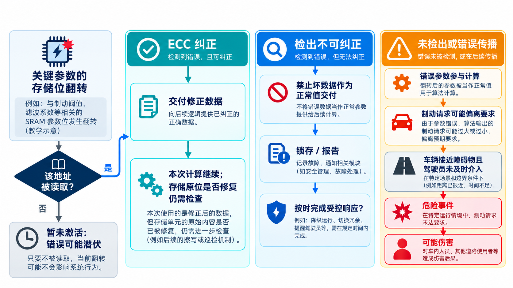
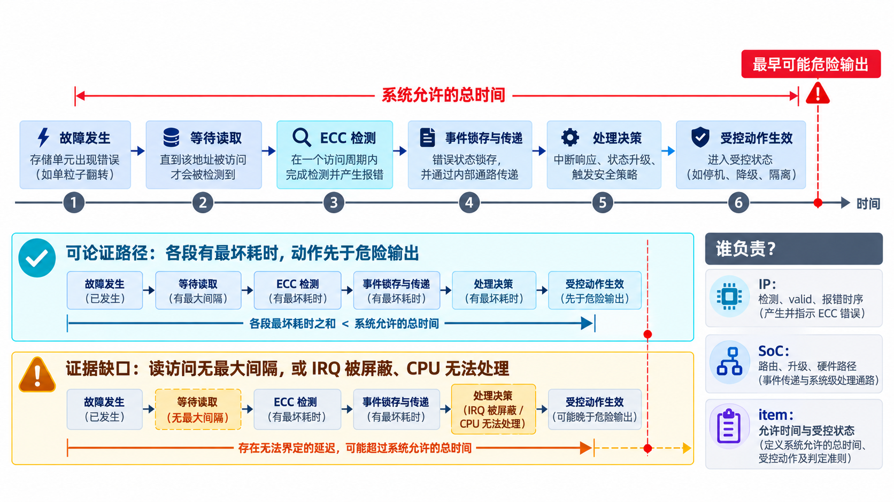

# 02｜一个 SRAM 位翻转，何时会成为系统危险？

[返回系列索引](../INDEX.md) · 中文初稿

自动制动辅助功能正在等待下一轮计算，SRAM 中保存的一项判断参数却翻转了一位。它会让车辆错过制动时机吗？先不要回答“会”或“不会”：软件可能还没有读取该地址，ECC 可能修正错误，也可能只报告“这次读数不可信”。真正要追的是每个分支之后，系统还会做什么。

以下是**教学假设**，没有对应的真实车型、参数值或试验结果。假设控制软件周期性读取该参数，决定何时发出制动请求。我们用它把芯片内部的位变化、功能行为和道路情境放在同一条线上。

## 从芯片一直追到道路情境

假设某个 SRAM 存储位翻转，读出的码字与原值不同，这是内部错误。只有当该地址被读取、错误未被纠正且其值改变了判断结果时，存储子系统才会把错误参数交给软件，辅助制动功能可能未能在要求的时刻发出请求。**功能未按要求工作是失效；“在车辆接近障碍物、驾驶员也未及时介入时制动请求缺失”才进入危险事件的讨论；碰撞并造成人身伤害则是更后面的可能结果。**这条链上任一条件不成立，结局都可能不同。不能把位翻转直接写成“导致伤害”。

在这个例子里，item 是承担车辆层面辅助制动功能的系统，不是单颗 SRAM。芯片供应方可以假设“错误参数可能影响制动请求”并据此设计存储保护，但只有整车 item 团队掌握传感器、控制软件、执行器、驾驶员与运行场景，才能做实际 HARA、确定安全目标和 ASIL。芯片的使用假设需要在集成时被核实，不能用这段教学叙述替代整车风险分析。

还有一个容易忽略的分支：位翻转发生后，该地址长期不再被读取。此时“没有报错”可能只说明 ECC 没有被激活，错误仍潜伏在存储单元里。若安全概念要求在下一次关键读取之前发现它，就需要巡检、自检或其他独立观察手段，并为检测间隔规定上限。

*图 1｜自动制动辅助功能的教学假设。图中三种读出结果及“尚未读取”的分支各有不同条件；危险事件和伤害不是位翻转的必然结局。*

## 三条不同的传播路径

第一条路径是**纠正**。读出码字后，ECC 解码器发现所选编码能够处理的错误模式，向下游交付修正后的数据。此时还要问：原存储位置是否被回写或巡检修复？如果没有，下次读取仍可能再次触发纠错。第二条路径是**检出但无法纠正**。解码器不应悄悄把不可信数据当成正确值交给使用者；它需要给出可辨别的状态，再由系统选择停止当前操作、重取可信副本或采取其他动作。第三条路径是**未检出**。错误数据进入计算，输出偏离要求；只有在特定功能和运行情境下，才可能进一步成为危险事件。

这三条路径也说明“检测覆盖”与“系统安全”之间隔着不少工程问题。告警是否能到达处理单元？处理单元是否仍可执行？从故障激活到受控动作的总时间是否满足系统要求？如果 ECC 检出了错误，但控制器仍把数据标成正常有效，后续软件可能根本不会触发异常处理；如果控制器正确阻断了数据，普通 IRQ 却被屏蔽，系统还需要一条能按时完成动作的路径。

## 截断与受控响应

Fault containment 的直观含义，是让错误尽量止步于受控范围。例如 ECC 可以阻止部分存储错误进入计算；访问隔离可以阻止某个 master 写坏安全域。若错误已经影响功能，系统则需要事先定义可执行的响应。“安全状态”并不总是简单复位：某些功能允许停机，另一些功能可能需要有限时间内维持服务，再逐步降级。选择取决于系统风险分析，而不是由 `error_irq` 信号决定。

回到制动辅助的教学场景，“停止输出”“保持上一次请求”“交给其他控制单元接管”可能产生完全不同的车辆行为。只有 item 层面的分析能决定哪些动作在何种车速、道路情境和剩余可用功能下可接受。芯片团队能做的是把异常数据标识清楚、定义错误输出的默认值和握手行为、给出告警最坏延迟，并说明复位期间输出引脚会怎样变化。**复位完成不等于安全动作完成**：若复位窗口内外部接口仍保留危险命令，系统风险可能反而增加。

把错误传播和系统响应画在同一时间轴上，才能看出机制保护了哪里。可把最早可能出现危险输出的时刻记为终点，再向前核算等待读取、ECC 检测、事件锁存、通知、决策和执行各段的最坏耗时。若安全功能仍在运行，其中任何一段没有上界，单独给出“ECC 一周期报警”都不足以证明整体及时。

*图 2｜教学时间轴，无实测数值。蓝色路径要求各段有最坏耗时，并让受控动作先于可能的危险输出；橙色路径展示读访问无上界或报告/处理路径失效时的缺口。*

如果要让这套路径在真实系统中发挥作用，至少要把四件事落实为要求和证据：SRAM/ECC 对指定故障模型能检出什么；不可纠正数据能否被阻止作为正常参数使用；告警能否通过总线、中断与软件路径到达决策点；受控响应能否赶在危险输出之前执行。还要检查这些机制自己的潜伏故障与共因依赖。少了其中一段，“芯片报过错”并不能说明整车风险已被控制。

**把“及时”写成可核查条件。** 发现错误的时间和完成反应的时间必须一起看。[ISO 26262-5:2018](https://www.iso.org/standard/68387.html)要求硬件安全需求中的机制时序与故障容忍时间或最大故障处理时间保持一致。对本例而言，ECC 在读出当周期报警仍可能不够：若中断排队、软件迟迟没有执行，危险输出已先发生，就不能把该故障算作对这次危险有效的控制。真正的证据是一条带最坏条件、观察点和系统动作的端到端时间轴。
