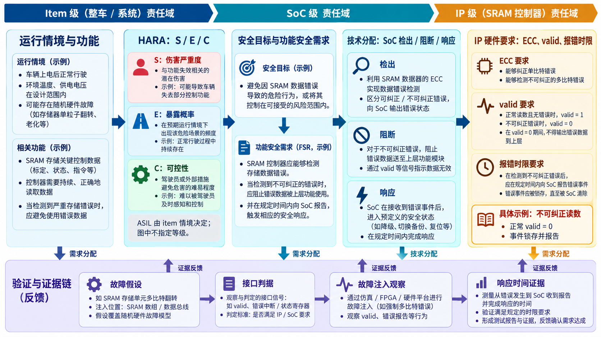
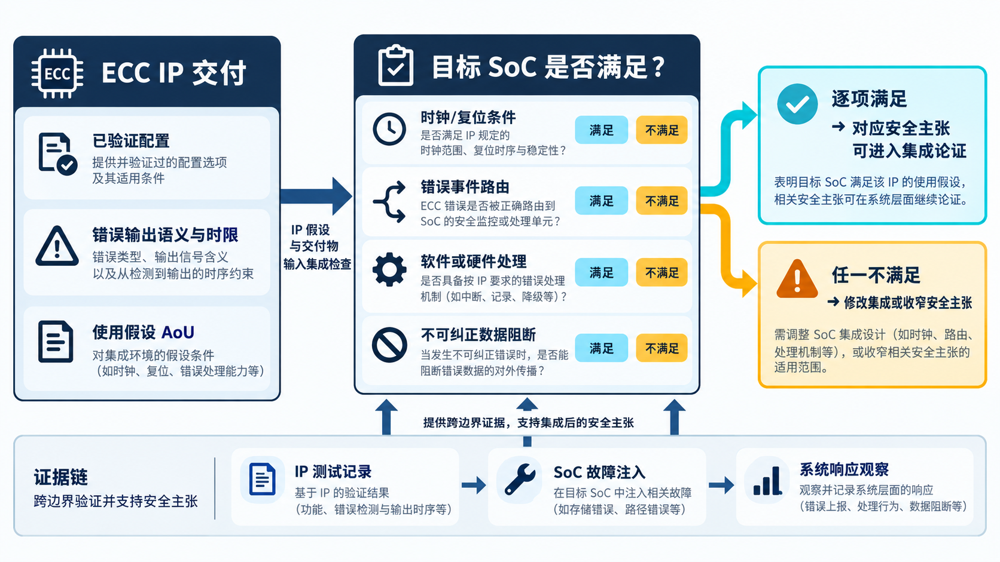

# 03｜ASIL 是怎样落到芯片需求上的？

[返回系列索引](../INDEX.md) · 中文初稿

芯片工程师收到一句要求：“这块 SRAM 的错误必须被检测并上报。”他可以马上加 ECC，却仍答不出一个关键问题：报警之后，谁阻止错误参数被使用？若不知上层功能为何需要这块存储器，以及错误输出在什么情境下有风险，RTL 很容易把“有报警”误当成“要求已完成”。

## 先定义系统问题，再分配硬件职责

以一个假设的道路车辆电子系统为例，团队首先界定 item 的功能和边界，再对危险事件开展 HARA（Hazard Analysis and Risk Assessment，危险分析与风险评估）。严重程度、暴露可能性与可控性用于分析情境，并形成安全目标及相应 ASIL。这里的 ASIL 不是“ECC 芯片的型号等级”，也不是 RTL 通过仿真后可自行获得的标签。[ISO 26262-3:2018](https://www.iso.org/standard/68385.html)把 item definition、HARA 和功能安全概念放在概念阶段。

之后，安全目标被分解为功能安全需求和技术安全需求。假如系统要求“错误控制参数不得在未识别的情况下持续影响输出”，硬件团队才可能收到更具体的要求：相关存储区域需要保护，无法纠正的读取结果不得被正常消费，错误要在规定时间内送达响应逻辑。这些句子仍不是最终 RTL。设计人员还要明确数据宽度、时钟域、错误编码、接口语义、复位后的状态和验证方法。

用上一章的**教学假设**，这条分解链可以压缩成三句：系统层要求“错误参数不能造成未受控的制动请求行为”；SoC 层分配“检出、阻断、报告和受控动作各由谁执行”；SRAM 控制器层规定“对指定码字错误，在读响应上给出可检查的分类，不可纠正时不得置正常有效标记，并在规定窗口内锁存事件”。每往下一层，都增加责任边界、接口语义和验证方法，而不是把上一级原话换个缩写。这里不为任何真实项目分配 ASIL 或时限数字。

*图 1｜教学分解示意。上层要求向下分配，故障假设、接口判据和注入观察形成反向证据；图中没有给真实 item 指定 ASIL。*

## 需求需要能被检验

“必须足够安全”无法直接写成断言；“检测到指定故障模式后，在规定周期内置位不可纠正错误状态，并阻止正常数据有效信号”才接近可检验的硬件要求。规定周期来自系统允许的故障处理时间，不能由 IP 团队随意填一个看起来漂亮的数字。验证团队则要设计能够激活故障、观察输出和检查时限的测试。

一条要求最终应能同时指向设计决定和验证证据。若 RTL 里有 ECC，却找不到它对应的故障假设、需要的响应时间和验证判据，安全需求与实现之间就断了。第 21 章会把这条链延伸到需求追踪矩阵；涉及硬件研发的规范性要求仍应核对 [ISO 26262-5:2018](https://www.iso.org/standard/68387.html)。

**可复用 IP 的额外一层。** 若 ECC 作为可复用 IP 交付，供应方往往不知道最终系统的全部情境。ISO 26262-11:2018 讨论了在假定使用条件下开发的 IP：集成方必须核对配置、外部时钟、错误处理软件和所需时间界限。对一条硬件安全需求，除了写“IP 能报错”，还要写清谁接收、谁处理、哪种配置经过验证。这是把模块能力变成系统安全能力的关键一步。

## 把一句目标改成两份可执行约定

“发现不可纠正数据”在硬件侧要落实故障模型、错误分类、输出有效性和最迟上报时间；在硬件软件接口（HSI）侧，还要约定状态是否锁存、软件先读哪个寄存器、何时清除、重复错误如何处理。若要求只写“产生中断”，却没有说明中断被屏蔽时如何处置，需求分解仍停在半路。还要核对一条反向链：故障注入测试能否激活指定错误，checker 是否同时观察正常有效标记、事件锁存和后续动作。设计有对应测试、测试有独立判据，追踪才有意义。

可复用 IP 还需交付配置和使用假设。总线宽度、ECC 使能方式、外部时钟或软件处理例程只要在集成时改变，就要重新审视原安全分析是否仍成立。

*图 2｜SEooC/IP 集成核对示意。满足使用假设只允许相应主张继续进入系统论证；任一关键条件不满足，就要修改集成或收窄主张。*

## ASIL 分配后，要求不会自动变成 QM

HARA 对危险事件考察严重程度（S）、暴露可能性（E）和可控性（C），据此确定相应安全目标的 ASIL；这不是按芯片失效模式的“严重度、发生度、探测度（S/O/D）”给某个 IP 打分。评级依赖 item 的运行情境，工程团队需保存各项判断及其依据，而不是凭“业界通识”给通用芯片贴一个固定等级。

安全机制的目的，是让分配到该安全目标的要求得到满足，并使风险在系统情境中受到充分控制。加入 ECC 或达到某个硬件架构指标，不会把原 ASIL D 安全目标整体“拉回 QM”。在满足规定条件、论证元素独立性并开展相应分析时，ASIL 分解可以让冗余实现元素承接分解后的要求；这与把系统风险或芯片产品简单降级为 QM 不是一回事。[ISO 26262-9:2018](https://www.iso.org/standard/68391.html)讨论 ASIL 分解、共存与依赖失效分析。后续第 25–28 章会把这条要求继续追到 TSC、IP 需求、故障分析、Safety Manual 和评估证据。
