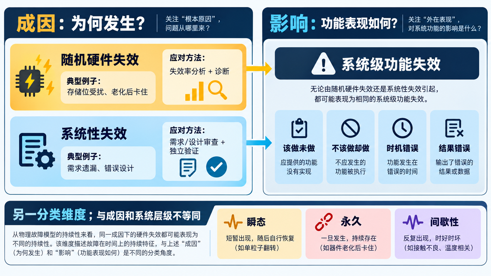
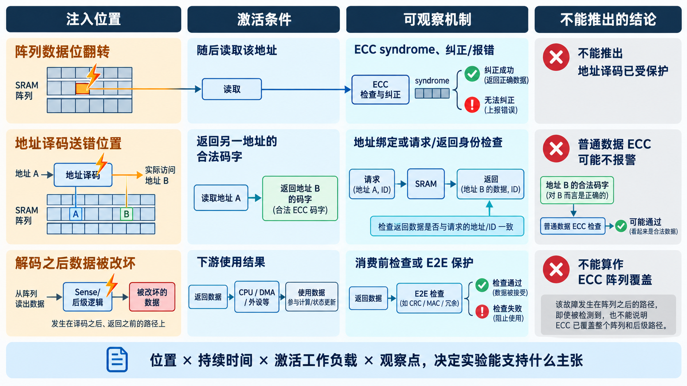

# 04｜芯片会怎样坏：故障模型决定验证方法

[返回系列索引](../INDEX.md) · 中文初稿

一份故障注入报告写着“100 次测试全部检出”。先别看百分比，先看注入器做了什么：如果它只会在 ECC 解码器输入翻转一个 bit，这份结果无法说明地址译码器送错位置、主时钟停止，或软件没有处理告警时会怎样。安全机制的覆盖范围始终相对于**被选中的故障模型、激活条件和观察点**成立。

## 随机硬件失效与系统性失效

功能安全里还有一条比“瞬态或永久”更基础的分界。**随机硬件失效**是在硬件寿命期间以不可预知的时刻发生、可按概率分布分析的失效，例如某个存储单元受到扰动或器件老化后失效。**系统性失效**则与某个确定原因相连，例如需求遗漏、地址译码设计错误、复位顺序规定不完整，或生产流程中的固定缺陷；只重复运行同一套测试，不会让根因按概率自然消失。这两个定义取自 ISO 26262-1:2018 的术语语境。[ISO 官方术语页](https://www.iso.org/standard/68383.html)

一个具体对照是 watchdog：运行一段时间后计数器某位随机卡住，属于随机硬件故障候选；如果规格从一开始就允许软件在关键任务未完成时无条件喂狗，那么问题源于设计要求，即使每颗芯片都严格按 RTL 工作，监控仍可能失效。前者通常需要故障分析、诊断机制与失效率依据；后者需要修正需求、设计或流程，并用独立审查和验证防止重现。ISO 26262-5:2018 的硬件架构指标与随机硬件故障定量评价，不能拿来给系统性设计错误“算一个失效率”。

这里的“系统性失效”也不同于**系统级功能失效**。后者指系统对外没有按要求完成某项功能，是故障传播到系统边界后的表现；它可能由随机硬件故障造成，也可能由系统性设计问题造成。先分清成因类别与影响层级，后面才能正确选择避免、检测和缓解办法。

*图 1｜教学分类示意。左边按成因分类，右边按对外功能表现分类；下方的瞬态、永久和间歇性又是故障持续方式这一独立维度。*

## 按持续方式与电路表现建模

按持续方式看，可以区分瞬态、永久和间歇性故障。瞬态翻转也许只影响一次读取；永久 stuck-at 可能让同一位置反复出现错误；间歇性故障则可能在实验中难以稳定复现。按电路表现看，bit flip、桥接、延时异常、停钟和复位异常会落在不同路径上。ECC 适合处理其编码能力范围内的数据错误，却无法仅靠数据校验发现所有时钟或控制状态问题；watchdog 可以观察特定的进度异常，但未必看得见“计算按时完成、答案却错了”。

还要看一个故障与其他故障的关系。某项功能失效若能独自违反安全目标，是单点风险；某些故障即使有诊断机制，仍有未覆盖的残余；某个监控器故障可能暂时不显现，直到另一故障发生才暴露。共因或相关失效尤其值得警惕：两路复制计算若共享错误输入或关键时钟，结果一致不代表结果正确。

## 故障模型直接决定实验

给每种故障写一张小卡片，比笼统说“覆盖所有故障”有用：注入位置在哪里，故障持续多久，什么条件下会被激活，预计影响哪个输出，哪个机制负责发现，系统最终应做什么。以 SRAM 为例，三个看似相近的实验其实回答不同问题：

| 注入位置与行为 | 首先检验的路径 | 不能据此声称 |
| --- | --- | --- |
| 阵列数据位在写后翻转，随后读该地址 | 存储码字、ECC 解码及读错误状态 | 地址译码错误已被检出 |
| 地址选择错误，返回另一地址的完整合法码字 | 地址绑定或请求/返回身份检查 | 普通数据 ECC 必然报警 |
| ECC 解码之后改坏输出数据 | 下游数据保护或消费前检查 | ECC 已覆盖阵列故障 |

时钟丢失实验还要确认注入器和监控器没有一起停在同一时钟上，否则实验可能连故障是否生效都看不清。

*图 2｜三种注入位置检验不同路径。特别留意第二行：送错地址可能返回一个完整的合法码字，普通数据 ECC 因而可能保持安静。*

这份映射会贯穿后面的机制设计、Safety VIP 与 FMEDA。故障模型越具体，实验结果的含义越清楚；结果也只能覆盖被建模、被激活、被观察到的部分。**故障模型**描述我们假定电路怎样受扰，**失效模式**描述功能对外怎样偏离要求；两者之间的映射若有空白，再多注入次数也填不平。下一章从 ECC 开始，看一种明确的数据错误模型如何落成电路。

**从功能反推物理故障。** [ISO 26262-11:2018](https://www.iso.org/standard/69604.html)把半导体层故障模型与 IP 失效模式联系起来。工程分析也可以反过来问：某项功能是“该做没做、不该做却做了、时机错了，还是结果错了”？再追问哪些电路故障会造成它。这样比只列上千个 stuck-at 点更贴近系统影响，也比只写“CPU 出错”更有助于选择诊断机制。

## 系统性问题靠什么避免

随机硬件失效可以围绕失效率、失效模式和诊断措施开展分析；系统性失效需要把注意力前移到需求、架构、实现和验证过程。若规格把“错误中断保持到软件确认”漏写成单周期脉冲，增加第二个相同的中断控制器并不能修复同一设计错误。更有效的是需求审查、接口审查、独立判据和变更影响分析。ISO 26262-11:2018 也把数字部件的系统性错误避免与随机硬件故障诊断分开讨论。

同一个现象可能有不同根因：软件没有响应 ECC 告警，可能是 IRQ 线路随机损坏，也可能是 HSI 从未规定驱动应注册处理程序。实验看到的都是“告警未处理”，修复方法却不同。
