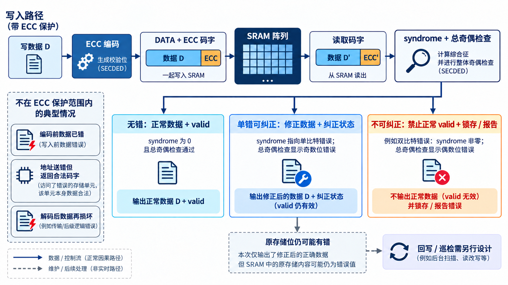
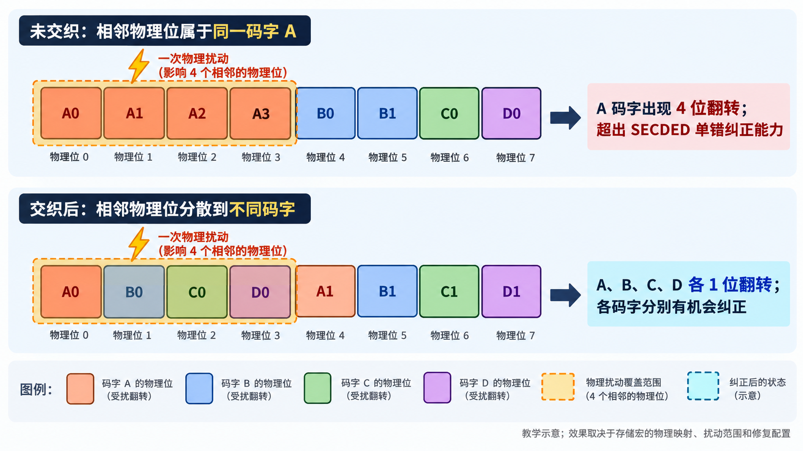

# 05｜ECC 如何处理 SRAM 的一位错与两位错？

[返回系列索引](../INDEX.md) · 中文初稿

SRAM 中翻转一位，系统还要读出正确参数；翻转两位，至少不能把坏数据当成正常值交付。这是 SECDED（single-error correction, double-error detection，单错纠正、双错检测）常被采用的原因。它的能力来自码字结构，而不是“旁边多放几位校验”这么简单。最简单的 parity 能发现部分错误，却通常不能定位该改哪一位；SECDED 则在指定码字和故障模型下区分可纠正与不可纠正的读结果。

## 一次读写中发生了什么

写入时，编码器依据数据生成校验位，把数据和校验信息作为码字存储。读取时，解码器重新计算检查关系，得到 syndrome（校验关系不一致时形成的错误指示）。若 syndrome 与总奇偶信息共同指向可纠正的单个位错误，电路可在输出侧恢复数据，并给出“发生过纠正”的状态；若结果指向不可纠正的模式，输出不能再被当作普通有效数据。系统常会希望知道两类错误分别发生了多少次、哪个地址出错，以及是否需要通知软件，但这些都需要明确接口、锁存和计数语义，不会自动从 ECC 算法里长出来。

设想同一个存储位置发生一次可纠正错误。如果解码器只修正读出的值，没有把原位置写回，下一次读取仍会重复报告；若后来再叠加一个位错误，情形可能越过原先的纠错能力。这就是后续 SRAM 控制器篇会讨论 scrubbing 的原因。不过，巡检也需要安排时机、访问仲裁和错误上报，不能把它视为 ECC 的一个免费开关。

## ECC 的边界也要画出来

SECDED 的名字描述的是特定码字错误能力，不代表所有多位扰动都能被安全分类，更不代表阵列地址错误、写入前已损坏的数据或解码器自身故障都已覆盖。尤其在硬件实现中，错误出现在编码器之前、存储阵列内部和解码器之后，会得到完全不同的诊断结果。因此，注入实验应至少明确故障位置、错误位数、读写时序和预期报告。

从系统接口看，关键是把读结果拆成三类：无错正常数据、纠正后数据、不可纠正数据。三类的内部数据可用标志、响应码、错误状态和下游可否消费，都应可区分。若不可纠正时只拉高告警，却仍把坏数据标为可正常使用，错误参数可能先进入计算，随后到来的中断已经晚了一步。这里的内部 `data_valid` 不能与 AXI 读通道的 `RVALID` 混同：AXI 即使返回错误，也要按协议完成读响应握手，并通过 `RRESP` 表示错误；`RVALID=0` 不是“返回错误响应”的方法。读者因此需要问：在指定错误模型下，ECC 纠正了什么，阻断了什么，剩下的错误交给谁？

*图 1｜ECC 读写路径示意。图中单错与双错的 syndrome/总奇偶关系针对所示 SECDED 机制；实际编码矩阵、位宽与接口语义须按目标 IP 核对。纠正读出值也不代表原存储位已修复。*

**存储器还可能以别的方式失效。** [ISO 26262-11:2018](https://www.iso.org/standard/69604.html)对存储器故障模型的讨论包括地址、耦合、转换等情形，不能用一位数据翻转代替全部阵列问题。一次错误地址访问甚至可能返回一个校验完全正确的码字。若设计把 SECDED 的单码字能力直接写成“SRAM 已受全面保护”，就跨过了地址译码、控制逻辑、多位相关扰动与 ECC 自身故障；它们需要分别分配给地址保护、主动测试或其他诊断。

## 相邻单元一起翻转，为什么交织有用

这里要分清物理位置与 ECC 码字。一次粒子事件可能使物理上相邻的多个存储单元同时翻转，称为多单元翻转（multiple-cell upset，MCU）；如果其中两个或更多错误落入同一个受 ECC 保护的字，就形成多位翻转（multiple-bit upset，MBU）。ISO 26262-11:2018 在数字器件的瞬态故障模型中区分了这两个概念。**物理上连续翻转，并不必然等于同一码字连续出错**；结果取决于阵列中物理单元到逻辑码字的映射。

假设一个 SECDED 码字的两个数据位恰好放在相邻单元。它们同时翻转后，读取该码字时通常可以报告双位错误，却无法按单错规则恢复原数据。若相关事件波及更多位，就不能仅凭“SECDED”四个字母推定必然检出或正确分类，必须结合具体编码、校验位布局和错误模式分析。

位交织把同一码字的存储位在物理阵列中隔开，让相邻单元尽量属于不同码字。可以把一排物理位置示意为 `A0 B0 C0 D0 A1 B1 C1 D1`：`A0` 与 `A1` 属于码字 A，却不再挨着；若一次局部事件只影响前四个相邻单元，A、B、C、D 各出现一位错误，每个码字便有机会由 SECDED 分别纠正。没有交织时，同样范围的事件可能在一个码字内造成多个错误。[Infineon 关于 SRAM 软错误与位交织的说明](https://community.infineon.com/t5/Knowledge-Base-Articles/Different-Ways-to-Mitigate-Soft-Errors-in-Asynchronous-SRAMs/ta-p/257944)给出了这一机制及交织距离的工程依据。

*图 2｜物理位交织教学示意。同样覆盖四个相邻物理单元的扰动，在两种映射中形成不同的码字错误分布；实际效果取决于存储宏布局、扰动范围和修复配置。*

这个示意成立有条件：实际物理间距要大于目标事件的影响范围，数据位与 ECC 校验位都要纳入映射检查，还要看行列布局、备用单元修复后的映射和存储宏内部实现。影响范围与合适的交织距离随工艺和宏而变，不能凭 RTL 里的地址顺序猜测。交织也不解决整条字线、位线、地址译码器或共享控制电路故障；这类相关失效仍要单独建模和诊断。软件地址交织、bank 交织与这里的**物理位/码字交织**也不是一回事。

验证时，应从目标存储宏的物理映射出发，构造相邻单元受扰的故障集合，逐一映射到逻辑码字，检查纠错、不可纠错报告及系统响应。若没有宏的布局或供应方多位翻转资料，只能把交织效果列为待验证假设，不能据此提高诊断覆盖率。

## 用一个小码字看 syndrome

考虑教学用扩展 Hamming 码：四个数据位放在位置 3、5、6、7，校验位放在 1、2、4，位置 8 是总奇偶校验。若数据位依次为 1、0、1、1，并约定偶校验，位置 1 到 8 的码字可写为 `0 1 1 0 0 1 1 0`。翻转第 6 位，局部校验给出指向位置 6 的 syndrome，总校验也显示奇数位错误；翻转第 3、6 位，总校验显示偶数位错误，应报告不可纠正，不能按 syndrome 猜一个位置去修。

这个八位例子只解释机制，不代表实际 SRAM IP 配置。它还揭示了一个重要限制：如果错误模式超出所选码的保证范围，例如更多位同时翻转，不能只按“一位纠正、两位检出”去推断最终行为，必须针对具体码字与故障集合计算并验证。真实设计还须明确部分写、错误地址定位和不可纠正数据的响应语义。下一章会再追问：即使码字在数学上合法，某些全零或全一的物理存储模式为何仍可能带来风险？
