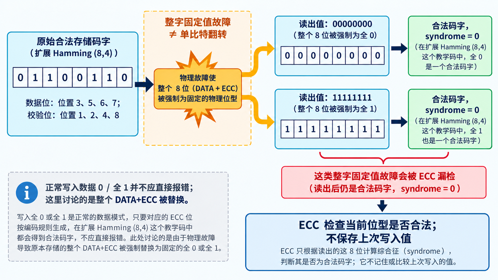
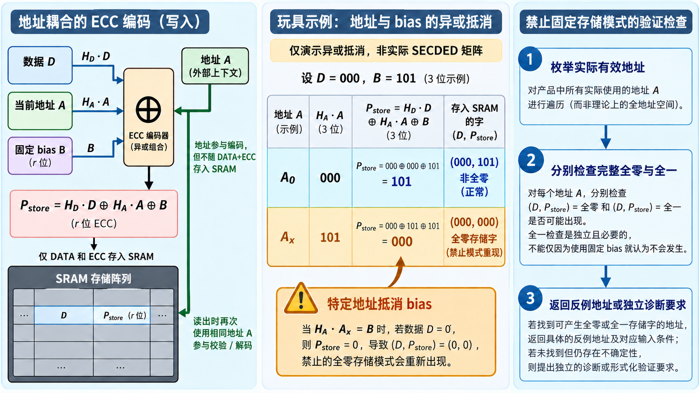

# 06｜地址耦合 ECC：全零码字为何会重新出现？

[返回系列索引](../INDEX.md) · 中文初稿

一块带 SECDED 的 SRAM，某次读出得到 `DATA=0`、`ECC=0`，校验也没有报警。工程师却发现，这个位置原本写入的不是零。ECC 没有“失灵”：它看到的是另一个**数学上合法的码字**，没有保存“上次应该是什么”的历史。这种整字固定值故障，和上一章的一位或两位翻转不是同一道题。Cache、TCM 等片上存储器也可能遇到类似问题。

## 全零、全一为何可能是合法码字

假设一次共因故障使某个存储字的**数据位和 ECC 校验位一起**读成全零或全一。解码器能否报警，取决于这个完整位型是不是所用 ECC 的合法码字。以偶校验扩展 Hamming（8,4）教学码为例，四个数据位放在码字位置 3、5、6、7，其余位置用于校验；对这个码，数据 `0000` 编成 `00000000`，数据 `1111` 编成 `11111111`，两者都是合法码字。原先存的是 `01100110`；若整字被错误地读成上述任一固定模式，syndrome 都是零。ECC 只能判断**当前读出的位型满足校验关系**，无法据此知道它不是先前写入的内容。这是**整字被另一个合法码字替换**的失效，与一位翻转、相邻单元多位翻转不同。

要注意，“数据全零”不等于“完整码字全零”。正常业务完全可能写入数值 0 或全 1；安全设计不能仅因数据值如此就报错。要检查的是 **DATA+ECC 这一完整物理存储位型**是否与上电默认值、整字 stuck-at、总线固定值或未初始化状态重合。普通线性 ECC 满足 `ECC_linear(0)=0`，所以未加处理时，数据全零往往对应完整码字全零。这个码字在数学上合法，SECDED 的最小码距也可以仍是 4；问题是某些整字故障可能落到另一个合法码字，逃过该码字检查。把码字最小距离和所有物理故障的检测范围画等号，会漏掉这类情况。



*图 1｜教学码字示意。数据位在位置 3、5、6、7，校验位在 1、2、4、8；图中全零和全一均合法只针对这个示例。ECC 检查读出的码字是否满足校验关系，不保存上次写入值。*

## 地址如何抵消固定 bias

常见的设计办法是给写入存储器的校验位加固定 inversion mask 或 bias。设数据宽度为 `n`、校验位宽为 `r`，矩阵运算均在 GF(2) 上进行，写入的校验位可表达为：

```text
P_store(D,A) = H_D·D ⊕ H_A·A ⊕ B
C_store(D,A) = (D, P_store(D,A))
```

`D` 是数据，`A` 是写入或读取时提供的地址，`B` 是固定 bias；`H_D` 与 `H_A` 分别给出数据和地址对校验位的贡献。写入时生成 `P_store`，读取时用**当前访问地址**重新计算并比较。地址参与计算，却不随 `DATA+ECC` 一起存入阵列。只看不带地址的情形，选择非零 `B` 确实能使全零数据不再配全零校验位；但加入地址后，若某个有效地址 `A_x` 满足 `H_A·A_x=B`，便有 `P_store(0,A_x)=0`，完整全零码字又在该地址合法。这就是**地址耦合 ECC 中的危险固定码字重现**；它不是 ECC 算错了。

先用一个只演示异或关系的小例子，不把它当作实际 SECDED 矩阵。设校验向量宽度为 3，`B=101`，且 `D=000`，所以数据贡献为 `000`。在地址 `A_0`，若地址贡献是 `000`，存储校验位为 `101`，完整存储字不会全零；换到地址 `A_x`，若地址贡献恰好是 `101`，异或后存储校验位变为 `000`。**固定 bias 没有消失；它在这个地址被抵消了。**要判断目标设计是否真的存在这样的 `A_x`，必须使用它的矩阵和有效地址集合求解。



*图 2｜异或抵消教学示意，不是某颗 SECDED IP 的矩阵。中间两行只改变地址贡献：同样的全零数据与 `B=101`，在 `A_0` 存为 `(000,101)`，在反例地址 `A_x` 存为 `(000,000)`。*

全一也要独立检查。完整全一码字在地址 `A_y` 合法的条件是 `H_A·A_y=1_r ⊕ H_D·1_n ⊕ B`，其中 `1_n`、`1_r` 分别是相应宽度的全一向量。工程上应对**实际可访问的地址集合**求解这两个方程，而不只在一个默认地址试写全零/全一。[NXP MPC5777C 的安全手册](https://community.nxp.com/pwmxy87654/attachments/pwmxy87654/mpc5xxx/10624/1/MPC5777_User_Guide.pdf)就记录了一个实际边界：其带地址 RAM ECC 不能保证所有地址的 All-X 都被判错，并给出选择周期测试地址的方法。那是该器件的具体实现，不能把它的地址比例或测试策略直接套给其他 IP。

固定 bias 只是在每个地址平移码字集合。如果 `H_A` 在有效地址上遍历了全部 `r` 位校验模式，任何固定 `B` 都无法在所有地址排除完整全零或全一码字。若实际有效地址集合较小，可能有某些 bias 避开目标危险模式；两种情况都应通过方程与可访问地址枚举确认，不能只凭“加了 inversion”下结论。

## 对完整编码函数提出约束

把这类设计要求写成**禁用物理存储模式约束**更直接：给定危险模式集合 `F`，要求对所有有效地址及相关数据 `C_store(D,A) ∉ F`。对于 `F={全零码字, 全一码字}`，实际上只需分别检查 `D=0` 和 `D=1_n`；若把其他固定模式也列入 `F`，再按其数据部分确定待检查的数据集合。求解器最好返回两类结果：满足约束的矩阵/bias 配置，或一个可复核的反例——哪条地址、哪组数据、最终写入的完整码字是什么。若在现有矩阵和地址范围内无解，就应改变编码或地址绑定方式，或承认需要独立诊断，而不能仍声称“已消除 All-X”。这个名称用于描述工程约束，不把它当作 ISO 26262 规定的术语。

## 运行时的检测与初始化

一种应对思路是在设计 ECC 码和存储映射时，让完整的全零、全一位型触发专门的错误检测，并核对它们不会在纠错后被当作正常数据放行。另一种是按故障模型定期运行已知数据的读回、互补模式或 RAM 测试，检查整字被卡在固定值；对于有预期内容的存储区，还可用独立保存的参考信息核对。选择哪种方法要看故障是否覆盖数据与校验位、目标存储器是否允许在线改写，以及诊断时间要求。ISO 26262-11:2018 §5.1.13.5 讨论的 RAM pattern test 包含全零/全一写入读回，用于发现 stuck-at 与转换故障；它不能替代对运行时内容的完整性判断。

上电或复位后的**未初始化**是另一个问题。SRAM 的数据位与 ECC 位没有经过配套写入，就不能假设其组合有效；反过来，若未初始化区域碰巧读出合法的全零码字，零 syndrome 也不证明这块地址已经初始化。系统需要明确初始化顺序、可读范围及部分写的处理。Flash 又有擦除态语义，某些器件有意让擦除后的全零或全一组合有效，另一些安全 ECC 会将其报错；不能把某个 SRAM 的处理办法直接套到 Flash。[Infineon 的 PFlash/DFlash ECC 对照](https://www.infineon.com/assets/row/public/documents/10/56/infineon-aurix-program-memory-unit-training-en.pdf?fileId=5546d46269bda8df0169ca89a7cb2567)展示了这种差异。

对 ECC Generator，可把禁用模式作为显式配置：生成矩阵和 bias 后，先用 GF(2) 方程求可能的反例，再遍历目标地址验证 SEC/DED/DAEC 等目标能力、地址错误检测及 All-X 告警语义。验证用例应同时包含正常写入全零/全一**数据**、完整**码字**被强制为全零/全一、未初始化读取，以及反例地址附近的访问。正常数据值不该被误报；整字固定故障若被列为受控对象，就不该无声地作为正常值通过。检查点包括 syndrome、专用 All-X 告警、纠错状态、`valid` 和后续系统动作。**改了 bias 不等于证明安全**；这里讨论的是生成器要求，不声称某个实际 IP 已实现。
