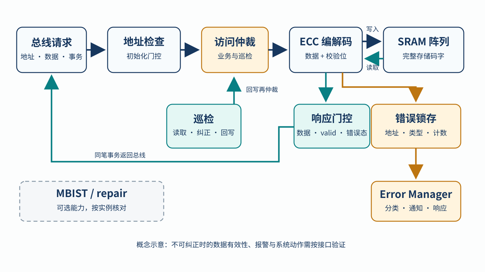
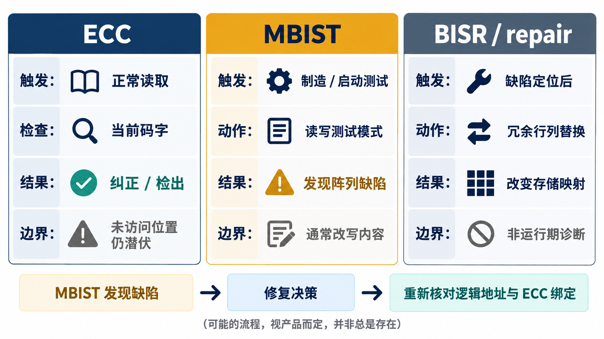

# 07｜安全 SRAM 控制器除了 ECC 还需要什么？

[返回系列索引](../INDEX.md) · 中文初稿，未完成工程实例核对

一次 SRAM 读取的 ECC syndrome 为零，却仍可能把错误参数交给 CPU：访问地址本来就错了，或者上电后这片存储器根本没有完成初始化。ECC 只处理它实际看到的码字；控制器还要管访问从哪里来、读到的数据能否交付、错误如何上报，以及阵列在维护时谁有访问权。下面是一套**教学架构**，用来说明集成时要核对的关系，不代表某颗现成 SRAM IP 已具备全部功能。

## 从总线请求走到可交付的数据

正常写入先做地址与权限检查，再为数据生成校验位并写入阵列；读取则取回完整码字、解码，并把数据和错误状态一起形成响应。地址译码错误、读到了另一个合法码字、或数据与错误状态在流水线中错拍，都可能让单独的 ECC 检查显得“通过”。若编码绑定地址，还要明确参与计算的是 CPU 地址、控制器局部地址还是宏内部地址；bank、别名和修复映射不能让写入与读取使用不同的地址语义。第 6 章的固定码字反例说明，地址相关的 ECC 也需要在实际可访问地址上验证。

可纠正错误出现时，控制器可以返回修正数据并记录事件；不可纠正错误出现时，则需要规定数据是否仍有效、响应码是什么、是否阻止下游提交。`valid` 与错误状态必须与同一笔事务对齐。若错误在读数据已经进入执行单元之后才上报，系统还需证明后续动作仍可受控；仅有一个延迟到来的 `error` 引脚不足以说明这一点。初始化也属于访问门槛：在数据与 ECC 位都经过有效写入之前，零 syndrome 不能证明内容可用。若另设完整码字全零/全一（All-X）检测，还要核对它检查哪些位与地址，以及正常写入零值时是否会误报。

*图 1｜SRAM 子系统概念示意。正常读写经过地址检查、ECC 与阵列；巡检经仲裁进入同一访问路径；错误状态随事务返回并上报 Error Manager。MBIST 与 repair 为待核对的可选能力，图中不代表已有实现。*

## 巡检和部分写会重新触碰旧数据

Scrubbing（巡检）主动读取存储位置，让 ECC 在业务尚未访问前发现部分潜伏错误；若要把修正后的码字写回，还必须和业务写入仲裁。同一地址上，巡检读到旧值之后业务完成新写，巡检再回写旧值，会把新数据覆盖。实现因此需要对同地址冲突规定顺序、失效重试和复位后的恢复点。巡检周期还应与潜伏故障的检测时间要求对应；只写“定期”无法说明最坏多久才看到错误。

按字节使能写入常由“读旧字—合并新字节—重新编码—写回”完成。若旧码字不可纠正，继续合并会把不可信的未写字节重新编码成一个合法码字，原故障也可能被掩盖。控制器需要明确是拒绝部分写、上报后交给软件恢复，还是有其他经验证的策略。整字写入不依赖旧内容，不能拿它的测试结果覆盖部分写路径。巡检、部分写和正常访问共享资源时，仲裁、事务原子性与错误状态的归属都要一起检查。

对相邻单元同时翻转，还要拿到目标 SRAM 宏的物理单元—逻辑码字映射。若物理位交织把相邻位分散到不同码字，ECC 可能分别处理；若多个坏位仍落在同一码字，结果就不同。控制器 RTL 中有 ECC 并不能证明宏已交织；校验位的布局、修复后映射和注入位置也应纳入核对。这是宏与控制器的共同边界，不从一张教学图推算覆盖率。

## ECC、MBIST 与修复提供不同证据

ECC 在**实际读取**时检查当前码字。MBIST（Memory Built-In Self-Test，存储器内建自测试）则主动对阵列执行读写模式；March 类算法可针对 stuck-at、转换及部分耦合等故障建立测试，但具体覆盖依赖算法和宏结构。BISR/repair 使用冗余行列替换被判为坏的存储位置，通常服务于制造或启动阶段的可用性。修复成功不能当作运行期诊断，MBIST 一次通过也不能保证之后没有新故障。

*图 2｜三种机制的作用对象与时机。ECC 依赖访问触发，MBIST 主动测试阵列，repair 改变缺陷位置映射；图中均为机制比较，是否支持运行期测试、数据保留和特定故障覆盖须按实例确认。*

启动 MBIST 往往会改写内容，必须说明何时运行、谁重建数据与 ECC、测试失败时能否阻止不可信存储被使用。若宣称运行期分 bank 测试，还要说明业务怎样避开被测区域、测试能否中断或恢复、内容是否保持。MBIST 控制器、地址发生器、比较器和失败锁存器也会失效；“测试完成”与“测试通过”是两件事。修复则要继续核对修复信息的保存、上电装载、错误映射处理，以及正常访问与 MBIST 是否指向同一逻辑位置。若 ECC 绑定地址，还需确认修复后的地址绑定仍一致。

这几条路径可以用同一组观察点验证：请求地址和事务编号、读出的完整码字、ECC 分类、返回数据与有效位、错误上报、最终系统动作。注入用例至少覆盖单个位错、不可纠正码字、部分写遇到旧错误、巡检与业务同地址竞争、MBIST 未完成与阵列缺陷被检出。完整码字固定为全零/全一和正常写入全零/全一**数据**要分开测；前者针对整字故障，后者检查正常值不被误报。对物理相邻位故障，注入应按宏的映射落到实际码字上。错误注入接口本身还要约束使能、目标地址和退出条件；错误计数须区分同一坏位置的重复读取与多个独立故障，不能直接把次数当成故障数。

交给集成者的说明最终要落到配置和责任：哪些功能确已实现并验证、初始化何时完成、错误输出如何解释、MBIST 由谁启动、巡检由谁调度、故障报告由谁接收。[ISO 26262-11:2018](https://www.iso.org/standard/69604.html) 为半导体 IP 的使用假设与集成信息提供了核对框架。具体控制器若缺少接口、故障注入和宏布局证据，这一章只能作为设计审阅方法，不能据此宣称诊断覆盖率。
