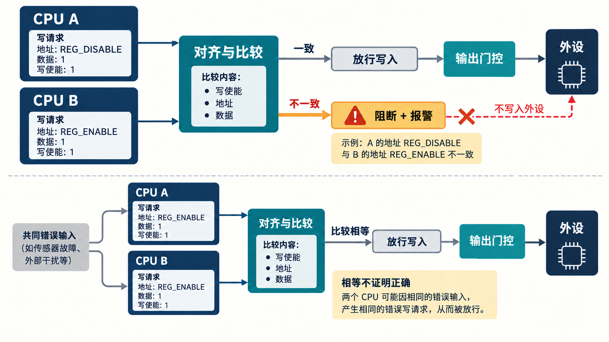

# 08｜Lockstep 为什么能检错，又会漏掉什么？

[返回系列索引](../INDEX.md) · 中文初稿，未完成双核实例核对

两路 CPU 的写数据相同，比较器显示“相等”，外设却被写错了。原因可能只是两路地址不同，而比较器只接了数据线。即使地址也参与比较，若其中一路写请求已经进入总线，随后才发现分歧，报警也晚于错误动作。Lockstep 的价值取决于**比较字段、对齐方法和比较前的输出约束**，不能从“两颗核加一个比较器”的框图直接推出。

## 把同一笔行为对齐，再决定能否放行

同步 lockstep 让主核与检查核尽量同时执行；延迟 lockstep 使一路落后若干周期，再把对应状态对齐比较。延迟可降低某些瞬时扰动同时影响两路相同位置的机会，但不能替代对共享时钟、电源和复位的分析。两路因缓存、仲裁或异常进入产生不同停顿时，比较器还需要事务身份与重同步规则，不能简单把“同一拍不同”都当成故障。

比较点应按可见副作用选择。若目标是阻止错误寄存器写入，就要比较写使能、地址、数据和必要的访问属性，并在结果确定前暂存请求。假设 CPU A 在时刻 `t` 形成写请求，延迟一路在 `t+k` 才形成对应请求；在 `t+k` 比较完成之前，A 的写不能已经作用于安全相关外设。读取、异常、内存屏障和被投机取消的事务也需要定义何时“提交”。比较点较少能简化实现，却扩大未观察到的内部故障范围；比较点较多则增加对齐、时序和比较器自身的设计负担。

*图 1｜Lockstep 教学示意。上方是单路地址分歧：外设写使能等待比较结果，不一致则报警并阻断写入。下方是共同错误输入：两路产生同样的错误结果，比较器仍可能认为相等。实际比较点与阻断位置须按实现核对。*

用一个具体反例检查设计：两路本该写 `REG_ENABLE`，A 的地址故障使它写向 `REG_DISABLE`，写数据仍与 B 相同。只比数据会漏检；比较地址但先放行 A 的请求，会“检测到却没阻止”。验证应分别观察地址字段是否参与比较、比较结果何时可用、外设写使能何时真正生效，以及 mismatch 后暂存事务如何丢弃或处理。`compare_error` 拉高只是其中一个观察点。

## 两路相等，不代表两路正确

若主核与检查核收到同一错误输入，或同一设计缺陷让两路执行了同一错误指令序列，比较器仍可能得到一致结果。共享 PLL、复位源、供电、测试与调试路径也可能让两路相关失效。物理分离、延迟或实现多样性可缓解部分场景，但每条共同依赖仍要根据失效传播路径判断；单纯增加延迟不能证明独立。[Infineon 关于 AURIX lockstep 的公开说明](https://documentation.infineon.com/aurixtc3xx/docs/owq1745576218449)给出输入及比较信号延迟对齐的器件实例，其具体周期数不作为通用配置。

比较器自身同样是安全路径的一部分。输入卡住、对齐寄存器损坏、比较逻辑失效，或错误输出无法送到错误管理器，都会改变诊断结果。对它的自检与故障注入应检查两种方向：正常两路不被误报，真实分歧不会静默通过；再检查报警到系统动作是否在规定时间内完成。若只验证一个比较器 CBB 的输入输出，结论就限于该 CBB，不能外推为双核与外设的端到端安全能力。

Lockstep 最擅长发现**被选中的观察点上两路产生了不同结果**。它不负责判断共同结果是否符合系统意图，也不自动处理被比较之前已发生的副作用。下一步做实际双核评估时，应把比较字段表、对齐/重同步规则、输出暂存位置、共享资源清单和从分歧到受控动作的时序放在一起核对；没有这些资料，不给出通用诊断覆盖率。
