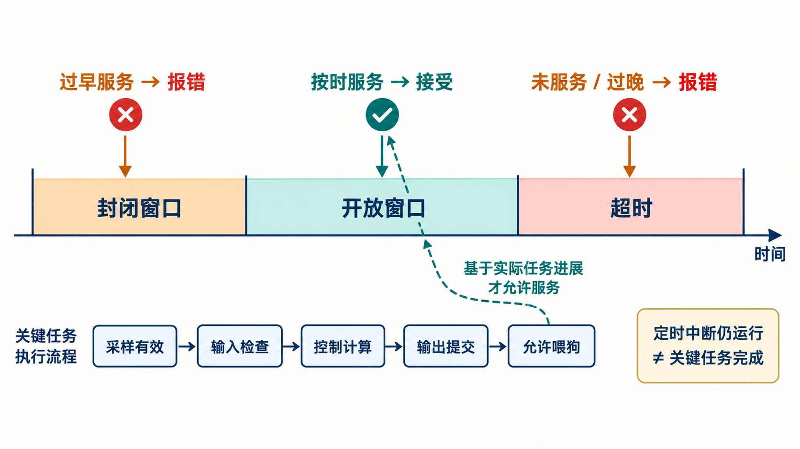

# 09｜Watchdog 怎样发现“CPU 还在运行却已失控”？

[返回系列索引](../INDEX.md) · 中文初稿，未完成目标 IP 核对

控制计算已经停了，定时中断却仍在执行，每次中断都照常写入 watchdog 服务寄存器。计数器不断清零，系统没有超时事件。这个场景提醒我们：watchdog 实际观察到的是**服务动作的时机和内容**，它能不能代表关键功能的进度，取决于软件怎样取得喂狗资格。

## 时间窗口能识别哪些异常

普通超时 watchdog 等待规定期限内的一次服务；错过期限通常触发事件。Window watchdog 还设置封闭窗口和开放窗口：在封闭窗口喂狗过早，开放窗口内服务才被接受，开放窗口结束仍未服务则超时。这样可发现某些跑得异常快的循环或重复服务，但一个空循环若总在正确窗口喂狗，时间规则仍会被满足。[AMD 的公开手册](https://docs.amd.com/r/en-US/am026-versal-ai-edge-prime-gen2-trm/Window-Watchdog-Timer-Mode)展示了基本窗口与带问答令牌的器件模式；下面只取通用的时间关系，具体服务序列仍以目标 IP 为准。

*图 1｜窗口 watchdog 的时间示意，区间宽度不代表真实配置。过早服务、开放窗口内服务和超时分别对应不同结果；图下方的任务阶段说明服务许可应来自关键工作完成，而非固定定时中断。*

窗口配置要从任务时序反推。采样、中断等待、控制计算、结果提交和总线写服务寄存器都有抖动；最早完成时间决定封闭窗口不能挡住正常服务，最晚完成时间与通信延迟决定开放窗口不能过早结束。若把窗口放宽以减少误报，故障检测最坏时间也随之增加。启动、休眠唤醒、调试暂停和复位恢复若改变任务节拍，需要有明确的服务或重新使能规则，不能让一次合法模式切换被误判，也不能留下长期关闭的监控空窗。

## 服务资格应来自关键工作

可把一次控制周期拆为采样有效、输入检查、控制计算、输出提交四个阶段。各阶段完成后更新状态，只有本轮序号与所需阶段都满足，才允许执行一次服务。这样，采样完成而计算停滞时，定时中断仍能运行，服务资格却不会产生，watchdog 最终超时。服务资格的定义要贴着安全功能的实际进度：如果状态位仅由同一个出错的软件流程自报完成，仍可能伪造一轮“成功”。

更复杂的程序顺序监控或 challenge-response 要求服务值随任务步骤或挑战变化，能提高机械喂狗的门槛，也引入挑战产生、状态保存、通信和比较逻辑的故障模式。它们并不验证计算结果数值一定正确；按时完成了错误计算，仍可能喂狗成功。结果合理性检查、冗余计算或端到端数据保护需要按故障模型另行设计。[AMD 的 AXI Timebase Watchdog 说明](https://docs.amd.com/api/khub/documents/Woso12Sanyrs~0MQKp1nYA/content)给出了任务签名监控的器件例子，不能据此推断本系列候选 watchdog 已实现相同能力。

## 看见超时之后，谁还能动作

若 CPU 已失控，报警后仅给它一个普通中断未必能完成恢复。Watchdog 可以把事件交给 Error Manager、触发 NMI、复位或外部硬件隔离；选择取决于系统的安全状态与故障反应时间。复位期间输出是否仍受控、复位是否会清掉诊断记录、连续复位循环如何处理，都要在系统层说明。独立时钟和供电也需核对：主时钟停摆时，同源时钟驱动的 watchdog 可能一起停止。即便时钟独立，计数器卡住、服务接口误触发或报警线路失效仍需分析。

验证时可用三组互相区分的刺激：过早服务、正常窗口内服务、晚到或完全缺失服务；再增加“定时中断继续运行但关键计算没有完成”的场景。记录服务请求、watchdog 接受或拒绝、错误锁存、系统动作及各自时间。若要宣称某个目标 IP 的诊断能力，还需给出时钟源、窗口配置、任务最坏时间和故障注入结果。[ISO 26262-5:2018](https://www.iso.org/standard/68387.html) 的硬件诊断示例可以帮助选择分析方法，但机制名称和教学时间轴都不能代替这些证据。
