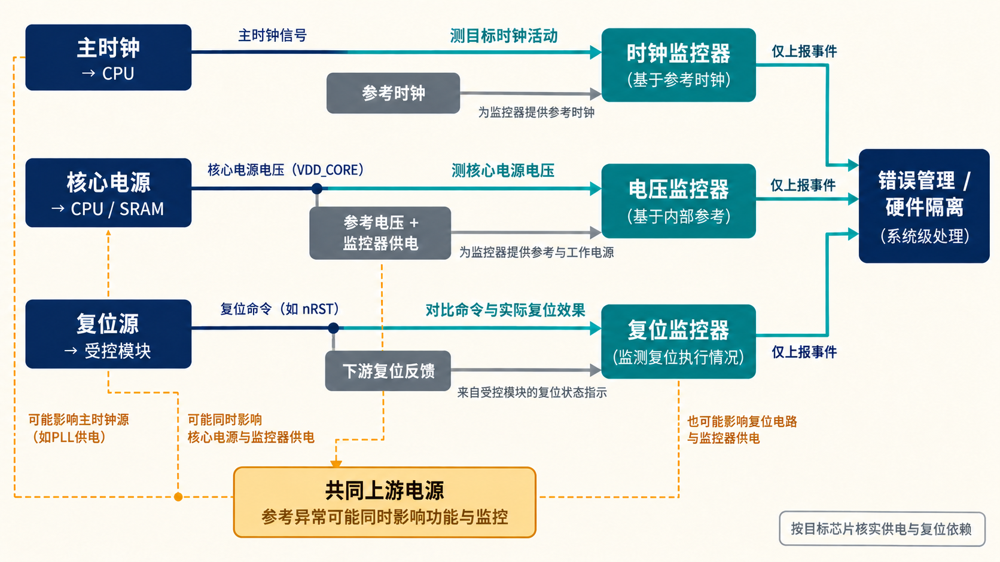
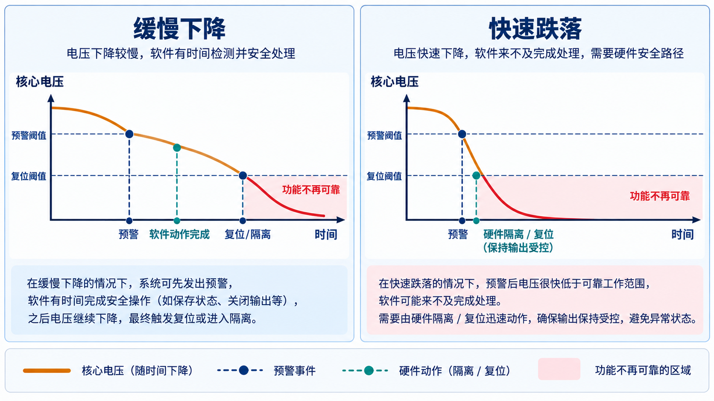

# 10｜时钟、复位和电源异常，监控器靠什么工作？

[返回系列索引](../INDEX.md) · 中文初稿，未完成目标芯片核对

主时钟停了，靠主时钟采样的“时钟正常”寄存器可能永远停在上一个值。核心电压跌落时，监控器若共用同一条已经越界的供电轨，报警可能比被监控逻辑更早失效。设计 clock monitor、reset monitor 和电压 supervisor 时，先要画清它们的**参考源、供电、复位和报警去向**，再讨论阈值与覆盖。

## 一个监控器能看见什么

用参考时钟计数目标时钟的边沿，可以在观察窗口结束时发现停钟或频率越界。窗口越长，频率估计通常越稳定，发现问题也越晚；过短又容易受抖动和跨时钟采样影响。PLL 失锁信号可以提供另一种观察，但它本身及输出路径也要验证。短毛刺未必在频率计数中留下明显差异，完全停钟也只有在参考时钟和监控逻辑仍工作的条件下才能被报告。主时钟与参考时钟若共享振荡源或供电，共同漂移或共同停摆需要单独分析。

复位则要观察命令与效果两端。复位卡在有效态使模块不能启动，意外复位会中断正在运行的功能；释放过早或跨时钟域同步错误可能让部分模块先运行。检查“复位控制寄存器已写入”不足以证明下游寄存器都进入预期状态。监控方案应选定关键域的实际复位反馈或启动就绪信号，并考虑复位故障是否同时清掉监控器的错误锁存。监控器自身的上电复位次序，也决定它何时开始给出可信判断。

*图 1｜监控依赖概念图。主时钟由参考时钟观察，核心与 SRAM 供电由电压监控观察，复位效果在受控模块侧核对；共同上游电源或参考源异常可能同时影响主功能与监控路径。虚线表示必须按目标芯片核实的依赖。*

## 电源越界时，安全动作还能完成吗

欠压、过压、短时跌落和电源轨上电顺序错误影响的模块可能不同。阈值应依据目标芯片的有效工作范围、监控误差、响应延迟与轨间时序设置；仅画一个“低于阈值就报警”的框图无法说明 CPU、SRAM 或输出在报警前是否仍可靠。若比较器和参考电压共用某个失效的基准，多个相同监控通道也可能给出一致的错误判断。外部 supervisor、参考自检或交叉检查是否有用，要看它们是否真正打断共同失效路径。[TI 的电压 supervisor 资料](https://www.ti.com/lit/sg/slyt361h/slyt361h.pdf)说明了监控供电轨并输出使能或复位信号的器件用法，具体阈值不能移植到另一颗芯片。

Brownout 提前告警与欠压复位可以承担不同动作。若电压缓慢下降，提前告警可能给软件保存状态或切换输出的时间；若跌落很快，软件尚未完成，硬件复位或隔离就必须保持输出受控。应分别标出“监控器检测到越界”“报警到达”“输出进入安全状态”三个时刻，再与功能逻辑首次不可靠的时刻比较。只量到 NMI 产生，不能推定受控动作已经完成。[TI 的提前告警实例](https://www.ti.com/document-viewer/lit/html/SSZTAQ7/GUID-CD23080D-D75F-43C5-A90C-6B45DF979F50)说明了预警阈值与复位阈值分开的工程思路。

*图 2｜电压下降时序概念示意，无通用阈值和时间数值。缓慢下降可能留下软件响应窗口；快速跌落时，这个窗口可能消失，须由仍可工作的硬件路径保持输出受控。*

温度监控也是一条有边界的观察路径。传感器只能代表其位置及采样、校准条件下的温度，不能自动说明所有局部热点；传感器无读数或卡在正常值也要有处理规则。温度异常可能影响时序与模拟参数，但温度监控不能替代供电监控。各监控器的参考源、供电和报警输出需要合在一张依赖图上看，避免同一上游故障同时使功能出错、监控失声。

一个实际可执行的核对办法是分别注入主时钟停止、参考时钟异常、核心电压缓降、短时跌落、复位释放顺序错误和单条轨未上电。每次都记录刺激边界、监控有效条件、首次不可靠的功能行为、报警、复位或隔离实际生效的时刻。只有这些次序满足系统要求，才能说监控方案留出了足够的反应时间。[ISO 26262-11:2018](https://www.iso.org/standard/69604.html) 提醒半导体设计分析共享时钟、复位与电源等依赖；它不会为某个未指定的供电架构给出可直接套用的诊断覆盖率。
