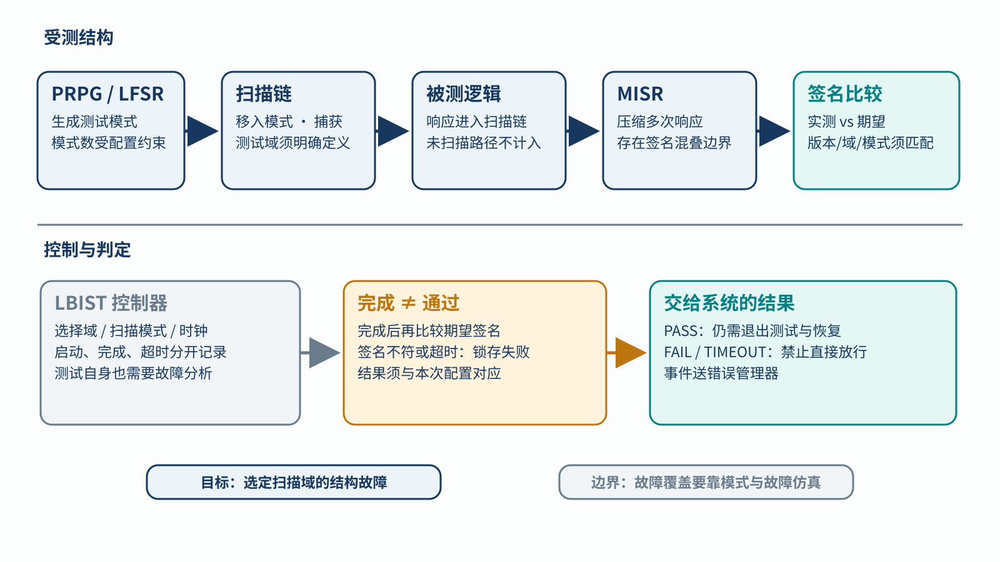
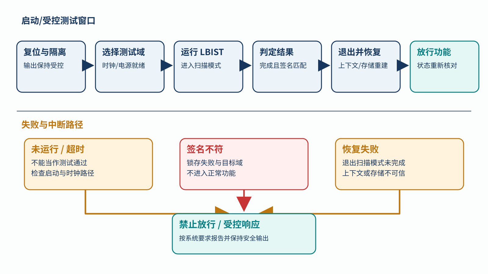

# 11｜LBIST 测了逻辑，为什么还要看启动时序？

[返回系列索引](../INDEX.md) · 中文初稿，未完成目标器件核对

假设一颗 SoC 在启动后才放行安全相关输出。放行前，数字逻辑里若已有一个长期潜伏的故障，仅靠运行中的 lockstep 或数据 ECC 未必能看见：前者需要两路在比较点出现分歧，后者检查的是指定码字。LBIST（Logic Built-In Self-Test，逻辑内建自测试）提供一段受控的结构测试窗口。但测试电路给出“完成”信号，距离安全功能可以运行，还隔着结果判断和状态恢复。

## 一次扫描测试交出了什么证据

常见扫描式 LBIST 使用 PRPG（伪随机模式发生器，常以 LFSR 实现）产生模式，装入目标扫描链；被测组合逻辑在捕获拍形成响应，MISR（多输入签名寄存器）将多次响应压缩为签名。控制器负责选择测试域、设置扫描模式与时钟、计数模式并处理完成或超时。最后，实际签名要与**同一设计版本、扫描域、模式数和配置**对应的期望签名比较。[Infineon 的 Logic-BIST 说明](https://documentation.infineon.com/aurixtc4xx/docs/pvz1545137908465)给出了 PRPG、扫描域、MISR 和测试控制的器件实例；其中的运行时间与覆盖率只属于该器件配置。

*图 1｜扫描式 LBIST 概念架构。上半部追踪 PRPG、扫描链、被测逻辑、MISR 与签名比较；下半部区分控制器给出的完成/超时状态、期望签名版本匹配，以及错误上报。图中没有目标器件的测试模式或覆盖率数字。*

LBIST 检查的是选定扫描域中**可控制、可观察**的数字逻辑，不能把未纳入扫描的路径也算进去。模式约束、未知值处理、签名压缩以及故障模型会改变实际检出能力；不同错误响应还可能压缩成相同签名。MBIST/PBIST 针对存储阵列，ECC 则在正常读写中检查码字，三者不能互相替代。若要给 LBIST 报出故障覆盖率，需要目标扫描结构、模式集和故障仿真等证据，而不是 PRPG 与 MISR 两个方框。

## 测试窗口改变了系统的可用状态

启动测试若在安全输出放行前执行，可发现一部分启动前已存在的故障。运行中才出现的故障，要到下一次测试才有机会被发现；若用周期测试控制潜伏时间，测试间隔也要进入分析。扫描模式常会中断被测核或 IP 的正常运行，测试后可能需要复位、恢复上下文、重新初始化存储，再验证软件与外设进入预期状态。[TI 的 J721E LBIST 集成文档](https://software-dl.ti.com/jacinto7/esd/processor-sdk-rtos-jacinto7/08_06_00_12/exports/docs/sdl/sdl_docs/userguide/j721e/modules/lbist.html)明确说明了软件触发测试对被测核的破坏性与恢复责任；不能把这种测试当作普通后台任务。

*图 2｜测试时间和放行条件。测试前须让目标域进入允许的状态；测试完成后还要比较签名、退出扫描模式、恢复状态，全部满足后才放行安全功能。超时、签名不符或恢复失败均进入受控处理，不能误记为通过。*

因此，时序要求不能只写“LBIST 运行若干模式”。要列出测试域、启动条件、最坏执行时间、退出测试模式的方法、存储和上下文是否仍可信、错误时的系统动作。若测试会暂停原本正在控制的功能，应先决定谁维持受控输出。若用它为单点故障提供诊断，还要证明故障发生到受控动作的时间足够短；若只用于周期发现潜伏故障，则分析重点是测试间隔与多点故障组合。

## 测试机制也可能失效

`not run`、`running`、`timeout`、`signature mismatch` 和 `pass` 必须是可区分的结果。控制器未启动、扫描链未覆盖目标域、MISR 卡死、期望签名表与版本不符，或失败后错误锁存被清除，都可能造成错误放行。向结果比较器注入错误，只能验证结果处理路径；不能证明扫描域中的所有结构故障都会形成不同签名。测试控制器、时钟和复位本身也应进入故障分析。

[ISO 26262-5:2018](https://www.iso.org/standard/68387.html) 附录 D 把逻辑 BIST 列为硬件支持自测试的一类示例。真正评价一颗 IP 时，应把目标扫描域、模式与故障模型、完成和比较状态、恢复流程、失败动作放到同一份证据链里。只拿到“LBIST PASS”字样，仍无法判断这次测试覆盖了哪片逻辑，或安全功能是否在测试后被正确放行。
