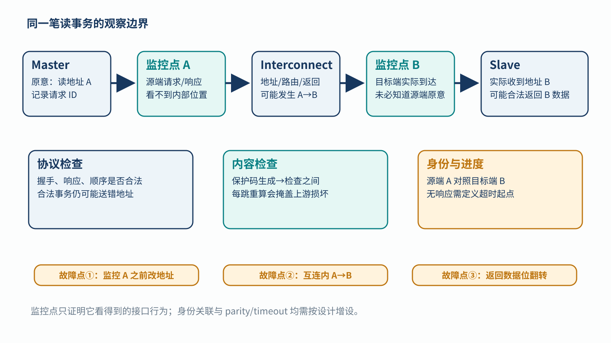
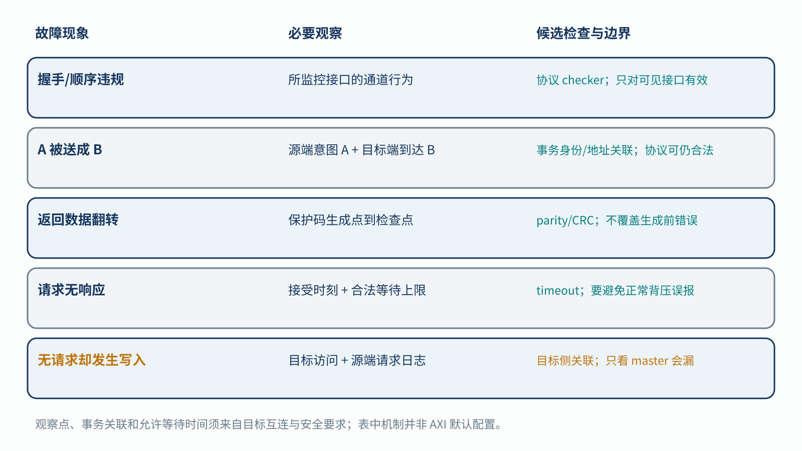

# 12｜AXI 事务出错时，监控器能看见什么？

[返回系列索引](../INDEX.md) · 中文初稿，未完成目标互连核对

Master 要读控制参数 `A`，互连里的地址却变成 `B`。Slave 合法地返回 `B` 的数据和正常响应，握手与顺序也完全符合 AXI。一个只检查协议的监控器可能全程显示通过，却没有发现消费者读错了参数。监控 AXI 之前，要先给出观察位置和故障类型；“总线受保护”本身不能说明读者真正关心的数据是否到了正确地方。

## 同一事务有四种不同的错误

协议检查器能发现所观察接口上的非法握手、通道关系或响应规则；它不判断上层本来想访问哪个地址。数据 parity 或其他完整性码可发现被保护字段在**生成与检查之间**发生的某些位错误；若每一跳都重新计算保护码，上游损坏的值可能被重新包装为合法数据。事务身份或端点地址检查用于识别误路由、错目标以及无请求的额外访问。Timeout 则针对没有按约定结束的事务，但必须说明计时从请求被接受还是发出时开始，正常背压和长延迟怎样处理。[Arm 的 AMBA AXI 规范入口](https://www.arm.com/architecture/system-architectures/amba/amba-specifications)用于核对协议语义；这里提到的 parity、身份关联和 timeout 是按需求增设的保护，不是所有 AXI 接口默认拥有的能力。

*图 1｜Master、互连与 Slave 之间的概念观察点。源端记录请求身份，目标端核对到达事务，返回路径另检查数据与响应；地址在监控点前改变、目标端凭空访问和返回数据翻转会留下不同证据。图中监控器为候选设计，不是 AXI 默认功能。*

将监控器放在 master 侧，可以看到发出的请求与最终响应，却未必知道互连内部哪一级改写了地址；放在 slave 侧能看到实际到达的请求，却未必知道 master 原本想发什么。若地址在**第一个观察点之前**已被破坏，后面的监控器只核对它所见到的地址，仍可能一致。要识别 `A→B`，可以将源端请求身份与目标端到达信息比较，或让消费者使用独立保存的预期地址/事务信息。无请求却发生了目标写入，则需要目标侧的访问观察和来源关联；只检查 master 发出去的事务不会看见它。

## 用故障矩阵反推检查器

图 2 将错误按“发生了什么、哪里能观察到、哪类检查可能有效”并列。数据位翻转、误路由、事务丢失、协议违规和多出来的访问，不应都算入同一个 `axi_error` 计数。尤其是“协议合法但语义错误”的路径，需要事务身份或端点内容的独立判据。

*图 2｜教学故障矩阵。每行把注入位置、观察到的现象与候选检查对应起来；“可检查”仍受保护字段、监控位置、事务关联和时间窗口限制。*

验证时可以固定一笔读参数事务，分别在源端之前改地址、在互连中改地址、在返回链路翻数据位、让 slave 不响应、在目标端制造无源请求的访问。对每种刺激记录实际握手、地址和事务标识、保护字段、超时起止点、报告事件及下游是否使用了数据。正常背压和被允许的长事务要作为反例，避免 timeout 误报。若是写事务，非法或多余的写还必须检查目标寄存器或存储器是否已产生副作用。

ISO 26262-11:2018 的半导体数字模块例子提醒我们区分“没送到”“多送了一笔”“送错地方或时间”和“值不对”。实际 AXI Monitor 的结论只能覆盖被观察的通道与已测试的故障模型。第 13 章再把生产者和最终消费者连起来，讨论跨过单一接口后的内容、身份、顺序和新鲜度。
