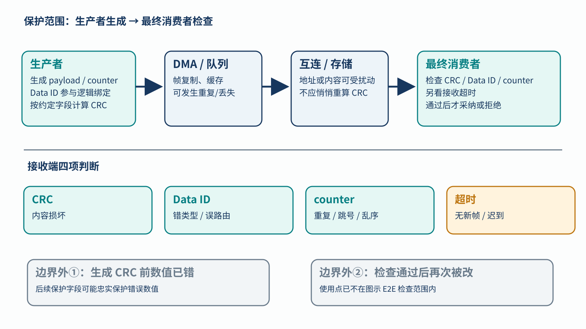
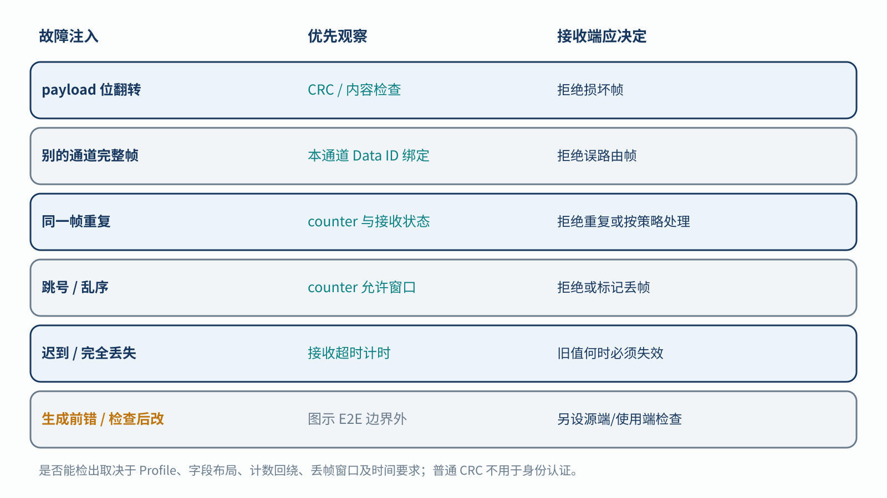

# 13｜E2E Protection 怎样发现数据送错、送迟或重复？

[返回系列索引](../INDEX.md) · 中文初稿，未完成目标消息格式核对

控制命令从生产者写入 DMA 缓冲区，经互连和队列送到执行 IP。每一跳都可能握手成功，最终消费者拿到的仍可能是上一轮的命令，或另一个通道的完整命令。E2E Protection（端到端通信保护）要让**生产者生成检查信息、最终消费者核对检查信息**，把中间搬运造成的内容、身份、顺序和新鲜度问题留到最后一端一起判断。

## 四种检查信息分别解决什么

教学消息可写为 `payload + counter + CRC`，并在双方配置中约定 `Data ID`。CRC 按约定的字段、位序、初值和多项式计算，用于发现其能力范围内的内容损坏；Data ID 将校验绑定到预期消息类型或通道，帮助识别误路由；counter 让接收端识别重复、跳号和乱序；独立的接收超时监控处理长时间没有新消息的情形。**Data ID 不一定作为明文字段随每帧传输**：例如某些 AUTOSAR E2E Profile 的模式把它隐式纳入 CRC 计算。不能把图中的教学字段布局误当成固定报文格式。[AUTOSAR E2E Library 规范](https://www.autosar.org/fileadmin/standards/R4.3.1/CP/AUTOSAR_SWS_E2ELibrary.pdf)提供了不同 Profile 的字段与状态处理实例。

*图 1｜E2E 教学路径。保护信息在需要覆盖的传输与缓存之前生成，在最终使用之前检查；图上还标出“生成前数值已错”和“检查后再被改”两个边界外反例。Data ID 在图中表示逻辑绑定，不暗示它一定出现在报文中。*

例如消费者上一轮接受 counter 为 7，本轮又收到 7，但 payload 改了。即使新帧 CRC 与自身内容一致，counter 仍提示重复或状态异常。另一个通道完整帧被误送过来时，原帧 CRC 也可能正确；与**本通道期望的** Data ID 绑定的检查才有机会发现混淆。若生产者在计算 CRC 前就给出了错误控制量，E2E 会忠实保护这个错误值；源端结果合理性或冗余计算要另行负责。

保护的两个“端”也要按安全要求确定。只在 AXI 某一跳生成和校验 parity，不能推出随后 DMA 缓冲区、软件复制和执行 IP 都在保护内。桥接器若把已经损坏的内容重新计算 CRC，消费者可能接到一个内部一致却错误的帧。反过来，检查通过后数据若还会被改写，检查点也没有覆盖最后的使用。保护字段、消息长度、计数器回绕、允许丢帧窗口、复位后首帧同步，都要写进接收规则；CRC 不保证发现所有错误，普通 CRC 与计数器也不提供防恶意篡改的认证。

## 错误类型决定拒绝与恢复

将内容位翻转、整帧重复、跳号、误路由、延迟、完全丢失以及检查后改写分别放入矩阵，能看到哪类检查会报警，哪类落在保护边界外。接收端还需决定拒绝当前值、保留上次可信值或进入受控状态；“保留旧值”本身也受数据时效约束，不能无限期使用。若系统要求在某个反应时间内完成动作，计数器或超时状态何时形成、软件何时消费状态，都需要测量。

*图 2｜故障与检查项对照。勾选表示在约定 Profile、字段和接收状态正确配置时有检测机会，不代表必然检出或特定覆盖率；生成前错误和检查后篡改属于图示 E2E 边界外。*

实际核对需要一份明确的消息格式、计数和超时策略，以及消费者的拒绝动作；注入要分别放在保护生成前、传输途中和检查通过后，不能把边界外刺激算作机制漏检。第 2 章谈的是故障到受控动作的时间链，本章谈的是通信内容在最终使用前能否被信任；两条链应在系统响应处接起来。
