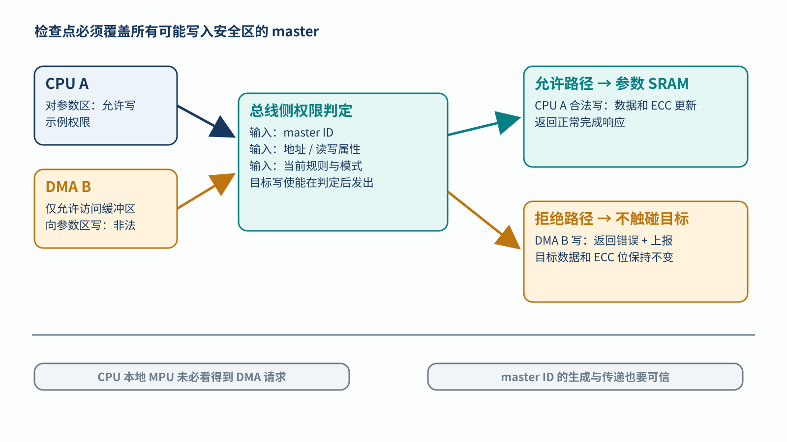
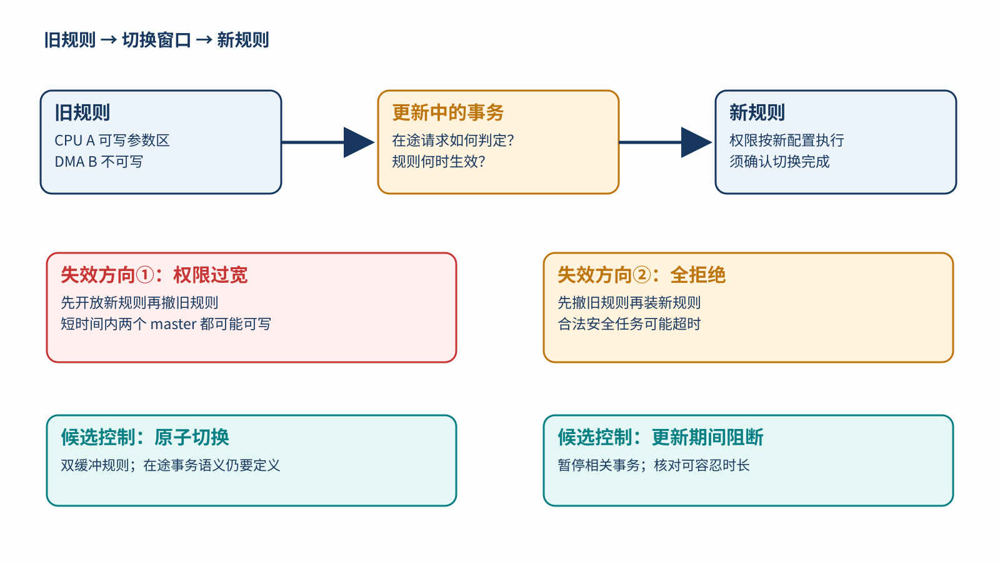

# 14｜MPU 与 Firewall 怎样保护安全域？

[返回系列索引](../INDEX.md) · 中文初稿，未完成目标隔离 IP 核对

控制参数存放在带 ECC 的 SRAM 中。DMA 却向参数地址写入了一份格式正确、数值错误的数据，控制器顺手生成了正确的 ECC；之后再读，校验完全通过。ECC 只能检查存储码字的完整性，不能判断**这笔写入是否有权发生**。因此，访问隔离必须在目标产生副作用之前生效。

## 先区分保护位置，再判断访问

CPU 内的 MPU 通常约束该 CPU 发起的访问；总线侧 firewall、共享内存保护单元或目标侧访问控制才能按其实际接线检查 DMA 和其他 master。即便都叫“MPU”，可观察的主设备与地址范围也未必一样。做 SoC 隔离时，需画出每个 master 到安全区域的全部路径，以及每个检查器位于路径的哪一段。

一次访问至少包含可信的 master 身份、目标地址、读写属性和当前权限配置。教学例子中，CPU A 被允许读写控制参数区，DMA B 只能读写自己的缓冲区。CPU A 的参数写入应被放行；DMA B 对参数区的写入应在目标前被拒绝，返回定义清楚的错误响应并记录事件，同时保持目标数据与 ECC 位不变。若只看见 `deny=1`，没有观察 SRAM 写使能和读回内容，还不能证明隔离成功。[Infineon 对总线内存保护的公开说明](https://documentation.infineon.com/aurixtc3xx/docs/owq1745576218449)展示了不同 master 对共享内存区域的访问限制；具体复位默认值与规则数量只适用于该器件。

*图 1｜访问隔离教学例子。判定输入包含 master 身份、地址和读写属性；允许路径进入 SRAM，拒绝路径返回错误并上报，但不会产生目标写使能。图中 CPU A/DMA B 的权限只是示例配置。*

权限检查器也可能被错误身份误导：若身份在检查点之前被错误改写，后续规则会对“看到的身份”做出一致但错误的判断。因此，master ID 的生成、传递与检查边界要一起核对。隔离器还会以相反方向失效：本该挡住的写入被放行，或本该允许的安全任务长期被阻断。后者可能让控制功能超时，不能因“更严格”就自动视为安全。

## 更新策略也会产生短暂故障窗口

权限配置是运行状态。若先撤旧规则再装新规则，可能暂时全拒绝；若先装新规则再撤旧规则，也可能暂时让两个 master 同时可写。双缓冲规则加原子切换，或更新期间阻断相关事务，是两种候选处理；它们各自需要核对正在途中的事务、切换完成标志和失败后的回退。复位默认策略、谁能写配置、配置位翻转后是否可发现，也影响隔离可信度。

*图 2｜策略切换的两类风险。旧规则与新规则交接期间可能形成过宽窗口或全拒绝窗口；图中原子切换只是候选实现，不能推定实际 IP 已具备。*

验证时用同一地址分别发 CPU A 合法写和 DMA B 非法写，记录检查器输入、允许/拒绝决定、总线响应、目标写使能、读回值与错误报告；然后在复位、配置切换和错误恢复边缘重复。既检查非法写是否漏过，也检查合法任务是否被饿死或超过反应时间。MPU/firewall 可以服务功能安全中的干扰隔离，也可能用于信息安全，但安全目标、故障模型和恶意攻击模型不能混为同一份证明。只有把规则、路径和配置状态对应起来，才能评价某个实际隔离边界。
