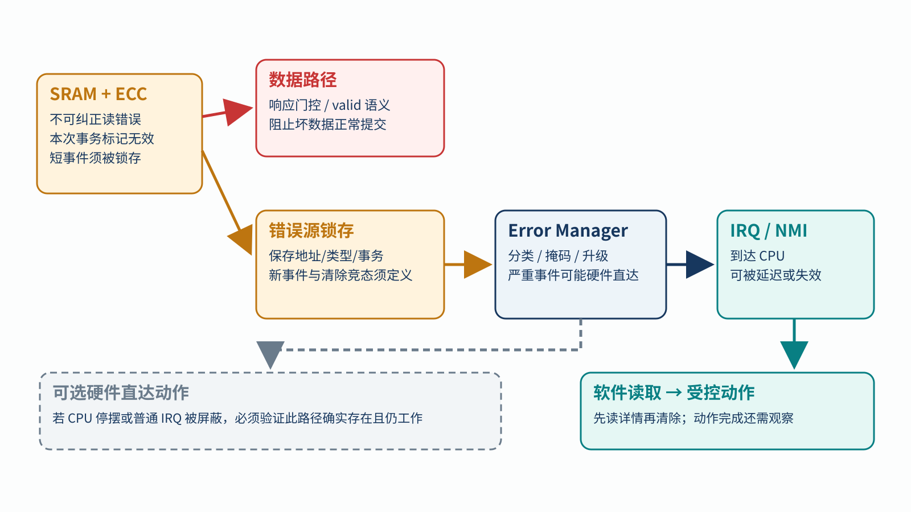
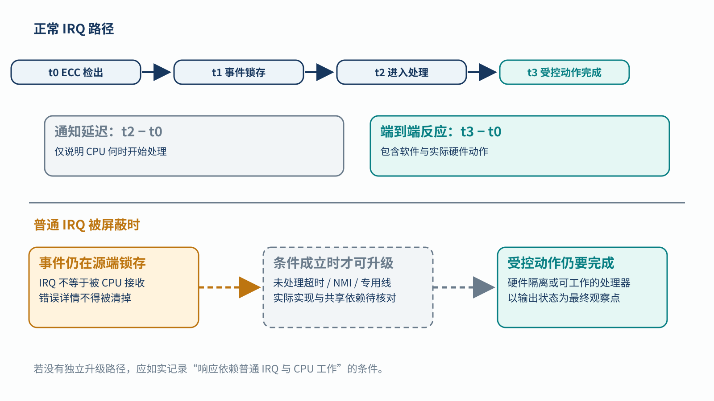

# 15｜错误中断发不出来时怎么办？

[返回系列索引](../INDEX.md) · 中文初稿，未完成目标中断架构核对

ECC 已经检出一笔不可纠正的 SRAM 读取，`error` 信号也拉高了。如果普通 IRQ 恰好被屏蔽，CPU 可能仍不知道发生了什么；如果错误数据已经作为有效值送出，稍后进入处理程序也无法收回那次使用。一个安全事件要经历**源端约束数据、事件保存、通知、处理和受控动作**，每一段都要有明确观察点。

## 源端检测后，事件如何活到软件读取

用一次 SRAM 读取举例。ECC 在读事务上标出不可纠正状态，同一事务的数据有效性必须按接口规则处理，不能让下游只收到“正常数据”。短脉冲错误应进入锁存器，保留地址、错误类型和必要的事务信息；Error Manager 再按配置分类、聚合或升级。中断控制器把通知送到 CPU，处理程序先读来源与详情，再按规定清除。若先清再读，可能丢失诊断信息；若清除旧事件时新事件又到，锁存与清除优先级必须定义。

*图 1｜错误报告与数据路径并行。源端先处理本次读数的有效性；事件经锁存、Error Manager 和中断到软件。严重错误可配置硬件直达动作，但这不是每个系统默认具备的通路。*

普通 IRQ 可能被优先级、屏蔽位或 CPU 停摆延迟。NMI、专用线、超时升级或硬件直接隔离是不同的设计选择，分别受 CPU、时钟、复位和路由依赖约束。NMI 绕过某些普通屏蔽规则，也不代表软件一定能执行；若 CPU 已停钟，必须考虑还能工作的硬件路径。反过来，误报和错误源编码也可能让系统执行不必要或错误的动作，不能只检查“应发未发”。

## 把通知延迟和动作延迟分开量

设 `t0` 为 ECC 检出，`t1` 为 Error Manager 锁存，`t2` 为 CPU 进入处理程序，`t3` 为输出实际进入受控状态。`t2−t0` 只能说明通知与调度延迟，**故障反应时间**还包括处理与硬件动作直到 `t3`。若 IRQ 从 `t1` 起被屏蔽，系统需说明由谁发现未处理事件、何时触发升级、升级路径是否也依赖停摆的 CPU。只看到 `irq=1` 或处理程序开始执行，不能证明 `t3` 赶在危险输出之前。

*图 2｜两条响应时序。正常路径列出检测、锁存、送达、软件读取和受控动作；另一条在 IRQ 被屏蔽后只有存在且验证过升级路径时才可继续。图中无固定时间数值，实际预算取决于系统要求。*

故障注入要覆盖应发未发、无事件误发、送达太晚和带错来源四类结果。观察源端数据有效性、锁存状态、掩码/优先级配置、中断送达、软件清除顺序、报警再次到来时是否保留，以及最终输出。对有硬件升级的方案，还需单独注入普通 IRQ 屏蔽、CPU 忙碌、CPU 停摆和升级线失效，确认“备份”没有共用同一个薄弱环节。不同 PLIC、GIC 或专用控制器的优先级和清除语义不同，测试必须按目标架构展开。

把错误集中交给 Error Manager 方便分类，却也把锁存、掩码、配置和路由变成共同依赖。下一章会专门讨论它自身失效时如何避免把多个错误源一起静音。本章能够成立的结论仍限于实际验证过的路径：ECC 检出、IRQ 发出与系统完成安全动作，是三件不同的事。
