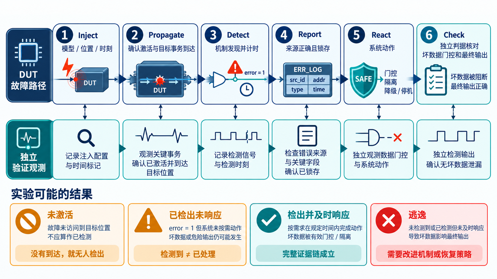
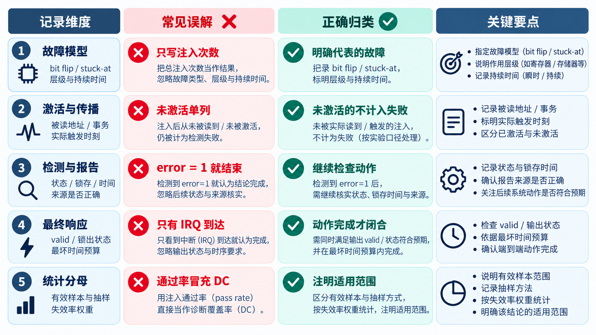

# 17｜故障注入怎样检验安全机制？

[返回系列索引](../INDEX.md) · 中文初稿

一个 ECC 单元通过了正常读写测试，只能说明无故障时的数据路径基本可用。要检验错误处理，工程师得主动制造异常。但“把一个 bit 翻过去并看到 `error`”仍不是完整实验：这次翻转到底发生在哪里？该地址是否被读到？报错后错误数据有没有继续传给下游？系统最后采取了什么动作？

## 注入位置决定结论

*图 1｜故障注入不是一个刺激加一个 `error` 信号；每段都要留下位置、激活、时间和输出证据。下排将未激活、只检出未响应与逃逸分开，防止统计口径混淆。*

若在 SRAM 阵列中的数据位注入翻转，随后触发读取，可检验编码、存储、解码和错误报告的一部分路径。若在 ECC 解码之后强行改掉输出数据，测试的则是下游是否还有保护，不能算作 ECC 对阵列故障的覆盖。若注入一个控制寄存器位，却从未执行对应功能，实验没有激活故障路径；把这种情况记为“机制通过”同样会误导。

一轮可审阅实验需要六步：定义 **Inject** 的故障类型和位置；确认它真的 **Propagate** 到目标路径；记录机制何时 **Detect**；核对错误怎样 **Report**；检查系统是否 **React**；最后用独立判据 **Check** 数据与状态。每一步都要有观察点和时间边界。例如系统要求不可纠正错误不得被当作有效读数据，checker 就不应只看告警，还要检查 `valid` 或响应语义。

这六步应先进入 Verification Plan：每条 IP LRS/硬件安全需求对应什么故障模型、注入层级、期望行为、时限、配置和通过/失败判据。执行后的 Verification Report 再记录实际刺激、观察结果、失败与偏差、工具/设计版本及证据路径。计划定义“凭什么算通过”，报告回答“这次是否真的通过”；事后根据观察结果改写判据，会让证据失去独立性。对集成级要求，单元级报告可作为输入，还要检查 Error Manager、软件或硬件动作是否真正走通。

## Campaign 的结果如何读

批量故障注入可以覆盖更多位置和时刻，但“注入次数”不是覆盖率本身。需要区分无效注入、故障未激活、被检测、被纠正、只报错未响应，以及真正逃逸的情况。模型化注入与真实物理故障之间也存在边界：仿真翻转寄存器不能自动代表时序、模拟或共因失效。

一份可比较的 campaign 报告需要同时给出故障模型、配置、批次、注入点、检查规则与统计口径。没有这些字段，“成功率”甚至无法判断分母是全部故障、已激活故障，还是只包括某类可观察故障。

**实验计划要能复做。** ISO 26262-11:2018 的故障注入指导把抽象层级、故障列表、注入位置、观察点、诊断点、工作负载和采样依据都列为规划变量。这些字段直接决定结论能否被他人复核：在 RTL 上做单次 bit flip，与门级 stuck-at 或硅后扰动的代表性不同；在基本工作负载上检查比较器输出，也不能直接推出完整软件场景的诊断覆盖。必要时可以组合分析与注入，但必须说明各自覆盖的部分。

## 一条可复核的注入记录长什么样

与其在报告里写“运行一万次注入”，不如先保证每次记录能回答：故障模型、抽象层级、注入位置、持续时间、发生周期、工作负载、实际激活与否、观察点、判据和最终分类。假如某个 bit flip 落在始终未读取的地址，结果应记为未激活或未传播，不能算作“安全机制成功检测”。若测试台用模型替代真实 watchdog，还要说明模型保留了哪些报警和时序属性。

选取部分故障点进行抽样时，也要写选择依据。采样可以节省仿真时间，但不能在未说明总体、抽样方式和不确定性的情况下把样本通过率当成全设计诊断覆盖。

*图 2｜一条可复核记录至少交代故障模型、实际激活、检测与报告、最终动作和统计分母。右列是对应的归类原则；表格为教学格式，不代表已有 campaign 结果。*
