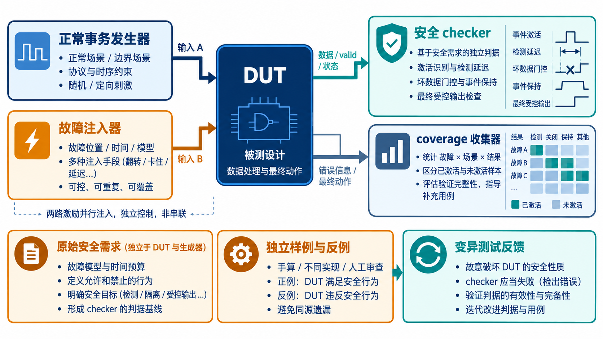
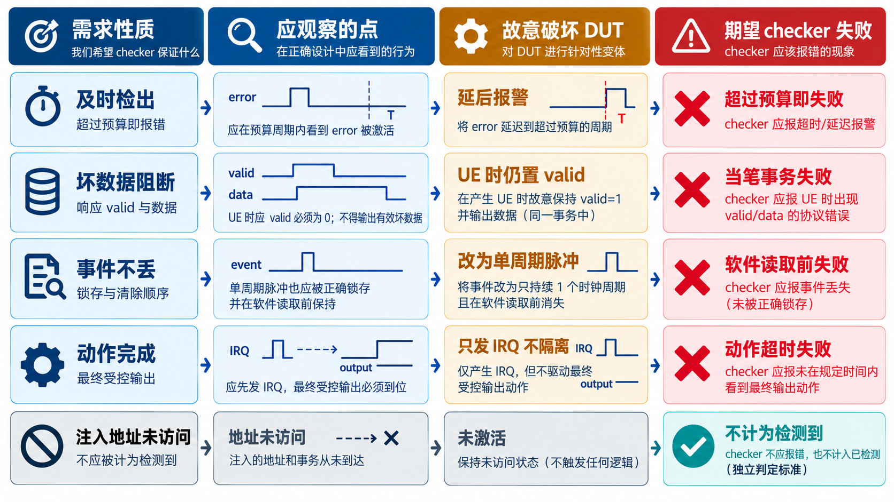

# 18｜Safety VIP 要检查故障后的哪几步？

[返回系列索引](../INDEX.md) · 中文初稿

普通 VIP 可以检查 AXI 事务的握手、响应和数据一致性。安全相关验证要多走一步：当指定故障在指定时刻出现，DUT 是否在规定窗口内检测到它，是否阻止错误结果继续传播，是否按要求报告，以及系统动作是否真的发生。只在 scoreboard 里加一个 `wait(error)`，做不到这些。

## 把正常流量和故障放在一起

*图 1｜事务发生器和故障注入器共同驱动 DUT；安全 checker 独立观察数据、事件、时限和最终动作。判据从原始需求与独立样例来，coverage 收集触及情况与结果，不直接给出诊断覆盖率。*

没有真实访问，许多故障根本不会被激活。例如 SRAM 存储位翻转以后，若测试从未读该地址，ECC 没有机会发现。Safety VIP 需要一边生成合法或边界事务，一边控制注入点和时机，再跟踪事务与故障的对应关系。对 ECC，checker 应区分可纠正数据、不可纠正状态与下游消费；对 watchdog，要检查服务发生的时窗；对总线监控器，要区分协议违规和数据损坏。

断言与 coverage 各有职责。断言可以写“在指定故障激活后 N 个周期内必须上报”，但 N 需要来自需求，且要明确跨时钟域怎样计数。Coverage 则记录故障类别、位置、激活条件和响应结果是否都被实验触及。覆盖某个组合，不等于其失效率权重或诊断覆盖率已经被证明；后者还需要故障分类和统计假设。

## 判据必须有独立来源

AI 可以协助生成 DUT 和 checker，但如果两者都照着同一条错误理解实现，就可能一致地通过。可靠做法是让需求、手算样例、不同实现或人工审阅提供独立判据；对关键性质，还要设计反例，确认 checker 真能抓到故意破坏的行为。Mutation testing 的价值就在这里：若删掉一条错误报告逻辑，测试是否会失败？

例如“SRAM 单比特错误能被纠正”这句话不足以生成一个有效测试。还需指定翻转发生在写前、写后还是读出途中；选择哪一位；是否真的读到该地址；修正数据和 `correctable` 状态分别在哪个接口观察。若没有读访问，这次注入只能记为未激活，不能算检测成功。Safety VIP 把这类故障假设变成可重复检查的实验；没有真实运行记录时，不能把示例 campaign 写成已取得的覆盖率。

**统计口径不能藏在 VIP 后面。** ISO 26262-11:2018 对数字电路故障注入验证讨论了测试台激活能力、故障位置与发生时机、模型抽象程度，以及被模拟安全机制的保真度。若为了跑得快，用一个简化 watchdog 模型替代实际 RTL，需要额外说明该模型保留了哪些安全性质。若只抽样一部分故障，也要讲清抽样依据和置信范围；否则一条“99% detected”会给读者不应有的确定感。

## 让 checker 证明自己会失败

一个具体做法是从需求写出四条独立检查：指定故障被激活后应在窗口内检出；不可纠正数据不得带正常有效标记；事件应保持到接收方确认；系统动作应在预算时间内完成。随后故意破坏 DUT 的其中一条逻辑，例如取消错误锁存或让坏数据仍置 `valid`，检查回归是否失败。若测试依旧全绿，问题在验证环境，不应先庆祝 DUT 稳定。

Safety VIP 的覆盖项还要分别记录故障位置、事务阶段、并发流量和响应类别。功能覆盖率与失效率加权的诊断覆盖不是同一个数字，报告时必须分开。

*图 2｜每一行将独立需求、观测点、变异和预期失败对应起来。最后一行提醒：未访问注入地址是未激活样本，不能记作检出成功。*
