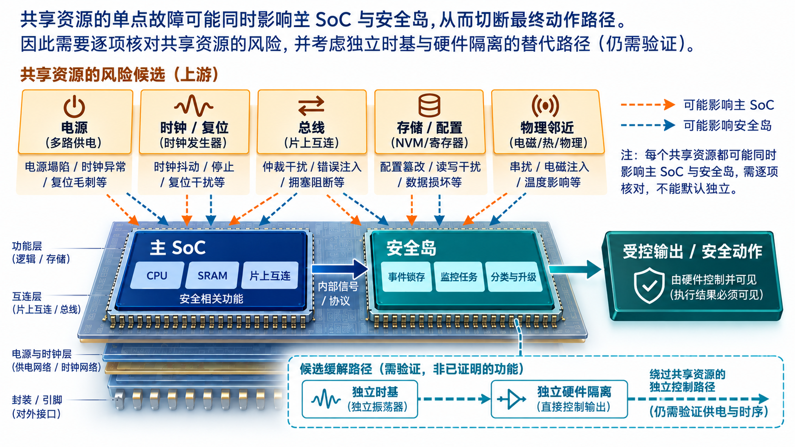
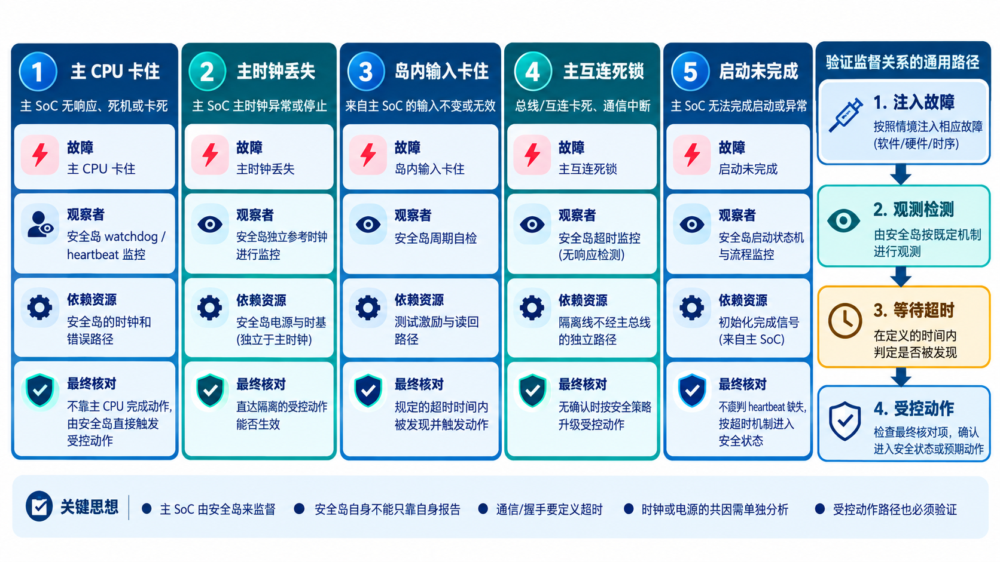

# 22｜功能安全岛怎样监督主 SoC？

[返回系列索引](../INDEX.md) · 中文初稿

主 CPU 若已经卡死，还让它负责判断“我是否卡死”显然不可靠。Safety Island 的想法，是在主功能之外设置一个能观察错误、保存关键状态并触发响应的监督区域。但画出一个独立方框，只代表架构意图；真正的独立性要穿过时钟、复位、电源、存储和通信路径逐项检查。

## 监督者需要哪些输入和动作

先把安全岛的边界画清：哪些错误信号直接进入岛内锁存器，哪些由主 SoC 软件转报；岛内逻辑掌握哪些输出的最终控制权，哪些动作还得经过主总线。假如主总线死锁时，安全岛只能通过这条总线下发“停止输出”，它就没有解决最需要监督的情形。相反，若安全岛拥有独立的硬件隔离线，也要证明这条线本身受保护、上电状态确定，并在故障处理时间内生效。

安全岛可以接收 ECC、lockstep、watchdog、clock monitor 与总线监控器的错误事件，统一记录并按策略升级。它也可能运行一段受限软件，检查主处理器的 heartbeat、参与故障恢复或协调受控停机。设计时应从具体安全目标反推需要的输入与输出，而不是把所有监控 IP 都塞进安全岛。某些严重错误需要硬件直达隔离/复位路径，不能等一颗同样可能失效的管理核慢慢轮询。

若安全岛与主 SoC 共用同一 PLL，PLL 失效时两边可能同时停摆；若共用复位源，异常复位可能同时清除错误记录；若通过同一互连上报并下发控制，互连故障可能切断整个响应链。ISO 26262-11:2018 的半导体相关失效分析讨论了共享时钟、复位、电源和基础设施引发的依赖。解决办法可能是独立资源、交叉监控或外部监控，但每种方法都要重新分析自己的失效与代价。

*图 1｜安全岛独立性要沿 PLL、复位、电源、调试网络和互连核对，最终还要看到输出隔离是否可生效。虚线候选缓解并不代表已有独立时基或硬件直达线。*

## 用依赖失效分析检查“独立”

安全岛与主功能之间需要的独立性，不能只靠两个方框之间的间距判断。**依赖失效分析（DFA）**先定义需要保持独立的元素和安全要求，再找出一个合理可预见的发起因素如何通过共享资源或耦合路径让两者一起失效。共因失效可以让两路在同一根因下同时出错；级联失效则由一个元素的错误传播并破坏另一个元素。二者都可能击穿监督架构，分析时不能把同一根因硬拆成两个独立随机故障。

以安全岛监控主 CPU 为例，先画出 CPU、岛内监控器、最终隔离输出和所有共同上游资源。然后逐项追问：同一 PLL 停摆是否让 CPU 和监控器一起停？同一调试使能是否同时关闭比较和错误上报？共享电压参考异常是否让多路电源监控共同误判？测试模式、复位树、DFT 网络、总线和中断控制器也要进入清单。对每条可成立的路径，记录发起因素、传播条件、受影响的两个元素、安全目标可能受到的影响，以及现有独立监测或缓解措施。找不到合理耦合路径也要保留判断依据。

例如共享 PLL 失效后，若安全岛依靠独立振荡器保持运行，并通过不依赖主互连的硬件线让输出进入受控状态，就有一条可检查的缓解路径；但独立振荡器、隔离线和其电源仍需各自核对。若隔离命令最终仍经已停摆的主总线，则“岛内检测到了”不足以关闭这条依赖失效路径。DFA 的结论应落实为可验证的架构要求，而不是把“物理隔离”“冗余”写成自动有效的标签。

这项分析与第 19、20 章的随机硬件失效分类和 FMEDA 互相补充。SPFM/LFM 的示意账本不能代替共因与级联失效分析；DFA 也不能凭一次故障注入给出一个普适的百分比覆盖率。[ISO 26262-9:2018](https://www.iso.org/standard/68391.html) 将依赖失效分析列为独立的安全分析活动，[ISO 26262-11:2018](https://www.iso.org/standard/69604.html) 给出半导体共享资源与物理耦合的进一步指导。

## 安全岛也有安全需求

可以用三次故障演练检查架构。第一，主 CPU 卡住：watchdog 到期后，安全岛是否能在不依赖主 CPU 的情况下记录事件并完成动作？第二，主时钟丢失：岛内是否仍有可用时间基准，能否发现丢失并驱动输出？第三，安全岛自己的事件输入卡住：周期自检能否在允许的潜伏故障检测区间内发现它？这三次实验对应主功能故障、共享资源故障与监督者自身故障，少任何一种，都不能只凭“独立安全岛”四个字说明设计有效。

事件锁存器卡住、配置损坏、岛内存储错误、监控任务未运行，都会让监督者丧失作用。上电测试、周期性自检、配置保护、专用错误输出或冗余监督可以缓解部分风险。是否需要这些措施，仍取决于故障分析和允许的多点故障检测时间。安全岛若无法在要求时间内完成响应，“独立”也不足以支持原安全主张。

审查实际设计时，还需要资源依赖图、故障注入和系统动作的时序。先把框图中的共享线圈出来，再沿每条线追问：它失效时哪些监控仍能工作，谁能让输出进入受控状态？若答案仍依赖同一条已失效的路径，“独立安全岛”的主张就需要收窄或修改架构。

## 安全岛与主 SoC 的握手也要定义

安全岛发出隔离请求后，主 SoC 是否必须返回确认？若主总线已经死锁，确认永远不会回来，岛内应等待、超时升级，还是走独立硬件输出？同样，主 SoC 上电尚未完成时，安全岛看到的 heartbeat 缺失不能与运行中失联使用同一判据。启动、运行、降级和复位四种状态的监督规则需要分别定义。

这类接口不是单纯的通信协议问题。它决定故障处理能否在允许时间内完成，也决定安全岛自身错误能否被主系统察觉。

*图 2｜矩阵把主 CPU 卡住、主时钟丢失、岛内输入卡住、主互连死锁和启动未完成分开审查。每行都需要目标设计中的实际资源和响应证据。*
