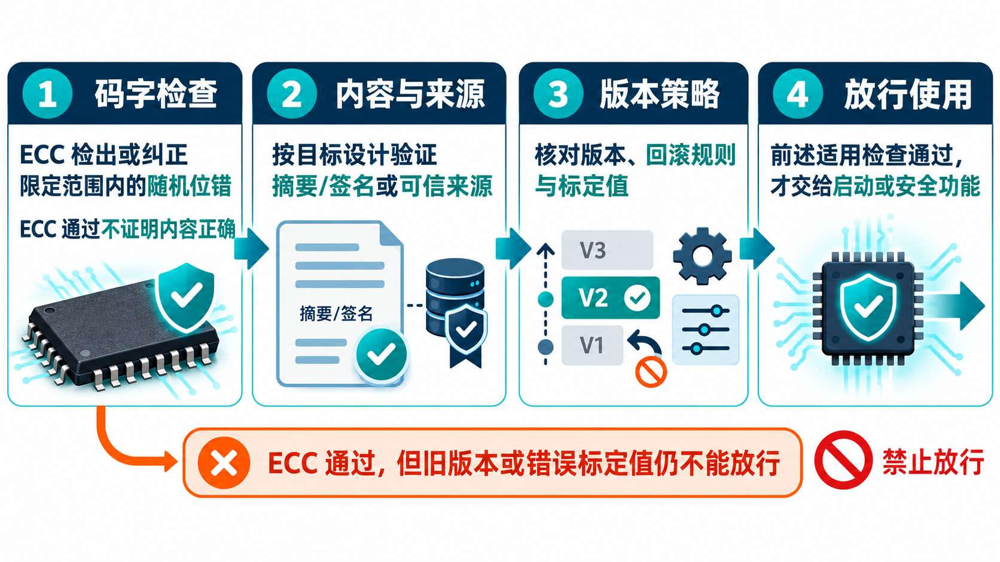
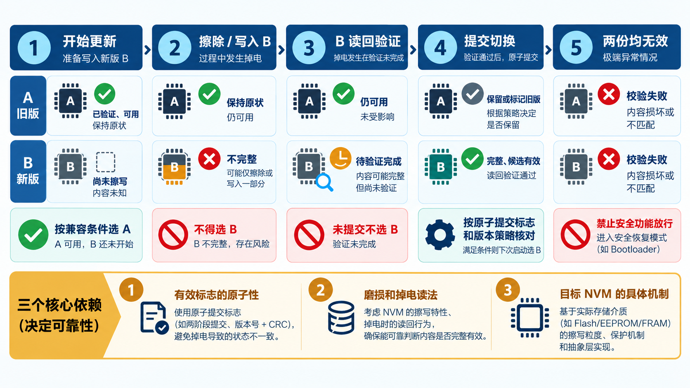

# 23｜Flash 校验通过了，启动数据就一定可信吗？

[返回系列索引](../INDEX.md) · 中文初稿

假设处理器从片上 Flash 取出一份控制参数，读口 ECC 没有报警。系统仍可能拿到一份错误数据：参数写到了错误地址、版本指针指向旧区、更新时掉电留下半份新数据，或者错误内容与它的校验值一起被写入。SRAM 篇讨论的是运行中一个码字如何损坏；非易失存储器（NVM）还要回答另一件事：**上电后究竟该信任哪一份长期保存的内容**。

这里把程序 Flash、数据 Flash 和一次性可编程的 OTP 都看成候选载体。它们的擦写粒度、寿命、出厂状态与失效表现不同，不能用一套“Flash 已有 ECC”的配置覆盖所有器件。下文用可更新的参数区作教学场景，不暗示某个现有芯片已经实现所述方案。

## 先按数据的用途分故障

程序指令、校准系数、安全策略、启动选择位和器件身份信息都可能存在 NVM 中。一个位错误对不同内容的后果并不相同：程序指令可能改变控制流，校准系数可能在合法数值范围内缓慢偏移，启动选择位则可能让 CPU 执行错误镜像。分析应先写清数据在何时被读取、谁会使用、更新由谁发起、错误能否在使用前被发现，以及失败后可否恢复或必须禁止功能放行。

NVM 阵列自身可能出现保持失效、读取干扰、擦写失败、地址译码或控制路径故障。擦除态也不是普通有效数据：某些 Flash ECC 组合对擦除态的读法和异常处理有专门约束，不能把未编程单元的全一模式自动解释为一个已初始化、可信的 ECC 码字。OTP 则通常无法像双 bank Flash 那样重写恢复；一次错误编程或读取错误需要另行分析冗余编码、校验和启动处理。具体失效模式必须按目标工艺与宏资料核对。[ISO 26262-11:2018](https://www.iso.org/standard/69604.html)在半导体存储器讨论中分别列出非易失和易失存储器的候选诊断措施。

## 字级 ECC、整块校验与签名各管一层

*图 1｜字级 ECC、整块检查、版本选择分别回答不同问题；数据与 CRC 同时出错或更新中掉电仍可能让读口 ECC 通过。末端放行必须建立在选中有效版本之上。*

字级 ECC 在每次读取时检查该码字，适合处理其码距和故障模型内的位错误；它不会自动知道“这份完整镜像是不是预期版本”。对固定的程序或参数区，可以在规定时机计算整块 CRC，并与独立受保护的预期值比较，以发现所选故障模型内的内容损坏。若错误流程把数据和 CRC 一起改成自洽的新值，这种比较便不能证明内容仍符合原来的功能要求。数字签名是另一种机制：在密钥、验签代码与信任根可信的条件下，它可验证内容来源和完整性，但不能证明被授权签入的内容在功能上正确，版本选择与回滚规则仍要单独检查。普通 CRC 不提供身份认证或防恶意篡改能力。[NIST FIPS 186-5](https://csrc.nist.gov/pubs/fips/186-5/final)说明数字签名用于检出未经授权的数据修改并认证签署者身份；它不代替功能正确性审查。已有第 6 章的全零/全一码字分析对 NVM 同样提醒我们：完整存储位型与擦除态、地址和 ECC 的关系，应以目标控制器的实际编码与有效地址集合检查。

整块扫描还引入时间和资源问题。若启动前必须验证程序区，扫描完成前不能执行未经验证的安全相关代码；如果检查程序本身就从被检查的 Flash 运行，要分析“执行期间读到坏指令”与“尚未完成检查”的循环依赖。若采用运行期分段扫描，需规定块大小、最大重复间隔、正常取指与 DMA 的仲裁、检查时内容是否允许更新，以及故障被发现前数据可能已被使用。某些器件的 CRC 扫描会占用 Flash 访问并使 CPU 等待，其他器件允许限速后台扫描，不能把一种器件的时序套给另一种。[Microchip 的 NVM CRC 示例](https://onlinedocs.microchip.com/oxy/GUID-C0410A3B-A192-4F94-A83F-81035433111B-en-US-2/GUID-B147D547-9BE5-4799-923A-784B3A6E41E1.html)就明确展示了扫描与 CPU 访问之间的关系。

## 更新中掉电时，下一次启动选哪一份

假设安全参数存为 A/B 两份。更新时先写备用区并完成读回、ECC 与按设计选定的整块校验或验签，再以一个有明确定义的提交步骤切换有效版本。若掉电发生在擦除、写入、校验或提交的任一位置，下一次启动都必须能辨别：旧版本仍有效、新版本完整有效，还是两者都不能安全使用。需要保护的不只是参数字节，还有版本号、有效标志、bank 选择位和更新状态机。把“有效标志最后写”当成通用解法仍不够，因为标志本身的写入原子性、磨损与上电读取行为依赖 NVM 技术。

一个可审查的教学状态机至少区分 `旧版本有效`、`新版本写入中`、`新版本已验证`、`提交完成` 和 `无可用版本`。若只剩旧版本，系统能否继续运行取决于旧参数与当前软件及安全要求是否兼容；若两份都无效，必须有明确的禁止放行或受控降级路径。若程序镜像也可更新，还需核对复位后执行入口、回滚条件及外部安全监控是否仍可工作。[Infineon 的双 bank 更新资料](https://documentation.infineon.com/traveo/docs/eyn1762021324263)可作为这种状态与掉电切换的器件实例，但不能替代目标器件的数据手册和安全分析。

## 怎样验证这条信任链

验证矩阵应横跨**数据类型 × 故障位置 × 发生阶段**：阵列单/多位错、错误地址、错误版本指针、预期校验值或签名本身损坏；上电扫描、正常读取、擦写中、提交前后掉电。每个实验都要观察错误是否在数据被消费前出现、哪份内容最终被选中、错误状态是否锁存、下游功能有没有被放行。还要单独检验 ECC 或 CRC 控制器未启动、扫描中断、比较结果卡住等监控器故障。故障注入若只修改仿真中的数据位，不会覆盖真实擦写、保持和供电时序。

这一章的工程稿仍需要目标 Flash/OTP 的宏行为、擦写约束、ECC/签名配置和可公开的掉电恢复记录。当前先给出判据：**码字正确、块内容正确、版本选择正确，以及错误时不错误放行**，是四个需要分别证明的主张。

*图 2｜旧版有效、写入备用区、读回校验、提交切换和两份均无效五种状态对应不同重启决定；有效标志的原子性与擦写行为须按目标 NVM 核实。*
