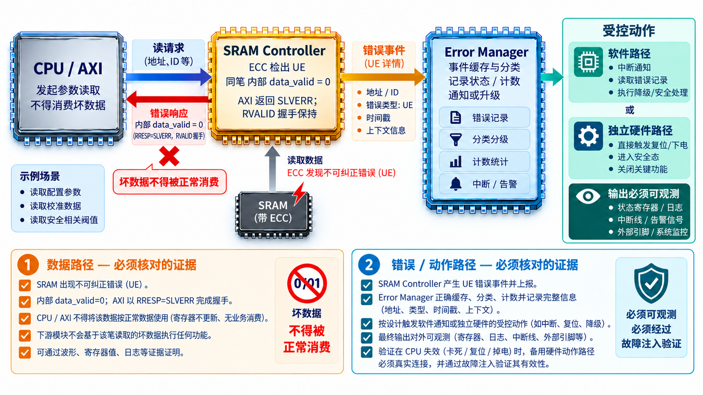
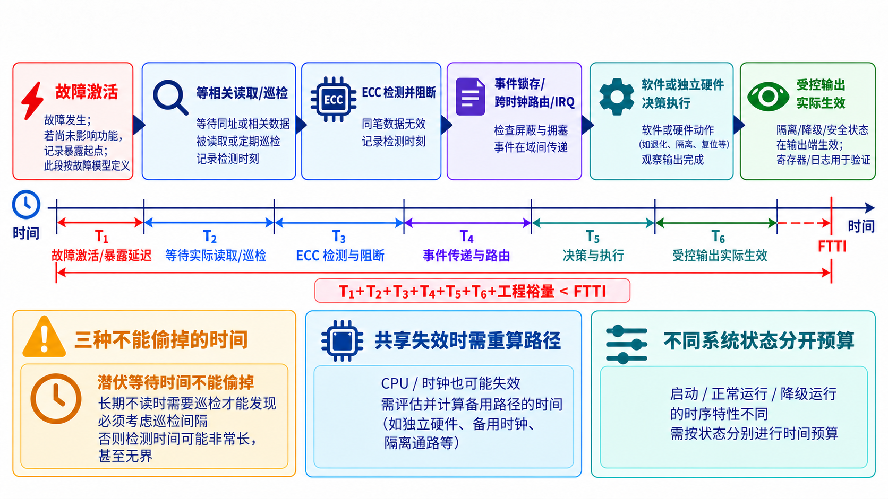

# 29｜用一颗 Mini Safety SoC 走完整条故障链

[返回系列索引](../INDEX.md) · 中文初稿

前面二十八章把问题拆开了：ECC 处理某些数据错误，MPU 阻止越权访问，Error Manager 收集事件，Safety VIP 检查故障后的行为，Flash 和 ADC 还把长期保存的数据与物理测量送入系统。TSC、IP 需求、故障分析和 Safety Manual 则说明这些机制为什么存在、怎样使用。现在把它们放回同一个受限的教学系统，看看一条故障链要经过多少交接。Mini Safety SoC 不是现有产品声明，而是一张帮助核对接口和证据的概念架构。

## 先限定架构和场景

*图 1｜内部 `data_valid` 表示载荷能否正常消费，AXI 的 `RVALID` 则表示读响应拍有效；SRAM 检出 UE 时，图中示例以 `RRESP=SLVERR` 完成握手。同一笔事务的数据、事件上报及最终受控输出需分别核对。CPU 不可用时的备用动作是待设计和验证的候选路径。*

假设 CPU 从受 ECC 保护的 SRAM 读取控制参数，经 AXI 互连访问，Error Manager 收集严重错误，专用通知路径唤起处理软件，软件或硬件随后让相关输出进入预先定义的受控状态。这里的目标不是把 lockstep、MBIST、firewall、safety island 全部列出来；只有参与这次故障处理的模块，才出现在主路径上。额外机制可以放在旁边，说明它们覆盖的是其他故障假设。

现在给 SRAM 中的一个码字注入超出所选纠错能力、但能够被检出的错误。CPU 读该地址时，解码器给出“不可纠正”状态，阻止坏数据作为正常值使用；在本教学接口中，内部 `data_valid=0`，AXI 仍以 `RVALID/RREADY` 完成读响应握手，并以 `RRESP=SLVERR` 报错。`DECERR` 通常用于地址未能译码到目标的情形，不是这里的 SRAM UE。控制器锁存地址和事件；Error Manager 分类并发出错误通知。处理软件读状态、确认所属功能后执行隔离，或硬件先行阻断输出。若 CPU 此时已失效，系统不能依赖同一 CPU 完成最后动作；这需要备用或硬件路径。若报错必须在固定时间内完成，所有阶段的延迟要相加，而不只报 ECC 解码的周期数。

## 再按证据核对每一段

这一示例至少需要四类证据：一是 ECC 对指定码字错误的行为；二是坏数据没有被正常消费；三是错误报告从源端到处理端没有丢失；四是最终动作在要求时间内生效。FMEDA 还会问各模块与报告路径本身的失效如何分类，相关失效分析会问共享时钟或复位能否同时切断主功能和监督者。ISO 26262-5:2018 的硬件集成与验证关注的正是把硬件安全需求放到集成层面检查，而非简单汇总各 IP 的单元测试。

这张概念架构可以用三个问题来拷问：上电初始化完成前，错误数据能否被使用？运行中普通报告路径被屏蔽时，谁接手？进入受控状态后，复位或重新使能是否会让危险输出再次出现？同一条故障在启动、正常运行和降级模式下可能需要不同的动作；只演示一次“错误中断到了 CPU”，回答不了这三个问题。

## 把端到端时间写成预算

从 SRAM 错误被激活到受控动作，可把时间拆成“等待相关读访问、ECC 检测、源端锁存与报告、中断或硬件通路传递、软件/安全岛决策、最终执行器动作”。并非每段都一定由芯片承担；但系统安全目标关心的是合计是否仍落在允许时间内。某个 IP 宣称“一个周期检出”，不能代表整条链一个周期完成。

可在教学案例中把允许的故障容忍时间记为 `T_FTTI`，把最坏条件下各段检测、传输、决策和执行时间记为 `T_i`，要求响应路径满足 `ΣT_i < T_FTTI`，并留出时钟误差、仲裁阻塞和软件调度等裕量。这个不等式只有在故障起点、危险输出出现的时刻及最坏运行条件都定义清楚后才有意义。若某项检测只在下一次读访问发生，等待访问的时间不能偷换成一个 ECC 周期；如果没有最大访问间隔，就不能凭这条在线路径声称有界检测时间。危险已经发生后才进入受控状态，也不能算作按时防止该次违反安全目标。

若故障在数据长期不被读取时潜伏，还要单独看 scrubbing 或自检周期；若 CPU 因共因故障无法执行处理软件，则必须换一条响应路径。这些反例能让 Mini Safety SoC 从模块清单变成可审查的系统方案。

同一架构还可换两种输入做边界检查：若从 Flash 读出的校准参数虽通过字级 ECC、却属于错误版本，启动选择与整块检查必须在使用前阻断；若 ADC 输出来自错误通道、数值仍在合理范围，范围检查不会报警，系统需要另一种可观察信息。这两条路径不必硬塞进 SRAM 故障演示的同一时序，但应在集成需求表中分别写明数据的生产者、验证点和受控响应。第 23、24 章的局部诊断，只有连上这里的消费和动作路径，才有明确的系统作用。

要把这颗教学 SoC 作为工程交付对象，还应为同一故障链列出文档对应关系：上层安全需求定义哪类错误不可被使用；TSC 分配检出、阻断和动作；SRAM Controller 的 LRS 与 HSI 给出可检查接口；DFMEA、FTA、DFA 与 FMEDA 记录逃逸与共同依赖，并评价指定范围内的随机硬件故障；验证报告记录注入、观察和时限；Safety Manual 将初始化与响应责任交给集成者。任何一步仍是教学假设，安全论证就只能在该假设的范围内讨论，不能写成整颗 SoC 已通过功能安全评估。

*图 2｜`T₁` 是故障激活或暴露延迟，`T₂` 是等待实际读取或巡检，二者须按同一故障模型界定，不能重复计时。`T₆` 以受控输出实际生效为终点；寄存器或日志只提供验证证据。长期不读、CPU 失效和运行状态变化须分别预算；图中没有实测时间。*
