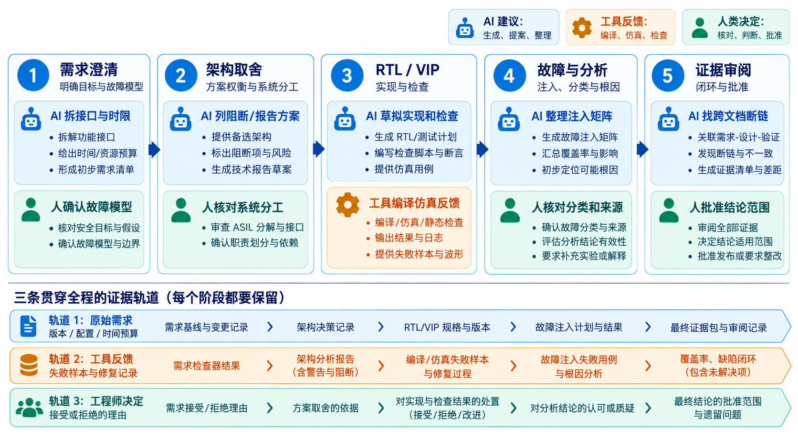
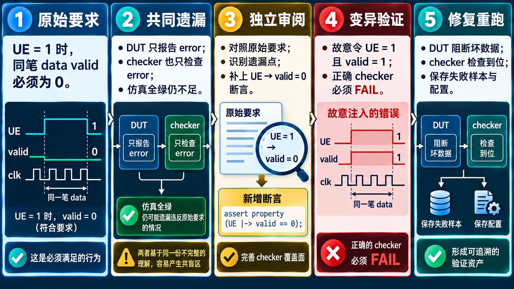

# 30｜AI 能在哪些功能安全研发环节帮上忙？

[返回系列索引](../INDEX.md) · 中文初稿

如果前二十九章只留下一个结论，那就是功能安全研发里没有一份文件能独自证明结果。需求决定机制要解决什么，架构决定错误能否被观察和响应，RTL 落实行为，验证提供特定条件下的证据，FMEDA 和相关失效分析则审视仍会漏掉什么。AI 的机会在于帮助工程师维护这些关系，但它不能替代关系背后的判断。

## 把 AI 放到具体工作上

*图 1｜需求、架构、RTL/VIP、故障分析与证据审阅各有 AI 可以提供的候选；原始要求、工具失败反馈与人的取舍贯穿全程。图中没有“一键认证”含义。*

以“SRAM 不可纠正错误不得作为正常数据使用”这条教学需求为例，AI 可以先帮助把自然语言拆成接口行为、异常状态和可测试条件；工程师必须确认故障模型、时间限制和系统响应。架构阶段，AI 可以列出“返回错误响应”“阻断 valid”“锁存并通知”的候选组合，工程师对照总线协议、软件接口和故障分析做取舍。实现阶段，它可以草拟 ECC 控制逻辑或 SVA，工具给出编译、仿真与形式检查反馈，工程师审查边界条件与配置差异。

到了故障 campaign，AI 可以整理注入矩阵和结果分类，却不能把无效注入算作检出。到了 FMEDA，它可以协助对齐失效模式、机制与测试记录，但失效率来源、分类依据和适用条件需要独立核实。到了 RTM，它可以发现“需求有了、测试没了”之类的断链；最终审阅者仍要确认链接所指证据是否真的支持结论。整个过程中，人做的是定义目标、挑选风险、批准取舍并承担结论，AI 提供候选和整理能力，EDA 与验证工具提供反馈。

新加入的 NVM 与 ADC 章节也能形成具体任务：AI 可以枚举“更新到一半掉电”应插入的状态点，或把“ADC 数值合理但来源错误”拆成 MUX、参考源、采样时刻和校准数据的候选故障。工程师仍须用目标 Flash 的擦写规则、模拟电路模型及板级实验筛掉不成立的场景。AI 若只从数字 RTL 推断 ADC 诊断覆盖率，或把 CRC 通过当成 NVM 版本可信，应被原始安全需求和独立实验直接纠正。

## 一个典型的 AI 错误怎样被发现

看一个**教学假设**：AI 根据“ECC 检出错误后拉高 `error`”生成 checker，DUT 也确实拉高 `error`，两者一致通过。但原始需求还要求不可纠正数据不得继续以有效数据输出。工程师独立审阅原始需求时，发现 checker 没有看 `data_valid`，便增加一条故障注入与断言。再次运行时，若坏数据仍带 `valid`，检查器应失败。这个例子展示一种可操作的纠错路径：回到独立需求，补观察点，再用故意破坏输出门控的变异测试确认 checker 会报警。同源生成的实现与测试若共同遗漏约束，回归全绿也无法发现。

一套可持续的研发方式，是让每个安全主张都能追到需求、设计、故障假设和独立证据，让工具帮助维护连接，让工程师持续检查连接是否仍然成立。AI 能加快候选方案与资料整理；可信度仍来自可解释的取舍与可核对的结果。

## AI 工作流需要留下什么记录

一个可审阅的 AI 辅助任务，至少保存原始需求版本、给 AI 的约束、候选方案、工程师选择或拒绝的理由、工具运行配置、失败与修复记录，以及最终证据的独立来源。仅留下“AI 生成了 RTL”和一份 PASS 日志，无法判断测试是否覆盖原要求，也看不出生成过程中是否把边界条件删掉。

AI 特别适合帮助检查跨文件一致性，例如 HSR 的检测时限是否同时出现在 RTL、SVA、故障 campaign 和 HSI 中。它发现差异后应提出待核对项，由工程师根据原始要求与工具结果裁决。对某个工具的能力描述，也应落在可展示的具体操作与记录上。

*图 2｜教学纠错路径：图中 `valid` 指内部数据可供正常使用的标志，并非 AXI 的 `RVALID`。图内断言只是关系示意；实际 SVA 还需明确采样时钟、复位、`UE` 与对应事务的对齐。人工审阅补检查后，故意破坏输出门控，应看到 checker 失败。*
