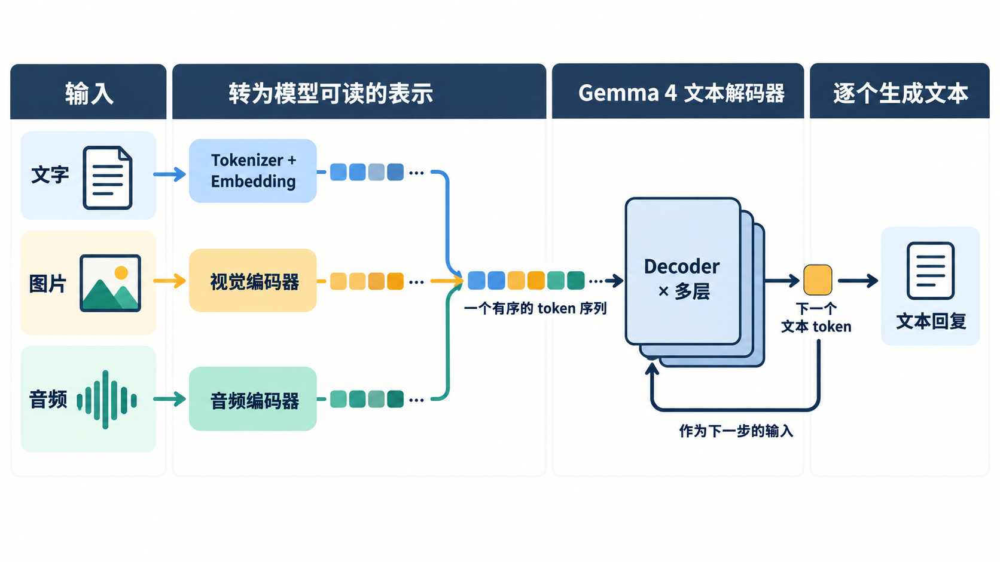
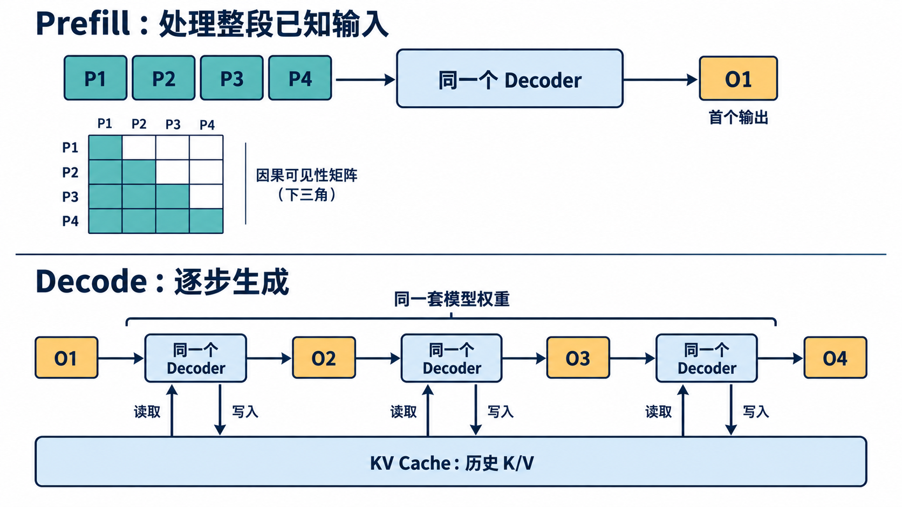

# Gemma 4 E4B 推理全景：多模态输入如何生成文本

[系列索引](README.md) · 第 01 期

同一个问题，可以打字问 Gemma 4，也可以附上一张照片，甚至录成一段语音。E4B 接收到的原始材料不同，最后交还给人的却是一段文字。它怎样把图片或声音带进回答？那段回答又是在什么时候、以什么顺序写出来的？沿着这两个问题往下看，Gemma 4 的计算全景就会清楚起来。

Gemma 4 是 Google DeepMind 发布的一组开放权重模型，包含 E2B、E4B、12B Unified、26B A4B MoE 和 31B Dense。它们有不同的规模，也有不同的输入路径：E2B、E4B 和 12B 可以接收音频，31B 则没有原生音频输入。本系列沿 **E4B** 追踪具体计算。它适合拿来讨论端侧资源，而且从文字、图像到音频的三条输入路都齐全。型号中的 E 指 *effective*：模型卡给出的 E4B 有约 4.5B effective 参数，连同 embedding 计算的总参数约 8B。它们分别描述什么，我们留到权重章节再算。

## 先建立一幅全景：输入是多模态，输出是逐 token 的文本

对文本，外层程序先把消息按聊天模板排好，再由 Tokenizer 切成 token ID。Token 是模型使用的离散单位，可能是一个字、词片段、标点或控制符，不等于屏幕上数到的“一个词”。Embedding 把 ID 变成数值向量，供后面的神经网络计算。

图片和声音没有文字可切。E4B 让图片经过预处理、patch 表示和视觉编码，让声音经过特征提取和音频编码，分别得到一串连续向量。这些向量常称**软 token**：它们在后续序列里占位置，却不是 Tokenizer 从普通文字里查出的 ID。投影到语言模型使用的宽度后，它们与文字向量汇成一条有顺序的输入。视频也可以拆成帧，进入视觉路径。这样，模型既保留了“问题文字在问什么”，也能把图片或声音中的信息带进后面的推理。

*图 1：E4B 的输入全景概念图。文字经 Tokenizer 与 Embedding；图片、音频各经专用编码器，成为软 token，再与文本向量一起进入文本解码器。图中小方块表示有顺序的表示单元，不代表三种输入具有相同的预处理成本，也不表示一张图片固定产生四个 token。*

合流之后，文本解码器处理的是这条向量序列。E4B 的主向量宽度是 2560，语言主干有 42 层。每层的 Attention 让当前位置读取允许看到的上下文，MLP 加工当前位置的特征，逐层嵌入（PLE）再为本层提供一份与原始输入有关的信息。注意力层也有分工：五个局部层后接一个全局层，使大部分层只读近处，定期让位置直接查看更长的历史。走完所有层，模型把序列末尾的向量变成词表中各候选 token 的分数。生成程序选出一个 ID，把它接回序列，再运行下一步。屏幕上的一段回答，就是这些步骤不断延续的结果。推理期间模型使用已经训练好的权重，不会因这一句提问而自动更新权重。

因此，“多模态”和“生成”说的是这条链的两端：前者决定问题能带入什么材料，后者决定回答怎样出现。E4B 可以读图、听音并生成文本；如果产品要把回答朗读出来，还需在文本之后接语音合成。

## “Decoder only”究竟指什么

到了这里，“decoder only”这个名字也容易理解了。它描述的是**负责语言建模和逐 token 生成的主干**：主干沿同一条序列，根据已有内容预测接下来写什么。E4B 的多模态系统仍有视觉和音频编码器，负责在输入端处理各自的材料；“decoder only”并没有把这些输入前端排除掉。这里的 decoder 也不是音频播放软件里的波形解码器。

设已经排好的输入 token 是 `x₁, x₂, …, xₙ`。语言生成的基本问题是求 `P(xₙ₊₁ | x₁, …, xₙ)`：在已知前缀的条件下，哪个 token 应该接在后面。选出 `xₙ₊₁` 后，问题变成 `P(xₙ₊₂ | x₁, …, xₙ₊₁)`。这就是**自回归**。模型每次给出一组候选分数，外层生成规则可能取最高分，也可能按温度等设置采样，所以同一提示词不一定总得到完全相同的措辞。

文本生成时，**因果注意力**规定了每个位置能读到什么：当前位置可以利用已有前缀，不能读尚未产生的后文。对于已经给定的提示词，模型可以在一次前向中处理多个位置，同时用因果 mask 约束各位置的可见范围；对于尚未写出的回答，下一枚 token 必须等上一枚被选出后才能确定。图像等媒体块有更具体的 mask 规则，后面讲多模态时再展开。

## 一次回答有两个节奏：Prefill 和 Decode

用户提交请求后，提示词已经确定。模型先处理这段已知输入，建立各层的中间表示，并为后续生成准备需要保留的历史 K/V。这一阶段叫 **Prefill**。它通常一次面对多个输入位置，因此许多线性运算能把多个 token 排成矩阵行，共同使用一块模型权重。Prefill 结束时，模型可根据提示词末尾的位置预测第一个回答 token。用户感受到的“等多久才开始出字”，会受到这段工作影响。

得到第一个回答 token 后，模型仍不知道第二个是什么。它把刚选出的 token 作为新输入，再执行一步前向，产生第二个；此后依次类推。这段逐步扩展输出的过程叫 **Decode**。在单请求的典型情形下，每步只新增一个位置；计算历史 Attention 时，可读取 Prefill 和先前 Decode 步保留的 **KV Cache**，避免每一步都从头重算整个前缀。即使有缓存，后一枚 token 的内容仍依赖前一枚的选择，所以同一条回答的各步不能任意并行决定。

*图 2：`P1–P4` 是已知提示词位置，`O1–O4` 是依次选出的输出 token；颜色和数量只用于教学。Prefill 的因果矩阵表示“后一个已知位置可以看前面的已知位置”，不是在 Prefill 中同时生成四个输出。图中 KV Cache 的读写箭头重点画了 Decode；Prefill 也会建立初始 K/V。两阶段使用同一套模型权重。*

模型权重在两个阶段相同，工作形状却变了。Prefill 处理整段已知序列，决定首 token 前要做多少计算、保留多少临时状态；Decode 每步的新输入很短，却反复访问权重和历史 K/V。提示词长度、回答长度和并发请求数又会改变这些访问的数量。讨论端侧速度时，至少要分别看首 token 延迟和后续 token/s；芯片的峰值算力不能直接回答用户要等多久。

这一章的链条走到了回答出现：文字、图像和音频先各自变成向量，汇入 E4B 的语言序列；文本解码器读已有内容，逐个决定后面的 token；Prefill 处理已经给出的部分，Decode 接续生成的部分。接下来可以沿这条链逐段拆开。先看第一步：同一句中文在屏幕上只有十来个字，真正送进模型的 token 序列会是什么样？
资料：[Google Gemma 4 模型卡](https://ai.google.dev/gemma/docs/core/model_card_4) · [E4B 固定配置](https://huggingface.co/google/gemma-4-E4B-it/blob/ee0ef6023621cff504d758262d4e04895a5af4a2/config.json) · [Transformers Gemma 4 源码](https://github.com/huggingface/transformers/tree/8445b13cd24961e47f25a649fb113580f71a8d11/src/transformers/models/gemma4)
