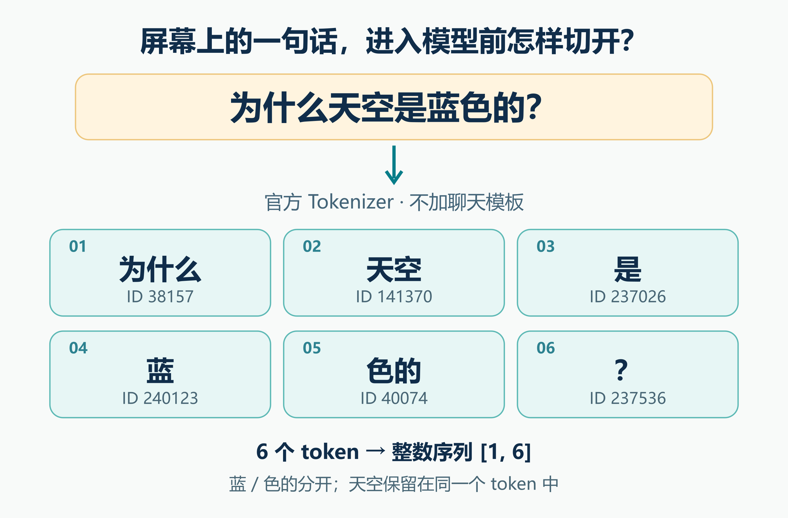
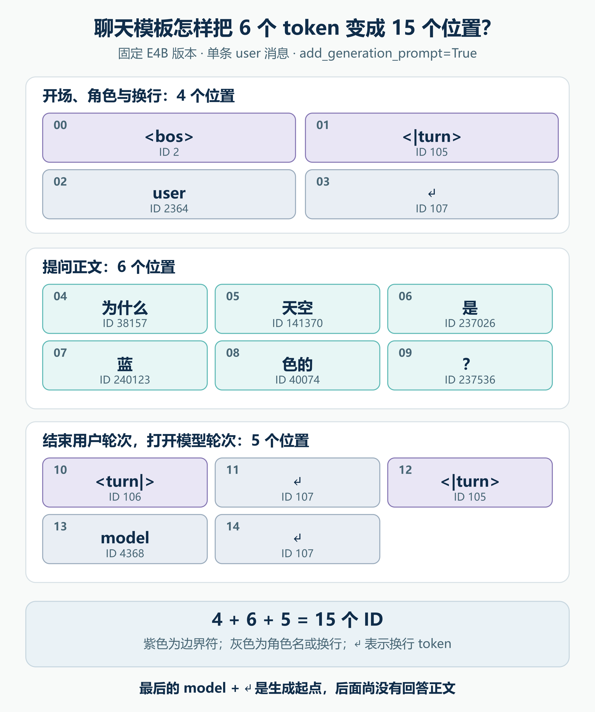

# 一句提问，怎么变成 15 个 Token？


[系列索引](README.md) · 第 02 期

上一期我们把 Gemma 4 的一次回答看成“读入已有内容，再预测下一个 token”。这里马上有个看似简单的问题：用户打下“为什么天空是蓝色的？”，模型读到的第一个东西究竟是什么？如果只按屏幕上的汉字数估计输入长度，后面讨论 Prefill、上下文窗口和 KV Cache 时，第一笔账就会算错。

E4B 的文本路径先由 Tokenizer 把字符串编码为整数 ID。这里的 token 是模型词表中的一个单位，可以覆盖几个字，也可以只覆盖一个字或标点。固定同一份 Tokenizer，同一段文本会得到确定的 ID 序列；ID 只是词表索引，数值大小不表示“更重要”或“更接近某个意思”。下一期的 Embedding 才会把这些索引变成可计算的向量。

## 先不套聊天模板：这句话被切成了六段

用 `google/gemma-4-E4B-it` 的固定 revision `ee0ef6023621cff504d758262d4e04895a5af4a2` 编码这句**原始文本**，并关闭自动添加特殊 token，得到如下结果：



*图 1：这六段是固定版官方 Tokenizer 的实际输出，图中的“？”使用原句的全角标点 `？`。图内 ID 是词表索引；这一步还没有加入角色或轮次标记。图由可编辑 SVG 精确绘制，不是模型运行截图。*

| 顺序 | Tokenizer 显示的片段 | ID |
| ---: | --- | ---: |
| 1 | 为什么 | 38157 |
| 2 | 天空 | 141370 |
| 3 | 是 | 237026 |
| 4 | 蓝 | 240123 |
| 5 | 色的 | 40074 |
| 6 | ？ | 237536 |

“天空”被保留在同一段，“蓝色的”却成了“蓝”和“色的”。这不是一套按语文词性切词的规则：Tokenizer 按自己的词表和编码规则把字符序列转成可识别的片段。换一个上下文或换一个 Tokenizer，边界就可能不同。因此不能用汉字数、空格数或人眼看到的“词数”代替 token 数。

这一轮编码得到的 ID 列表是 `[38157, 141370, 237026, 240123, 40074, 237536]`。如果只把这一句作为一条输入放进张量，形状可写为 `[1,6]`：`1` 是批量，`6` 是位置数。但聊天模型真正接收用户消息时，还有一步容易漏掉。

## 消息要有边界：六段内容怎样变成十五个位置

模型需要分清谁在说话、这一轮在哪结束、接下来轮到谁回答。聊天模板负责把这些结构排到序列里。对**只有一条 `user` 消息**、并设置 `add_generation_prompt=True` 的同一句提问，固定版官方 Tokenizer 返回 15 个 ID。按位置摊开，就能看见多出的九个位置在哪里：



*图 2：位置 `00–03` 建立消息起点和 `user` 角色，`04–09` 是刚才的六段提问，`10–14` 结束用户轮次并打开 `model` 轮次。紫色是边界符；灰色的 `user`、`model` 与换行也各占一个 ID。`↵` 表示换行 token。图是对固定版本编码结果的教学整理，前缀长度不能套到任意多轮对话。*

把图 2 的三段连起来，完整 ID 序列是：

```text
开场与角色  [2, 105, 2364, 107]
提问正文    [38157, 141370, 237026, 240123, 40074, 237536]
轮次与起点  [106, 107, 105, 4368, 107]
```

它们分别占 4、6、5 个位置，合起来是 15。这里的 `<bos>`、`<|turn>`、`<turn|>` 是控制边界；`user` 和 `model` 是模板写入的角色文字，也被编码成 ID；换行同样占位置。最后的 `model` 加换行是**等待模型续写的开头**，不代表回答正文已经存在。若把这些字符按普通用户问题直接拼进去，或者又额外加一次起始符，输入序列都会改变。

这也解释了第 01 期里“已知输入”的准确含义。Prefill 处理的是**经过模板与编码之后**的序列，而不只是用户可见的那一句话。在这个例子里，从 6 个内容位置变成 15 个总位置；这并不意味着运行时间必然变成 2.5 倍，因为模型执行还受固定开销、计算形状和设备实现影响。多轮历史、系统消息和工具内容会进一步改变长度。图片、音频还需要交给相应 processor：纯文本 Tokenizer 的六段结果不能替代完整多模态请求的长度统计。

## 把输入和输出都看成 ID，才能找到问题所在

生成阶段，模型为词表里的候选 ID 给出分数，生成规则选出一个 ID；Tokenizer 再把输出 ID 序列解码成可显示的文字。有的 token 只是半个可读片段，流式界面可能要等后面的 token 才能显示完整词；结束轮次的控制符则用于协议，不会像正文那样显示。调试时同时保存 ID 序列、token 字符串和最终解码文本，比只看屏幕上的字更容易分辨问题来自模板、分词还是模型预测。

下面的代码只调用官方 Transformers 的 Tokenizer 与聊天模板，没有构造任何 Gemma 模型仿真。`apply_chat_template` 在不同 Transformers 版本可能返回列表或带 `input_ids` 的映射，所以把两种返回形式都接住：

```python
from transformers import AutoTokenizer

revision = "ee0ef6023621cff504d758262d4e04895a5af4a2"
tok = AutoTokenizer.from_pretrained("google/gemma-4-E4B-it", revision=revision)
question = "为什么天空是蓝色的？"

raw_ids = tok(question, add_special_tokens=False).input_ids
encoded = tok.apply_chat_template(
    [{"role": "user", "content": question}],
    tokenize=True,
    add_generation_prompt=True,
)
chat_ids = encoded["input_ids"] if hasattr(encoded, "keys") else encoded
print(len(raw_ids), raw_ids)
print(len(chat_ids), chat_ids)
```

这段代码应输出本章的 `6` 和 `15`；要复核片段，可再调用 `tok.convert_ids_to_tokens(raw_ids)`。固定模型 revision、原文标点和模板选项很关键，尤其这里的问号是全角 `？`。下一期沿着 `天空 → 141370` 继续追踪：一个整数 ID 怎样从 Embedding 表里取出 2560 个数，进入 decoder 的第一层？

资料：[Google Gemma 4 模型卡](https://ai.google.dev/gemma/docs/core/model_card_4) · [E4B 固定版本 Tokenizer 与配置](https://huggingface.co/google/gemma-4-E4B-it/tree/ee0ef6023621cff504d758262d4e04895a5af4a2) · [Transformers Gemma 4 实现](https://github.com/huggingface/transformers/tree/8445b13cd24961e47f25a649fb113580f71a8d11/src/transformers/models/gemma4)
