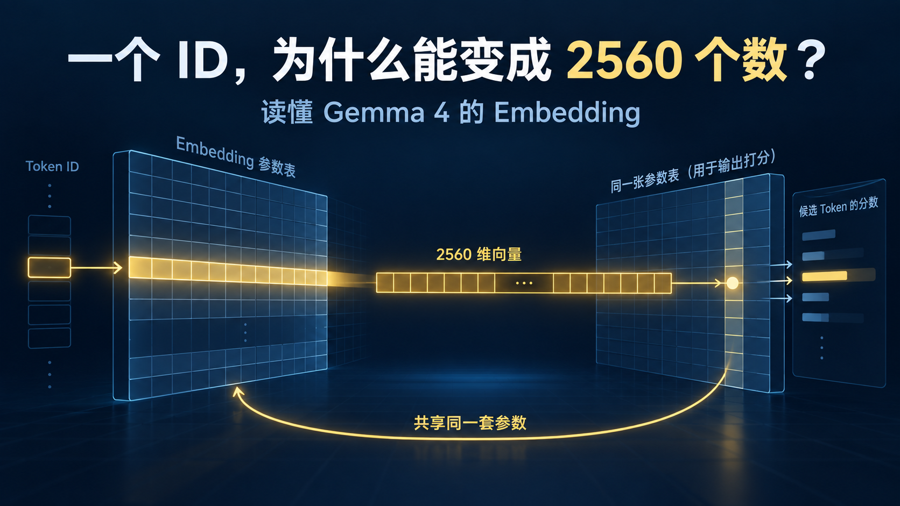
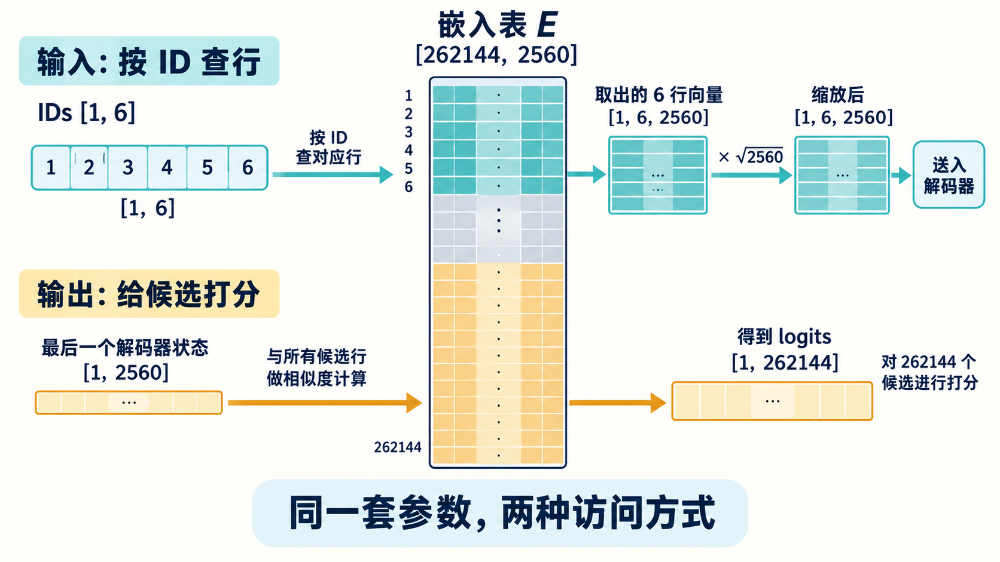

# Embedding：Token ID 如何变成 2560 维向量



[系列索引](README.md) · 第 03 期

上一期，`天空`在固定版 Tokenizer 中对应 ID `141370`。这个数首先是一个地址：`141370` 比 `141369` 大一，并不表示两个 token 的意思更接近或更远。E4B 用它到主 Embedding 表中取出一整行参数，得到 2560 维向量。问题也随之而来：把一个行号换成许多数，模型究竟多得到了什么？

先把 2560 维缩成两维，做一个**构造例子**。假设某个教学用词表把 `天空`、`云层`、`电阻` 分别编为 ID 9、30、10；这些 ID 和下面的向量都不是 Gemma 4 的真实数据。

| 构造的片段 | ID | 查表得到的二维向量 |
| --- | ---: | --- |
| 天空 | 9 | `[0.8, 0.6]` |
| 云层 | 30 | `[0.7, 0.65]` |
| 电阻 | 10 | `[-0.4, 0.2]` |

只看 ID，9 与 10 相邻，9 与 30 相隔很远；换成向量，`天空`与`云层`的欧氏距离约为 `0.11`，与`电阻`约为 `1.26`。模型后面的计算可以利用向量之间的数值关系，对它们做比较、组合和变换；直接拿行号做这些运算没有同样的意义。**这正是向量化带来的表达空间**：每个 token 不再只以一个离散编号出现，而以一组可学习的数参与计算。

例子里的两维和距离是为了说明机制，不能推断真实 E4B 一定把这三个片段排成这种几何关系。主表的 2560 个数不是人工标注的“颜色维”“天气维”。训练时，模型为预测后续内容不断调整这张表和后面的网络；像“天空”这样的 token 在不同语句中反复出现，其向量逐渐成为下游层处理这些语句时有用的起点。它可以承载训练中学到的关联，但单靠这条静态向量，仍无法判断当前句子谈的是晴天、晚霞，还是一首诗。具体语境要由后续 decoder 结合位置与上下文形成。

## ID 是行号，向量是训练得到的一整行

把 E4B 的主 Embedding 权重记作 `E`。固定配置给出词表大小 `V=262144`、文本主宽度 `D=2560`，所以 `E` 的逻辑形状是 `[262144,2560]`。输入 ID 为 `141370` 时，查表得到的是 `E[141370,:]`，一条含 2560 个数的向量。上一期那六个内容 ID 若单独组成一条 batch 为 1 的序列，输入形状 `[1,6]`，查表后就是 `[1,6,2560]`。真实的单轮聊天例子还包含模板标记，输入为 `[1,15]`，因此主查表输出为 `[1,15,2560]`。两种长度对应不同输入口径；无论哪一种，模型都按每个位置的 ID 取行，不会在输入这一步拿整张表做稠密矩阵乘。

这条向量不是由数字 `141370` 用固定算式展开出来的。同一个 token ID 每次查主表，起点仍是同一行；它进入不同句子后，经过 decoder 的上下文计算，最终表示才会不同。因此，Embedding 提供的是经过训练的**初始表示**，还不是对当前句意的完整判断。

官方 Transformers 的 `Gemma4TextScaledWordEmbedding` 在普通查表之后还有一步缩放：把查出的向量乘以 `√D`。E4B 的 `D=2560`，因此系数约为 `√2560≈50.6`。按源码的数值顺序，可概括为：

```text
input_ids [B,S] ──索引 E 的行──> [B,S,2560]
                  ──乘 √2560──> X₀ [B,S,2560]
```

缩放前后的形状相同，数值却不同。若只用一个裸 `Embedding` 模块对比 E4B 输入，忘记这一步就会出现“shape 全对、值却不对”的偏差。官方实现还按权重 dtype 处理缩放系数；做逐元素数值对齐时应复用该实现，而不是把上面的十进制近似值当作精确常量。

## 表很大，每次输入却只访问其中几行

主表有 `262144×2560=671088640` 个参数。假设它全部以 BF16 原始存放，每个参数 2 字节，表本身约占 `1.25 GiB`；这是一笔**静态容量**账，不是发布量化文件的实际大小。取一行 2560 维 BF16 向量，净荷约 `5 KiB`；刚才六个内容位置若按每次独立取行粗算，约 `30 KiB`。实际读到哪一级存储、重复 ID 是否命中缓存、是否有对齐开销，还要看运行时和硬件。大表必须有地方存放，与本次只查少数行，是两个同时成立的事实。

这也是 Embedding 与后面线性层的第一个访问差异：查表按 ID 访问若干离散行，矩阵乘让输入向量与一整块权重做大量乘加。芯片上的片上缓存、带宽和数据布局要面对这两类不同的流量。只用“参数量”推断单次查表的计算量，或者只用“取一行”推断模型的装载容量，都会漏掉另一半。

## 走到输出端，同一张表换了工作方式

E4B 的配置启用了输入主 Embedding 与输出 `lm_head` 的权重绑定。沿着生成路径，decoder 处理完已知序列后得到末尾位置向量 `h:[1,2560]`；输出头要给词表中的候选 ID 打分。把同一张表看作 `262144` 条候选向量，候选 `i` 的原始线性分数可写成 `zᵢ=h·E[i,:]`。把全部候选排在一起，形状就是 `[1,2560] × [2560,262144] → [1,262144]`。PyTorch 权重对象保存为 `[262144,2560]`；公式中的右矩阵是它的转置视角，并非另一张独立的参数表。



*图 1：上路按输入 ID 取少量行、乘 `√2560`，形成 decoder 输入；下路把末尾隐藏向量与同一张表的候选行比较，形成词表 logits。图中 `1–6` 只是六个输入**位置**的示意编号，青色高亮行不对应上一期的真实 ID 地址。两路共享的是参数，不意味着输出端只计算六个候选。图为机制示意，未画逐层嵌入 PLE 与最终 logit softcap。*

输入端只取本次出现的行；输出端则要为词表候选计算分数。权重绑定减少了重复保存一张同规格表，但没有让词表输出免费。若按完整词表打分，一枚输出位置的线性层逻辑上涉及约 `6.71 亿` 次 MAC；实际后端怎样分块、权重是否在近处缓存、使用什么位宽，会决定时间和外存流量。E4B 随后还对 logits 使用 `30·tanh(z/30)` 的 final softcap，再交给生成规则选择下一个 ID。图里只画到原始 logits，是为了把同一张表的两种访问看清楚。

## Embedding 还没有替模型决定词序

如果同一句话里两次出现 ID `141370`，两次主查表拿到的原始行相同。它们在序列中的位置不同、之前能读到的上下文不同；后续 Attention 会让两条路径分开。E4B 并没有在这张主表里为“第 1 个天空”和“第 20 个天空”各存一行位置专属参数。位置怎样进入 Q/K 的比较，要等讲 RoPE 时再展开。

主表也不是 E4B 唯一的嵌入参数。它还有给不同 decoder 层使用的逐层嵌入 PLE，查表和合并方式与这里的主流不同；第 09 期会单独拆开。图像、音频软 token 则由各自前端产生向量并投影到文本宽度，不应被当作普通文字 ID 来解释。此处先抓住主线：从 `[B,S]` 的整数，按行读出并缩放为 `[B,S,2560]`。这组数直接进入 decoder 层；下一期沿着它看一层里有哪些计算路径。

资料：[Google Gemma 4 模型卡](https://ai.google.dev/gemma/docs/core/model_card_4) · [E4B 固定配置](https://huggingface.co/google/gemma-4-E4B-it/blob/ee0ef6023621cff504d758262d4e04895a5af4a2/config.json) · [Transformers Gemma 4 源码](https://github.com/huggingface/transformers/tree/8445b13cd24961e47f25a649fb113580f71a8d11/src/transformers/models/gemma4)
