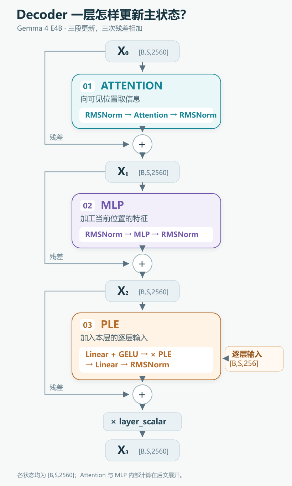

# 42 层里的这一层：Gemma 4 怎样更新一个向量？

[系列索引](README.md) · 第 04 期

上一期，一枚 token 的 ID 从主 Embedding 表取出一条 2560 维向量。它是模型处理这个 token 的起点。同一个 token 在两句话里会查到同一行参数；要让两处的表示反映各自的上下文，模型还得继续计算。Gemma 4 E4B 把这项工作交给 42 个 decoder 层。

这 42 层并不会重新生成 42 套 token。流过它们的始终是输入中的那些位置，每个位置带着一条不断更新的向量。对 E4B，主状态进入一层时是 `[B,S,2560]`，离开时仍是 `[B,S,2560]`：`B` 是同时处理的请求数，`S` 是本次输入的位置数。宽度不变，数值和它承载的信息却会改变。

一层主要回答三个问题：**当前位置该从上下文取什么信息？拿到信息后怎样加工自己的特征？本层还要补入什么输入？** 它依次用 Attention、MLP 和逐层嵌入 PLE 处理这三件事。本章先跟着一条向量走完这三段，为后面拆解具体计算建立路线图。

图：依据固定 E4B 配置与官方 `Gemma4TextDecoderLayer.forward` 绘制的单层结构示意。沿中央主路从 `X₀` 走到 `X₃`：Attention、MLP、PLE 各产生一次更新，并在各自的加号处与进入该段的状态相加。PLE 的 256 维输入只进入第三段的门控计算；第三次相加后还有 `layer_scalar` 缩放。图把 Attention 和 MLP 内部收起，以便先看清三段的职责。若要核对具体模块、运算节点和示例形状，可另看[第 0 层的 torchview 追踪图](assets/diagrams/decoder_layer_0_depth_2.png)；追踪采用 `B=1、S=2` 的 meta tensor，不加载模型权重。

## 第一段：当前位置向可见位置取信息

假设句中某个位置需要判断它前面的词指向什么。只看它自己的起始向量并不够，它还需要参考允许看到的其他位置。Attention 就做这件事：让当前位置与可见位置建立关联，再把相关信息汇入当前位置的状态。

这一步之后，每个位置仍只有一条主向量，并没有把几个 token 拼成一个新 token。变化在于：这条向量现在可以携带从上下文取得的信息。哪些位置可见、怎样计算关联，由后面的 Attention、RoPE 与局部/全局层章节细讲；在本章只需记住，**跨位置的信息交流发生在 Attention 这一段**。

## 第二段：在当前位置内部加工特征

拿到上下文信息后，模型还要重新组织当前位置的特征。前馈网络 MLP（多层感知机）承担这一步：同一位置的一组数经过可学习的变换与非线性运算，产生新的特征组合。它不会在这一段直接读取别的位置；不过它的输入已可能包含刚才 Attention 带来的上下文。

E4B 的 MLP 会暂时把每个位置的 2560 维扩展到 10240 维，经过门控加工后再收回 2560 维。这里变多的是**每个位置的特征数**，不是 token 数。为什么要扩宽、两条门控支路如何配合，以及矩阵乘到底算了什么，放在下一期逐步展开。

## 第三段：加入供本层使用的逐层输入

E4B 还有一条逐层嵌入 PLE（per-layer embedding）支路。模型在进入层堆叠前，已为不同层准备各自的输入；走到当前层时，取出对应的那份，再结合当前主状态生成一份更新。这让本层除了使用前两段加工过的向量，还能接收与原始输入有关的逐层信息。

这条支路不是在 Embedding 与 Decoder 之间多插一层，也不是把同一个向量简单复制 42 次。它怎样由 token 身份与主输入共同形成，为什么需要门控和投影，第 09 期单独解释。本章只把它放在正确的位置：**Attention 和 MLP 之后，作为本层的第三次更新**。

## 三段怎样接回同一条主线？

每一段都保留进入该段的主状态，再把本段算出的更新加回去；这种连接叫作残差。`X₀` 是本层输入，`X₁`、`X₂` 分别是前两段更新后的状态，`X₃` 是本层输出。

为了相加，本段的更新最终必须回到 2560 维。Attention 和 MLP 内部可以使用不同宽度，PLE 支路也有自己的中间宽度；**主路形状不变，并不意味着层内每一步都一样宽**。图中的 RMSNorm 是均方根归一化，用于调整进入模块或离开模块的数值尺度；它本身不让不同位置交流。

42 层都遵循这条主线，但 Attention 看到的范围不完全相同：E4B 有局部层和全局层，后面的部分层还会复用先前准备的 K/V。这些差异改变了某些层怎样获取上下文，不改变一层将主状态交给下一层的接口。42 层结束后，模型再做末端归一化，并通过输出头为下一枚 token 的候选项打分；单个 decoder 层本身不负责选出最终 token。

从硬件角度看，这张层图先给出**执行顺序和同时要保留的数据**：主状态要一路传过 42 层；每层先完成 Attention 更新，才能用更新后的状态计算 MLP，再接入本层 PLE。主路始终是 2560 维，不代表只需容纳这一条向量；层内还有投影结果、MLP 的 10240 维中间值和注意力所需的 K/V。它们各自占多少、要留多久，取决于后面几期展开的算子和 Prefill/Decode 阶段，不能从一张结构图直接报出片上存储量。

后文会按这里出现的对象逐个放大：第 05 期拆解 `Linear` 与 MLP；第 06 期看 Attention 的 Q/K/V；第 07 期解释 RoPE 怎样影响位置匹配；第 08 期区分局部/全局层及 KV 共享；第 09 期追踪 PLE 的来源与注入。读这些细节时，可以随时回到本篇，确认它们在一层中负责哪一步。

资料：[E4B 固定配置](https://huggingface.co/google/gemma-4-E4B-it/blob/ee0ef6023621cff504d758262d4e04895a5af4a2/config.json) · [Transformers Gemma 4 固定版本实现](https://github.com/huggingface/transformers/tree/8445b13cd24961e47f25a649fb113580f71a8d11/src/transformers/models/gemma4)
