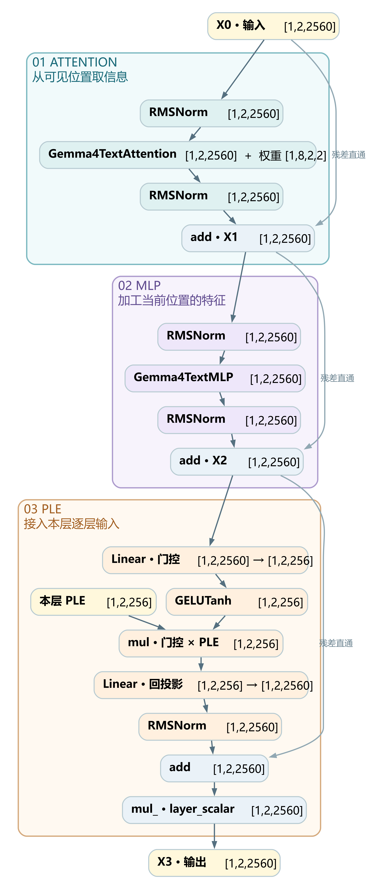
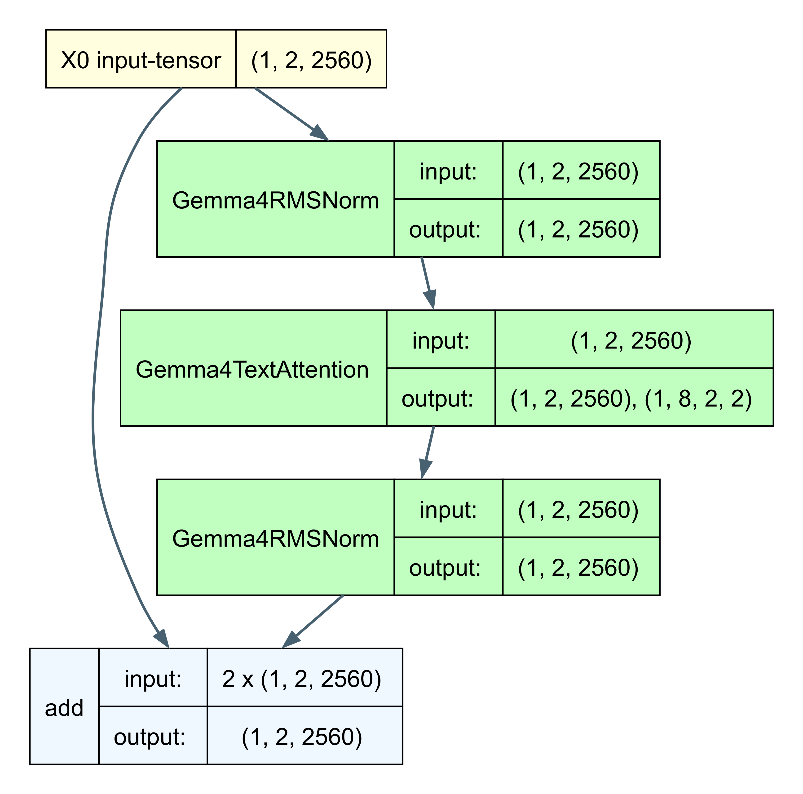
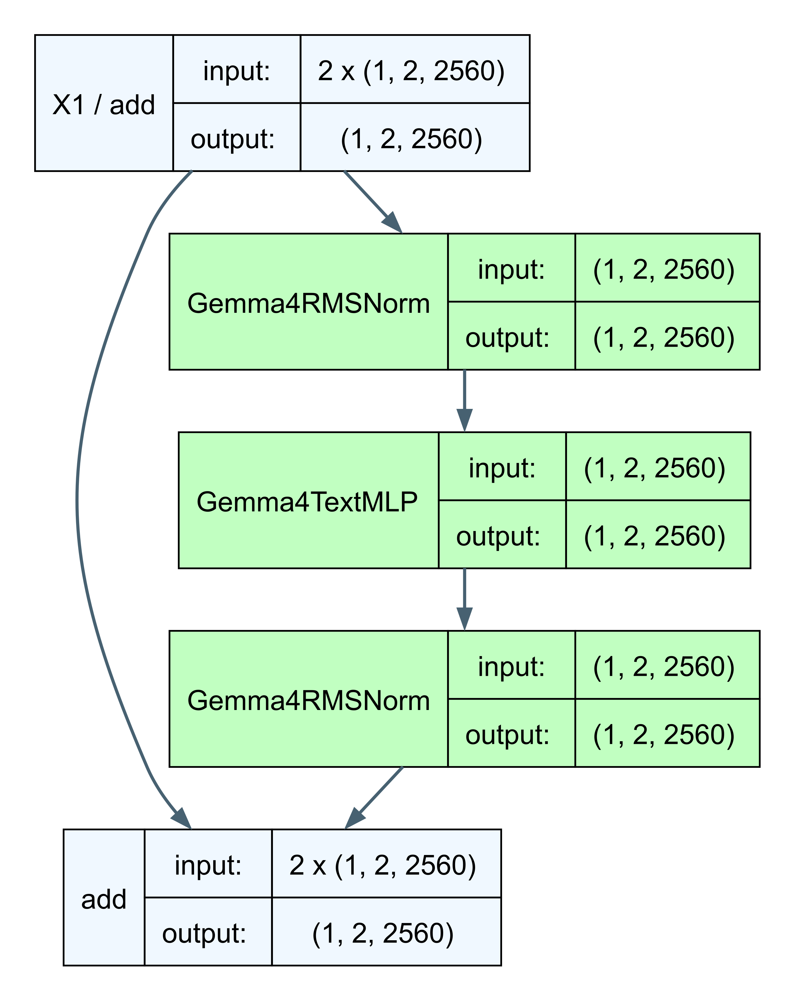
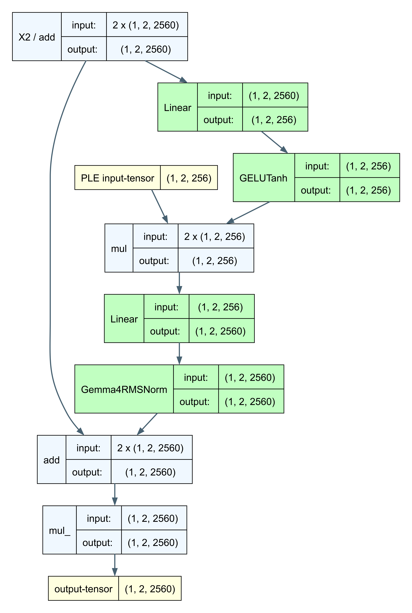

# Decoder Layer：Attention、MLP 与 PLE 如何更新状态

[系列索引](README.md) · 第 04 期

上一期，一枚 token 的 ID 从主 Embedding 表取出一条 2560 维向量。它是模型处理这个 token 的起点。同一个 token 在两句话里会查到同一行参数；要让两处的表示反映各自的上下文，模型还得继续计算。Gemma 4 E4B 把这项工作交给 42 个 decoder 层。

这 42 层并不会重新生成 42 套 token。流过它们的始终是输入中的那些位置，每个位置带着一条不断更新的向量。对 E4B，主状态进入一层时是 `[B,S,2560]`，离开时仍是 `[B,S,2560]`：`B` 是同时处理的请求数，`S` 是本次输入的位置数。宽度不变，数值和它承载的信息却会改变。

一层主要回答三个问题：**当前位置该从上下文取什么信息？拿到之后怎样整理为下一步可用的特征？本层还能从最初输入得到什么补充？** 它依次用 Attention、MLP 和逐层嵌入 PLE 处理这三件事。本章只跟着主状态走一遍，弄清每一步的职责；具体怎样计算留给后面的章节。

图 1（整体逻辑）：先只看三个彩色大框。`X₀` 是本层收到的状态；Attention 为每个位置补入可见上下文，交出 `X₁`；MLP 把这个位置已有的信息进一步加工，交出 `X₂`；PLE 把进入层堆叠前准备好的逐层输入接进来，交出 `X₃`。这样读，总图展示的就是**取信息 → 加工信息 → 补入逐层输入**。每段旁边的“残差直通”保留进入该段的状态，`add` 把本段的更新接在它上面。三个彩色框属于**同一个** decoder 层。图依据官方第 0 层的 `torchview` 追踪整理，保留原有节点、形状和连接；完整节点表见[原始追踪图](assets/diagrams/decoder_layer_0_depth_2.png)。第 0 层是局部注意力层，其他层的可见范围与 K/V 来源可能不同。

下面三张 `torchview` 图依次放大这三段。沿每张图往下读：RMSNorm 调整送入模块或接回主路的向量尺度，模块完成该段的任务，`add` 把更新接回直通的主状态。RMSNorm 只处理经过它的向量，具体怎样调整留到第 05 期。这些图从同一份第 0 层追踪截取，示例输入设为 `B=1、S=2`，所以主状态写作 `[1,2,2560]`：一批、两个位置、每个位置 2560 个特征。形状数字不是模型预测结果；追踪使用 meta tensor，没有加载权重。

## 第一段：当前位置向可见位置取信息

读到“杯子太烫，小王把它放在桌上”中的“它”时，前面已有“杯子”和“太烫”。当前位置若要形成与语境相关的表示，就需要能利用这些前文线索。Attention 的价值是让**一个位置取得其他可见位置的信息**。这个句子只帮助理解信息流，不代表我们知道 E4B 实际关注了哪些词。

*图 2：第 0 层 Attention 的 `torchview` 局部视图。右侧依次准备输入、读取上下文、整理更新；左侧长箭头保留进入本段的状态。两路在底部 `add` 汇合，得到 `X₁`。Attention 旁边还有一条权重输出，它不进入下一段的主路。*

在图 2 中，前一个 RMSNorm 先整理 `X₀`，Attention 再从当前位置能看到的范围取得信息，后一个 RMSNorm 整理这份更新。底部的 `add` 将它接回直通的 `X₀`，得到 `X₁`。用刚才的句子想象，走完这一段，“它”这个位置的状态便有机会带上前文关于“杯子”的线索，供下一段使用。**这一段改变的是每个位置能利用的信息来源**；线索如何被选中、权重如何计算，留到第 07–09 期。

## 第二段：在当前位置内部加工特征

Attention 已把可见上下文带到各位置，接下来要处理的是**当前位置已经拥有的内容**。前馈网络 MLP（多层感知机）分别处理每个位置的 `X₁`，把其中的线索重新组合成供后续层继续使用的特征。它的任务是加工已有信息；跨位置取信息已由前一段完成。

*图 3：第 0 层 MLP 的 `torchview` 局部视图。最上方的 `add` 是上一段交出的 `X₁`。右侧支路整理并加工当前位置的状态；左侧支路保留 `X₁`。底部的 `add` 把加工结果接回主路，得到 `X₂`。*

在图 3 中，前一个 RMSNorm 整理 `X₁`，MLP 产生新的特征组合，后一个 RMSNorm 整理这份更新，底部的 `add` 把它接回直通的 `X₁`，得到 `X₂`。仍用“它”的位置想象：前一段让它可以利用前文线索，这一段把这些线索连同当前位置原有的表示一起加工，交给下一段。**它没有新增一条来自别的位置的信息通道，而是在当前位置形成新的特征。**MLP 框内部怎样完成加工，第 06 期再解释。

## 第三段：加入供本层使用的逐层输入

经过 Attention 和 MLP，`X₂` 已经带着本层加工后的状态。图 4 还有一条从层外进入的黄色线：逐层嵌入 PLE（per-layer embedding）。它从哪里来？以文字输入为例，在进入 decoder 层堆叠前，模型用 token ID 查询一张**单独的逐层嵌入表**，取得与 token 身份有关的分量；同时从尚未经过 decoder 的主输入生成一份内容分量。两路合成后，每个位置都备好供不同层使用的 PLE；走到当前层，只取属于这一层的那份。

因此，PLE 带来的是**与原始 token 身份和起始输入有关的、按层区分的线索**。这些是模型训练得到的向量信息，不能把其中某一维直接读成“杯子”这样的文字标签。它的价值是让当前层在持续加工的主状态之外，仍能接触起始输入提供的信息。PLE 在进入层堆叠前已经备好；它不是这一层的 Attention 刚从前文取得的结果。图 4 只展示这份输入怎样进入当前层，准备过程留给第 10 期。

*图 4：第 0 层 PLE 的 `torchview` 局部视图。左上 `add` 是上一段交出的 `X₂`，黄色输入是本层提前备好的 PLE。主状态分出一路去调节 PLE，同时另一路直通底部；两路汇合后再经过最下方的层输出缩放。*

在图 4 的上半段，第一个 `Linear` 把 `X₂` 转成与 PLE 相匹配的宽度，`GELUTanh` 让这份信号能以非线性的方式调节 PLE，第一个 `mul` 则把调节落实到本层的 PLE 上。可以把 PLE 看作事先备好的材料：当前状态不同，这份材料参与本层更新的方式也不同。**逐层输入先与当前状态结合，再进入主路。**

在下半段，第二个 `Linear` 把这份补充更新变回主状态的宽度，RMSNorm 整理后，`add` 将它接回直通的 `X₂`。最下方的 `mul_` 按本层的 `layer_scalar` 统一缩放输出，得到 `X₃`；这个节点调节输出幅度，本身不提供新的信息。这样，第三段的结果是**当前状态加上一份按当前状态调节过的逐层输入**。PLE 怎样准备、门控怎样计算，留给第 10 期。

## 三段怎样接回同一条主线？

把三张局部图的首尾接起来，就得到总图里的 `X₀ → X₁ → X₂ → X₃`。每段都有一条绕过计算模块的直通线，让本段结果与进入本段的主状态相加；这叫残差连接。总图中的三个 `add` 依次完成这三次更新，第三次相加后再经 `layer_scalar` 缩放。

读完三张图，可以按信息的来源辨认它们：Attention 从可见的其他位置取信息；MLP 加工当前位置已有的信息；PLE 把进入层堆叠前准备的逐层输入接入当前状态。RMSNorm 负责各次更新前后的数值尺度，残差负责把更新接回主状态，末尾的 `layer_scalar` 调节这一层的输出。主状态从 `X₀` 走到 `X₃`，形状仍相同，内容则经历了三次不同用途的更新。

42 层都遵循这条主线，但 Attention 看到的范围不完全相同：E4B 有局部层和全局层，后面的部分层还会复用先前准备的 K/V。这些差异改变了某些层怎样获取上下文，不改变一层将主状态交给下一层的接口。42 层结束后，模型再做末端归一化，并通过输出头为下一枚 token 的候选项打分；单个 decoder 层本身不负责选出最终 token。

后文会按这里出现的对象逐个放大：第 [05 期](05-rmsnorm.md)解释各处 RMSNorm；第 06 期拆解 `Linear` 与 MLP；第 07 期看 Attention 的 Q/K/V；第 08 期解释 RoPE 怎样影响位置匹配；第 09 期区分局部/全局层及 KV 共享；第 10 期追踪 PLE 的来源与注入。读这些细节时，可以随时回到本篇，确认它们在一层中负责哪一步。

资料：[E4B 固定配置](https://huggingface.co/google/gemma-4-E4B-it/blob/ee0ef6023621cff504d758262d4e04895a5af4a2/config.json) · [Transformers Gemma 4 固定版本实现](https://github.com/huggingface/transformers/tree/8445b13cd24961e47f25a649fb113580f71a8d11/src/transformers/models/gemma4)
