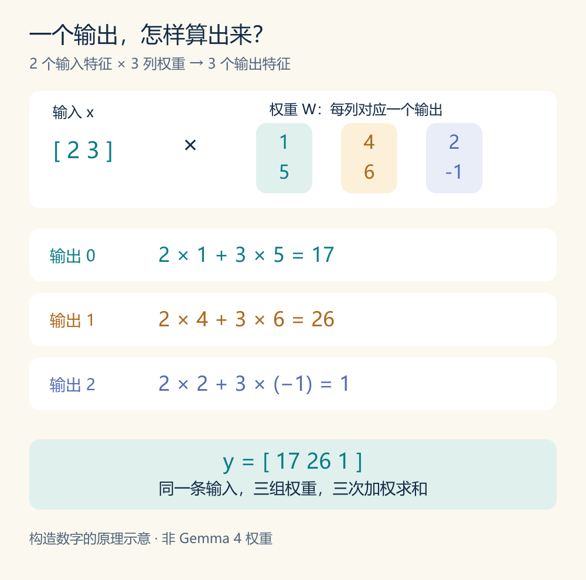
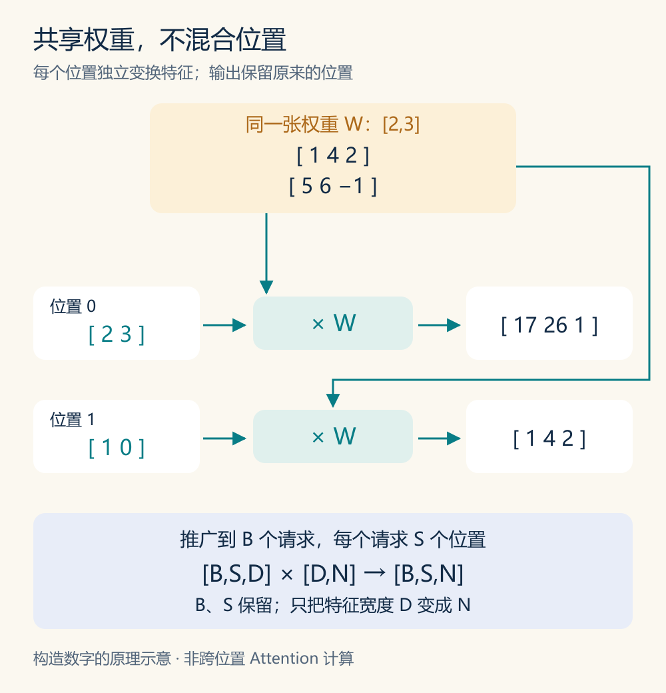
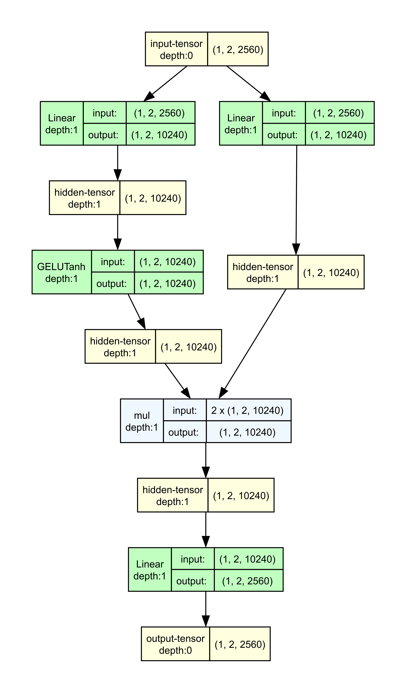

# Decoder 里的 Linear 在算什么？


[系列索引](README.md) · 第 05 期

上一期，我们看到 E4B 的 decoder 层用 Attention、前馈网络和逐层嵌入更新同一组位置上的向量。Attention 和前馈网络里反复出现 `Linear`；这一期把其中一次计算单独展开，看看它究竟怎样改变向量。

先排除一个容易误读的地方：**Embedding 和 Decoder 之间没有额外插入一个 Linear 层。** 在官方实现的主路径上，查表得到的 `inputs_embeds` 成为 `hidden_states`，进入第一个 decoder layer。本文拆解的是上一期已经看到的层内计算，并非增加一段模型结构。

## 为什么要把已有特征重新组合？

Embedding 给每个 token 一个训练得到的起始表示。若只是把其中每个数各自放大或缩小，一个输出仍只依赖一个输入。Decoder 需要构造新的特征：让某个输出同时参考输入向量的多个数，而且让训练决定各数的权重。办法是把这些数分别乘以权重，再相加。要得到多个输出，就给每个输出准备一组权重；将这些计算排在一起，就是矩阵乘。

不同 `Linear` 使用不同的权重，也就能从当前状态中提取不同的组合。后续的 Attention 会用它们准备位置匹配和信息汇聚所需的表示；前馈网络会用它们加工当前位置的特征。这里说的是这些模块**内部**使用矩阵乘的原因，不是说一次矩阵乘就完成了上下文理解。

## 一个输出数是怎样算出的？

把规模缩到两个输入特征：`x=[2,3]`。假设我们想得到三个输出，便准备三列权重：

```text
             输出 0   输出 1   输出 2
输入特征 0      1        4        2
输入特征 1      5        6       -1
```

第一个输出取第一列，算出 `2×1+3×5=17`。另外两列分别给出 `2×4+3×6=26` 和 `2×2+3×(-1)=1`。结果是 `y=[17,26,1]`。第三列同时使用两个输入，并给第二个输入一个负权重；它不是把某个输入原样复制到新位置。



*图 1：构造数字的原理示意，非 Gemma 4 权重。每一列决定一个输出，三个输出都使用完整的输入向量。*

把输入宽度记为 `D`、输出宽度记为 `N`，这一步可以写作 `x:[D] × W:[D,N] → y:[N]`。第 `j` 个输出为 `y[j]=Σᵢ x[i]W[i,j]`：沿输入特征轴相乘并求和，留下一个输出数。矩阵有多少列，就有多少个输出。因此它可以改变宽度，也可以在宽度不变时重新组合特征。本文只看无偏置的线性层；一般 `Linear` 也可以加偏置。

权重在训练中学得，推理时保持不变。一次线性投影只对现有特征做加权组合；若没有激活或其他操作，连续两个线性投影还可以合并成一个。Decoder 因此会把投影和非线性、Attention 等操作组合使用。输出维度变多，本身不等于模型知道了更多上下文。

## 一次算多个 token，会让它们互相交流吗？

再放入第二个位置 `x₁=[1,0]`。它使用**同一张权重矩阵**，得到 `[1,4,2]`；第一个位置仍得到 `[17,26,1]`。两个位置可以排成矩阵一起计算，但这一张 `Linear` 并没有让第一个位置读取第二个位置。



*图 2：构造数字的原理示意。相同权重分别作用于两行输入；输出保留两个位置，没有跨位置求和。*

一般地，若同时处理 `B` 个请求、每个请求本次有 `S` 个 token 位置，输入形状是 `[B,S,D]`，输出就是 `[B,S,N]`。`B` 与 `S` 保留，变化的是每个位置的特征宽度。硬件可以成批计算这些行并复用权重；这不改变“每行各算各的”这一事实。输入向量可能已含前面层写入的上下文，但当前这次投影不会独自建立新的跨位置联系。

这也解释了上一期层图中的两类计算：在 Attention 中，Q/K/V 的线性投影先为各位置准备表示，后续的匹配和汇聚才涉及位置之间的信息；在前馈网络中，几次线性投影与非线性、逐元素运算连在一起，专门加工当前位置的特征。先把后一条路径展开，看看矩阵乘怎样成为完整 MLP 的一部分。

## E4B 的 MLP：为什么先扩宽，再回到 2560 维？

官方 `Gemma4TextMLP` 有三张独立的权重矩阵。`gate_proj` 和 `up_proj` 都把每个位置从 2560 维投影到 10240 维。gate 路经过 `gelu_pytorch_tanh` 激活，再与 up 路逐元素相乘；`down_proj` 最后把 10240 维结果投影回 2560 维。用本文的行向量约定，可以概括为：

```text
MLP(x) = [ GELU_tanh(xW_gate) ⊙ (xW_up) ] W_down
```

`⊙` 是两个同形状向量对应位置相乘，不是矩阵乘。gate 路决定哪些中间特征以什么方式影响输出，up 路提供与之相乘的特征值。扩宽让这一步有更多中间特征可加工；降回 2560 维，则让 MLP 的结果能与进入这一段前保存的主状态相加。把三张矩阵直接合成一张，会丢掉中间的激活与逐元素乘法。



*图 3：官方 `Gemma4TextMLP` 的局部算子路径。输入 `[1,2,2560]`，gate 与 up 两路各得到 `[1,2,10240]`，down 路回到 `[1,2,2560]`。图用 meta tensor 追踪形状，没有加载模型权重或产生数值预测，也不是完整 decoder 层。*

固定 E4B 配置中 `use_double_wide_mlp=false`，所以这里的中间宽度是 10240。三张矩阵共含 `3×2560×10240≈7864 万` 个权重元素，尚未计入一层内的其他参数。这是静态权重元素数，不是单次推理的设备耗时；具体字节量还取决于位宽和存储格式。后面讨论 Prefill、Decode 与数据搬运时，再用这项规模分析权重复用。

这一段仍逐位置执行：它能加工该位置已有的上下文表示，却不会独自把其他位置的信息读进来。下一期再沿 Q、K、V 看 Attention 在哪些步骤真正让位置之间发生交流。

读 PyTorch 源码时还要注意方向：本文采用行向量，数学权重写成 `[D,N]`；`nn.Linear` 将参数存为 `[N,D]`，前向相当于计算 `x @ weight.T`。这只是记法和存储方向的差别。[PyTorch Linear 文档](https://docs.pytorch.org/docs/2.14/generated/torch.nn.Linear.html)

资料：[固定版本的 Gemma 4 实现](https://github.com/huggingface/transformers/tree/8445b13cd24961e47f25a649fb113580f71a8d11/src/transformers/models/gemma4) · [E4B 配置](https://huggingface.co/google/gemma-4-E4B-it/blob/ee0ef6023621cff504d758262d4e04895a5af4a2/config.json)
