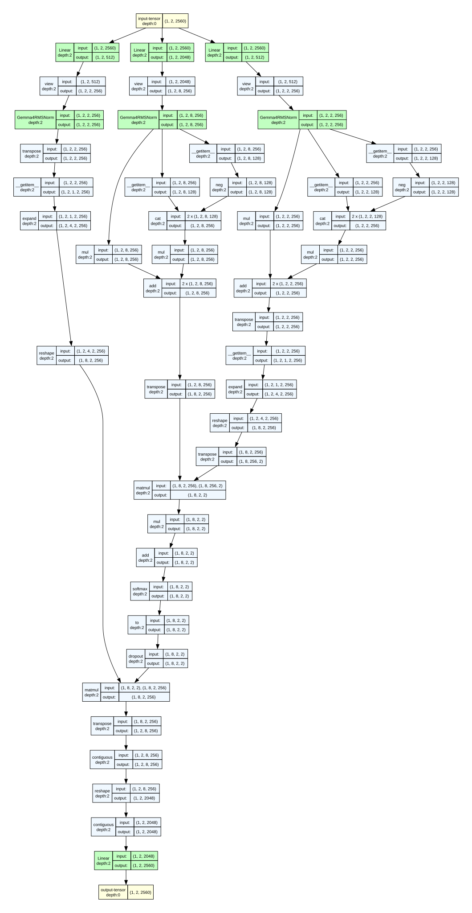
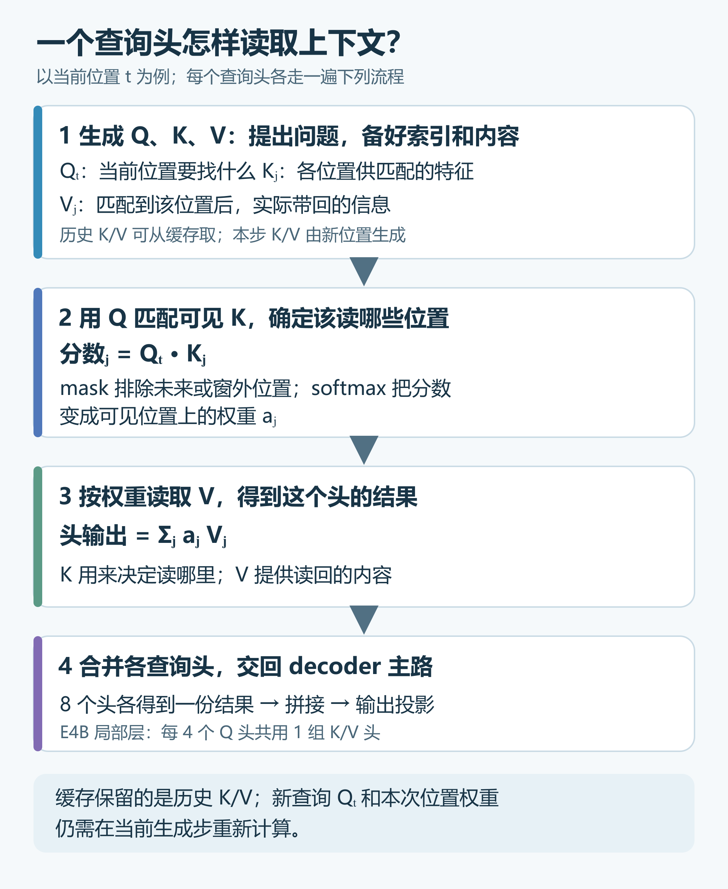

# Attention：当前位置怎样读取上下文

[系列索引](README.md) · 第 06 期

读到“杯子太烫，小王把它放在桌上”中的“它”，当前位置已经能看到前面的“杯子”和“太烫”。它该利用哪些前文线索，不能只靠当前位置原有的向量。**Attention 让每个位置按当前需要，从允许看见的位置汇入信息**。这是一条计算路径，不表示我们知道 E4B 在这句话中实际关注了哪个词。

这里的“位置”是一个 token 在序列中的位置。在一个 decoder 层里，当前状态先经过层前 RMSNorm，Attention 接收整理后的 `X:[B,S,2560]`，为每个位置产生一份上下文更新；`B` 是批量，`S` 是本次输入的 token 数。Attention 输出再经层内的后置 RMSNorm，与进入这一层的状态相加。

先按图 1 抓住两次汇合：Q 与 K 匹配，决定各个可见位置能分到多少权重；这些权重再与对应的 V 汇合，带回信息。图 2 保留了这条路径上的原始算子，后文再说明每一步为什么需要。

*图 1：第 0 层局部 Attention 的阅读版。它依据完整 `torchview` 追踪压缩重绘，把 RoPE 的逐元素运算与形状整理合并为用途明确的节点，便于先看清三条支路在哪里汇合。分组名称是讲解标注，并非原始追踪中的算子；图中的 mask 节点表示接口位置，不演示实际遮挡效果。*

*图 2：同一段 `Gemma4TextAttention` 的原始 `torchview` 图。生成时设置 `hide_inner_tensors=True`，只隐藏重复的内部张量框，保留算子与连线，没有合并节点。顶部 2048 维支路是 Q，两条 512 维支路分别是 K 和 V；V 不经过 RoPE，而是在后面的第二个 `matmul` 与位置权重汇合。示例 `B=1,S=2`，使用 meta tensor、不加载权重，也未启用 KV Cache。追踪为显露算子路径，给 RoPE 传入 `cos=1,sin=0`，给 mask 传入全零张量：图中有旋转与加 mask 的算子，但没有实际位置旋转或因果、窗口遮挡；两个位置也不是窗口上限。可单独打开[PNG 大图](assets/diagrams/attention_layer_0_full.png)查看细节。*

## Q、K、V 分别做什么

图 1 和图 2 顶部的三路都由**同一份当前层输入经过三套学习到的投影**产生，并不是三组独立的词。`Q`（query）表达当前位置想找什么，`K`（key）供各候选位置接受匹配，`V`（value）是匹配后可从该位置带回的信息。拿“它”的位置作直观例子：它发出查询，前文各位置提供匹配特征；得到较大权重的位置，会贡献较多 V 中的信息。这只是解释读取方式，不表示我们知道模型实际上把“它”对应到了哪个词。

把“匹配特征”和“带回内容”分成 K、V 两路，模型就能分别学习**怎样找到一个位置**和**从那里取回什么**。因此图中先比较 Q 与 K，再用得到的权重汇聚 V；V 不参加位置匹配，同一位置的 K 和 V 按位置对齐。当前位置本身也在允许读取的集合中。Q/K/V 都是学到的数值向量，不能直接读成文字标签或固定的语言规则。

## “头”是什么，GQA 又共享了什么

一个注意力头是一套并行的查询与读取通道：它为每个位置形成一条查询，独立算出对可见位置的权重，再汇成一条结果。**多个头的意义是让同一位置有多种独立的查询和读取结果**，随后再合并。头不是一个 token，也不是预先指定的“语法头”或“指代头”；不能先验地给某个头指定语言职责。

E4B 第 0 层是局部层：每个位置有 8 个 Q 头，每头 256 维；K 和 V 各有 2 个头，每头也为 256 维。分组查询注意力（GQA）让 **4 个 Q 头共用同一组 K/V 头**：Q 头 0–3 对应 KV 头 0，Q 头 4–7 对应 KV 头 1。共用的是 K/V 数据，各 Q 头仍有自己的查询和位置权重。图 1 中的“按 GQA 对应”节点和图 3 展开了这一关系。

**直接好处是少生成、少保存、少读取 K/V。**在头宽和序列长度相同的比较下，2 个 KV 头的 K/V 张量只有 8 个 KV 头方案的四分之一，逐步生成时的 KV Cache 和读取量也随之减少。代价是四个 Q 头不能各自拥有一套独立的 K/V 表示；而且 8 个 Q 头仍要分别匹配并计算权重，不能把“KV 头少四倍”理解成整层计算量少四倍。

*图 3：GQA 的教学示意图，非模型运行截图。图中下标是头编号。左侧 X 表示同一层的输入序列；每个位置各自产生 K/V，绿色长条把多个可见位置的结果汇成一条 KV 头序列。图中的八条 Q 路径以其中一个查询位置为例：每组四个 Q 头分别匹配共享的 K，产生自己的位置权重，再读取同组 V；八份头输出最终合并。*

## 一次 Attention 怎样完成

先准备三路向量：当前层状态经投影和按头拆分，形成 Q、K、V。E4B 在每个头内用 [RMSNorm](04a-rmsnorm.md) 整理 Q/K/V 的数值尺度，让后续打分和汇聚所用的尺度更可控。接着只给 Q、K 做 RoPE 位置旋转：相同的匹配特征出现在不同位置时，Q/K 的相对位置会影响匹配；V 承担的是被读回的内容，不走这条位置匹配支路。具体旋转方式留到第 07 期。图 1 的三条彩色支路显示准备过程，图 2 展开对应的实际算子。

对于某个查询头、某个当前位置 `t`，模型让它的 `Qₜ` 与候选位置 `j` 的 `Kⱼ` 逐一匹配，形成一行分数。分数回答“这个查询与哪个位置更相合”，**mask 则先规定哪些位置有资格参与**：因果 mask 排除未来位置，保证当前位置不会偷看尚未生成的内容；第 0 层的滑动窗口长度配置为 512，窗外的旧位置也不能被它直接读取。局部窗口因此限定了这一层在逻辑上需要考虑的历史范围，具体实现能省多少计算还取决于注意力后端。

随后 softmax 把可见位置的分数变成一行可比较的权重，权重之和为 1；它允许同时从多个位置读取，而不必硬选一个。换一个查询位置或查询头，就会重新得到自己的一行权重；softmax 不沿“头数”或“特征数”求和。

最后，用这行权重对对应位置的 `V` 做加权汇聚，把“读哪里、读多少”变成实际带回的信息。8 个查询头各得到一条结果，拼接后经过 `o_proj` 输出投影：它把各头结果混合，并从 `8×256=2048` 维映射回主状态的 2560 维，交给 decoder 层的后置归一化与残差连接。这才构成**一次完整的 Attention 更新**。

*图 4：辅助理解图 1、图 2 的下半段。每个查询头各有一行位置权重；这些权重用于对应位置的 V，然后合并各头。历史 K/V 可能来自缓存，图 2 的无缓存 `torchview` 追踪没有画出缓存读取。*

为了看出“分配”与“硬选择”的区别，假设某个查询头对三个候选位置得到构造分数 `[2,1,−∞]`，最后一个被 mask 排除。softmax 后前两个位置的权重约为 `0.73` 和 `0.27`，第三个为 `0`：前者贡献较多 V 信息，后者仍有贡献。这里的数字只演示顺序，不是 E4B 的运行结果。E4B 这份实现先归一化 Q/K，并向注意力后端传入 `scaling=1.0`；直接额外套用通用教材中的 `QKᵀ/√d` 会改变数值。

## 图上的头数、位置数和宽度

下表仍以 E4B **第 0 层局部、独立生产 K/V** 为例，取 `B=1,S=4` 且不启动缓存。它与图 1、图 2 的 `S=2` 只是示例长度不同：

| 数据 | 逻辑形状 | 这根线上的含义 |
| --- | --- | --- |
| Attention 输入 | `[1,4,2560]` | 四个 token 经层前 RMSNorm 整理后的向量 |
| Q | `[1,8,4,256]` | 每个位置有 8 个独立查询头 |
| K、V 各自 | `[1,2,4,256]` | 每个位置各有 2 个 KV 头 |
| 分数，若完整展开 | `[1,8,4,4]` | 每个 Q 头、每个查询位置对四个键的分数 |
| 加权后的头输出 | `[1,8,4,256]` | 每头按权重汇聚 V |
| 拼头后 | `[1,4,2048]` | 8×256，尚未回到主宽度 |
| `o_proj` 后 | `[1,4,2560]` | 还要经后置 RMSNorm，再与本层残差相加 |

表中 `[1,8,4,4]` 是“4 个查询位置各对 4 个键位置打分”的**逻辑形状**，其中第二个 8 是查询头数，最后一个 4 是键位置数。mask 会让未来和窗外位置不能贡献信息；具体后端也未必真的把整张分数表写入内存。理解算法时，先分清“这一行分数对应哪个查询”和“哪些列允许被读”，再看存储实现。

## 历史 K/V 从哪里来

上面的匹配和汇聚需要当前位置可见的 K/V。处理完整前缀时，它们可以在本次前向中算出；逐步生成时，先前位置已算好的 K/V 也可以从 KV Cache 读取。因果约束保证后来追加的 token 不会回头改写旧位置的结果，所以可以复用历史 K/V；当前 Q 的匹配分数、mask 和 softmax 权重仍要重新计算。**缓存改变历史 K/V 的来源，不改变 Attention 的读取规则。**图 1、图 2 是无缓存的算子追踪，完整的跨步复用过程、位置管理和容量代价放在[第 11 期](11-kv-cache.md)。

E4B 的局部层只直接读取滑动窗口内的历史，全局层可读取更长的因果历史；全局层每头宽度为 512，不能沿用图 1、图 2 的 256。它还有另一种**跨层 KV 共享**：后段部分层使用前面生产层的 K/V，而非各自重新投影。这与同一层跨生成步的 KV Cache 是不同的复用关系，第 08 期再按层号说明。

沿这条路径回看，每一步各管一件事：RoPE 让位置影响匹配，mask 划定可读范围，Q/K 与 softmax 分配读取比例，V 提供带回的内容，多个头和输出投影把不同读取结果交回主状态。GQA 减少必须生成与保存的 K/V 头，KV Cache 复用已经算好的历史 K/V；两者都不省去当前查询的权重计算。第 07 期继续拆 RoPE，第 08、13 期分别展开局部/全局可见范围与分块实现。

资料：[Google Gemma 4 模型卡](https://ai.google.dev/gemma/docs/core/model_card_4) · [E4B 固定配置](https://huggingface.co/google/gemma-4-E4B-it/blob/ee0ef6023621cff504d758262d4e04895a5af4a2/config.json) · [Transformers Gemma 4 源码](https://github.com/huggingface/transformers/tree/8445b13cd24961e47f25a649fb113580f71a8d11/src/transformers/models/gemma4)
