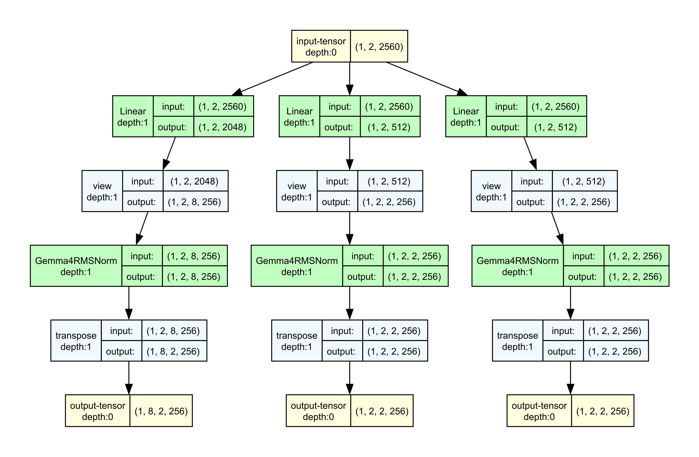
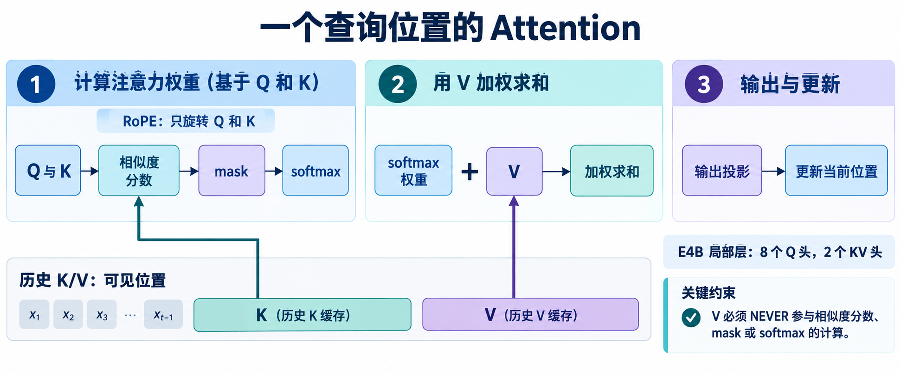

# “它”指向谁：沿着 Q、K、V 看一次注意力

[系列索引](README.md) · 第 06 期

看“小王把杯子放在桌上，因为它太烫了”。读到“它”时，前面的“杯子”和“桌子”都在上下文里，但两者提供的信息可能不同。例句只用来解释信息关联，并非 E4B 的实际回答。Attention 的做法是让当前位置形成查询 `Q`，让可见位置提供 `K` 和 `V`：先用 `Q·K` 给候选位置打分，再沿**键位置轴**归一化，用得到的权重混合 `V`。一个位置由此可以吸收其他位置的信息。

E4B 的局部层给出具体形状。输入 `X:[B,S,2560]`，查询有 8 个头、每头宽 256，因此 `Q:[B,8,S,256]`；K/V 各有 2 个头，`K,V:[B,2,S,256]`。四个查询头共用一组 KV 头，这叫分组查询注意力（GQA）。它减少 K/V 投影和缓存的头数，不等于少了 8 个查询头。局部层还会按窗口和因果 mask 限制可读位置；对于一个查询位置，分数的逻辑形状是 `[B,8,1,K_visible]`，softmax 正是沿最后一轴进行。

图将显示范围限制在投影、按头重排、Q/K/V 归一化与转置。输入 `[1,2,2560]` 后，Q 线先到 `[1,2,2048]`，再排为 `[1,8,2,256]`；K、V 各先到 `[1,2,512]`，再排为 `[1,2,2,256]`。这里 `B=1,S=2` 只是显示范围；维度 2560、8/2 个头和 256 head dim 是 E4B 局部层配置。**这张图尚未画 RoPE、mask、softmax、缓存或输出投影**，不能把它当作完整 Attention 图。

*图：单个查询位置的 Attention 原理示意。Q/K 决定可见位置的权重，V 只参与加权汇聚；图中省略了逐头张量重排，具体形状见下文。*

## 把一个查询位置算到底

取当前某个查询头 `h`，它的查询向量是 `[256]`。局部层有 8 个 Q 头、2 个 KV 头，所以头 `h` 使用的 KV 头可按分组关系映射到 `floor(h/4)`：Q 头 0–3 读取 KV 头 0，Q 头 4–7 读取 KV 头 1。对每个可见历史位置 `j`，计算一个 score；mask 把未来位置和窗口外位置排除。若可见位置为 `j=1…K`，归一化权重是 `a_j=exp(score_j−m)/Σ_r exp(score_r−m)`，其中 `m=max(score_r)` 用来避免指数数值过大。输出向量是 `Σ_j a_j V_j`，形状仍为 `[256]`。8 个查询头各得到一条向量，拼成 2048 维，再经过输出投影回 2560 维。

这也指出了几类完全不同的数据。Q/K/V 投影要读权重；score 和 softmax 是本次查询的临时量；历史 K/V 可以跨生成步骤保留。若图中一根线只写“Attention”，这些访问模式就都被遮住了。RoPE 会在 Q/K 比较前改变其数值，但不改变上面这些张量的基本形状。

## 一张尺寸表，避免把头数和序列长度混在一起

取 E4B **局部、非共享生产层**，令 `B=1,S=4`，先不启动缓存。官方层中 `q_proj`、`k_proj`、`v_proj` 的输出依次为 `[1,4,2048]`、`[1,4,512]`、`[1,4,512]`。随后按头拆分、归一化、Q/K 加 RoPE，再转置成注意力后端的轴顺序：

| 数据 | 逻辑形状 | 这根线上的含义 |
| --- | --- | --- |
| 输入主流 | `[1,4,2560]` | 四个 token 的当前层向量 |
| Q | `[1,8,4,256]` | 每个位置有 8 个独立查询头 |
| K、V 各自 | `[1,2,4,256]` | 每个位置各有 2 个 KV 头 |
| 分数，若完整展开 | `[1,8,4,4]` | 每个 Q 头、每个查询位置对四个键的分数 |
| 加权后的头输出 | `[1,8,4,256]` | 每头按权重汇聚 V |
| 拼头后 | `[1,4,2048]` | 8×256，尚未回到主宽度 |
| `o_proj` 后 | `[1,4,2560]` | 可以与本层残差相加 |

分数表是**数学上的逻辑形状**。可见性 mask 会排除未来和窗口外的位置，分块后端也未必写出整张 `[1,8,4,4]` 表。比如查询位置 1 的未来位置 2、3 即使占据逻辑表中的列，也不会成为它的可见信息。图中的每根线要把 shape 和语义一起读，不能把“没有物化”误读为“没有计算对应的相似度”。

## 用三个键手算 softmax 在哪里起作用

只取一个查询头，假设它能看到三个键，经过 Q/K 点积和 mask 后的构造分数为 `[2,1,−∞]`。最后一个键被 mask 排除，它的概率是 0。前两个权重分别是 `e²/(e²+e¹)≈0.731` 和 `e¹/(e²+e¹)≈0.269`。若对应 V 的第一维分别是 10 和 0，这一维的输出就是 `0.731×10+0.269×0≈7.31`；其余 255 维照同样权重求和。例子仅用于验算运算顺序，不是模型的真实分数。

官方 E4B 的 Q/K 在点积前按 head 维做 RMSNorm，V 也有独立 RMSNorm；本层传给 attention 后端的 `scaling=1.0`。所以若从通用 Transformer 教材抄来 `QKᵀ/√256`，会得到不同数值。全局层把 head dim 换成 512，Q 仍有 8 头、KV 仍有 2 头，拼头宽度变为 4096，再由输出投影回 2560。共享层不再拥有自己的 K/V 投影，尺寸关系仍需按其层类型读取。

若让全部 `S` 个位置互相比较，逻辑分数可记 `[B,8,S,S]`；但滑动窗口与分块实现决定哪些元素实际参与计算、整张矩阵是否曾在内存中物化。

这给硬件预算留下三个不同的问题：Q/K/V 与输出投影的权重需要搬运多少，历史 K/V 要保留并读取多少，分数与 softmax 的中间量是否必须写到外存。头数、head dim 和可见键数分别控制这些账，不能用一张 `[B,8,S,S]` 逻辑表代替实际流量。第 08、11、13 期会依次确定可见范围与共享关系、缓存生命周期、以及分块计算怎样减少中间量的外存往返；在这之前，还要先弄清 Q/K 中的位置从哪里来。

资料：[Google Gemma 4 模型卡](https://ai.google.dev/gemma/docs/core/model_card_4) · [E4B 固定配置](https://huggingface.co/google/gemma-4-E4B-it/blob/ee0ef6023621cff504d758262d4e04895a5af4a2/config.json) · [Transformers Gemma 4 源码](https://github.com/huggingface/transformers/tree/8445b13cd24961e47f25a649fb113580f71a8d11/src/transformers/models/gemma4)
