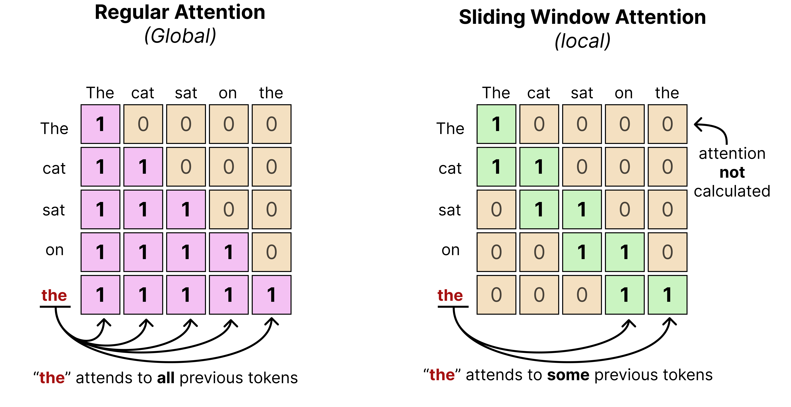
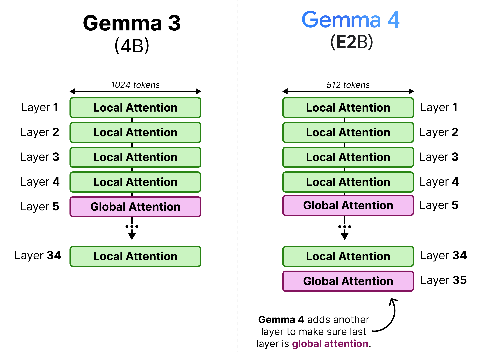
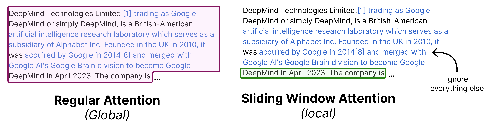
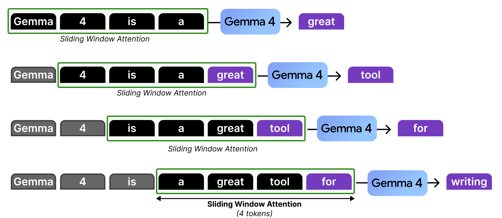
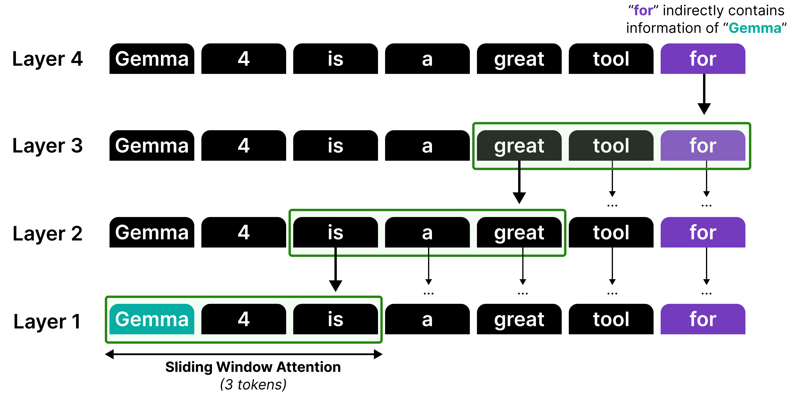
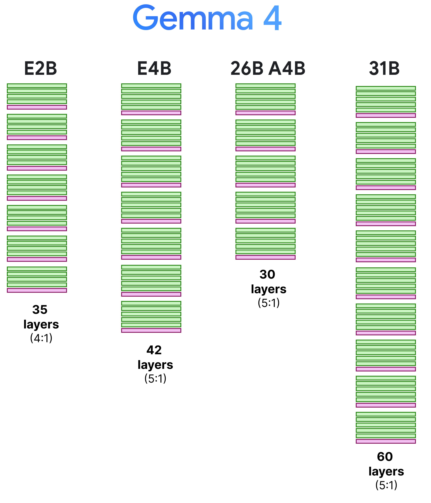
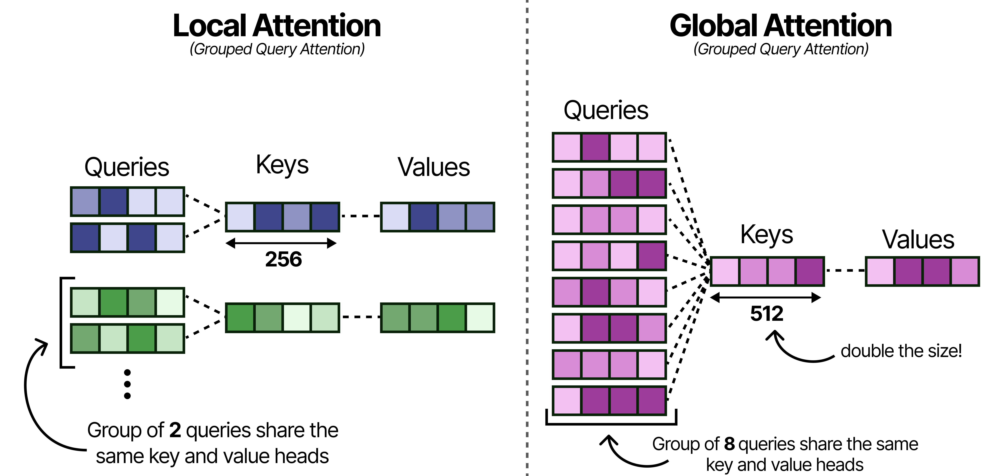
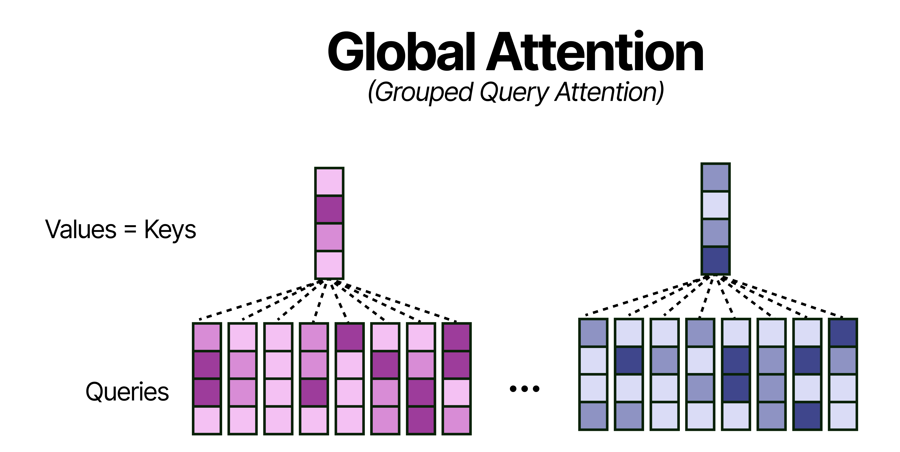
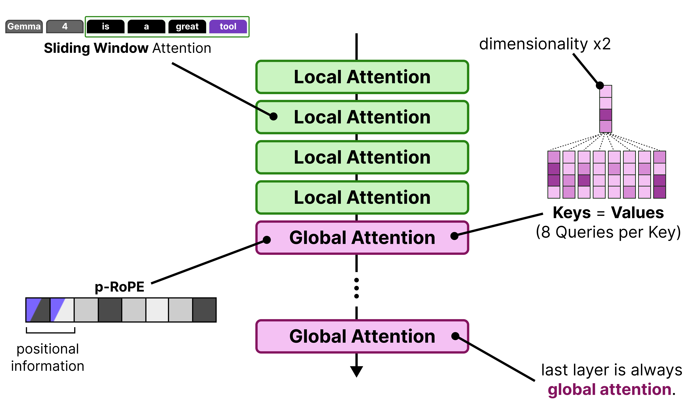

# 五层看近处，一层看全局：E4B 如何分配注意力

[系列索引](README.md) · 第 08 期

假设一段对话已有 4096 个位置。让每一层的新查询都读遍这 4096 个键，可以得到长距离信息，却会在每一层付出相应的读取和比较。E4B 的 42 层采用另一种节奏：五层局部滑动窗口，接一层全局注意力，这组六层重复七次。局部窗口配置为 512 token；全局层允许看到更长的因果历史。位置 `q` 只看允许的 `k≤q`，局部层还要满足窗口边界。RoPE 改变可见位置的匹配分数，mask 则决定可见集合。

*图 05：局部注意力与全局注意力允许读取的历史位置不同。*

因此第 41 层恰好是全局层，末层输出前有一次直接面向完整可见历史的注意力。图 05 的窗口宽度只是教学例子，本篇计算仍以 E4B 配置的 512 为准。

*图 09：末层局部与末层全局的可见范围对照。*

这不意味着全局信息每六层才“突然出现”。上一层已经更新的向量会继续进入下一层，局部层与全局层共同构成信息传播路径。但计算一层注意力时，确实要按该层的类型决定读哪些 K/V。全局层 head dim=512，局部层=256；不能用一张固定 `[B,H,S,256]` 图覆盖全部层。

## 窗口向前走，较早的信息怎样留下来

滑窗也不等于把更早历史从模型里彻底抹去：它不再让本层查询**直接**读取窗外的 K/V，但进入窗口的向量可能已经在先前层汇入更早的信息。这种层间传递并不保证逐字保留久远细节，周期性的全局层提供直接面向完整历史的读取机会。图中的“四个位置”仅用于演示窗口怎样随生成向前移动；E2B/E4B 的实际配置是 512，较大型号需按各自配置重算，不能沿用本篇数字。

窗口跟着当前查询位置向前走，因此同一层在不同生成步读到的 K/V 范围也会移动。

*图 06：滑动窗口随生成位置向前移动。*

用宽度为 4 的小例子可以看清边界；E4B 的真实窗口宽度是 512。

*图 07：四位置滑窗的教学例子。*

窗外位置不能被本层直接读取，但早先层加工后的状态仍可能把部分信息带入当前窗口。

*图 08：局部层间接传递较早信息的示意；不保证逐字记忆。*

家族图还对照了 E2B 的四局部一全局与 E4B 的五局部一全局。最后一层是否全局，会改变输出前能否直接查看完整可见历史；本篇 E4B 的第 41 层确为全局层。第 18 期再按型号分开核算，不能用一张家族图代替各自的 `layer_types` 列表。

*图 10：不同型号的局部/全局层节奏；本篇按 E4B 的五局部一全局计算。*

## 全局层更宽，缓存口径也要重算

多个 Q 头共享一组 K/V，可以减少需要生成和保留的 KV 头数；全局层增大每头宽度，则又增加每个头的字节数。对本篇固定的 E4B 配置，要读出精确值：局部层与全局层均为 8 个 Q 头、2 个 KV 头，即 **4 个 Q 头共享一组 K/V**；全局层 head dim 从 256 增至 512。图 11 的“局部 2:1、全局 8:1”是其他配置的示意，不能作为 E4B 的头数表。

*图 11：GQA 使多个 Q 头共用 K/V 头；E4B 固定配置是 8Q/2KV。*

图 12 的“全局 K=V、只存 K”也不能直接套到 E4B。此配置 `attention_k_eq_v=false`，源码为非共享生产层分别建立 `k_proj` 与 `v_proj`，缓存接口接收处理后的 K 和 V。即便某个其他配置启用共用投影输入，K 后续仍经历自己的归一化与 RoPE，V 则走另一套归一化；“投影共享”与“缓存里两份张量逐元素相同”是两件事。第 11 期算缓存容量时仍按这份 E4B 的实际张量形状和生产层数计。

*图 12：原文的全局 K=V 设计示意；本篇 E4B 配置未启用该选项。*

把这些全局层技巧放在一起看，才能区分家族层面的想法和 E4B 真正启用的配置。

*图 17：原文全局注意力优化汇总；其中 K=V 与头共享比例不适用于本篇 E4B 配置。*

E4B 还有跨层 KV 共享。官方配置的 `num_kv_shared_layers=18` 表示后 18 层不再分别投影自己的 K/V；同类型层从前面最后一个非共享生产层取得 K/V，而 Q 和输出投影仍由各层自己计算。这不是“42 层只留一份 KV”：前 24 层仍有独立生产，局部与全局也有不同共享来源。多条消费层的读取关系是算法结构的一部分，估算缓存时必须按实际**生产层**统计。

## 共享关系如何改变一层的工作

比较第 23 层和第 24 层附近的执行更直观。E4B 的前 24 层仍为自己的 K/V 建投影；第 24 层起属于后 18 个共享层。共享层仍接收它自己的 hidden state，并计算自己的 Q，再根据层类型取先前生产层保存的 K/V。这样两层的注意力输出未必相同：Q 不同，后续输出投影和残差也不同。节省的是部分 K/V 参数与生成、保存工作，而非整个 Attention 层。

画缓存容量曲线时，还要把“某层在当前前向过程中临时保留了一段完整 K/V”与“会话结束这一步后长期留下的缓存”区分开。局部窗口允许长期状态有界；全局层随有效上下文增长。只用一个 `T` 代表所有层，会把这一关键差别藏掉。

## 把 42 层列出来，才能数对缓存

层号从 0 起。`0–23` 是独立生产 K/V 的前 24 层，其中全局层是 `5、11、17、23`，余下 20 层为局部层。`24–41` 是 18 个共享层。源码在进入共享段前，为每种层类型找到**最后一个非共享生产层**，因此局部共享层取第 22 层产生的 K/V，全局共享层取第 23 层产生的 K/V。每个共享层的 Q 仍来自该层自己的 hidden state。若画 42 根 KV 箭头，必须把第 22/23 层扇出的读取线画出来，而不能把共享层画成相互串联复制缓存。

共享层还带来一个容易漏掉的执行约束。源码会把最后一个生产层的本次完整 K/V 放入 `shared_kv_states`，即使局部层面向长期缓存只需滑窗，后续共享层在**同一次前向**中仍可能需要这段完整状态。于是“局部缓存上限 512”并不自动意味着 Prefill 的所有临时 K/V 工作区都被压到 512。容量预算应至少分开：跨生成步保留的持久状态、本次前向的共享中间状态、注意力后端自己的工作区。

复杂度也要按阶段说。若长度为 `S` 的 Prefill 在一个全局层完整计算因果注意力，逻辑 QK 比较数随 `S²` 增长；滑窗宽 `W=512` 的局部层，充分长序列下约随 `S×W` 增长。Decode 一步只有一个新查询，局部层至多读窗口内约 `W` 个键，全局层读到当前可见历史 `T`，对应约 `O(W)` 与 `O(T)` 的键比较。以 `T=4096` 的单步逻辑可见长度为例，局部层最多约 512 个键，全局层约 4096 个键；这只是位置数比较，还未乘查询头数与 head dim。具体后端与共享读取也会影响实际时间，不能把大 O 写成实测延迟。

局部窗口和共享 KV 都减少某类资源，但减的不是同一项：前者限制参与注意力的位置数，后者减少部分层的 KV 投影和保存份数。下一章还有一条看似与注意力无关、却显著影响 E4B 参数口径的支路：PLE。

图源：[Maarten Grootendorst，《A Visual Guide to Gemma 4》](https://newsletter.maartengrootendorst.com/p/a-visual-guide-to-gemma-4)。

资料：[Google Gemma 4 模型卡](https://ai.google.dev/gemma/docs/core/model_card_4) · [E4B 固定配置](https://huggingface.co/google/gemma-4-E4B-it/blob/ee0ef6023621cff504d758262d4e04895a5af4a2/config.json) · [Transformers Gemma 4 源码](https://github.com/huggingface/transformers/tree/8445b13cd24961e47f25a649fb113580f71a8d11/src/transformers/models/gemma4)
