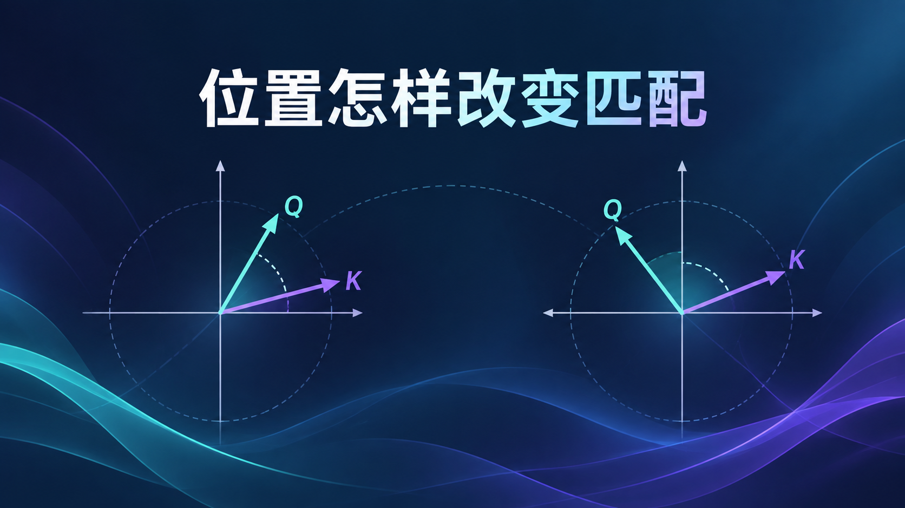

# RoPE：Q、K 的绝对位置怎样变成相对位移

[系列索引](README.md) · 第 08 期

上一期讲 Attention 时，Q 与 K 的点积回答的是“这两个位置的内容有多匹配”。可词序同样会影响一次匹配：一个词在当前位置之前多远，不能仅靠这次内容点积明确表达。RoPE（旋转位置编码）给 Q、K 带来位置线索，巧妙之处在于：**分别使用两个绝对位置，点积里却只留下它们的相对位移。**

## 两个绝对位置，怎样留下一个位置差

先只看 Q 和 K 各自的一对特征维度，把它们想成同一平面里的两支箭头。Q 位于位置 `m`，就在这个平面旋转 `mω`；K 位于位置 `n`，旋转 `nω`。`ω` 是这对维度的固定旋转速率。这里的位置不是作为一个数字加到 Q、K 上，而是分别决定两支箭头转过多少角度。

点积比较的是旋转后的两支箭头。假如两支箭头再一起转过同一个角度，它们之间的夹角不变，点积也不变。于是 `mω` 和 `nω` 中共同的那部分旋转，在比较时抵消了；位置对分数的作用只通过角度差 `(n−m)ω` 出现。记 `R(m)` 为旋转 `mω`，这个关系可以浓缩为一行：

`(R(m)q)ᵀ(R(n)k) = qᵀR(n−m)k`。

式子右边仍有 `q` 和 `k`：**分数同时依赖内容与相对位移**，并非只看两个 token 相隔多远。固定同一对内容，把两个位置一起向后平移相同距离，位置差不变，点积中的这部分位置关系也不变。

*图 1：RoPE 的核心关系。两端分别使用绝对位置 `m`、`n`，共同平移不会改变角度差；这是固定 `q`、`k` 时的位置关系示意，不代表分数只由距离决定。*

真实 Q/K 向量不止一对维度。RoPE 将多对维度分别旋转，不同维度对有不同速率；每一对都遵守同一个“共同旋转抵消”的关系，最后各对的点积贡献相加。这样，注意力能同时使用内容和多个尺度的相对位移信号，无需为每一对 token 另存一张相对位置表。

## 放回 Gemma 4 的 Attention

在 Gemma 4 E4B 中，Q、K 在参与匹配前接受位置旋转，V 不走这条旋转路径。局部注意力层使用 RoPE；全局层使用 p-RoPE，只让部分特征维度承担旋转，其余维度仍参加 QK 点积。这改变的是**允许比较的 Q/K 怎样得到分数**。因果或滑窗 mask 另外决定哪些历史位置可以参加比较，二者不能混为一谈。

*图 2：局部层与全局层的位置处理概念图。全局层的部分旋转来自 E4B 配置；未旋转的特征维度仍参与点积。V 不做 RoPE，mask 决定可见位置。图示不表示实际 head 排布或芯片连线。*

因此，RoPE 解决的是“两个已可比较的位置，如何让距离进入匹配分数”；下一期的局部与全局注意力，讨论的是“当前位置究竟允许看见哪些历史位置”。

资料：[RoFormer 原论文](https://arxiv.org/abs/2104.09864) · [Gemma 4 E4B 固定配置](https://huggingface.co/google/gemma-4-E4B-it/blob/ee0ef6023621cff504d758262d4e04895a5af4a2/config.json) · [Transformers Gemma 4 固定版本实现](https://github.com/huggingface/transformers/blob/8445b13cd24961e47f25a649fb113580f71a8d11/src/transformers/models/gemma4/modeling_gemma4.py)
