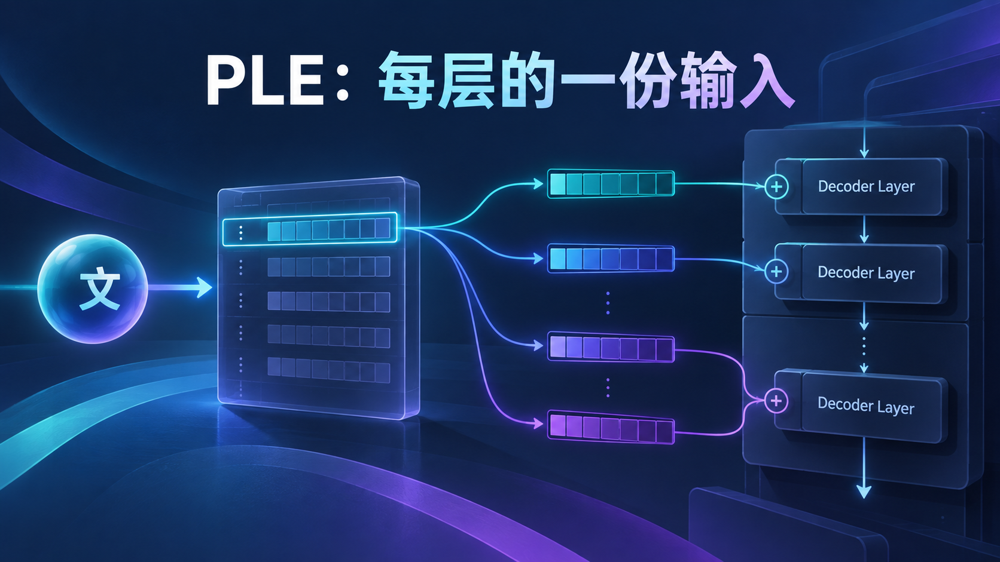
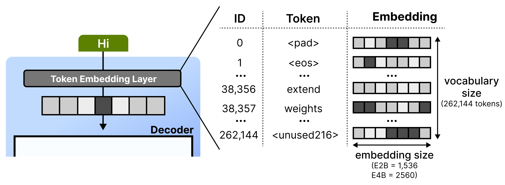
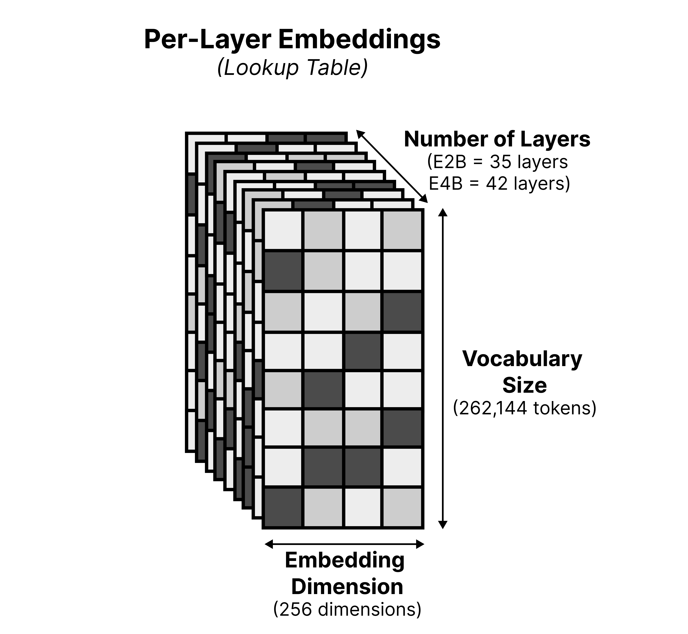
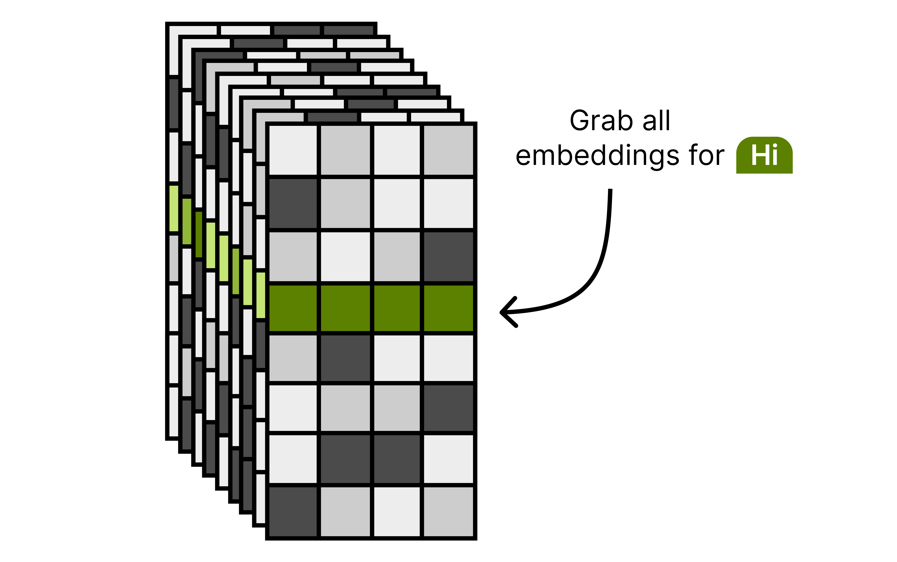
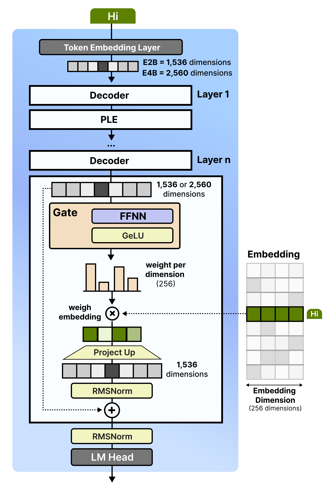

# 同一个词，42 次提醒：E4B 的额外参数藏在哪

[系列索引](README.md) · 第 09 期

经过数层 Attention 与 MLP 后，一枚 token 的主向量已经包含上下文加工的结果。E4B 还让每一层拿到一小份与原始 token 身份有关的输入：逐层嵌入（PLE）。可以把它理解为“这个位置原来是哪枚 token”的一条旁路，但它的数值是训练得到的参数，不能解释成可读的标签。打包表形状为 `[V,42×256]`；按 ID 查出一行后切成 `[B,S,42,256]`，第 `l` 层只用自己的 `[B,S,256]`。这不是把同一根 256 维向量重复广播 42 次。

*图 34：主 Embedding 按 token ID 从词表中取出一条向量。*

PLE 也不是直接加到主流上：维度不匹配。官方实现先对主输入作投影，缩放并整理成每层 256 维的内容分量，再用 RMSNorm；身份分量来自逐层表，二者按 `1/√2` 合并。到了具体 decoder 层，当前 `[B,S,2560]` 主流经过门控投影和激活，再与该层 PLE `[B,S,256]` 逐元素相乘；结果投影回 2560 维、归一化后加回残差。这样每一步的相加都发生在匹配的维度上。

*图 35：PLE 表按词表、层和 256 维特征组织；实现中打包存储。*

## 两条输入支路不能画成一次查表

可以把 PLE 的来源拆成 `I` 和 `C`。`I` 由 token ID 索引逐层表并按模块规定缩放，`C` 从主输入投影、缩放、整理为 `[B,S,42,256]` 后归一化。文本 ID 可用时，模型把 `(I+C)/√2` 作为逐层输入。这里的“内容”不是每经过一层就重新投影一次：该支路在进入 decoder 层堆叠前形成，再由各层取相应切片。否则不仅计算量估计会错，图上的时间顺序也会错。

*图 36：同一 token 从逐层表取得不同层的输入。*

图像和音频让这条路径出现一个容易误画的细节。`project_per_layer_inputs` 函数在未提供身份分量时能返回纯内容分量，但 E4B 常规多模态前向并非简单走此分支：官方 `Gemma4Model.forward` 先把媒体占位位置换成 pad ID 准备 PLE，再把视觉/音频软 token 填回主输入。主流中的软 token 与 PLE 身份查表因此不是“同一个媒体 ID 查两张表”。第 15、16 期会沿实际媒体调用链再看一次。

第 `l` 层只读这一序列中的第 `l` 片，经过门控投影再回到 2560 维。取 E4B 配置中的 `V=262144,L=42,P=256`，打包 PLE 表的元素数是 `VLP≈2.82×10^9`；这是解释 effective 与总参数差距的一个重要来源。它并不意味着每步都对约 28 亿个数做稠密乘法：本次需要的身份向量由 token ID 索引，访问模式与 MLP 权重不同。真实字节数还取决于发布权重的位宽和压缩格式。

## 沿一枚 token 追踪 42 份向量

令 `e_i:[2560]` 为主 Embedding 输出，`E_PLE[i]:[10752]` 为 token `i` 在打包表中的一行，其中 `10752=42×256`。查表以后 reshape 为 `I_i:[42,256]`。另一支路把 `e_i` 投影为 `[10752]`、乘以 `1/√2560`、reshape 成 `[42,256]`，再对末维做 RMSNorm，得到 `C_i`。若存在身份支路，官方组合是 `P_i=(I_i+C_i)/√2`。这些操作的次序很重要：归一化的是内容投影，合并以后没有再执行同一个投影归一化。

进入第 `l` 层时只取 `P_i[l]:[256]`。该层主流 `x_l:[2560]` 经 `per_layer_input_gate` 得到 `[256]`，激活后与 `P_i[l]` 逐元素相乘，随后 `per_layer_projection` 回到 `[2560]`、RMSNorm、残差相加。这让身份信息对每层的影响取决于该层当前状态，而非每层都无条件加同一向量。为阅读源码，可以在 `Gemma4TextModel.get_per_layer_inputs`、`project_per_layer_inputs` 和 `Gemma4TextDecoderLayer.forward` 三处依次核对这条线。

*图 37：PLE 经门控、乘法、回投影与残差接入；图中 E2B 尺寸与层外画法应按正文修正。*

打包表 `262144×10752=2,818,572,288` 个元素。若仅按 BF16 原始存储算，它约占 `5.25 GiB`；再加主 Embedding 的约 `1.25 GiB`，两张表已经是相当大的静态容量。这是为什么“有效参数少”不等于“文件和内存必然小”。但每个文本位置只索引 PLE 的一行，不能把 28 亿元素全算成本步乘加。量化后的实际容量还要看表的位宽、分组元数据与加载格式。

可以把 PLE 理解为每层提醒模型“这枚 token 原先是什么”。这个比喻说明为什么逐层输入可能有用，却不表示某层的 256 维向量能被读成“名词”“动物”等人类可解释标签。将大表放在闪存、只把当次查到的行送入快速存储，是一种**可能的内存分层方案**，不表示 Gemma 4 权重天然不占 RAM。若按 token 逐行从闪存读取，还要把随机访问延迟、预取和带宽算进 Decode，不能只从参数量推出手机上的实际速度。

PLE 增加了不少**存储参数**，但查表是按当前 token ID 取部分行，与每个 token 都对整张表做矩阵乘不同。官方模型卡因此区分 E4B 的约 4.5B effective 参数和约 8B 包含 embedding 的总参数。前者不能拿来直接乘位宽，推断完整模型要装多少字节。下一章回到时间：同一模型在第一个回答 token 前后会换一种工作形状。

图源：[Maarten Grootendorst，《A Visual Guide to Gemma 4》](https://newsletter.maartengrootendorst.com/p/a-visual-guide-to-gemma-4)。

资料：[Google Gemma 4 模型卡](https://ai.google.dev/gemma/docs/core/model_card_4) · [E4B 固定配置](https://huggingface.co/google/gemma-4-E4B-it/blob/ee0ef6023621cff504d758262d4e04895a5af4a2/config.json) · [Transformers Gemma 4 源码](https://github.com/huggingface/transformers/tree/8445b13cd24961e47f25a649fb113580f71a8d11/src/transformers/models/gemma4)
