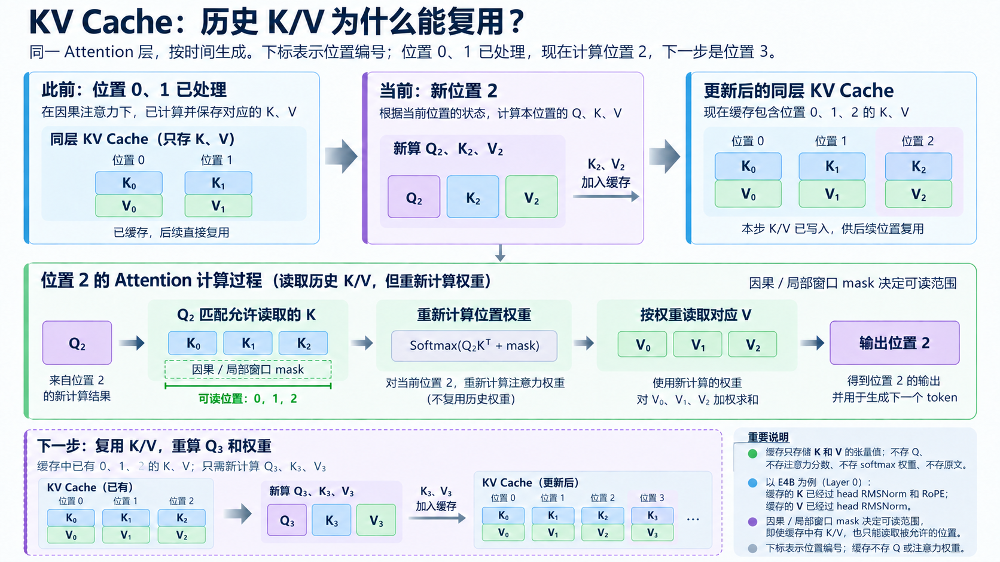
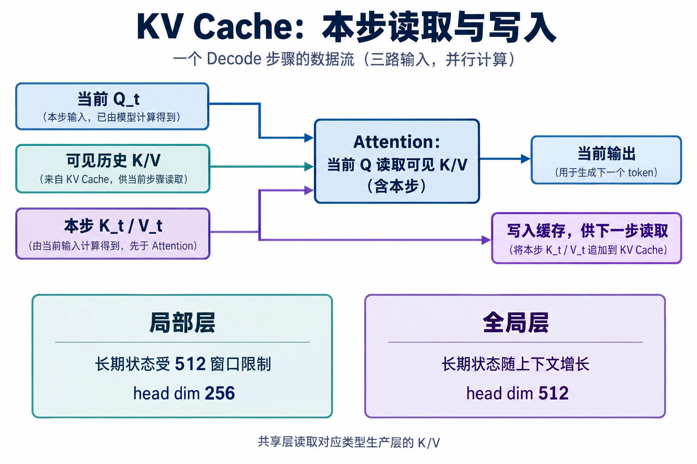
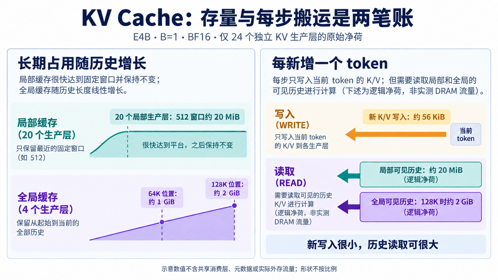
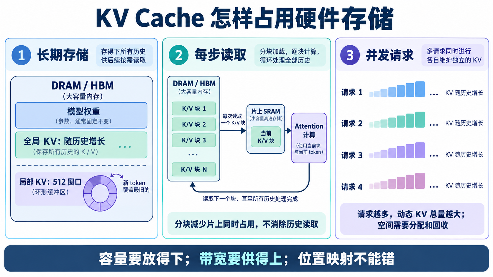

# KV Cache：保存什么，容量如何增长

[系列索引](README.md) · 第 11 期

生成回答时，Decoder 每次加入一个新位置。它的查询 Q 要与可见历史的 K 匹配，再按新算出的权重读取对应的 V。如果每一步都重新处理整段历史来生成 K/V，大量工作会反复进行。**KV Cache 留下已算好的历史 K/V，让下一步直接读取。**它省掉旧 K/V 的重复生成，却没有省掉当前查询与可见历史的匹配；历史越长，保存和读取这些数值也越贵。

## 为什么旧 K/V 可以复用

在因果约束下，旧位置当时只能利用自己及更早位置的信息。后来追加的新 token 不会回头改变它已经算出的状态，因此同一生产层的旧 K/V 可以留下。来到新位置，模型算出本步 Q/K/V：当前 Q 读取允许可见的旧 K/V 和本步 K/V，本步 K/V 再供后续位置使用。**留下的是 K/V，不是旧 Q 的分数或 softmax 权重。**新查询不同，位置权重必须重算。

*图 1：沿时间读一层的缓存。位置 0、1 的 K/V 已保存；来到位置 2，新算 Q₂/K₂/V₂，Q₂ 重新匹配可见 K 并读取对应 V，K₂/V₂ 随后供下一个位置使用。只展开一个查询头和少量位置；图为原理示意，不是模型运行截图。*

以 E4B 的第 0 层为例，保存的 K 已经过该头的 RMSNorm 和 RoPE，V 已经过自己的 RMSNorm。缓存不是原文摘要，也不保存完整隐藏状态或注意力概率。因果与局部窗口 mask 仍控制当前 Q 可以读哪些位置：**缓存中有一条 K/V，不等于当前查询能读它。**第 06 期讲了匹配与汇聚的算法，这里沿生成步骤看状态怎样延续。

## 局部和全局，保留范围不同

局部层当前只直接读取最多 512 个相邻位置；更早的 K/V 对本层当前查询已不可见，长期保留时可以淘汰。全局层则可能读取整段因果历史，随上下文增长保留更多位置。这里说的是**算法要求的可见与可保留范围**；具体后端是否立即释放旧局部条目，还取决于缓存实现。E4B 另有跨层 KV 共享：后 18 层消费前面生产层的 K/V，不必再各自产生一套。这是层之间的复用，与同一份 K/V 跨生成步骤保留不同。

*图 2：把图 1 的当前一步展开。当前 Q 读取可见历史与本步 K/V，新 K/V 写入缓存供下一步使用；下方比较局部层的有界窗口与全局层随上下文增长的历史。图不指定缓存的物理布局。*

局部窗口还带来一个容易出错的位置问题。假设一个环形缓冲只存最近 512 个位置，旧位置被覆盖后，数组第 0 行可能对应整段对话中的第 512 个位置。RoPE、因果 mask 和窗口判断仍要使用正确的**序列绝对位置**，不能把这行误当位置 0。连续数组、环形缓冲或分页存储只是物理安排；换布局不应改变模型读到的逻辑位置。容量收益要建立在这一点通过数值验证的基础上。

## 一笔账：容量、每步写入和历史读取

先数原始 K/V 净荷，不计索引、对齐、运行时副本和其他工作区。若一层保留 `T` 个位置，有 `Hkv` 个 KV 头、每头 `d` 个元素，每元素占 `b` 字节，批量为 `B`，那么 K 与 V 合计为 `2×B×T×Hkv×d×b` 字节。这里的 `T` 是**实际保留位置数**；算 Attention 读取量时，应另用**当前查询可见位置数**，两者在局部层或未及时淘汰的实现中可能不同。

E4B 共 42 层，前 24 个独立生产 K/V 的层中有 20 个局部层、4 个全局层；后 18 层消费共享 K/V，不能把每层缓存机械乘以 42。取 `B=1`、BF16 每元素 2 字节，只为说明数量级：

- 一个局部生产层每个位置的 K/V 占 `2×2×256×2=2048` 字节，即 2 KiB。若长期只留 512 个位置，这层约 1 MiB，20 层合计约 **20 MiB**。
- 一个全局生产层每个位置占 `2×2×512×2=4096` 字节，即 4 KiB。四层每增加一个位置共 16 KiB；可见并保留 65,536 个位置时共约 **1 GiB**，达到配置的 131,072 个位置边界时共约 **2 GiB**。

所以只看这 24 个生产层，每新增一个位置的原始 KV 写入是局部 `20×2=40 KiB` 加全局 `4×4=16 KiB`，合计约 **56 KiB**。这不等于长期占用总量：局部窗口满后可以覆盖旧状态，而全局前缀会继续增长。上面的 2 GiB 也是按配置边界计算的原始净荷，不是设备部署所需内存或某次运行的实测值。

每步**读取**又是另一笔账。窗口已满时，20 个局部生产层读取 512 个位置的原始 K/V，合计约 20 MiB；四个全局生产层在可见键数为 131,072 的边界情形下，单次完整逻辑读取约 2 GiB。实际整模型还可能有共享消费层的读取；片上缓存命中、分块与复用也会让外存流量不同于这个逻辑净荷。这个对比说明：**本步新增写入可以很小，查询历史的流量却可能随上下文变大。**因此只报 KV Cache 容量或每 token 写入量，都不足以预测 Decode 速度。

*图 3：把上面的数分成两笔账。左侧是长期占用：20 个局部生产层在 512 窗口下约 20 MiB，四个全局生产层随历史增长，在 64K、128K 位置分别约 1、2 GiB。右侧是一个新 token 的净荷：约 56 KiB 新 K/V 写入，与可见历史的逻辑读取分开看。数值以 `B=1`、BF16、只数 24 个独立生产层为条件；箭头与面积不按比例，也不是实测外存流量。*

## 这些数字怎样落到硬件存储

*图 4：从硬件存储看 KV Cache。左侧比较随历史增长的全局 KV 与可按窗口复用空间的局部 KV；中间以全局层为例，历史 K/V 分块从大容量存储送入片上 SRAM，Attention 逐块处理；右侧表示独立请求各有自己的动态历史。图是概念结构，DRAM/HBM、SRAM 的具体容量和速度须由目标设备确认。*

**先看放不放得下。**在上面的 128K、`B=1` 构造例子中，只算生产层的 BF16 原始 KV，四个全局层约 2 GiB，局部层另约 20 MiB。它们是随请求存在的动态状态，还要与模型权重、激活、注意力工作区共享设备存储。因此硬件容量预算至少要同时放下**权重、并发请求的 KV、计算工作区和运行时开销**；只用模型权重文件大小判断能否部署，会漏掉随上下文增长的部分。

当片上 SRAM 装不下整份历史时，长期状态要留在更大的一层存储中，例如设备 DRAM；本步计算将当前需要的 K/V 分块搬入片上。片上空间同时要容纳 Q、当前 K/V 块和部分注意力结果，块做多大受 SRAM 容量与供数能力约束。**分块减少同时驻留片上的数据，不会让仍需读取的全局历史凭空消失。**这也解释了为什么把整份 KV Cache 都画进片上存储会误导硬件估算。

**再看供不供得上。**做一个只针对上述四个全局生产层的带宽直觉：假设每个 Decode 步的 2 GiB 历史 K/V 都需从外部存储读取，目标若是每秒 10 个 token，光这一项就要求约 20 GiB/s 的持续搬运，还没算权重、局部层和共享消费层。这不是 E4B 的实测带宽要求；片上命中、跨层复用、分块调度和具体注意力实现都会改变实际外存流量。但它说明为什么缓存容量“够放”仍不保证生成速度。

**并发会把容量放大。**不同请求通常有各自的历史；若四个独立请求都达到上述 128K 边界，仅四个全局生产层的 BF16 原始 KV 就约 8 GiB，仍未计局部层、权重及管理开销。一个假设只有 8 GiB 可用模型存储的设备，单凭这四份全局 KV 就已装不下完整工作负载。于是可同时接纳的请求数、允许的上下文长度和 KV 精度要一起规划；把溢出的 KV 移到更慢的存储，也会把问题转成更长的搬运与等待。

局部层的长期状态可以围绕 512 窗口复用固定空间；全局历史则需要随着请求增长。不同请求长度各异，按最大长度预留连续大块容易浪费空间；按需分配块可以减少预留和碎片，但会引入块表、地址转换与回收工作。布局还要让 K/V 搬运适合存储突发访问和片上缓冲，不可只看净荷公式。

因此硬件设计要同时回答三个问题：**长期 KV 放在哪里、每步怎样把可见块送到计算单元、并发请求怎样分配与回收空间。**KV 量化可能降低净荷与搬运量，但需要解量化支持和数值验证；分页或环形布局也必须保持正确的绝对位置与可见范围。KV Cache 把重复算旧 K/V 的代价换成动态存储和历史读取。下一章转向另一笔大数据：近乎固定的模型权重。

资料：[Google Gemma 4 模型卡](https://ai.google.dev/gemma/docs/core/model_card_4) · [E4B 固定配置](https://huggingface.co/google/gemma-4-E4B-it/blob/ee0ef6023621cff504d758262d4e04895a5af4a2/config.json) · [Transformers Gemma 4 源码](https://github.com/huggingface/transformers/tree/8445b13cd24961e47f25a649fb113580f71a8d11/src/transformers/models/gemma4) · [FlashAttention 论文](https://arxiv.org/abs/2205.14135) · [PagedAttention 论文](https://arxiv.org/abs/2309.06180)
