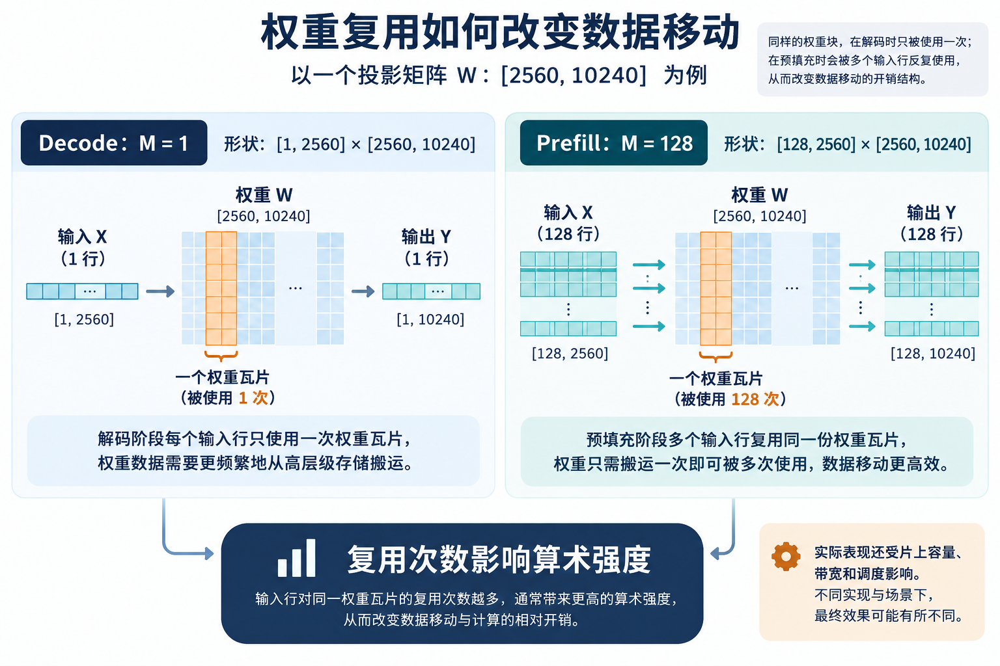

# 乘加阵列跑得快，数据为什么还在路上

[系列索引](README.md) · 第 14 期

前面几期不断出现一种反差：Prompt 变长时 GEMM 做的乘加更多，持续生成时每步乘加较少，设备却未必更轻松。看一个线性层 `A:[M,K] × W:[K,N] → Y:[M,N]`。它大约执行 `MKN` 次 MAC；若按 2 ops/MAC 统计，就是约 `2MKN` operations。Prefill 让 `M` 包含较多 token 行，一块权重搬来可以服务多行；batch=1 Decode 常接近 `M=1`，同样的权重服务的行数更少。运算量不变成实际速度，关键还在于为了完成这些运算搬了多少字节。

算术强度定义为 `operations / 从指定存储边界搬运的 bytes`。它回答“搬一个字节能换来多少运算”，因此能把权重复用程度写进一项可比较的量。必须先说清边界：是外部内存到片上 SRAM，还是 SRAM 到寄存器。用峰值计算率 `P_peak`、可持续带宽 `BW` 和算术强度 `I`，一个简化 Roofline 上界是 `min(P_peak, BW×I)`。它是瓶颈分析的起点，不是设备实测 token/s；真实链路还含归一化、激活、Attention、调度、词表输出及软件开销。

*图：同一投影矩阵在 `M=1` 与 `M=128` 两种构造负载下的权重复用机会。右侧“多行复用”是假设权重瓦片能被保留并复用的理想情况；实际算术强度取决于所选存储边界、片上容量和调度。*

## 从公式读出一个硬件取舍

拿同一层权重 `W:[K,N]` 作思想实验。如果一次搬入后只给一个输入行使用，权重字节几乎只换来一次行向量乘；若有 128 个输入行，权重有机会被复用 128 次。真实硬件未必能把整个 W 留在片上，因此通常拆成 tile，再问每个 tile 能被多少输入行、多少输出列复用。tile 做得太大放不下，太小又使调度和搬运开销上升。这个取舍由算法矩阵形状触发，却要在具体 SRAM 容量、bank 和 DMA 条件下求解。

同样的分析不应只套矩阵。归一化有按特征轴的归约，softmax 有按键轴的最大值与指数和，残差是逐元素读写，词表输出头还涉及很宽的候选空间。一个号称能跑满 GEMM 的引擎，若向量/归约或数据供给跟不上，整层仍无法按峰值速度执行。

## 一张投影矩阵的理想算术强度

仍看 `A:[M,2560]×W:[2560,10240]`，假设 A、W、Y 全是 BF16，且每个张量从外存**理想地只读/写一次**。运算数约为 `2M×2560×10240` ops；最低张量净荷字节约为 `2(M×2560+2560×10240+M×10240)`。`M=1` 时，计算约 5243 万 ops，读写约 50 MiB，算术强度约 1 ops/byte；`M=128` 时，计算约 67.1 亿 ops，理想张量净荷约 53 MiB，强度约 121 ops/byte。这里取整后的数字只用于说明**权重被更多输入行分摊**，没有计缓存失效、tile 重读、量化、融合或设备实际带宽。

若假想设备的可持续外存带宽为 100 GB/s、计算上限为 10 TOPS，则简化 Roofline 的转折点是 `10 TOPS / 100 GB/s =100 ops/byte`。上面的单行例子落在带宽一侧，128 行理想例子接近计算上限。这个设备数字完全是假设，不代表任何文王芯片、GPU 或 NPU 测量；换位宽、batch 或 tile 布局后，位置会变化。

这也解释了算法给端侧硬件提出的具体诉求：能否容纳并复用权重 tile，能否高效处理 `M≈1` 的窄形状，能否在片上完成归一化和 softmax 的归约，能否在长历史下供应 K/V。答案要由目标芯片的可持续带宽、SRAM 容量/端口、矩阵与向量单元利用率以及软件调度共同决定；峰值 TOPS 只覆盖其中一项。

芯片靠近乘加阵列的寄存器和 SRAM 容量有限；数据要从外部内存分块搬入，再在片上尽可能复用。SRAM 容量大也不保证每个计算单元都同时拿到足够带宽，端口、bank、互连和访问冲突会影响有效吞吐。算法因此给硬件提出的要求不是“尽量堆 MAC”这么简单，而是让具体形状的权重、激活和 KV 在合适时间到达合适的计算位置。文本故事到此暂告一段落；下一章加入一张照片，会多出哪些步骤？

资料：[Google Gemma 4 模型卡](https://ai.google.dev/gemma/docs/core/model_card_4) · [E4B 固定配置](https://huggingface.co/google/gemma-4-E4B-it/blob/ee0ef6023621cff504d758262d4e04895a5af4a2/config.json) · [Transformers Gemma 4 源码](https://github.com/huggingface/transformers/tree/8445b13cd24961e47f25a649fb113580f71a8d11/src/transformers/models/gemma4)
