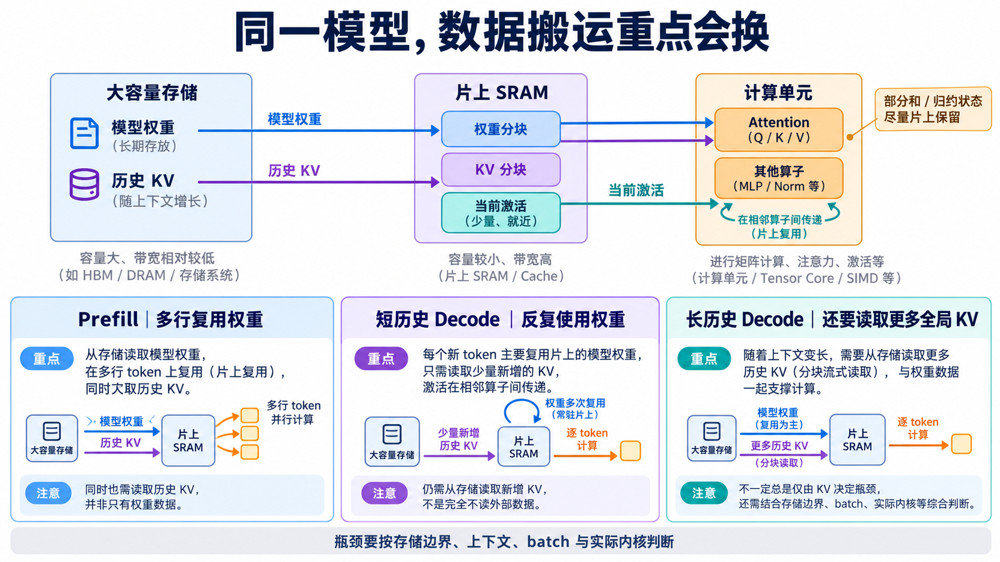

# 数据搬运与 Roofline：端侧 NPU 什么时候在等数据

[系列索引](README.md) · 第 15 期

第 11 期用同一张权重服务 128 行或 1 行，解释了 Prefill 与 Decode 的权重复用差异；第 12–14 期又看到，历史 KV、Attention 中间量和算子调度各有自己的成本。现在把它们放到同一台端侧 NPU 上：**计算单元要一直有数据可算，数据就必须按时从大容量存储到达片上。** 哪一路搬运先跟不上，会随提示词长度、生成历史和并发请求数改变。本章讨论的是判断方法，不替某块尚未测量的芯片指定瓶颈。

*图 1：按用户指定图片保留的资源地图，属于概念示意。蓝色权重、紫色 KV 和青色当前激活是三类不同数据。图中的“片上复用权重”指分块计算时的复用机会，不保证完整模型权重能跨 token 常驻 SRAM。Prefill 会为当前请求**生成** K/V；短历史 Decode 仍要读取可见的旧 K/V，图中“少量新增 KV”只描述新写入量。箭头不表示逐节点的真实芯片连线。*

## 先认清三条数据流

**权重**在一次请求中基本不变。主 Embedding 与 PLE 要按 ID 查表，线性层要读取相应矩阵，词表输出头还要为候选 ID 打分。模型权重可以放在大容量存储中，计算时按块搬到片上 SRAM 或缓存，再送进矩阵单元；能否多次使用同一块，取决于本次有多少输入行、片上容量和调度。第 13 期的量化若让外存中保持低比特打包，便是在这条流上减少需要搬的字节。

**KV Cache**随请求推进而变化。每个新位置产生少量新 K/V，但它的 Q 还要读取允许可见的历史。局部层至多直接看 512 个位置；全局层可见历史会继续增长。第 12 期按 E4B、`B=1`、BF16、只计四个全局 KV 生产层的原始净荷估算：128K 位置的完整历史约 **2 GiB**。若一次全读，单步逻辑读取就是这个量级；共享消费层也会使用这些 K/V，所以它不能被误读为整模型的外存实测流量。片上 SRAM 装不下整段历史时，只能分块送入 Attention，分块不会让必须参与计算的历史凭空消失。

**当前激活与中间结果**通常比完整权重和长历史小，却会频繁穿过算子边界。MLP 的门控、RMSNorm 的归约、残差相加和 Attention 的 softmax 都会产生临时值。把相邻算子融合，让激活、部分和、softmax 的最大值与指数和尽量留在片上，可以少一次外存往返；代价是占用寄存器/SRAM，块太大又会压低并行度。第 14 期的分块 Attention 正是在不落地完整分数表的同时，仍按需读取 K/V。[FlashAttention 原论文](https://arxiv.org/abs/2205.14135)说明了这种 IO 取舍；[CUTLASS 的分块 GEMM 文档](https://docs.nvidia.com/cutlass/latest/media/docs/cpp/efficient_gemm.html)展示了矩阵块在存储层级中逐级复用的实现思路。它们是方法参考，不代表 E4B 已在某款端侧 NPU 上采用同一内核。

三条流还可能争用同一条外存带宽或片上缓冲。权重占空间大，不等于每一步都完整从外存重读；KV 有容量，不等于每一份都经过外存；激活尺寸较小，也不等于其频繁读写免费。必须先指定**哪两级存储之间**在计字节，才能讨论“带宽瓶颈”。

## 同一模型，关注重点为什么会换

| 场景 | 数据怎样变化 | 首先检查什么 |
| --- | --- | --- |
| Prefill | 多行共用权重；同时建立 K/V | 权重复用；局部层跳过窗外块；全局层避免落地完整分数表 |
| 短历史 Decode | 单请求每步一行；可见 K/V 较短 | 权重供给、窄形状利用率、旧 K/V 读取 |
| 长历史 Decode | 每步一行；全局可见 K/V 变长 | 权重与全局 KV 合计搬运、缓存命中 |
| 多请求 Decode | 可合并更多新位置；各请求有独立 KV | 权重跨请求复用与 KV 容量、延迟的取舍 |

表中写的是**优先检查的对象**，不是预先判定的瓶颈。较长的 Prompt 让全局 Attention 的可见配对数上升；较长的 Decode 历史让全局 KV 读取增长；增加 batch 让权重有更多复用机会，也增加独立请求的 KV 状态。哪一项先限制速度，要看位宽、设备带宽、缓存命中、具体内核和调度。

## Roofline 怎样帮助判断，哪里又管不到

Roofline 用一个简单关系连接计算与搬运：算术强度 `I = 运算数 / 从指定存储边界搬运的字节数`，可达到的计算吞吐上界不超过 `min(计算峰值, 该边界的可持续带宽 × I)`。[Roofline 原论文](https://digicoll.lib.berkeley.edu/record/136692/files/EECS-2008-134.pdf)用它判断程序更可能碰到算力上限还是带宽上限。比如同一权重块在 Prefill 中服务多行，分母未必随行数等比例增加，算术强度有机会升高；单请求 Decode 的这一机会较少。具体算术已在第 11 期给出，本期不再重算那张 gate 投影。

**边界选错，结论就会错。**若统计的是外存到 SRAM 的字节，却用 SRAM 到计算单元的带宽作 Roofline，得到的“带宽上限”没有实际意义。权重经过量化、缓存或重复读取，`I` 也会变；同一层的 Prefill 与 Decode 不能共用一个点。端侧 NPU 还可能有矩阵阵列、向量/归约单元和 DMA 等不同资源，单一 `P_peak` 只是一种简化。Roofline 给出上界和排查方向，不能直接换算成用户看到的 token/s，更不能替代真实内核的时间线。[NVIDIA 的性能测量指南](https://docs.nvidia.com/deeplearning/tensorrt-rtx/latest/performance/best-practices.html)也强调要把吞吐、延迟与逐层耗时放到实际配置中测量。

实际定位时，先固定模型版本、量化格式、输入与输出长度、batch、上下文及设备电源模式。按 Prefill 和 Decode 分别记录层或内核耗时、矩阵单元利用率、外存/SRAM 搬运量和缓存命中；随后再问慢的部分是在**等权重、等 KV、写中间结果，还是算子启动与归约**。如果长历史下全局 Attention 耗时上升，只能说明该路径值得查，不能不测就断言外存带宽已经饱和。

第 16、17 期把图像和音频前端接入同一条推理链后，还会多出媒体编码和更多输入位置。第 18 期再讨论持续输出时功率、温度与供电会怎样约束这张数据流图。端侧 NPU 的设计判断，最终要把**数据量、所在层级、搬运次数和实际带宽**与算力一起对齐。

资料：[Roofline 原论文](https://digicoll.lib.berkeley.edu/record/136692/files/EECS-2008-134.pdf) · [CUTLASS 分块 GEMM 文档](https://docs.nvidia.com/cutlass/latest/media/docs/cpp/efficient_gemm.html) · [FlashAttention 论文](https://arxiv.org/abs/2205.14135) · [NVIDIA 推理性能测量指南](https://docs.nvidia.com/deeplearning/tensorrt-rtx/latest/performance/best-practices.html) · [E4B 固定配置](https://huggingface.co/google/gemma-4-E4B-it/blob/ee0ef6023621cff504d758262d4e04895a5af4a2/config.json)
