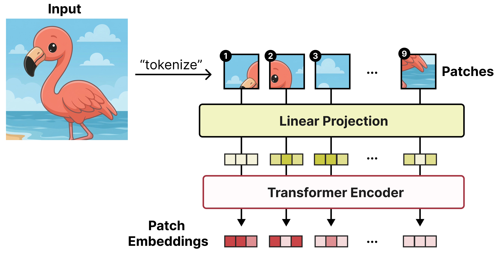
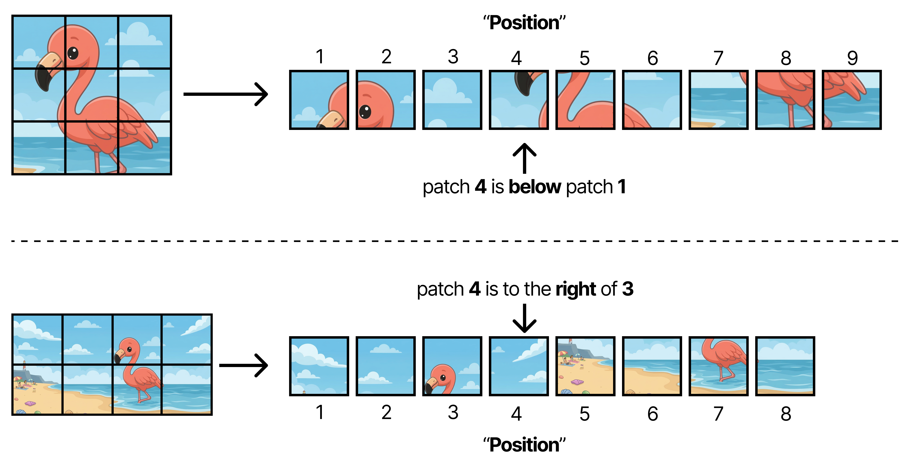
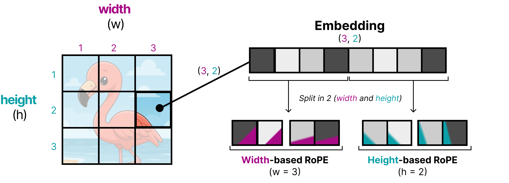
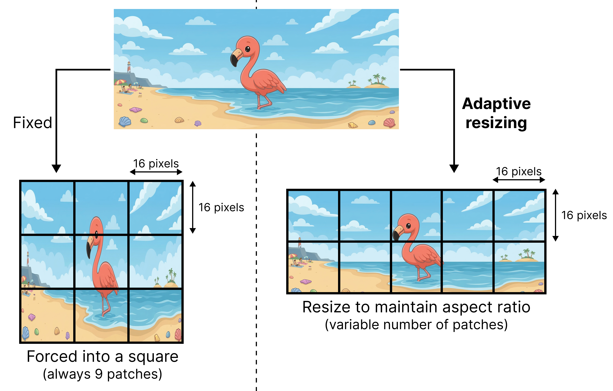
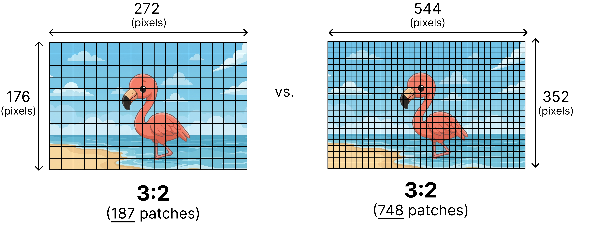
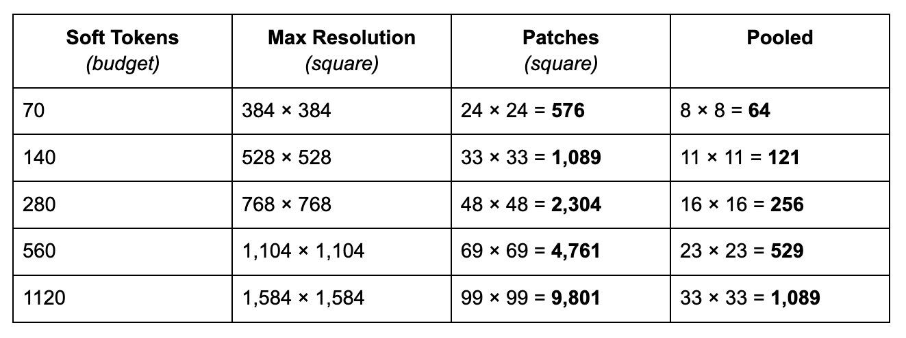
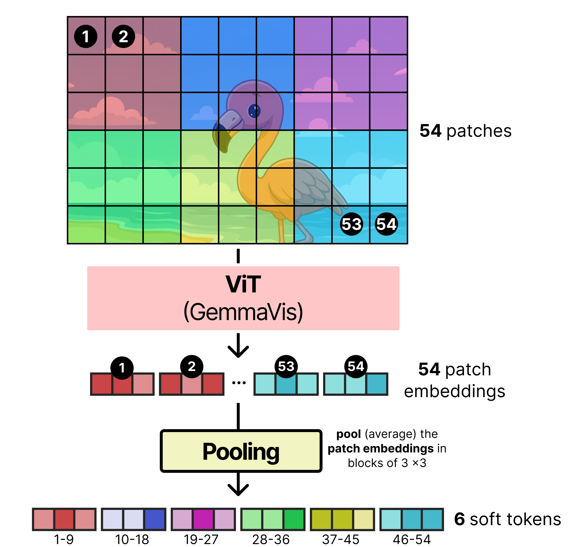
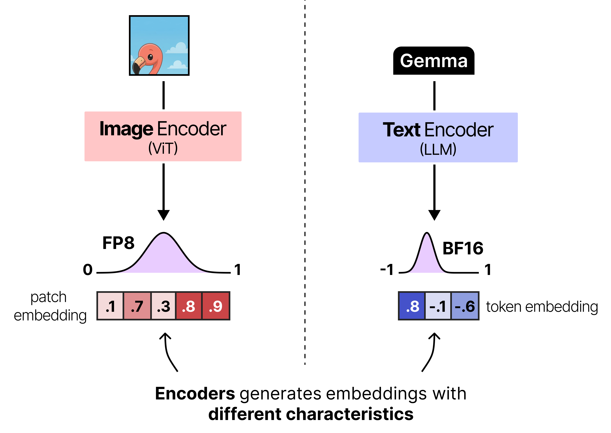
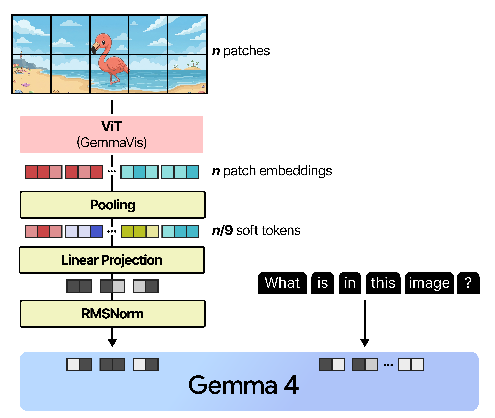

# 视觉输入：照片如何变成软 Token

[系列索引](README.md) · 第 15 期

当用户问“这张图里有什么？”，文字 token 只承载了问题，图片本身还要另走一条输入链。E4B 的视觉路径先按官方 processor 处理图片，再由视觉编码器产生特征，经过投影变成语言 decoder 可接收的软 token，按位置与文本 token 一起送入后续计算。它并不是把 JPEG 的字节直接塞进文字词表，也不是让大模型先生成一段隐藏的文字描述再阅读。

理解图像开销至少要区分四个大小：原图像素、预处理后的 patch/裁剪序列、视觉编码器中间特征、进入 decoder 的软 token 数。不同图片尺寸和处理策略会影响这些长度；在固定 processor revision 与输入样例之前，本章不伪造“一张图固定多少 token”。软 token 与文本向量在 decoder 中占据位置，因此会影响 Prefill 长度及后续上下文预算；视觉编码器还要有自己的权重与临时工作区，这些不能全塞进“KV Cache”一项。

## “一张图”进入模型前已有多种长度

E4B 固定配置给出视觉编码器 hidden width 768、16 层，并设置 `vision_soft_tokens_per_image=280`。这三个数描述不同位置：768 是视觉编码器的特征宽度，16 是其层数，280 是配置中的软 token 数设置；它们都不是原始图像像素数。实际处理流程还要看 processor 对尺寸、裁剪和有效图像单元的规则，不能只凭 280 推出任意高分辨率输入的总 decoder token 数。

### Patch 为什么需要二维位置

视觉编码器先把图像分成 patch，再让这些 patch 经 Transformer 交换信息。单看展开后的序号会丢失二维关系：同为“第 4 个 patch”，在 `3×3` 与 `2×4` 网格里位置不同。因此视觉路径用宽、高坐标形成二维位置编码。预处理也要兼顾长宽比：强行拉成正方形会扭曲内容，裁剪可能丢掉画面；按 patch 网格调整并填充时，padding 位置必须在后续被识别和剔除。这里的二维 patch 位置与语言 decoder 的一维 token 位置不是同一个坐标系。

*图 18：图像被分成 patch，再由视觉 Transformer 产生特征。*

展平成一维序列后，同一个序号在不同网格中未必处于同一个画面位置。

*图 19：同一 patch 序号在不同长宽比下对应不同二维位置。*

二维位置编码分别利用横向和纵向坐标，让模型保留 patch 在画面中的几何关系。

*图 20：patch 的宽、高坐标分别参与二维位置编码。*

尺寸调整还要处理无法整除 patch 网格的边缘，填充位置不能被当成真实图像内容。

*图 21：保持长宽比并填充 patch 网格的示意。*

### 分辨率预算控制进入 decoder 的长度

前面的长宽比决定 patch 的二维位置；即使长宽比相同，分辨率也会改变初始 patch 数量。Gemma 4 通过视觉 token 预算控制保留多少细节。[Google 的视觉说明](https://ai.google.dev/gemma/docs/capabilities/vision)列出 70、140、280、560、1120 五档预算，并说明编码路径会把相邻 `3×3` patch 汇聚成一个软 token。280 是本篇固定 E4B 配置使用的设置，不能把五档预算写成这次推理同时生成的五份图像表示。提高预算通常保留更多细节，也扩大视觉前端和后续 Prefill 的工作量；具体产生多少有效 token 仍由实际输入和 processor 决定。

*图 22：相同长宽比下，提高分辨率会增加原始 patch 数。*

把 280 解释为预算，可得到一个有用的尺寸直觉：若每 `3×3` 个 patch 汇成一个软 token，理论上可先处理至多约 `9×280=2520` 个原始 patch，再做空间 pooling。实际图像要符合 patch 网格和预处理约束，因长宽比、边缘填充而未必刚好达到 280。预算调大可以保留更多细节，也会增加视觉编码和语言 Prefill 的输入量；选择预算要看任务是否需要辨认小字、细小物体等细节，而不是把最高档视为免费提升。

*图 23：视觉 soft-token 预算与可处理分辨率的对应直觉；有效长度依输入而定。*

编码后再按空间邻域聚合；图中的 54 个 patch 汇成 6 个软 token 只是便于看清的样例。

*图 24：相邻 3×3 patch 特征经 pooling 汇成更少的软 token。*

### 视觉特征怎样接入文字序列

到 decoder 汇合时，视觉特征必须投影到文本主宽度 2560，才可能与文本向量处于同一个 `[B,S_total,2560]` 序列。原始图像、视觉中间激活与最后的软 token 生命周期不同：图像处理完成后某些工作区可以释放，软 token 已参与 Prefill 并影响后续文本生成。容量预算要按这些阶段的**同时存在**情况求峰值，不能把所有最大值简单相加，也不能只看最后输出的 token 数。

*图 25：视觉特征与文本向量的宽度和分布需要对齐。*

*图 26：视觉特征对齐语言主宽度的目的。原图的模块先后顺序不可直接套用 E4B；下文源码是 RMSNorm 后接 Linear。*

## 把官方前向的四个接口对上

在 `Gemma4Model.forward` 中，文字侧提供 `input_ids:[B,S_total]`，图片侧提供 `pixel_values` 与 `image_position_ids`。`image_position_ids` 给 patch 的二维 `(x,y)` 坐标，填充 patch 用 `(-1,-1)` 标记。视觉模型先做 patch embedding、视觉 encoder 和 pooling；pooling 后剔除 padding，得到真正有效的软 token。随后 `Gemma4MultimodalEmbedder` 先做 RMSNorm，再用线性投影把视觉宽度送到文本主宽度 2560。

合流不是简单把两张张量无条件拼在末尾；如果问题的文字在图片前后都有内容，软 token 还必须占据处理器安排的对应位置。处理后的 `input_ids` 中已经有供图像软 token 放入的**占位槽**。官方代码检查图像特征元素数与这些槽的元素数是否一致，再用 `masked_scatter` 把视觉特征写入对应位置。于是对 decoder 而言，整条输入仍是 `[B,S_total,2560]`，但其中某些位置的主向量来自图像，而不是普通词 ID 的主查表结果。若占位数与编码器实际输出数不匹配，应该报错而不是静默截断。

视觉路径还有位置的第二层含义：图像内部 patch 的二维坐标用于视觉编码；合流后的软 token 也在语言序列里占位置。它们不是同一种位置编码。对含视觉块的注意力，官方实现还可能按 `mm_token_type_ids` 建立视觉块的局部 mask；不能直接沿用纯文本“一律只看过去”的图。做硬件容量预算时应分别数 patch 数、pooling 后的软 token 数与 decoder 总序列长。

E4B 使用独立视觉编码路径；家族里的 12B Unified 采用不同的无独立编码器思路，不能画进 E4B 这一张图。多模态性能也不能只报告文本 decode token/s：图片解码、预处理、视觉编码和追加的 Prefill 都影响用户从上传图片到看到回答的时间。下一章沿声音的时间轴看另一条媒体链。

图源：[Maarten Grootendorst，《A Visual Guide to Gemma 4》](https://newsletter.maartengrootendorst.com/p/a-visual-guide-to-gemma-4)。

资料：[Google Gemma 4 模型卡](https://ai.google.dev/gemma/docs/core/model_card_4) · [E4B 固定配置](https://huggingface.co/google/gemma-4-E4B-it/blob/ee0ef6023621cff504d758262d4e04895a5af4a2/config.json) · [Transformers Gemma 4 源码](https://github.com/huggingface/transformers/tree/8445b13cd24961e47f25a649fb113580f71a8d11/src/transformers/models/gemma4)
