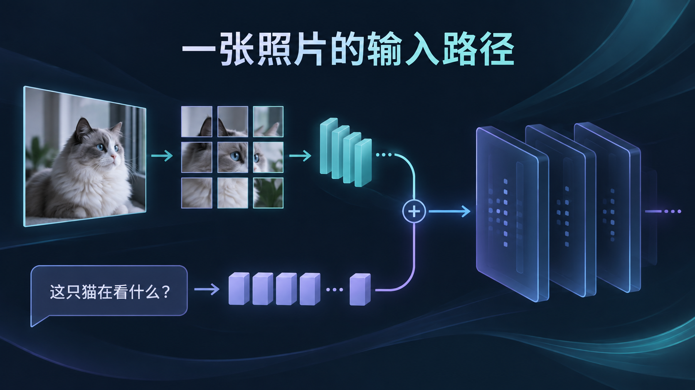
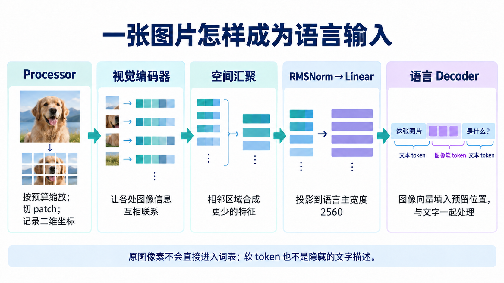
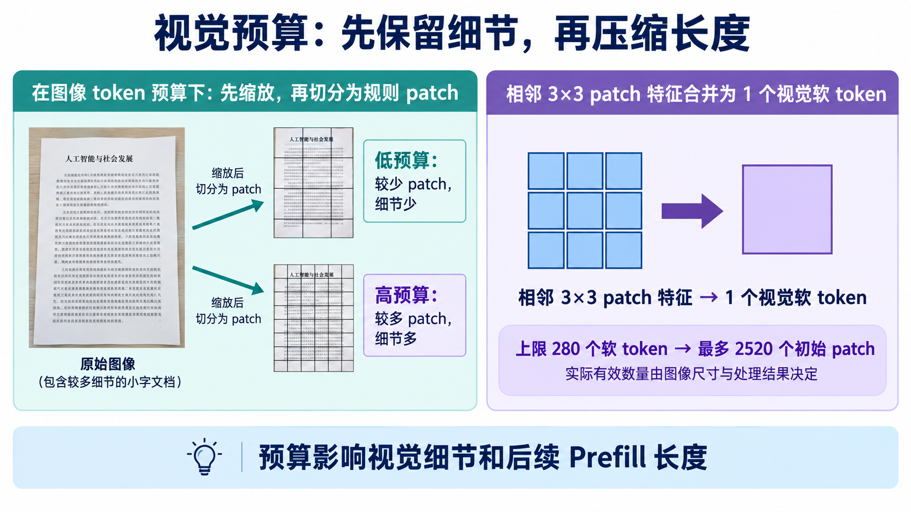

# 视觉输入：照片如何变成软 Token

[系列索引](README.md) · 第 15 期

问模型“这张图片里有什么”，问题中的字可以按普通文本处理，图片却不能直接按字节送进词表。Gemma 4 E4B 先把图片处理成 patch，经视觉编码器提取特征，再将特征变为语言模型主宽度的**视觉软 token**。这些软 token 占据输入序列中的位置，和问题的文字一起进入语言 Decoder。它们是向量，不是模型暗中写出的一段图片说明。

*图 1：E4B 的视觉输入总览。Processor 准备 patch，视觉编码器让各处信息互相关联，空间汇聚缩短序列，RMSNorm 与 Linear 对齐宽度，最后把图像向量填进文字序列预留的位置。图为原理示意，patch 数与软 token 数不代表某张图片的实际输出。*

这条路径里，**图像像素、视觉 patch、编码器特征和语言序列中的软 token 是四种不同的东西**。把它们都叫“图像 token”，很容易误判哪个阶段占内存、哪个阶段增加 Prefill 长度。下面按数据实际经过的顺序看。

## 先把画面变成有位置的 patch

Processor 先根据视觉 token 预算调整图片尺寸，尽量保持原有长宽比，再把它切成规则的 patch。E4B 固定配置中的 patch 边长是 16 个像素。把一张横向照片强行拉成正方形会改变物体形状；保留长宽比，则能让模型看到更接近原图的空间关系。图片越大，不一定原样产生越多 patch：预算会限制处理后的尺寸。

每个 patch 除了像素内容，还要带自己的横向 `x` 和纵向 `y` 坐标。想象猫眼所在的小块：只知道它在展开序列里排第几个，不足以说明它在画面的哪一行、哪一列。视觉编码器会用这两个坐标建立位置表示，再让不同 patch 通过注意力交换信息。这样，一个局部小块可以结合其他位置的画面信息，不必单凭自己的像素判断内容。

同一批图片的 patch 数可能不同。Processor 会把较短的 patch 序列补齐到统一长度，并用 `(-1,-1)` 标记填充位置。填充只是为了批处理对齐，视觉编码和后续汇聚必须识别它；它不该变成一块“真实画面”。这里的二维坐标描述**图片内部**的位置，合流后软 token 在语言序列里的先后位置是另一回事。

## 预算先限制细节，再由汇聚缩短序列

[Google 的视觉说明](https://ai.google.dev/gemma/docs/capabilities/vision)给 Gemma 4 提供 70、140、280、560、1120 五档视觉 token 预算。E4B 的固定配置写的是 `vision_soft_tokens_per_image=280`。这些是可选预算与本篇配置，不是一次处理图片时同时生成五份表示。较高预算允许保留更多细节，例如小字或远处物体；代价是视觉编码器要处理更多 patch，后面的语言 Prefill 也可能变长。

*图 2：同一图片在不同预算下会被处理成不同密度的 patch 网格。视觉编码之后，相邻 `3×3` 的九个 patch 特征汇成一个软 token；`280×9=2520` 说明该预算对应的**初始 patch 上限**，不是每张图片必然产生 2520 个 patch 或 280 个有效软 token。*

关键顺序是**先编码，再汇聚**。视觉编码器让 patch 特征带上周围画面的信息，然后空间汇聚把相邻 `3×3` 的特征合成一个。这样既能在前端看较细的画面，又能减少送往语言 Decoder 的向量数量。E4B 的视觉编码器宽度为 768、层数为 16；这些是视觉前端的规模，不等于语言 Decoder 的输入宽度或层数。

280 档对应最多 `9×280=2520` 个初始 patch，但 Processor 仍会根据原图长宽比、缩放和 patch 网格确定实际有效数量。选择预算时，应先看任务是否需要识别小字、微小物体等细节，再看所能接受的视觉编码与 Prefill 开销。提高预算并不保证回答一定更好。

## 软 token 怎样和文字接上

经过空间汇聚的视觉特征还不能直接当语言主向量使用。E4B 的多模态映射先做 RMSNorm，再通过 Linear 从视觉宽度投影到语言主宽度 2560。这里的“软 token”指已经准备好放进语言输入序列的图像向量；它没有对应的普通词 ID，也不需要先变成自然语言句子。

图文合流的方式也很具体：Processor 根据图片实际产生的软 token 数，在文字输入中安排相应的图像占位槽。模型检查占位槽数量与视觉特征数量一致，再把视觉向量写入这些位置。于是 Decoder 接收的仍是一条统一的主向量序列，只是有些位置来自文本嵌入，有些位置来自图片。比如“这张图片”和“是什么？”之间可以放图像软 token；图片不必被无条件拼在整段文字末尾。数量不一致时应报错，不能悄悄截断。

这也解释了图像为什么会影响资源预算。上传到看见回答之前，可能经历图片解码与预处理、视觉编码、图文 Prefill，随后才是逐 token 的文本生成。视觉前端要占权重和临时工作区；有效软 token 增加语言序列长度，影响 Prefill 和后续上下文占用。估算峰值内存时要看哪些数据在同一阶段同时存在，不能把原图、全部中间特征和 KV Cache 的各自最大值直接相加，也不能只按最终输出字数估算。

本章讨论的是 E4B 的独立视觉编码路径。看懂它，最重要的是分清两个位置系统和两个长度变化：图片内部用 `(x,y)` 保留几何关系；进入语言 Decoder 后，软 token 占据语言序列的位置。预算决定前端能看多细，`3×3` 汇聚决定最终要送入多少视觉向量。下一章沿声音的时间轴看另一条媒体输入链。

资料：[Google Gemma 4 视觉说明](https://ai.google.dev/gemma/docs/capabilities/vision) · [E4B 固定配置](https://huggingface.co/google/gemma-4-E4B-it/blob/ee0ef6023621cff504d758262d4e04895a5af4a2/config.json) · [Transformers Gemma 4 实现](https://github.com/huggingface/transformers/tree/8445b13cd24961e47f25a649fb113580f71a8d11/src/transformers/models/gemma4)
