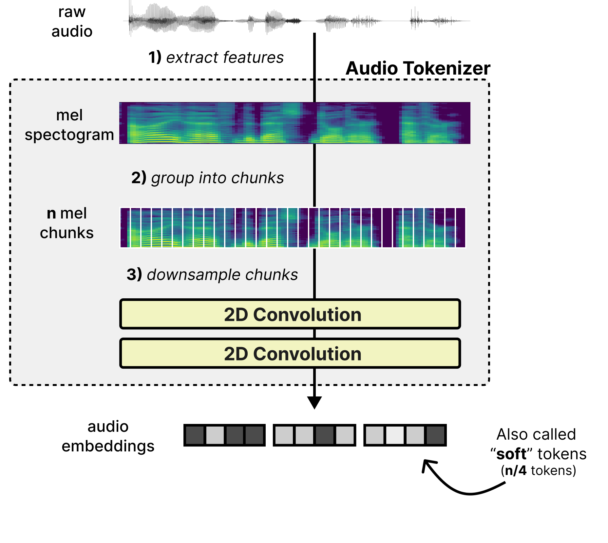
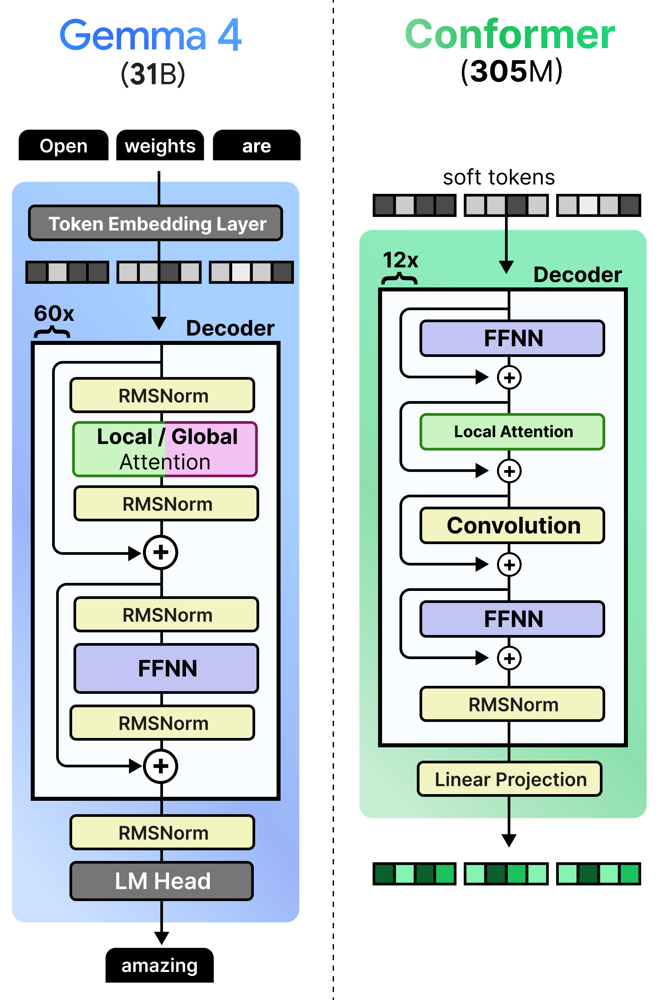
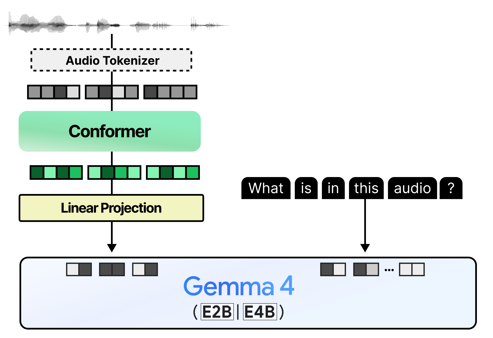

# 听到一句话之前，Gemma 4 先处理了什么

[系列索引](README.md) · 第 16 期

文字输入一开始就是可切分的符号串；音频输入先是一串随时间采样的波形。说话快慢、停顿和片段长度会改变需要处理的时间范围，因此“同样一句话”也不能只按文字 token 数估算。进入 E4B 前，官方处理链要明确采样率、声道、有效时长、特征与 padding；音频编码器再通过下采样、卷积和局部/分块注意力等步骤提取特征，投影为 decoder 可接收的软 token。沿路径追踪长度，比只写“支持音频”更能说明端侧代价：`N_samples → N_frames → N_encoded → S_audio`，每个箭头都可能改变时间分辨率与特征宽度。

## 时间长度怎样变成 token 长度

官方 Gemma 4 特征提取实现的默认采样率为 16 kHz、特征维度 128、步长 10 ms。这三个量分别描述波形采样、每帧特征宽度和帧沿时间轴移动的距离，不能互相当成 token 数。若只做一个粗略直觉：一秒原始波形约 16000 个单声道采样点，以 10 ms 步长产生的特征帧数量约在百帧量级；实际帧数还受窗口长度、边界 padding 和处理器配置影响，不能把“100 帧”当固定公式。音频编码器进一步下采样，进入 decoder 的软 token 数需要按固定 processor 与具体长度计算。

这些特征帧可排成一张“横轴为时间、纵轴为频率带”的梅尔频谱。它仍是连续数值，不是文字词表 ID。编码器先把相邻时间片组织起来，用卷积缩短长度，再让 Conformer 风格的模块结合注意力与卷积提取时序上下文。卷积使局部声学模式容易被识别，注意力则让当前片段参考邻近片段；两者输出仍是音频特征，之后才投影到语言主宽度。

*图 38：波形经梅尔特征与下采样形成音频软 token；频谱是作者示例录音。*

音频编码器继续把局部声学模式与较长时间的上下文结合，输出仍是连续特征。

*图 39：Conformer 风格的音频编码器结合卷积和注意力。*

这一路与图像相似之处是最终都投影到文本主宽度；不同之处是音频有持续时间、帧边界和可能的分块上下文。若只比较最终 `S_audio`，会漏掉特征提取、编码器卷积与注意力的工作量。端侧若要求低延迟，还要问是否必须等完整语音结束才能开始回答，这属于任务流程和运行时设计，不能由模型名直接推断。

## 从特征帧到语言槽位，长度为何连续变化

音频输入在模型接口处是 `input_features`，还配有 `input_features_mask` 表示有效部分。官方音频塔先用卷积投影下采样，再构造相对位置表示；音频层使用带左右上下文的局部注意力，内部 mask 会改排成 `[B,1,num_blocks,chunk_size,context_size]` 的分块形状。最后输出投影得到音频软 token 特征。这里的“左右上下文”属于音频 encoder，对已知音频做编码；它不能被误画成语言 decoder 在生成未来文本时偷看未来 token。

`get_audio_features` 之后，跨模态投影将音频特征转为 2560 维。官方前向先用 encoder 返回的有效位 mask 去掉 padding，再检查有效音频软 token 数是否与文字序列里的音频占位槽一致，最后 `masked_scatter` 填入主向量。于是有至少三种长度需要记录：原始采样点数、特征/编码器帧数、占用 decoder 位置的有效软 token 数。音频越长，这些数通常一起增长，但并非简单一比一；缺少固定样本和 processor 参数时，不应编造精确换算率。

这三种长度也对应不同的硬件账：波形和特征帧决定输入缓冲与音频塔的临时工作区，编码后的有效软 token 决定语言 Prefill 增加多少位置；若音频按块处理，还要保留块间所需的状态。哪些缓冲同时存在，应沿处理时间线计算峰值，不能把音频文件大小直接当作 decoder 的 KV Cache，也不能只数最终软 token 来估算整段语音的内存。

*图 40：音频编码特征投影到语言模型宽度并占据输入槽位。*

在端侧，一段语音的总等待可拆成采集与预处理、音频编码、语言 Prefill、首 token 选择和后续 Decode。若要判断是否能实时处理，应明确音频是否整段到齐、处理是否按块运行以及第一段可用输出的时间；只用文本 token/s 无法回答这个问题。

E4B 可用于语音输入的理解并输出文本，例如转写、翻译或基于语音内容回答。它并不是原生把回答生成为可播放波形；若产品要语音回答，还需另一个文本转语音环节。音频输入处理时间、看到首个文本 token 的时间、持续文本生成的速率，也应分开量。宣称“实时对话”还需要流式切块、状态管理与端到端延迟证据，不能仅由模型支持音频推出。

图像和音频扩展了工作负载，但最后都回到资源问题：它们与文本生成一起运行时，设备能否持续提供足够的算力、带宽和电力？

图源：[Maarten Grootendorst，《A Visual Guide to Gemma 4》](https://newsletter.maartengrootendorst.com/p/a-visual-guide-to-gemma-4)。

资料：[Google Gemma 4 模型卡](https://ai.google.dev/gemma/docs/core/model_card_4) · [E4B 固定配置](https://huggingface.co/google/gemma-4-E4B-it/blob/ee0ef6023621cff504d758262d4e04895a5af4a2/config.json) · [Transformers Gemma 4 源码](https://github.com/huggingface/transformers/tree/8445b13cd24961e47f25a649fb113580f71a8d11/src/transformers/models/gemma4)
