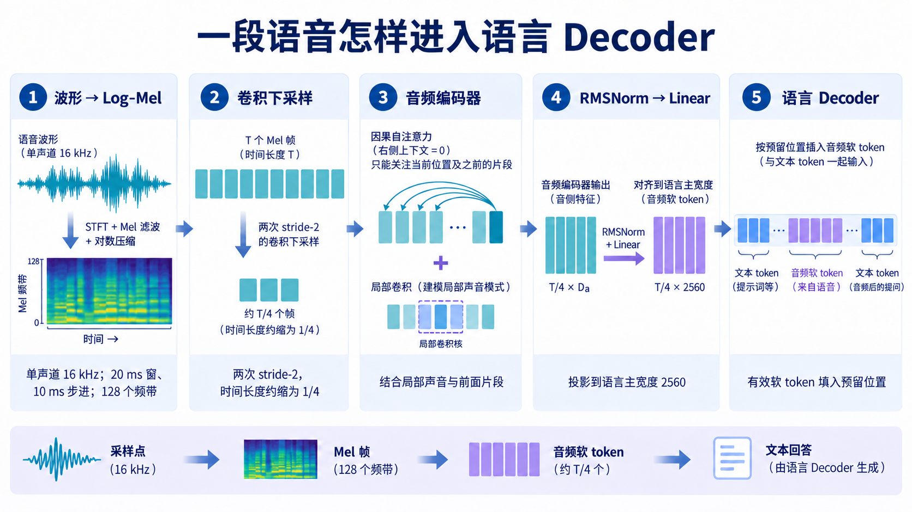
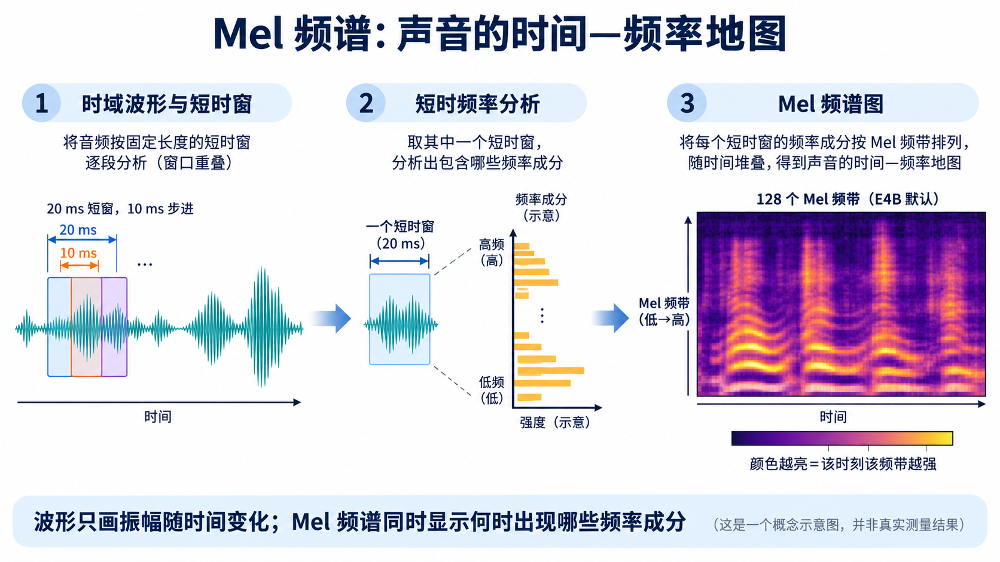

# 音频输入：波形如何变成软 Token

[系列索引](README.md) · 第 16 期

给 E4B 一段语音并问“他说了什么？”，模型收到的不是现成文字。录音首先是一条随时间变化的波形；同一句话说得快慢不同，波形长度也不同。E4B 先把波形变成 **Mel 频谱**，再压缩时间长度、提取声学特征，最后将特征作为音频软 token 放进语言输入序列。文字回答由语言 Decoder 生成。看清每一步，才能分辨录音时长、音频前端工作量和语言 Prefill 长度各由什么决定。

*图 1：E4B 音频输入的主路径。横向看每一步改变了什么：波形变为随时间排列的频带特征，卷积减少时间帧数，编码器结合局部声音与先前片段，最后投影并填入语言序列。图中的波形与频谱都是原理示意，不是某段录音的实测结果；`T/4` 表示两次 stride-2 下采样后的近似长度，实际有效数由边界与 mask 决定。*

## Mel 频谱为什么在最前面

波形图的横轴是时间、纵轴是振幅。它能告诉我们什么时候有声音、强弱如何变化，却不能直接让人看出同一时刻有哪些频率成分。语音里，元音的共振峰、擦音的高频能量以及停顿，在频率随时间变化的图上更容易区分。**Mel spectrogram（梅尔频谱）就是一种音频特有的时频分析表示**：沿时间切出一系列短窗，分析每个短窗包含哪些频率，再按 Mel 频带汇总，把结果排成“时间 × 频带”的二维数值图。

*图 2：先用相互重叠的短窗观察波形，再计算各窗的频率成分，并用 Mel 滤波器组汇成频带强度。横向是时间，纵向是从低到高的 Mel 频带，颜色表示强弱。这是机制示意，不是录音测量图，也不是语音转写结果。*

在本篇核对的特征提取实现中，输入采用单声道 16 kHz 采样；每个分析窗长 20 ms，每隔 10 ms 向前移动一次，所以相邻窗有重叠。每窗先经过短时傅里叶变换得到频率成分，再用 128 个 Mel 滤波器汇成 128 维特征，并取对数。Mel 频带在低频区域分得更细，贴近人对音高差异的感知；取对数则压缩很强与很弱的数值差距。它保留了“什么频率在什么时候较强”，但丢掉了部分原始波形信息，不能把它当作文字，也不能把这张图当作原始声音的无损复制。

10 ms 是帧沿时间轴前进的步长，意味着一秒语音通常形成百帧量级的 Mel 特征；这不是“一秒已经变成 100 个语言 token”。帧数还受窗口边界、填充和有效时长影响。处理器同时给出 `input_features_mask`，标记哪些帧来自有效音频，防止补齐批次长度的部分被当作语音内容。

## 音频编码器先缩短时间，再理解片段

Mel 频谱仍是一串密集的数值帧。E4B 音频塔先用两层时间步长为 2 的卷积做下采样：直观上，每经过一层，时间位置约减半，两层之后约为原来的四分之一。这个动作降低后续编码器要处理的序列长度；卷积同时提取邻近帧的局部声学模式，并非单纯扔掉每四帧中的三帧。

随后，音频编码器的注意力让当前编码位置参考此前有限范围的片段，局部卷积继续捕捉相邻声音的变化。固定 E4B 配置的音频注意力右侧上下文为 0，因此不能把这一路画成“当前片段直接读取后续片段”的双向窗口。编码器输出仍是连续的**音频特征**，不是识别后的文字。前面的时间缩短解释了 [Google 音频说明](https://ai.google.dev/gemma/docs/capabilities/audio)中“一秒约 25 个音频 token”的量级：10 ms 一帧约为每秒 100 帧，再经过约四倍时间下采样。准确的有效 token 数仍要由这段录音的处理结果与 mask 确定。

## 音频软 token 怎样进入文字序列

音频塔输出特征后，多模态映射先做 RMSNorm，再用 Linear 投影到 E4B 语言主宽度 2560。处理器预先在输入中留出与有效音频软 token 数对应的槽位；模型剔除 padding 对应的编码输出，检查特征数量和槽位数量一致，然后将向量写入这些位置。这样，语言 Decoder 读取的仍是一条统一的输入序列，只是其中一段位置来自音频，其他位置来自提示文字。音频软 token 不是词表中一串被“听写”出来的词。

沿整条链至少要分别数三个长度：原始波形的采样点、Mel 特征帧、最终占据语言序列位置的有效音频软 token。波形和 Mel 帧影响输入缓冲与音频塔临时工作区；软 token 增加语言 Prefill 的长度，并可能影响后续上下文和 KV Cache。只按录音文件大小估算 Decoder 内存，或者只按最后的软 token 数估算整个音频前端，都会漏掉一部分工作。

对用户而言，等待时间还包含采集与预处理、音频编码、语言 Prefill 和逐 token 文本生成。官方说明给出单段音频最长 30 秒的使用边界；能否边听边答，还取决于产品是否按块处理音频、如何维护状态以及何时开始输出，不能仅由模型支持音频输入推出。E4B 在这里生成的是文本回答；如果要播放语音回复，还需要另外的语音合成环节。

和上一章的图片路径相比，音频最特别的是**时间轴一直在推进**。Mel 频谱让声音的频率结构显现，卷积让密集帧变短，编码器把局部声学线索连起来，软 token 再把这些结果交给语言模型。下一步评估端侧实现，就要把音频前端、语言模型和持续运行时的带宽与功耗放到同一条时间线上。

资料：[Google Gemma 4 音频说明](https://ai.google.dev/gemma/docs/capabilities/audio) · [E4B 固定配置](https://huggingface.co/google/gemma-4-E4B-it/blob/ee0ef6023621cff504d758262d4e04895a5af4a2/config.json) · [Transformers 音频特征提取](https://github.com/huggingface/transformers/blob/8445b13cd24961e47f25a649fb113580f71a8d11/src/transformers/models/gemma4/feature_extraction_gemma4.py) · [Transformers Gemma 4 实现](https://github.com/huggingface/transformers/tree/8445b13cd24961e47f25a649fb113580f71a8d11/src/transformers/models/gemma4)
