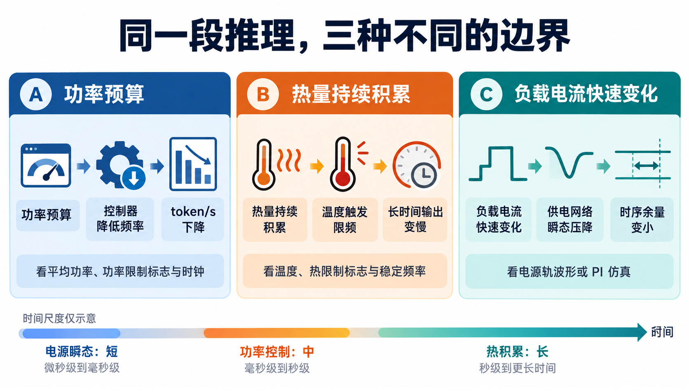
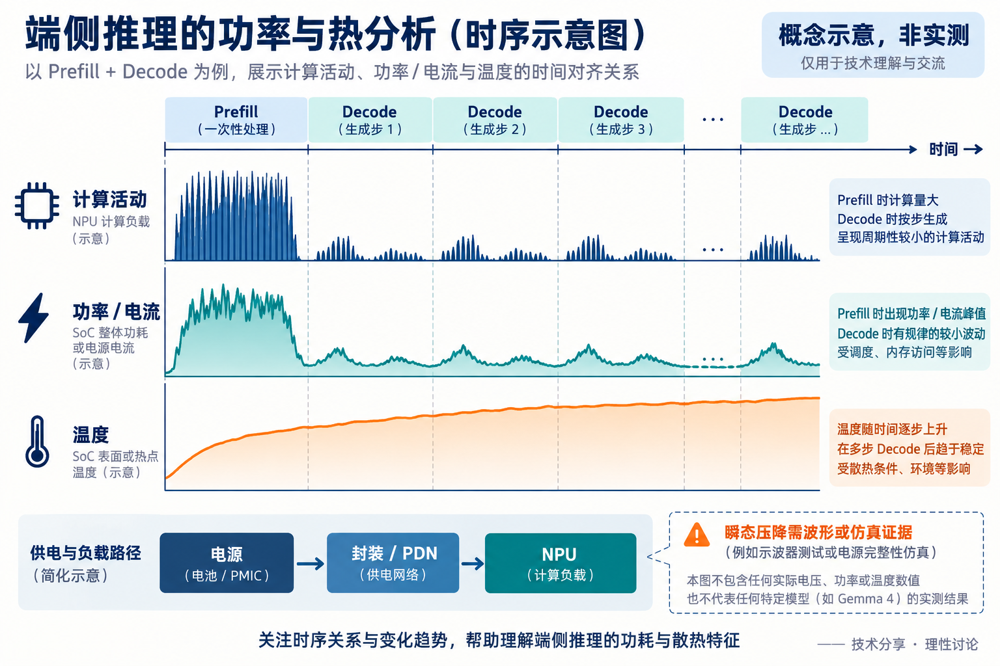

# 功耗、散热与供电：端侧推理为什么会越跑越慢

[系列索引](README.md) · 第 17 期

一台设备刚开始生成时很快，连续运行后每秒输出的 token 却变少了。模型权重没有变，算法也没有变，问题可能出在设备允许它以多高的频率持续工作。前面章节算出的乘加量、权重读取量和 KV Cache 容量，到了真实设备上，还要经过三道边界：**可用功率、排热能力、瞬态供电**。它们影响推理的方式不同，需要分开看。

*图 1：原创概念示意。功率限制和温度限制都可能使控制器降频；供电压降首先改变的是电路时序余量，是否进一步影响频率或可见性能取决于具体硬件。下方时间尺度只表示相对快慢，不是本系列的测量结果。*

## 功耗：忙起来的单元与搬运的数据都要用电

Prefill 一次处理整段输入，矩阵单元可能在一段时间内持续工作；Decode 每步通常只生成一个 token，反复读取权重和历史 KV。于是两阶段的计算单元活动、片上数据移动和外部内存访问不同，功率曲线也未必相同。不能只用“运算次数更多”判断哪一段功率更高：实际还受实现方式、频率、电压、内存系统和并发任务影响。

电路切换带来的动态功耗可用 `P_dynamic ∝ 活动率 × 电容 × 电压² × 频率` 理解；静态漏电和内存、互连、其他系统部件也消耗功率。[Arm 的 SoC 功耗白皮书](https://community.arm.com/cfs-file/__key/telligent-evolution-components-attachments/01-1998-00-00-00-00-68-16/White-Paper_2D00_-Strategic-Analog-Power-Management-IP-for-Systems-on-a-Chip.pdf)给出了这一基本关系。提高频率常常还需要更高电压，因此“再加一点频率”可能带来不成比例的功耗增加。反过来，降频省下的功率能否换成更少的任务能量，仍取决于运行时间和静态功耗。

功率是某个时刻消耗能量的速度；一次请求消耗的能量是这段时间功率的积分 `E=∫P(t)dt`。两个实现即使峰值功率相同，完成时间不同，每次请求的能量也会不同。评价端侧体验至少应把首 token 延迟、持续输出速度和每次请求能量分开报；“每 token 能量”还要写清分母是输出 token，还是输入加输出 token。

## 散热：短跑时允许的频率，不一定能一直保持

功耗最终大多变成热。芯片、封装和机身不会瞬间达到稳定温度；热量先积累，再沿散热路径传给环境。[TI 对热动态的说明](https://www.ti.com/video/6243719539001)用热阻和热容解释这种延迟。于是冷机的一次短请求可能跑在较高频率，持续生成、多轮对话或后台负载叠加后，温度才接近设备的限制条件。

达到功率预算或温度限制时，设备可能调低频率。两种情况在用户眼里都可能表现为 token/s 下降，但原因和改进办法不同：功率受限时应看供电模式与功率上限；热受限时应看稳态温度、环境温度和散热路径。[NVIDIA 的推理性能指南](https://developer.nvidia.com/docs/drive/drive-os/7.0.3/public/drive-os-tensorrt-developer-guide/best-practices.html)也将功率限频与热限频分开，并要求把频率、功率和温度与负载同时记录。这里引用的是通用硬件机制，不代表 Gemma 4 已在某块芯片上触发限频。

*图 2：原有概念时间线，非 Gemma 4 实测。它示范如何把推理阶段与功率、温度记录对齐；曲线的高度、波形和温升趋势都不能套用到具体设备。图下方的供电路径引出下一节的更快时间尺度。*

图 2 中的温度缓慢上升只是典型情形之一。实际采样时，要把请求到达、Prefill 起止、首 token、连续 Decode、频率、功率和温度放在同一时钟轴上。先比较冷机与热稳态的 token/s，再查相同时间段的频率及限制标志；仅看到“越跑越慢”，还不能断言就是热限频。内存带宽、并发调度或输入长度变化也可能造成类似现象。

## 供电完整性：平均功率正常，也可能有瞬时压降

功率计显示的平均瓦数，回答不了电源轨在负载突变瞬间是否稳住。NPU 从空闲进入密集计算，电流可能迅速上升。电池或适配器、PMIC、板级走线、封装与片上供电网络共同把电流送到运算单元；这条路径存在阻抗，调压器也需要时间响应。去耦电容可在短时间提供电荷，但局部电压仍可能出现下探。[TI 的处理器 PDN 指南](https://www.ti.com/lit/an/sprac76g/sprac76g.pdf)把负载瞬态、供电阻抗和电压波动联系起来。

电压下探会减少晶体管切换的时序余量。它首先是供电完整性（Power Integrity，PI）问题，不能把它直接等同于热限频，也不能从 Attention 的计算量推算出“会掉多少毫伏”。判断风险需要负载电流波形、电源轨探测或包含板级、封装和片上的 PDN 仿真；慢速功率或温度记录不足以证明瞬态压降。若看到系统保护或频率变化，还要用硬件事件记录确定它与压降的关系。

## 怎样把模型分析变成可验证的设备结论

先固定同一套任务和运行条件：模型与量化版本、输入/输出 token 数、是否有图像或音频、batch、并发、环境温度和设备电源模式。接着记录三组同步信息：推理阶段与 token 时间戳；设备的功率、频率、温度及限制标志；若要讨论 PI，再加足够带宽的供电波形或可信仿真。板级总功率和芯片单元功率不是同一个量，测量位置必须注明。

这样才能区分几种容易混淆的结论：峰值 TOPS 说明算力上限，不说明稳态 token/s；平均瓦数不能说明瞬态压降；温度升高不自动证明性能下降由热限频造成。若想改善持续输出，先定位限制来自哪里，再决定是减少数据搬运、调整频率电压、改善散热，还是处理供电网络。第 18 期再把同一套核算方法带到 Gemma 4 的其他型号；本章没有给出某款设备的功耗、温升或电压实测值。

资料：[Arm：SoC 功耗组成](https://community.arm.com/cfs-file/__key/telligent-evolution-components-attachments/01-1998-00-00-00-00-68-16/White-Paper_2D00_-Strategic-Analog-Power-Management-IP-for-Systems-on-a-Chip.pdf) · [TI：热动态](https://www.ti.com/video/6243719539001) · [TI：处理器供电网络](https://www.ti.com/lit/an/sprac76g/sprac76g.pdf) · [NVIDIA：推理时的功率与热限制](https://developer.nvidia.com/docs/drive/drive-os/7.0.3/public/drive-os-tensorrt-developer-guide/best-practices.html)
