# 换个 Gemma 4 型号，前面的账还算数吗

[系列索引](README.md) · 第 18 期

E4B 的 42 层、PLE、局部与全局注意力，已经能让我们算出一套具体的张量和资源账。到选型时却不能把这张账直接乘一个比例套在其他型号上：Gemma 4 是家族，各成员的参数口径与媒体前端都可能不同。Google 模型卡列出 E2B、E4B、12B Unified、26B A4B MoE 和 31B Dense。读参数名时先问“总参数、有效参数还是每 token 激活参数”，再问媒体前端、层数、窗口和上下文配置，不能只按名字里的 B 排硬件资源。

| 型号 | 官方参数口径 | 本系列要重新核算的差异 |
| --- | --- | --- |
| E2B | 约 2.3B effective，含 embedding 约 5.1B | PLE、层数与完整权重容量 |
| E4B | 约 4.5B effective，含 embedding 约 8B | 本系列贯穿案例 |
| 12B Unified | 约 11.95B 总参数 | 无独立视觉/音频编码器的媒体输入路径 |
| 26B A4B MoE | 约 25.2B 总参数、约 3.8B 激活参数 | 专家路由、权重驻留与不规则访问 |
| 31B Dense | 约 30.7B 总参数 | 稠密权重、计算与更大容量 |

## 型号名字背后是不同的计算路径

先看家族规模和结构分野，再决定能否沿用 E4B 的资源账。

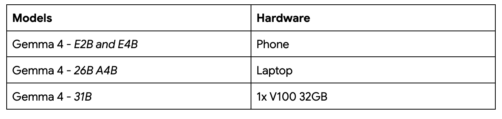

*图 02：原文发布时的四型号规模对照；本系列另含后来加入的 12B Unified。*

稠密模型的主要权重会沿同一计算路径工作；MoE 则在部分计算中按 token 选择专家。图中的“模型大小”因此不能直接读成每步乘加量。

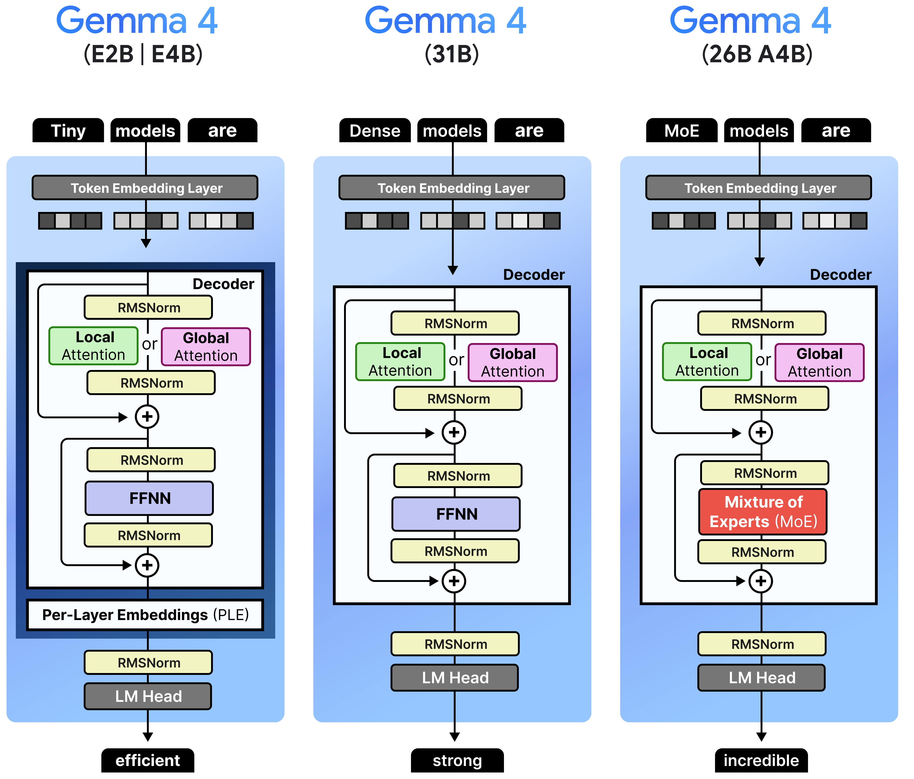

*图 03：稠密模型与 MoE 的权重使用方式不同。*

媒体前端也不能只按参数名推断。E2B/E4B 具有独立视觉与音频路径；31B 可读图，但不沿 E4B 的音频输入路径。

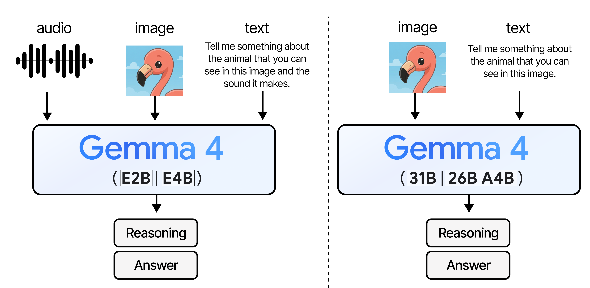

*图 04：小型号可接收文字、图像与音频输入。*

E2B/E4B 还把逐层嵌入接入文本主干。下图有助于比较 35 层与 42 层以及局部、全局层的节奏；它把 PLE 画在 decoder 小框之外，仅是概览分组。单层的真实执行顺序见第 04 期：Attention、MLP、PLE 都在同一 decoder 层内。

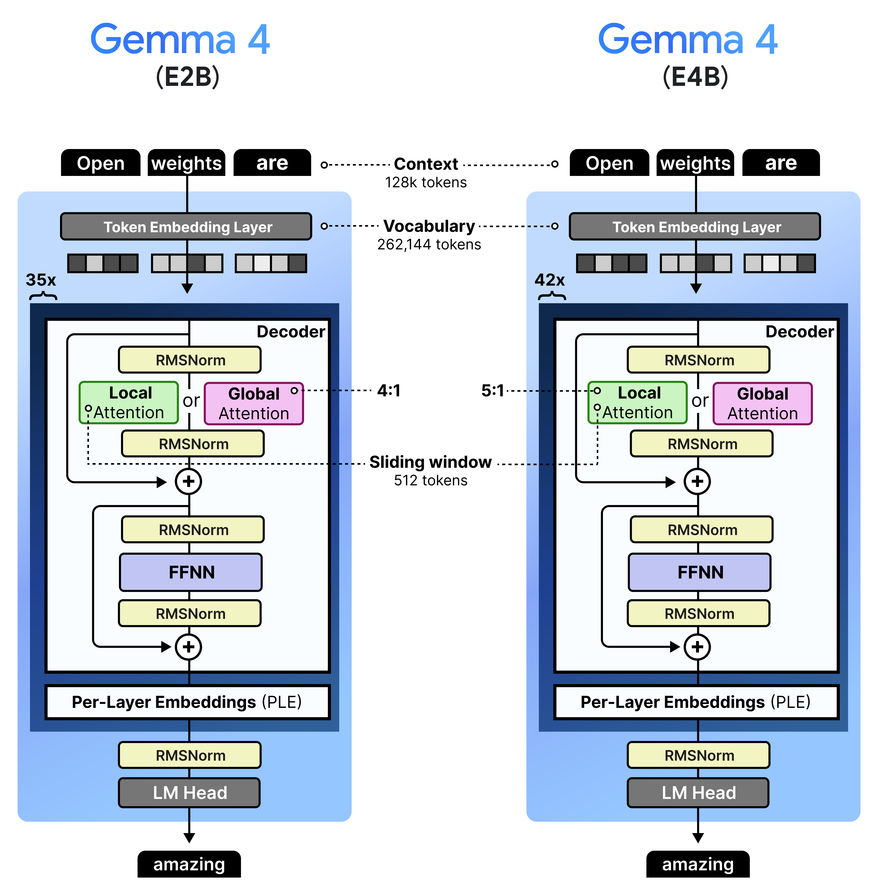

*图 33：E2B 与 E4B 的家族概览；PLE 的框外画法不代表层外执行。*

把注意力、前馈或专家、视觉编码三条线叠起来，能看出系列共享的骨架。不过 12B Unified 后来加入家族，不能被这张早期图涵盖。

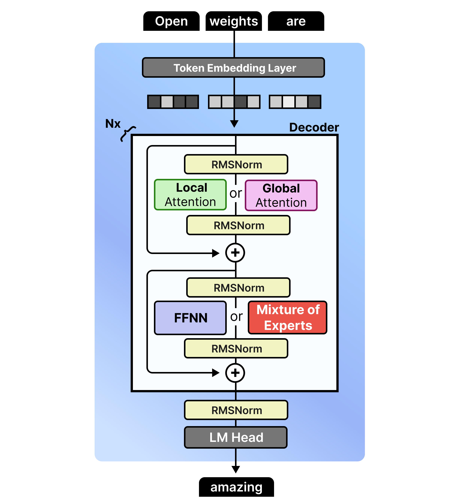

*图 27：家族共同结构的早期汇总；12B Unified 不适用“独立视觉编码器”画法。*

## 26B A4B：计算稀疏，权重仍要可访问

MoE 的“每 token 只激活一部分专家”能减少当步某些计算，却不意味着设备只需保存激活的那部分权重。它改变的是每枚 token 访问哪些专家矩阵；完整模型仍包含其余专家参数。若要快速处理后续 token，未激活专家的权重也要有可访问的存放方式；路由还会改变访问规律。

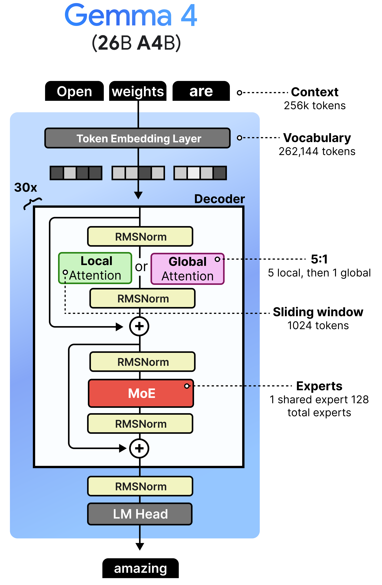

*图 29：总参数与当步激活参数描述不同的资源问题。*

26B A4B 的固定配置给出 128 个可选专家、每枚 token 选 8 个。Router 先为专家打分并选出 top-8，选中的专家各自处理当前向量，输出按路由权重合并。源码还保留一条每次都会运行的普通 MLP 支路，再把它与专家支路合并；原文说“每层要么 FFNN、要么 MoE”会漏掉这条共享计算。因此“8/128”只描述可选专家的稀疏激活，不能理解为这一层只算 8 个 FFNN，也不能据此推断速度必然与稠密 4B 相同。[26B A4B 官方配置](https://huggingface.co/google/gemma-4-26B-A4B-it/blob/47b6801/config.json)与固定版本源码共同给出这条更精确的路径。

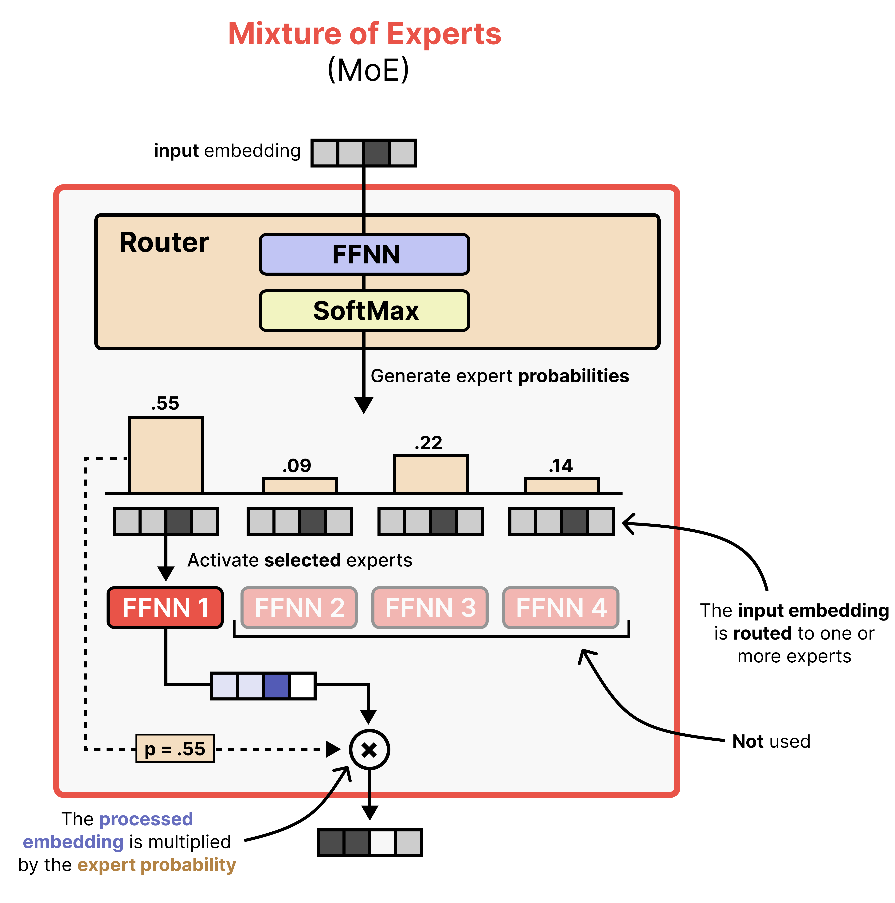

*图 30：Router 选专家并按权重汇合输出。*

原文把常运行的共享支路解释为承载较通用的知识，把按 token 选择的专家解释为更专门的加工；这是一种理解路由用途的直觉，不是能从单次推理读出的专家语义标签。其示意图还给共享支路画出约为单个路由专家三倍的中间宽度；在该配置中普通 MLP 的 `intermediate_size=2112`、路由专家的 `moe_intermediate_size=704`，恰好是 3:1。硬件上应分别统计这条常运行支路和八条被选专家的乘加与读权重。

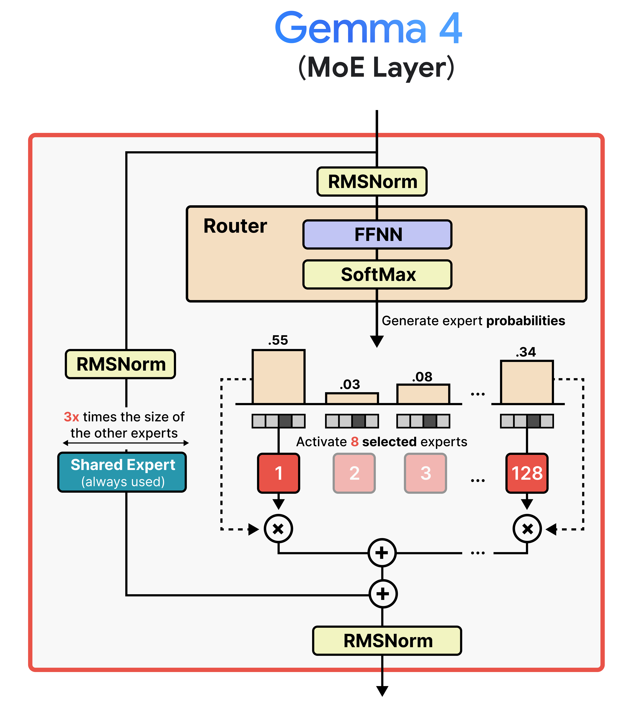

*图 31：常运行 MLP 与被选专家共同产生这一层的更新。*

一个 token 只访问 128 个路由专家中的 8 个，并不等于其余权重从设备容量预算里消失。路由选择还可能随下一个 token 改变。

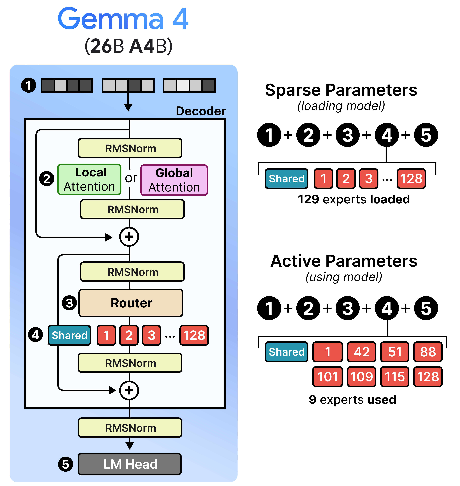

*图 32：128 个候选专家中每 token 激活 8 个；总权重仍需可访问。*

## 31B Dense：不能把 E4B 的层图放大

31B 则是稠密的大型号。它和 E4B 都有局部/全局层交错，但没有把 E4B 的 PLE 路径直接复制过去；31B 的层数、主宽度和视觉前端也要重新读配置。原文拿它与 Gemma 3 的 27B 作比较，是为了说明 Gemma 4 延续混合注意力，同时改变全局层的一些细节。对端侧选型，重要的是把具体配置带进权重、KV 与计算三张账，而不是把“稠密”当成与小型号只有参数倍数之差。

原文还用 31B 的 60 层与 Gemma 3 27B 的 62 层比较“更少层、更宽”的取舍，并把小型号与大型号的视觉编码器粗分为约 150M 与约 550M 参数。它们用于提醒：媒体前端本身也占权重与计算，不能仅凭文本 decoder 的参数口径比较多模态端侧成本。当前系列的详细张量账仍只针对固定 E4B；跨型号的视觉参数、层宽和预处理应在选定各自的官方版本后重新核算。12B Unified 更不能套用“每个型号都有独立视觉编码器”的旧总览图。

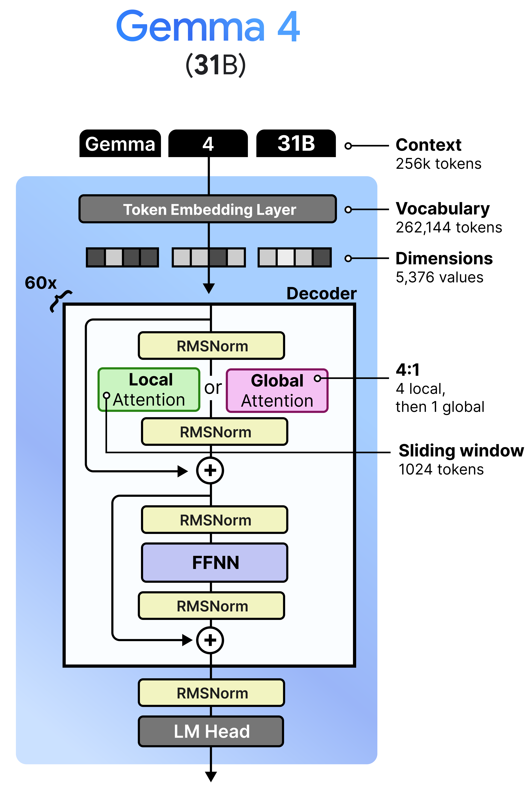

*图 28：31B Dense 的原文结构总览；层数与宽度按该型号核算。*

## MTP：目标模型少跑几次，要付出什么

Gemma 4 的配套 draft model 可用于推测解码：小 drafter 逐个提出候选，目标模型随后在一次前向中验证多个位置。按 [Google 的 MTP 说明](https://ai.google.dev/gemma/docs/mtp/overview)，配套 drafter 可复用目标模型的输入 Embedding，并利用目标末层激活；E2B/E4B 的 drafter 还可先筛选词表簇，减少输出头要逐项评分的候选。实际部署却多了一套小模型权重、状态与调度，不能把“主模型单步少跑几次”直接换算为端到端提速；MoE 的候选验证还可能触发不同专家，batch=1 时尤其需要实测。这是生成程序选择启用的额外路径，不属于第 04 期单个 decoder 层。

这一流程里，小 drafter 仍是自回归的：它顺序提出多枚候选，目标模型在一次前向中并行检查这些候选；若中途拒绝，只保留此前连续接受的前缀，丢弃后续猜测，再由目标模型给出替代 token。若全部接受，目标模型还可给出下一枚 token。正确的推测解码实现需要按目标模型的分布执行接受与修正；原图的“同意/不同意”只是直观讲法，不等于任意 greedy 比较都能保证同样的采样分布。

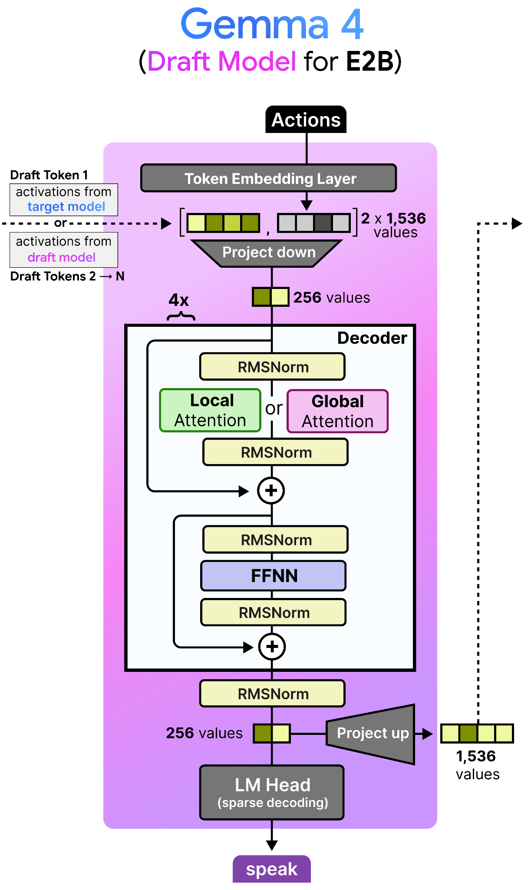

*图 41：MTP 用小 drafter 预先提出候选，再由目标模型验证。*

草稿模型仍按顺序生成，所以候选越多，草稿本身的耗时也越长。

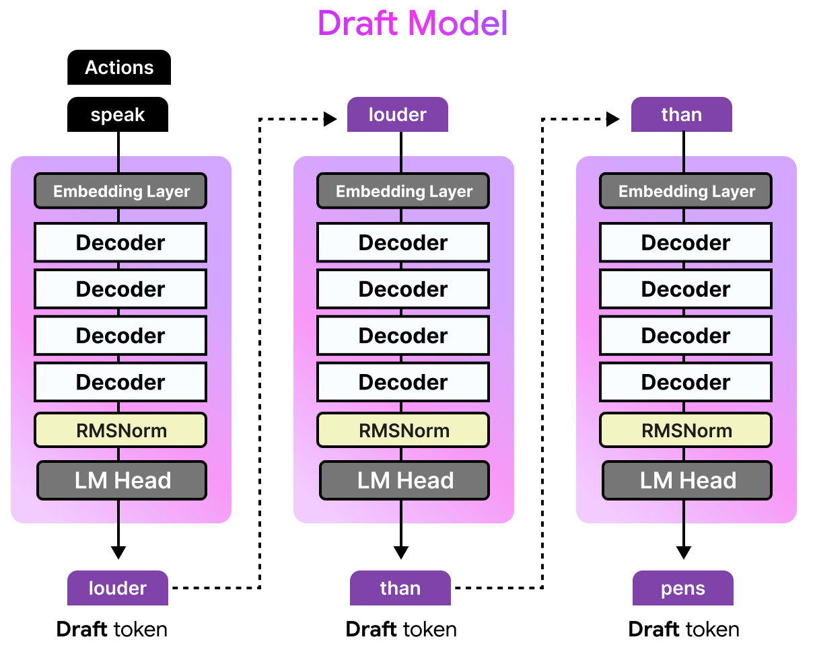

*图 42：小模型逐步提出一串候选 token。*

目标模型把这串已知候选作为输入，一次前向检查多个位置。

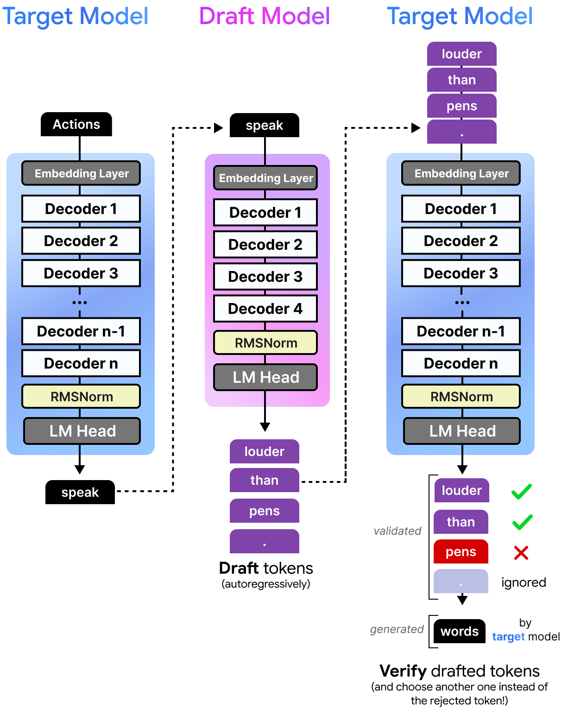

*图 43：目标模型并行检查候选，并接受连续匹配前缀。*

遇到第一个拒绝位置后，后续草稿失去有效前缀条件，需要丢弃；目标模型会在拒绝处给出替代 token。

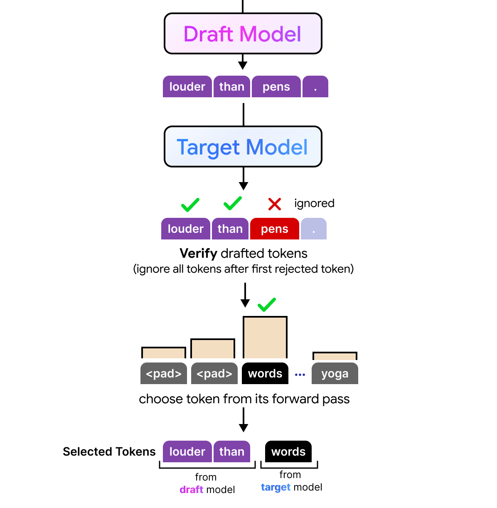

*图 44：拒绝位置之后的草稿不再采用。*

把草稿与验证画在同一条时间线上，可以看见节省的目标前向和新增的草稿前向各发生在哪里。

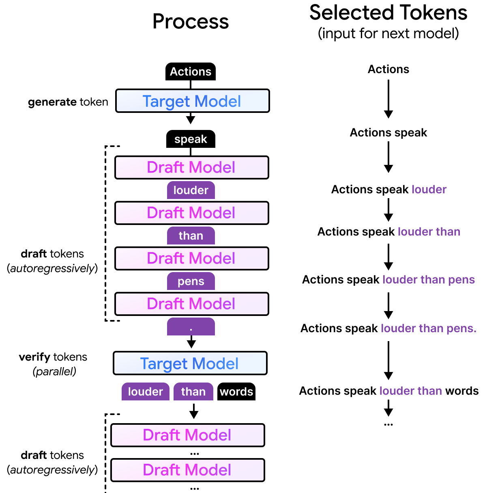

*图 45：草稿顺序生成与目标并行验证的完整时间关系。*

一次草稿得越长，全部被接受时节省的目标前向机会越多；若早早拒绝，后面的草稿计算就白做了。因此评测需同时记录候选长度、接受率、目标验证时间与 drafter 时间，不能只数目标模型少跑了几步。

Gemma 4 drafter 的加速点分别落在输入、上下文和输出头：首次启动时把目标模型末层激活与共享 Embedding 得到的 token 向量合并并降维；后续草稿步复用 drafter 自己刚算出的状态；注意力可借用目标模型已算好的 KV，而不用独自重做完整提示词缓存；E2B/E4B 的高效输出头先算词簇分数，再在选中簇里细算 token。原文给 E2B drafter 的约 76M 参数、4 层和 256 维内部宽度是**该型号示例**，不能作为 E4B drafter 的固定规格。共享权重和 KV 会降低重复工作，也使两模型的设备放置与同步成本成为延迟分析的一部分。

### 输入端：利用目标状态

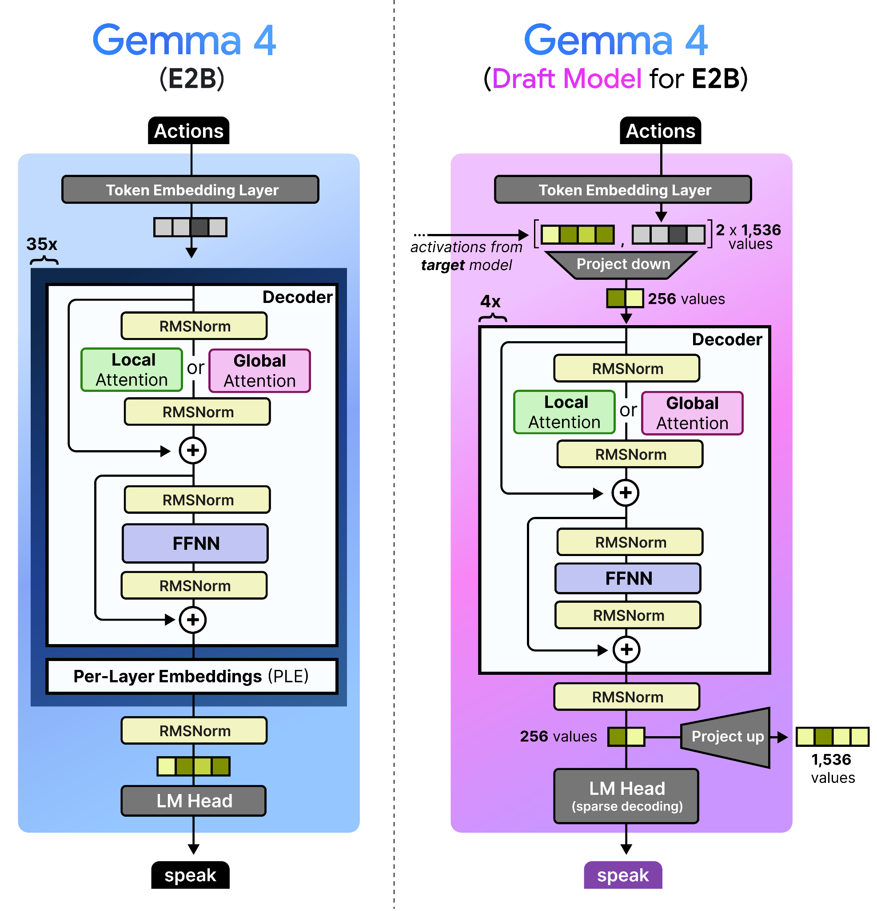

*图 46：E2B 目标模型与小型 drafter 的结构对照；尺寸不套用到 E4B。*

首次草稿步可以利用目标模型已算出的末层状态。

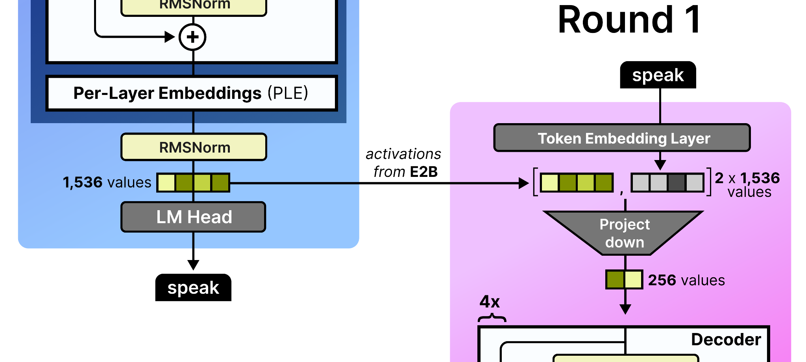

*图 47：目标末层激活与共享 token Embedding 合并后降维。*

后续草稿步则接续 drafter 自己的状态，不必再要求目标模型先产生新激活。

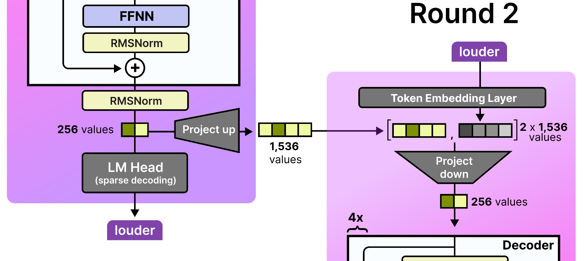

*图 48：drafter 后续轮次复用自身状态。*

目标模型已经建立的 KV 也可供 drafter 的注意力使用，减少重复计算前缀。

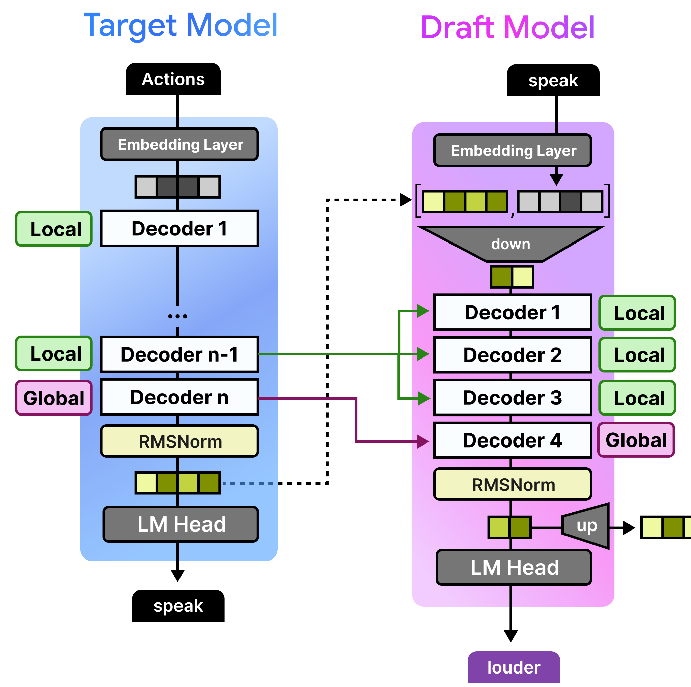

*图 49：drafter 复用目标模型 KV 的原文示意。*

### 输出端：先选词簇，再选 token

输出头原本要为整个词表计算分数；对很小的 drafter，这一项也可能成为明显开销。

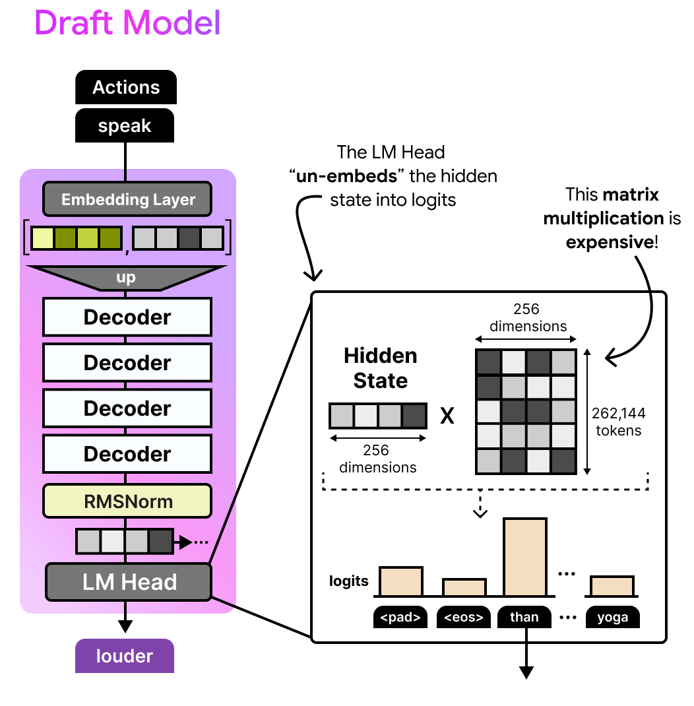

*图 50：完整词表输出头的计算范围。*

高效输出头先找有希望的词簇，再只计算选中簇内的 token。

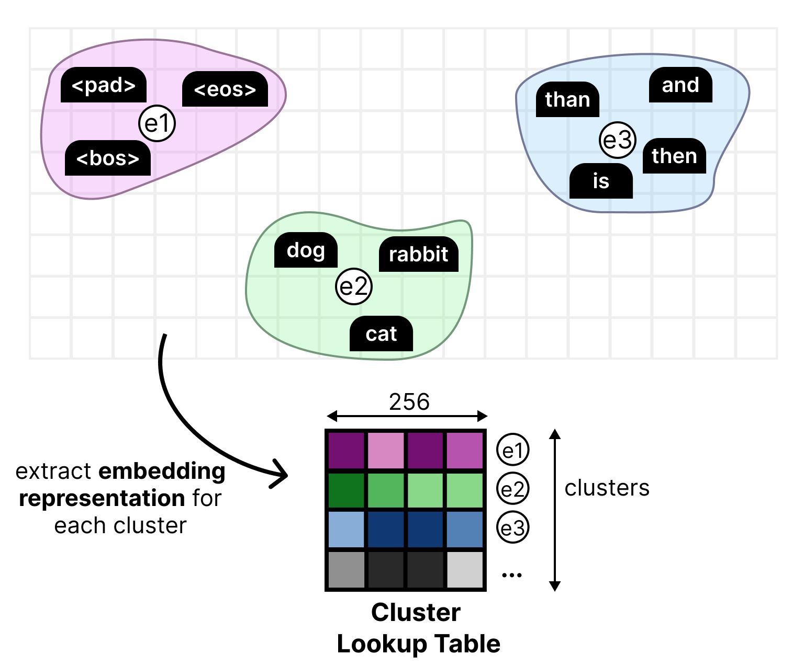

*图 51：词表 Embedding 被组织成簇及簇代表。*

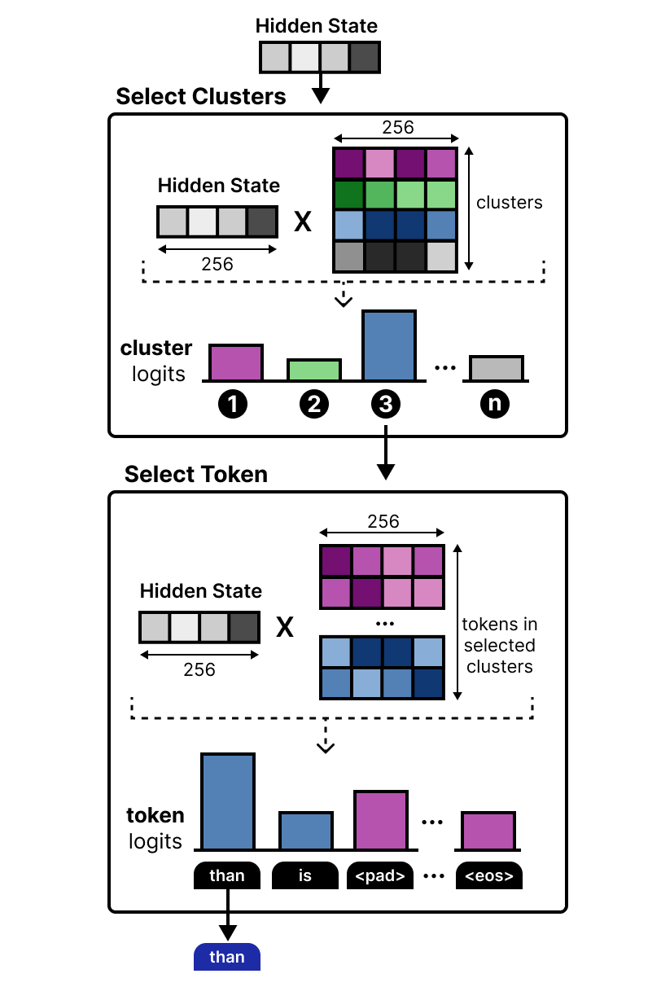

*图 52：先对簇打分，再对选中簇内的 token 打分。*

## 选型时先问工作负载，再看名字

若目标是单用户、短文本、严格内存预算，首先核算的是完整权重文件、运行时 KV 与首 token 延迟，而不是只选名字最小的一项。若任务包含图像和语音输入，媒体处理路径和端到端延迟会改变比较基准。若选择 MoE，应同时估计总权重驻留和被选专家的当步计算；若选择 12B Unified，应重新画媒体进入 decoder 的线路，而不能沿用 E4B 的独立 encoder 图。这些并非某型号一定更优的判断，只是让选型比较使用同一种完整口径。

## 把本系列的方法带到另一个型号

迁移分析时，先固定同一任务：输入文本、是否含图像/音频、输入与输出 token 长度、batch、并发和允许的首 token 延迟。再从该型号的官方配置重新读取词表、hidden width、层数、局部窗口、Q/KV 头数与 head dim、PLE 维度、MoE 路由和媒体前端。把这些配置代入三张账：**静态权重与量化元数据**、**随上下文增长的 KV/激活**、**Prefill 与 Decode 的算术和数据移动**。最后才把三张账映射到某块设备的可持续带宽、片上容量、算力、功耗和热边界。

以 26B A4B 的“约 3.8B 激活参数”为例，它回答的是每个 token 主要动用多少参数的计算口径；约 25.2B 总参数回答的是模型总权重规模。路由若在不同 token 上选择不同专家，缓存哪些专家、何时搬入，会影响实际带宽和延迟。若只把 3.8B 乘位宽来报装载容量，就是把计算账误当存储账。反过来，若把 25.2B 全算成每 token 稠密乘法，也会高估当步专家计算。具体专家数和 top-k 应从该型号固定配置读取，不能拿 E4B 的层图套用。

这样回看整个系列，模型“做了什么”可以沿输入 ID、主向量、Q/K/V、位置、mask、PLE、logits 一步步验算；硬件“需要什么”则由这些张量在 Prefill、Decode 和多模态路径中的大小、生命周期与访问次数导出。下一轮若要加入性能数字，必须先固定设备和实现版本，再把测量点落到这些具体路径上。

回到第 01 期的提问：端侧运行大模型，需要沿真实输入把 token 数、张量形状、静态权重、动态 KV、算术和访存逐项算清，再把它们放进具体设备的带宽、容量和热预算。这个方法能迁移，**具体数字和瓶颈判断必须随型号、精度、上下文和设备重新计算**。本系列目前完成中文正文改稿；概念图、固定版本的多模态样例和设备实测仍待补齐。

图源：[Maarten Grootendorst，《A Visual Guide to Gemma 4》](https://newsletter.maartengrootendorst.com/p/a-visual-guide-to-gemma-4)。

资料：[Google Gemma 4 模型卡](https://ai.google.dev/gemma/docs/core/model_card_4) · [E4B 固定配置](https://huggingface.co/google/gemma-4-E4B-it/blob/ee0ef6023621cff504d758262d4e04895a5af4a2/config.json) · [Transformers Gemma 4 源码](https://github.com/huggingface/transformers/tree/8445b13cd24961e47f25a649fb113580f71a8d11/src/transformers/models/gemma4)
