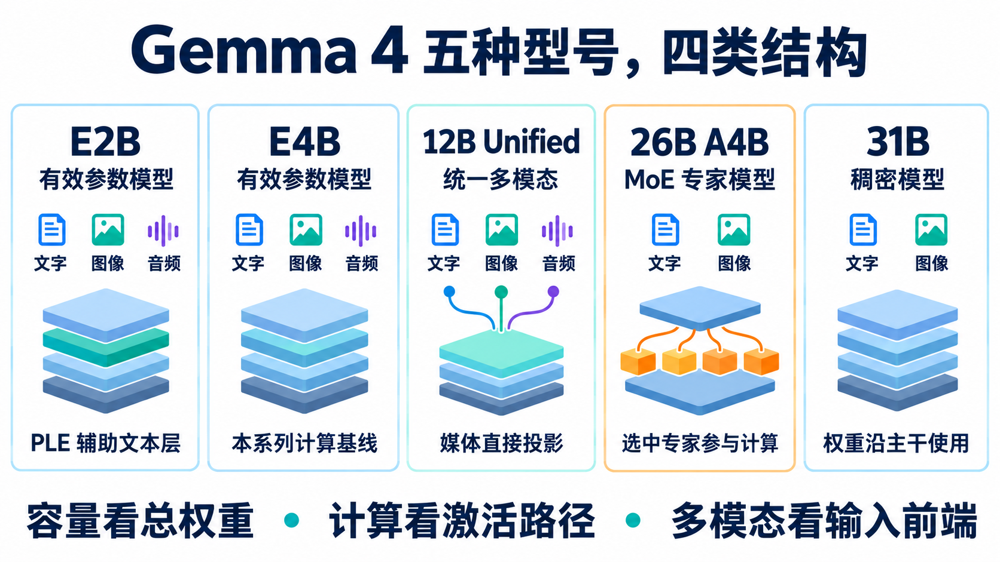
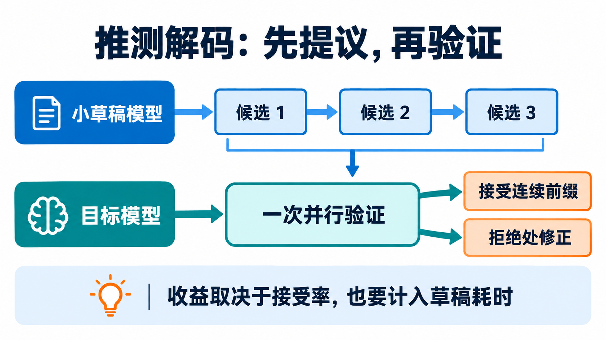
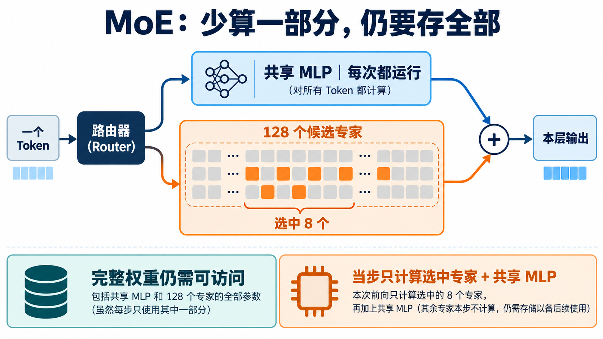

# Gemma 4 家族：换一个型号，资源账为什么要重算

[系列索引](README.md) · 第 19 期

前面十七期沿 E4B 追踪了一次推理：输入如何变成 token，decoder 怎样更新状态，权重和 KV Cache 怎样落到芯片存储。现在换成 E2B、12B、26B A4B 或 31B，能否直接把 E4B 的计算结果按参数量缩放？不能。型号名字里的数字有不同含义，媒体输入与层内计算也走不同路径。选型要先看任务，再看该型号实际要搬运和计算什么。

## 一张图看清五个型号

*图 1：原创概念示意。五个型号都能接收文字和图像；E2B、E4B、12B 还支持音频输入。下方三句话是读型号时应分别核算的三件事，并非性能排名。*

[Google Gemma 4 模型卡](https://ai.google.dev/gemma/docs/core/model_card_4)给出的家族配置如下。这里的“上下文”是模型支持的上限，实际部署能用多长还取决于 KV Cache 和设备内存。

| 型号 | 结构和参数口径 | 层数 / 上下文 | 输入 | 最先改变的资源账 |
| --- | --- | --- | --- | --- |
| E2B | 约 2.3B *effective*；含嵌入约 5.1B | 35 层 / 128K | 文字、图像、音频 | 比 E4B 更小的主干，但仍要装载嵌入与媒体前端 |
| E4B | 约 4.5B *effective*；含嵌入约 8B | 42 层 / 128K | 文字、图像、音频 | 本系列的逐层分析基线 |
| 12B Unified | 约 11.95B 总参数 | 48 层 / 256K | 文字、图像、音频 | 媒体直接投影进主干，输入端要重新画 |
| 26B A4B | 约 25.2B 总参数；约 3.8B 激活参数 | 30 层 / 256K | 文字、图像 | 专家计算稀疏，完整权重仍要可访问 |
| 31B Dense | 约 30.7B 总参数 | 60 层 / 256K | 文字、图像 | 更大的稠密主干与视觉前端 |

表里的 `E` 指有效参数：E2B 和 E4B 用逐层嵌入（PLE）扩展 token 在各层可用的信息，但查表不等于把整张嵌入表都参与当步矩阵乘。因此 **effective 不是完整权重容量**。`A4B` 则指每个 token 大约激活的参数量；它同样不能拿来当 26B 模型的装载容量。不同口径回答不同问题，不能把这五个数字排成一条“所需内存从小到大”的直线。

## E2B：沿用 E4B 思路，重新代入配置

E2B 与 E4B 最接近：都有 PLE，文字、图像和音频各自经过相应输入路径，再进入文本 decoder；局部与全局 Attention 交错。若目标是内存和功耗更紧的设备，可以从 E2B 开始评估。但它不是“E4B 的一半”：官方给出 E2B 35 层、E4B 42 层；计入嵌入后，两者的总参数分别约为 5.1B 和 8B。PLE 的表和媒体编码器都要计入装载；音频或图片任务还要计入前端运行时间。[模型卡](https://ai.google.dev/gemma/docs/core/model_card_4)

对硬件分析，这意味着第 04 期的层内概念仍可帮助理解 E2B，具体层数、宽度、KV Cache 和权重容量必须按 E2B 的配置重算。小型号减轻预算，并不免除对长上下文和多模态输入的核算。

## 12B Unified：改变的是媒体进入模型的方式

E4B 处理图片和音频时有独立的媒体编码器，编码后的表示再送进文本主干。12B Unified 取消独立视觉、音频编码器，使用较轻的线性投影，把图像 patch 和音频波形接入统一的 decoder。它仍支持三类输入，但第 16、17 期为 E4B 画的独立编码器路径不能原样套用。[Google 模型卡](https://ai.google.dev/gemma/docs/core/model_card_4)

直观地说，E4B 先让专门的前端整理媒体信息，12B 则让更多媒体处理落在共同主干里。前者有可单独核算的编码器阶段；后者要关注媒体输入带来多少主干位置、这些位置经过多少层。不能仅因为少了独立编码器，就推断总计算或端到端延迟一定更低。12B 的 256K 上下文也意味着长序列场景下必须重新核算 KV Cache，而非沿用 E4B 的 128K 预算。

## 26B A4B：一枚 token 只访部分专家

26B A4B 是混合专家模型（MoE）。在专家层，输入一边经过每次都会运行的共享 MLP，另一边由 Router 在 128 个候选专家中为当前 token 选 8 个；两边的结果合并成这一层的更新。选哪 8 个可能随 token 改变。[模型卡](https://ai.google.dev/gemma/docs/core/model_card_4)给出 25.2B 总参数、约 3.8B 激活参数和 8/128 的专家配置。

*图 2：原创概念示意。Router 只在专家分支；共享 MLP 始终运行。橙色框表示当步选中的专家，图中的省略号代表其余候选；完整专家权重仍需有可访问的存储位置。*

这一步的直接好处是减少每个 token 的专家矩阵计算；代价是完整权重仍需装载或按需调入，且专家访问位置会变化。若把 3.8B 当作权重容量，会低估存储；若把 25.2B 都算作每 token 的稠密乘法，又会高估当步计算。吞吐能否获益，还要看专家权重所在的存储层级、搬运带宽、batch 和路由分布。它也只支持文字与图像输入，不能直接沿用 E4B 的音频路径。

## 31B Dense：主干变大，计算路径保持稠密

31B 是 60 层、约 30.7B 参数的稠密模型。相比 MoE，它没有“每 token 只选择部分专家”的资源口径：主干权重沿固定计算路径使用。它同样支持图像输入，官方模型卡给出约 550M 参数的视觉编码器；没有 E4B 的音频输入路径。局部与全局 Attention 的思路仍在，但窗口、层数、上下文上限和主干宽度都应读 31B 的配置。[模型卡](https://ai.google.dev/gemma/docs/core/model_card_4)

对设备而言，首先要确认完整权重及量化元数据能放在哪里、Decode 时能以什么速度读取；随后再算 256K 上下文下的 KV、图像前端和持续运行的热预算。参数更多通常带来更重的存储与计算需求，但不能只凭参数量宣称某块芯片的实际速度。

## MTP：同一型号上还可以换生成策略

上述差别来自模型结构。Gemma 4 还提供配套的草稿模型用于推测解码（MTP）：小模型先顺序提出多个候选 token，目标模型把候选作为一段已知输入，在一次前向中并行验证多个位置；接受连续前缀，遇到拒绝就从该处修正。[Google MTP 说明](https://ai.google.dev/gemma/docs/mtp/overview)描述了配套草稿模型及其与目标模型的复用关系。

*图 3：原创概念示意。上方候选依次生成，下方目标模型批量验证；实际接受与修正要遵循推测解码算法，图中只展示流程。*

它试图减少昂贵的目标模型串行前向次数，却增加了草稿计算和两模型之间的调度。候选频繁被拒绝时，草稿的工作可能收不回成本。评估时至少同时记录候选长度、接受率、草稿耗时、目标验证耗时和端到端延迟。MTP 是生成时可选的执行策略，不能把其收益直接算进任何一个型号的固有性能。

## 把同一套方法带到新型号

先固定工作负载：文字、图片还是音频，输入与输出长度，batch 和并发，延迟目标。再按所选型号的官方配置重算三件事：**静态权重放在哪里**，包括嵌入、专家或媒体前端；**运行状态占多少**，尤其是随序列增长的 KV Cache；**每步要搬什么、算什么**，区分 Prefill、Decode，以及是否启用 MTP。

E4B 的分析给出的是方法，不是全家族通用的数值答案。E2B 需要缩小后重新核算，12B 要重画媒体入口，26B 要分清总权重与激活专家，31B 要面对更大的稠密主干。只有把这些路径放进具体设备的容量、带宽、算力与功耗约束里，型号比较才真正落地。

资料：[Gemma 4 模型卡](https://ai.google.dev/gemma/docs/core/model_card_4) · [Gemma 4 模型概览与内存估算](https://ai.google.dev/gemma/docs/core) · [Gemma 4 MTP 官方说明](https://ai.google.dev/gemma/docs/mtp/overview)
