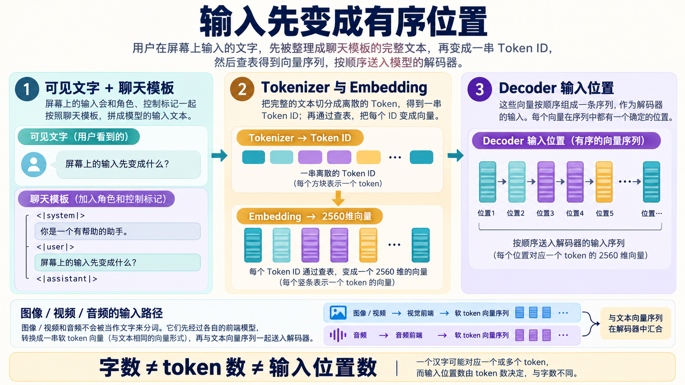
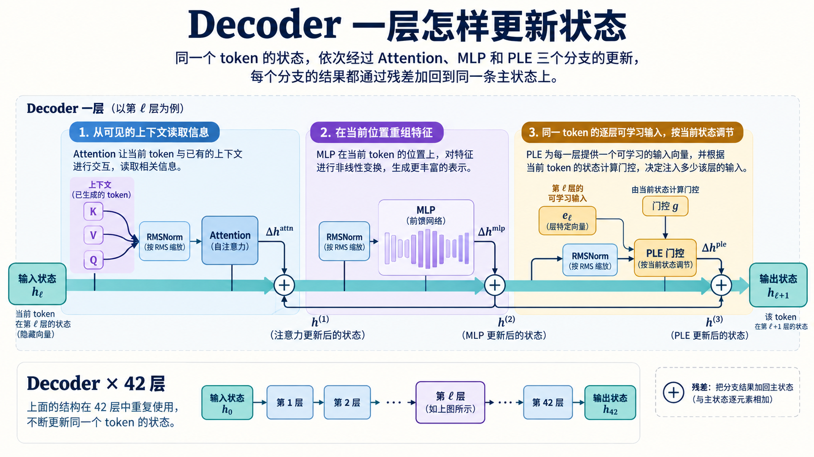
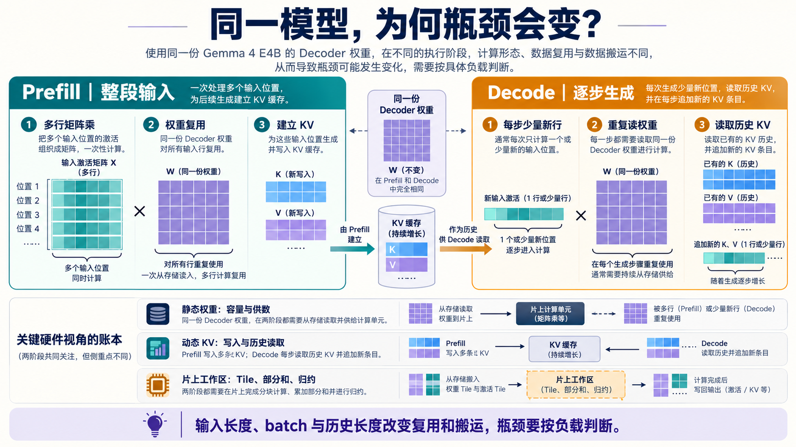
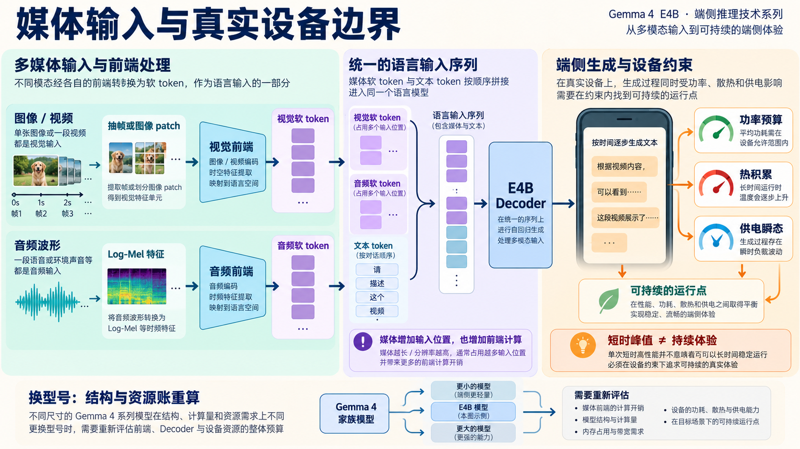

# Gemma 4 从算法到端侧芯片

同一套 Gemma 4 E4B 权重，刚收到提问时可以同时处理许多输入位置；开始逐字回答后，单个请求每步通常只新增一个位置，却仍要读取权重和已有的 K/V。附上一张照片或一段录音，语言模型开始工作之前还多了视觉或音频前端。**模型没有换，计算形状、数据寿命和芯片压力已经换了。**这也是只看参数量或峰值 TOPS，很难预判端侧体验的原因。

本系列只追一条主线：**输入先变成什么 → Decoder 怎样更新它 → 同一模型为何会遇到不同的硬件瓶颈 → 媒体与真实设备又改变了什么。**前两步回答“模型在算什么”，后两步回答“芯片实际要供给和承受什么”。Gemma 4 E4B 是贯穿案例；用固定配置看清算子、数据流与资源代价，最后再讨论换型号时哪些账必须重算。

如果只想先抓住主线，可从 [01 推理全景](01-input-to-next-token.md)、[04 Decoder Layer](04-decoder-layer.md)、[11 Prefill 与 Decode](11-prefill-decode.md) 和 [15 数据搬运与 Roofline](15-compute-and-data-movement.md) 读起。想追某个算子或媒体路径，可以直接从下面进入相应文章。

## 输入先变成什么

屏幕上的一句提问不是直接送进 Decoder。聊天模板先补上角色和控制标记，Tokenizer 将完整文本切成 ID，Embedding 再把 ID 变成按位置排列的向量。先分清**可见文字、token 与输入位置**，后面才有办法讨论上下文长度和计算量。

*图 1：沿箭头看文字输入的三次变化。媒体输入另经视觉或音频前端形成软 token；图中的方块数量只表示顺序，不是一次实际请求的 token 统计。*

**01｜[E4B 推理全景：多模态输入如何生成文本](01-input-to-next-token.md)** 先把全程摊开：文字、图像和声音从不同前端进入同一条语言输入序列，回答则一枚 token 一枚 token 地接续生成。它给后续章节一个共同的坐标。

**02｜[聊天模板与 Tokenizer：一句提问如何变成模型输入](02-tokenizer.md)** 用固定版 Tokenizer 追踪一句中文提问。读者能看到可见文字怎样切成 ID，以及聊天模板为何让实际输入位置数多于正文 token 数。

**03｜[Embedding：Token ID 如何变成 2560 维向量](03-embedding.md)** 沿一个 ID 查主 Embedding 表，说明离散行号如何变成 Decoder 的向量输入；再看同一张参数表如何用于输出端候选打分。

## Decoder 一层怎样工作

拿到有序向量之后，Decoder 不是一次完成“理解”。同一条主状态依次经过 Attention、MLP 和 PLE：前者读可见上下文，中者重组当前特征，后者将该 token 的逐层可学习输入按当前状态门控后接入。每个分支都通过残差更新主状态，接着进入下一层。下面七篇依次把这条主路、关键算子和数据共享方式放大。

*图 2：主线是一枚 token 在一层内的状态更新；上下文、当前特征与逐层输入分别从不同分支进入。图为机制示意，细节以各章的配置和 `torchview` 追踪为准。*

**04｜[Decoder Layer：Attention、MLP 与 PLE 如何更新状态](04-decoder-layer.md)** 沿第 0 层的 `torchview` 总图追踪主状态。Attention 读取上下文，MLP 加工当前位置，PLE 再接入按层准备的输入；三次更新通过残差回到同一条主路。

**05｜[RMSNorm：Gemma 4 为什么反复调整向量尺度](05-rmsnorm.md)** 放大层内反复出现的归一化。它解释 RMSNorm 怎样控制幅度、与 LayerNorm 差在哪里，以及不同向量宽度怎样影响硬件归约和融合。

**06｜[矩阵乘：特征怎样进入 Cube](06-tensor-matmul-basics.md)** 从模型里的特征重组讲到矩阵乘的内积与外积两种展开，再看 Tiling 怎样在有限片上存储、部分和与数据复用之间取舍。

**07｜[Attention：当前位置怎样读取上下文](07-attention-tensors.md)** 顺着 Q/K/V、GQA、打分、mask、softmax 和 V 汇聚看完整的数据路径，分清“形成匹配”与“带回内容”分别由什么完成。

**08｜[RoPE：Q、K 的绝对位置怎样变成相对位移](08-rope-position.md)** 只抓一个核心关系：Q 和 K 各按自己的绝对位置旋转，点积中共同旋转抵消，留下两者的位置差。随后再放回局部和全局 Attention。

**09｜[Hybrid Attention：局部层、全局层与 KV 共享如何分工](09-hybrid-attention.md)** 解释五层局部接一层全局的可见范围，以及后 18 层为什么能复用前面同类型层的 K/V。窗口、GQA 和跨层共享节省的是三笔不同的资源。

**10｜[PLE：一枚 Token 怎样给每层不同的输入](10-ple.md)** 把逐层嵌入从身份查表、输入投影一直追到层内门控，讲清“同一个 token 每层一份可学习输入”具体怎样形成、怎样受当前状态调节。

## 同一模型为何有不同的硬件瓶颈

层内算子不变，负载却会变。Prefill 同时处理许多输入位置，矩阵乘有机会跨行复用权重，并建立 KV；Decode 每步通常只新增少量位置，需要反复供给权重并读取已有 KV。于是硬件分析要同时记**静态权重、动态 KV 和片上工作区**，再按输入长度、batch 和历史长度判断瓶颈，不能只报一个参数量或峰值算力。

*图 3：左边是多行输入的 Prefill，右边是逐步生成的 Decode；中间的 KV 从建立转为历史读取。图示解释资源流向，不表示某台设备必然受算力或带宽限制。*

**11｜[Prefill 与 Decode：同一模型的两种计算形态](11-prefill-decode.md)** 比较一次处理整段提示词与逐步生成时的矩阵形状、权重复用和理想算术强度，说明首 token 延迟与后续 token/s 为什么要分别看。

**12｜[KV Cache：保存什么，容量如何增长](12-kv-cache.md)** 说明旧 K/V 为什么能复用、新查询为何仍要重算权重，并按 E4B 的局部与全局生产层分别核算长期容量、每步写入和历史读取。

**13｜[权重与量化：从参数容量到芯片带宽](13-weights-ple-quantization.md)** 区分 effective 参数、完整静态权重和运行时状态；再比较低比特权重在片上转换计算与提前展开后反复搬运的差别。

**14｜[Attention 加速：分块、滑窗与长上下文 Decode 怎样分工](14-attention-acceleration.md)** 按局部/全局层、Prefill/Decode 四种负载选办法。分块融合、跳过窗外 tile、单查询缓存内核、Split-K 和分页缓存各解决不同问题。

**15｜[数据搬运与 Roofline：端侧 NPU 什么时候在等数据](15-compute-and-data-movement.md)** 把权重、历史 KV 和当前激活放进同一张存储层级图，再用 Roofline 判断算力与带宽的边界会怎样随负载变化。

## 媒体输入与真实设备边界

照片、视频和声音并不会先变成普通文字。各自的前端提取特征，形成软 token 后才与文字位置一起进入语言模型；视频还带来帧与时间信息。输入位置和前端工作因此增加。模型进入设备后，短时跑得快也不等于长时间能保持速度：功率、热积累和供电瞬态共同约束持续运行。换到家族中的另一型号，还要重新核算结构与资源。

*图 4：先看左侧不同媒体的前端，再看软 token 如何加入语言序列，最后看右侧设备运行边界。帧间隔、仪表和设备外形均为概念示意，不代表抽帧策略或实测数据。*

**16｜[视觉输入：照片与视频帧如何变成软 Token](16-vision-path.md)** 从图片 patch、视觉编码和空间汇聚走到语言序列；视频再增加抽帧、时间戳和逐帧占位槽。概念图与实际视觉模块的 `torchview` 追踪各解释一段。

**17｜[音频输入：波形如何变成软 Token](17-audio-path.md)** 先弄清 Log-Mel 特征与有效帧 mask，再看占位槽数量、音频塔下采样和语言宽度投影怎样对齐。Mel 帧数与最终语言位置数不能混算。

**18｜[功耗、散热与供电：端侧推理为什么会越跑越慢](18-power-thermal-pi.md)** 把功率预算、热积累和供电瞬态拆开分析，说明为何冷机峰值速度不足以代表持续输出，以及需要哪些设备记录才能判断原因。

**19｜[Gemma 4 家族：换一个型号，资源账为什么要重算](19-family-and-next-steps.md)** 用同一套核算方法比较 E2B、E4B、12B Unified、26B A4B 与 31B Dense，并说明 MTP 改变的是生成日程，不是任意型号都能直接获得的固定收益。

## 阅读口径

本文用 `B` 表示 batch，`S` 表示本次输入位置数，`T` 表示已有历史长度；E4B 语言主宽度为 `D=2560`。图中的短序列与小 patch 网格只用于读清结构，不代表模型上限。结构与配置依据 [Google Gemma 4 模型卡](https://ai.google.dev/gemma/docs/core/model_card_4)、[固定 E4B 配置](https://huggingface.co/google/gemma-4-E4B-it/blob/ee0ef6023621cff504d758262d4e04895a5af4a2/config.json)及 [固定版本 Transformers 实现](https://github.com/huggingface/transformers/tree/8445b13cd24961e47f25a649fb113580f71a8d11/src/transformers/models/gemma4)核对。

目前 19 篇均为中文编辑稿，尚未完成正式发布审阅；英文正文与英文配图按当前安排暂缓。
