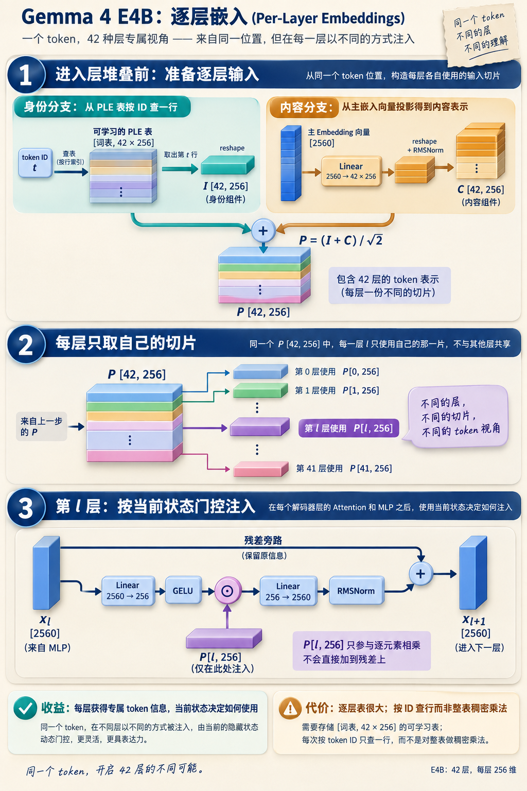
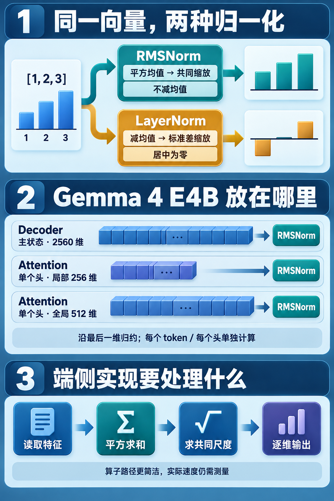

# Decoder 怎样更新状态：Attention、MLP、RMSNorm 与 PLE

[11 篇版索引](README.md) · 第 02 篇

一枚 token 刚进 E4B 时，主 Embedding 给它一条 2560 维向量。42 层 Decoder 不会把它变成 42 枚 token；输入中的位置仍在，变化的是每个位置携带的状态。看懂一层的关键，是沿着同一条主状态追踪：它先从可见上下文取信息，再加工当前位置的特征，最后接入一份为本层准备的额外输入。

*图 1：真实第 0 层模块追踪的压缩图。`X₀→X₁→X₂→X₃` 是同一批位置的连续状态；每段旁边的直通路与计算结果在残差 `add` 处汇合。追踪用构造形状和初始化模块，不是加载权重后的预测。*

## 三次更新，职责并不一样

**Attention** 让当前位置读取允许看见的其他位置。先把主状态整理为 Q、K、V 等表示，计算匹配与加权汇聚，再把得到的更新接回原状态，形成 `X₁`。这一段改变了当前位置可利用的信息来源；局部层和全局层的可见范围并不相同。

**MLP** 在当前位置内部重组特征。E4B 的两条扩宽投影把 2560 维状态送往 10240 维门控与内容路径，经过激活、逐元素结合，再投影回 2560 维，接成 `X₂`。它不直接读取另一个位置；不同位置之间的交换已由 Attention 负责。矩阵乘在这里承担了大量密集乘加，但门控与激活也不能省略。

**PLE（per-layer embedding，逐层嵌入）** 提供第三条输入。模型在进入层堆叠前，从 token 身份和初始输入准备按层区分的向量；走到当前层，只取属于这一层的那一份。当前状态经门控决定怎样使用它，随后回投影、归一化并残差相加，形成 `X₃`。所以 PLE 既不是当前层刚从历史读来的 K/V，也不是固定不变地加一条向量：同一 token 在不同层有不同的可学习分量，当前状态还会调节注入强度。

*图 2：上游准备与层内使用放在同一张图。图中 256 维是 PLE 逐层输入的宽度，不是主状态宽度；它经过回投影才接回 2560 维主路。*

## RMSNorm 为什么反复出现

三次更新都要把新计算结果接回残差主路。数值尺度若一路漂移，后续投影和残差的工作范围就会难以控制。RMSNorm 以一条向量的平方均值估计整体幅度，用它缩放向量，再施加可学习的逐维权重。对向量 `x`，核心尺度是 `rms(x)=√(mean(x²)+ε)`；这项计算不沿 token 位置归约，也不让不同请求混在一起。

传统 LayerNorm 先减去均值，再按标准差缩放，处理的是“相对均值的偏离”；RMSNorm 不减均值，只控制整体幅度。因此两者对有非零均值的输入并不等价。RMSNorm 少了一次均值中心化，但仍要归约、求缩放因子并读写向量。它不是一个可以在硬件账里忽略的“免费小算子”。

*图 3：同一输入经两种归一化的机制对照。图中的高度是示意，不能据此读取具体数值结果。*

E4B 除了主状态上的 2560 维归一化，还在部分 Attention 头和 PLE 路径上使用不同宽度的 RMSNorm。硬件分析时要问：它读哪条向量、归约多宽、结果是否马上被下一算子消费。宽度与相邻算子决定了融合机会和数据搬运，而不是仅凭“RMSNorm 次数”估计成本。

这张一层总图给后文提供坐标：矩阵乘负责生成特征，Attention 负责跨位置取信息，PLE 负责逐层补充，RMSNorm 维护接合时的尺度。具体瓶颈还取决于一次处理多少位置和数据怎样存放，不能把所有时间简单归给图中最大的 Linear 方框。

资料：[E4B 固定配置](https://huggingface.co/google/gemma-4-E4B-it/blob/ee0ef6023621cff504d758262d4e04895a5af4a2/config.json) · [Transformers Gemma 4 模型实现](https://github.com/huggingface/transformers/blob/8445b13cd24961e47f25a649fb113580f71a8d11/src/transformers/models/gemma4/modeling_gemma4.py) · [RMSNorm 论文](https://arxiv.org/abs/1910.07467)
