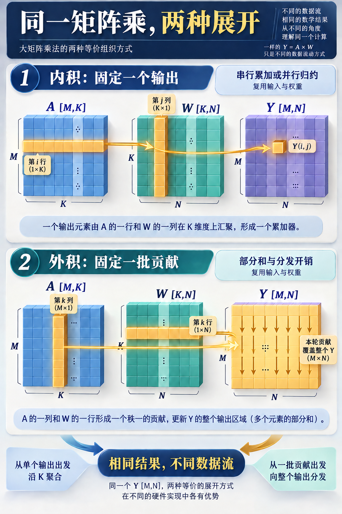
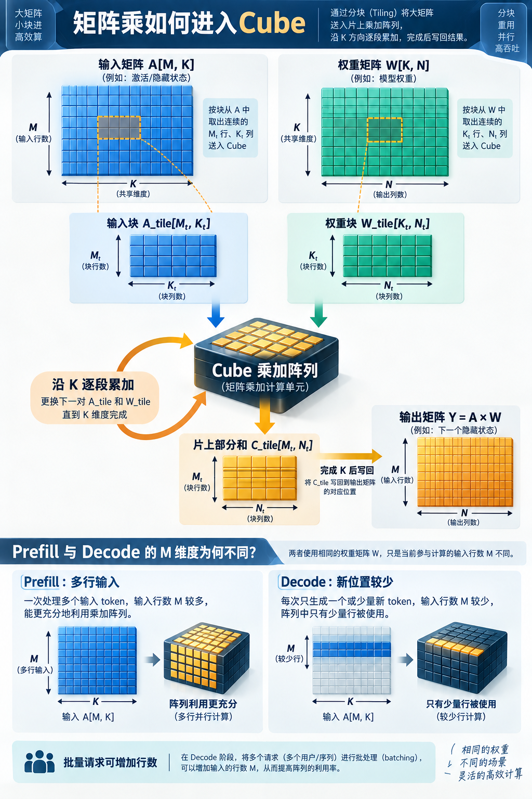

# 矩阵乘怎样落到 Cube：内积、外积与 Tiling

[11 篇版索引](README.md) · 第 03 篇

Decoder 一层里，MLP 要把每个位置的 2560 维状态扩成两条 10240 维路径，再压回 2560 维；Attention 也要投影 Q/K/V、算位置间的匹配和加权结果。这些步骤形式不同，却频繁落到矩阵乘。它反复出现，因为模型需要用训练所得的权重**重新组合特征**，并让许多位置复用同一组权重。

把待处理位置排成 `A[M,K]`，权重写成 `W[K,N]`，输出就是 `Y[M,N]=AW`。`M` 是这次参与计算的位置行数，`K` 是输入特征宽度，`N` 是新特征数。每个 `Y[m,n]` 汇集输入行的全部 `K` 个分量：`Y[m,n]=Σₖ A[m,k]W[k,n]`。线性投影自身只加工各位置的特征；Attention 中的 `QKᵀ` 与概率乘 V，才让位置之间发生信息交换。

*图 1：MLP 的 torchview 局部图。三处 Linear 都对应矩阵运算，中间的激活与门控意味着它们不能合并为一次投影。*

## 同一个结果，两种组织计算的方向

若固定输出格 `(m,n)`，沿 `K` 依次乘加，就是**内积**。它只需为当前输出保留部分和，完成后写出；但长累加链存在依赖，若把 `K` 拆给多个单元，还需归约树或通信来合并部分和。逐格独立做也会重复取相同的输入或权重，实际硬件必须通过缓存和广播减轻重复。

若固定一个 `k`，取 `A` 的第 `k` 列与 `W` 的第 `k` 行相乘，会形成覆盖整个 `Y` 区域的一份贡献：`A[:,k]W[k,:]`。沿 `K` 累加这些贡献，就是**外积**。一个输入值可以服务多个输出列，一个权重值可以服务多个输入行；代价是同时维护一片输出部分和，并把数据分发给多个计算单元。片区越大，累加器容量、寄存器端口与布线压力越高。两种方向算的是同一个 `Y`，差别是先锁定一个输出，还是先广播一批输入贡献。

*图 2：看箭头的范围。外积每次对整片输出都有贡献，但仍需沿 `K` 累加到最终结果；图中的格子不表示真实阵列布线。*

## 为什么还要切块

这里把执行矩阵乘加的小型硬件阵列统称为 **Cube**。任意大的 `A`、`W` 与输出部分和不可能同时待在有限片上存储中，所以先选一片输出 `C_tile[Mₜ,Nₜ]`，再把 `K` 分段。每段搬入 `A_tile[Mₜ,Kₜ]` 和 `W_tile[Kₜ,Nₜ]`，在片上执行 `C_tile += A_tile×W_tile`；沿 `K` 完成后才写回输出。站在单个格看是内积，站在整片看则获得输入与权重的并行复用。

一段要容纳约 `MₜKₜ` 个输入、`KₜNₜ` 个权重和 `MₜNₜ` 个部分和。加大输出片区提高复用机会，却增加部分和与供数网络压力；加大 `Kₜ` 减少调度段数，又吃掉更多输入缓冲。Tiling 的目的，是让复用落在设备实际装得下、供得上的范围，而不只是把数学矩阵切小。

*图 3：同一权重在 Prefill 中可能服务许多位置行；单请求 Decode 每步的新行数很少。阵列利用和访存瓶颈因此会变化。*

完整推理还有查表、RMSNorm、GELU、softmax、RoPE 和 KV 读取。矩阵乘占大量乘加，不意味着它在每种输入长度和每台设备上都占最多时间。尤其单请求 Decode 的 `M` 很小，同一权重从存储取来却只服务少数行；后续的带宽账要从这里接着算。

资料：[E4B 固定配置](https://huggingface.co/google/gemma-4-E4B-it/blob/ee0ef6023621cff504d758262d4e04895a5af4a2/config.json) · [Transformers Gemma 4 实现](https://github.com/huggingface/transformers/tree/8445b13cd24961e47f25a649fb113580f71a8d11/src/transformers/models/gemma4) · [NVIDIA CUTLASS 分块矩阵乘说明](https://docs.nvidia.com/cutlass/latest/media/docs/cpp/efficient_gemm.html)
