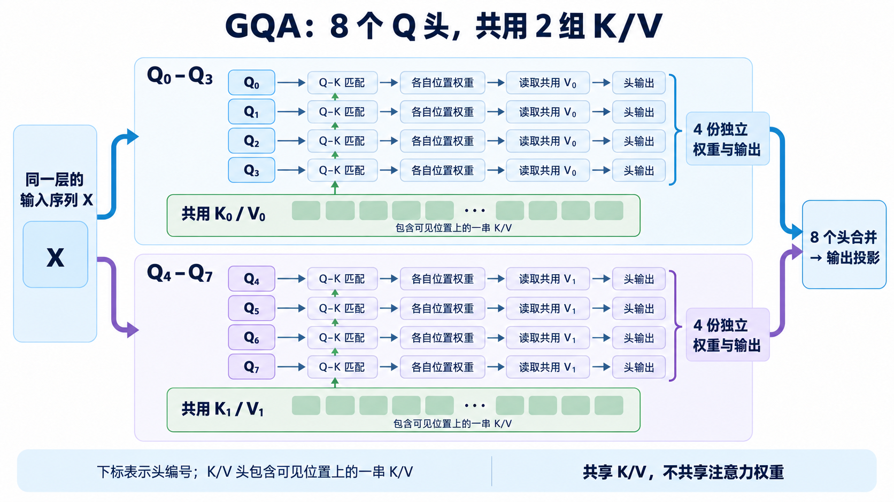
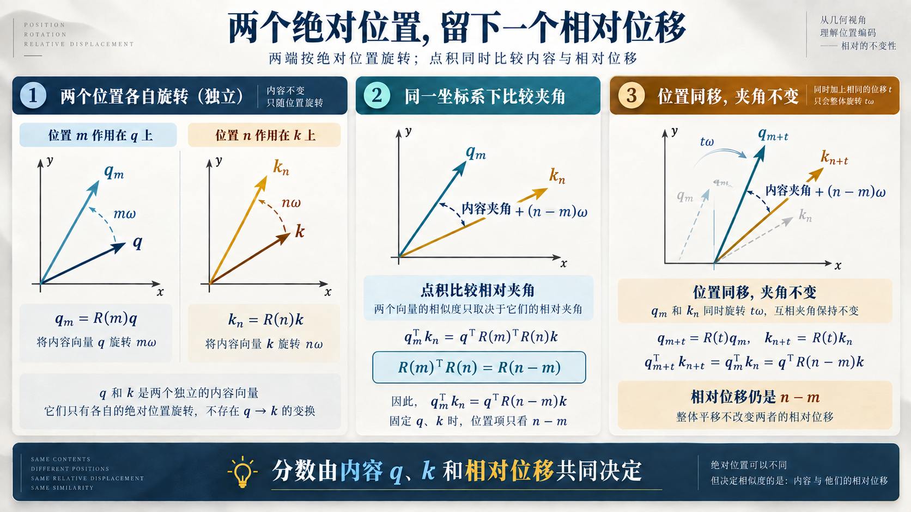
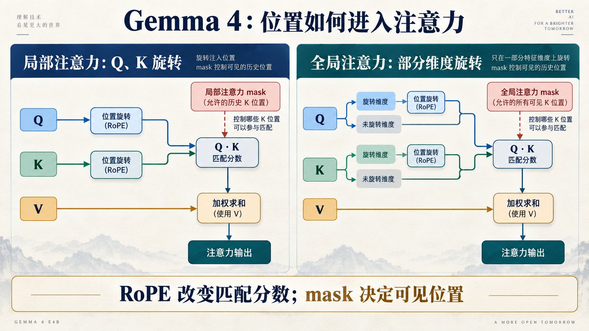

# Attention 怎样读到正确位置：Q/K/V 与 RoPE

[11 篇版索引](README.md) · 第 04 篇

矩阵乘可以替一个位置形成新特征，但一句话里的当前位置还要借用别处的信息。Attention 正是这条跨位置的路：当前位置提出查询，用查询与可见位置的键比较，再按比较结果汇集对应的值。要让“看到了谁”和“对方离我多远”都讲得清楚，必须把 Q/K/V、位置旋转和可见性 mask 分开。

## 从一个查询走到一次汇聚

状态先分别投影为 Q（query）、K（key）和 V（value）。一条 Q 与各个可见 K 做点积，得到匹配分数；mask 排除未来位置或窗口外位置；softmax 把剩余分数变成权重；最后用这些权重对 V 求和。**K 参与决定读谁，V 提供读到的内容。**新查询即使复用旧 K/V，也要重新计算自己的分数和权重。

*图 1：沿 Q/K/V、RoPE、GQA、打分、mask、softmax、V 汇聚和输出投影读。图来自第 0 层模块的结构追踪，形状是构造输入，不是实际回答。*

E4B 每层有 8 个 Q 头、2 个 KV 头，即每四个 Q 头共用一组 K/V。这是 **GQA（分组查询注意力）**。共享 K/V 减少每个位置需要生产、保存和读取的 KV 头数；8 个 Q 头仍各自形成查询和输出，不能把它们当成两个查询。局部层的 head_dim 是 256，全局层是 512，后文算缓存字节时必须按各自宽度计。

*图 2：图中四对一的是查询头与 KV 头的对应关系，不是复制四份 KV 到存储中。*

## 两个绝对位置怎样留下相对位移

仅靠 Q 与 K 的内容点积，无法明确表达两者在序列里相隔多远。RoPE（旋转位置编码）把 Q、K 的特征维度成对处理：位置 `m` 的 Q 旋转 `mω`，位置 `n` 的 K 旋转 `nω`。两支箭头一起再转同一个角度，夹角和点积不变，所以比较时共同的绝对旋转抵消，位置影响只通过角度差 `(n−m)ω` 留下：

`(R(m)q)ᵀ(R(n)k)=qᵀR(n−m)k`。

式子里仍有内容向量 `q`、`k`；分数同时依赖内容和相对位移，不是只看距离。真实向量有多对维度，各对旋转速率不同，点积贡献最后相加。这样模型分别给 Q 和 K 使用绝对位置，计算匹配时却得到相对位置关系。

*图 3：共同平移两端位置时，固定内容下的角度差不变。图只画一对特征维度，以便看清关系。*

E4B 的局部层使用 RoPE；全局层使用 p-RoPE，只旋转部分 Q/K 维度，未旋转部分仍参与匹配。V 不沿这条位置旋转路径走。RoPE 回答的是“两个位置参与比较时，距离怎样进入分数”；因果和滑窗 mask 回答的是“哪些位置允许参与比较”。RoPE 不能使被 mask 排除的远处位置重新可见。

*图 4：局部、全局层在位置处理上的差异。全局层的部分旋转不等于部分位置可见；可见范围由 mask 单独控制。*

读 Attention 时最好按这条顺序核对：先查 Q/K/V 从哪里来，再查 Q/K 的尺度与位置旋转，随后查 head 对应、mask 和 softmax，最后查 V 汇聚及输出投影。它既能解释数学上的信息读取，也能防止硬件内核把默认缩放或头排布套错。下一篇再问：历史范围不同的层，要保存多少 K/V？

资料：[E4B 固定配置](https://huggingface.co/google/gemma-4-E4B-it/blob/ee0ef6023621cff504d758262d4e04895a5af4a2/config.json) · [Transformers Gemma 4 模型实现](https://github.com/huggingface/transformers/blob/8445b13cd24961e47f25a649fb113580f71a8d11/src/transformers/models/gemma4/modeling_gemma4.py) · [RoFormer 论文](https://arxiv.org/abs/2104.09864)
