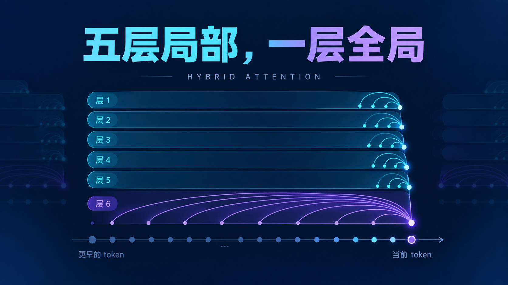
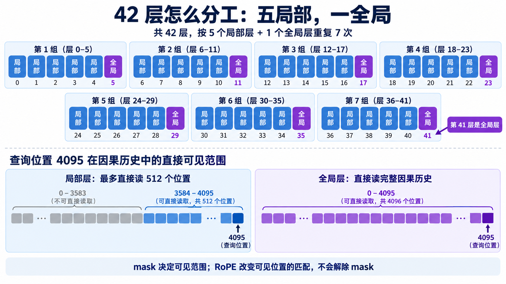
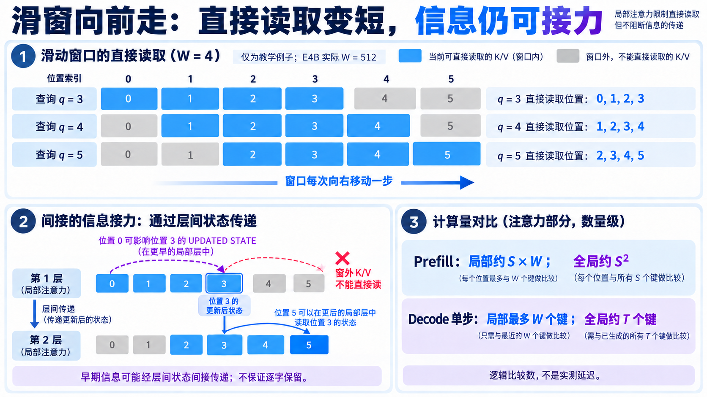
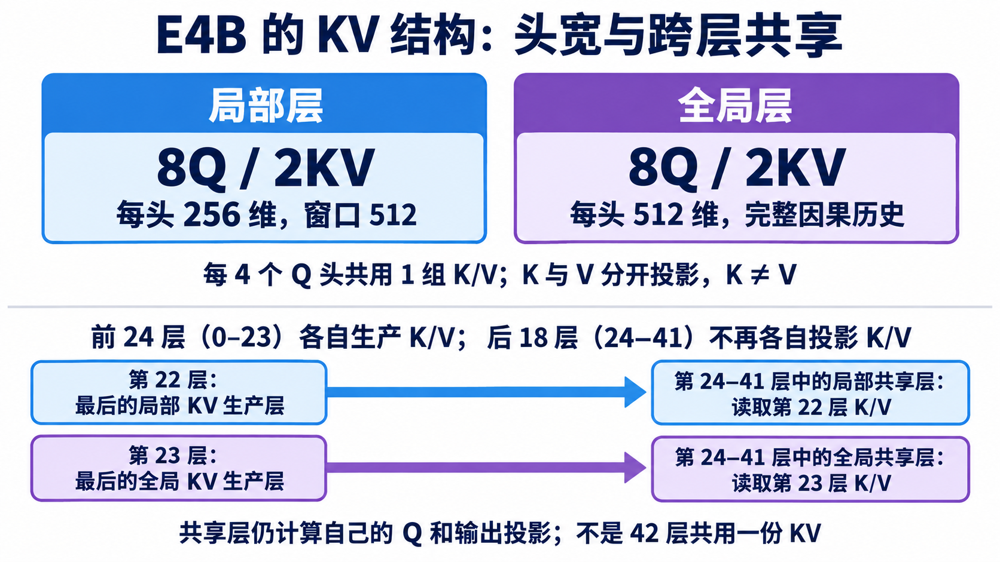

# 历史信息怎样保存：混合 Attention 与 KV Cache

[11 篇版索引](README.md) · 第 05 篇

生成一枚新 token 时，当前位置的 Q 要读历史 K/V。若每层都读完整前缀，长上下文会让匹配数和缓存读取一路增长。E4B 把 42 层排成七组，每组五层局部、一层全局：局部层只直接看最近 512 个位置，全局层能看完整的因果历史。这个可见范围同时决定了要算哪些匹配，以及哪些旧 K/V 对下一步仍有用。

*图 1：层号从 0 起，第 5、11、17、23、29、35、41 层是全局层。局部窗口为 512；图中的位置示例只展示逻辑可见范围。*

## 滑窗减少直接读取，不能替代全局层

窗口随查询位置向前移动。对很长的 Prefill，局部层每个查询最多直接比较 512 个键，逻辑配对数随 `S×512` 增长；全局因果层仍随 `S²` 增长。Decode 每步只有一个新查询，局部层最多读一个窗口，全局层则读当时可见的全部历史。局部层经过多层可以间接传递较早的信息，但窗外 K/V 不能被当前层直接读取，间接传递也不等于逐字保存。周期性全局层给模型直接访问远处的机会。

*图 2：示意窗口宽度只有四格，便于看边界；E4B 的实际窗口是 512。图中的间接箭头表示可能的影响，不表示旧 token 被完整复制。*

## 缓存留下什么，为什么还要每步读它

因果约束使旧位置的状态不会被后来追加的 token 改写，因此旧 K/V 可以缓存。来到新位置，模型算新 Q；生产层也算本步 K/V。新 Q 读取可见历史 K/V 和本步 K/V，本步 K/V 随后留给将来。缓存没有保存旧查询的 softmax 概率：每次查询内容不同，分数和权重要重算。局部层更早的 K/V 对当前查询不可见，长期存储可围绕 512 窗口复用；全局历史则继续增长。

*图 3：读取和写入是两笔不同的流量。缓存中有一条 K/V，也不表示当前查询的 mask 一定允许读它。*

E4B 还做了**跨层 KV 共享**。前 24 层中 20 层局部、4 层全局各自产生 K/V；后 18 层按类型复用进入共享段前的生产层：局部层取第 22 层的 K/V，全局层取第 23 层的 K/V。共享层仍算自己的 Q、注意力权重和输出；省掉的是各自产生及长期保存另一份 K/V，而不是整个 Attention。长期 cache 与一次 Prefill 中跨层传递的临时 K/V 生命周期不同，不能合并成一笔容量。

*图 4：箭头表示生产层到消费层的扇出；Q 与输出投影仍属于各消费层。*

## 用 E4B 算一笔净荷账

只算 BF16 原始 K/V，不计管理、对齐与工作区。一个保留 `T` 个位置的生产层，批量 `B`、KV 头数 `Hkv`、每头宽度 `d`、元素字节数 `b`，净荷是 `2BTHkvdb`。E4B 的 `Hkv=2`：局部头宽 256，每位置 K/V 为 2 KiB；全局头宽 512，每位置为 4 KiB。若局部层长期只留 512 个位置，20 个生产层约 20 MiB。四个全局生产层到 64K 历史约 1 GiB，到 128K 配置边界约 2 GiB。以上均为 `B=1`、BF16 的解析净荷，不是设备占用实测。

*图 5：局部长期容量有界，全局随历史增长。每新增一个位置，这 24 个生产层的原始 KV 写入约 56 KiB；读可见历史的逻辑净荷则可能远大于它。*

这笔账对硬件有三个直接问题：权重与并发请求的动态 KV 能否同时放下？每一步可见的 K/V 怎样从大容量存储分块送到片上？滑窗环形存储覆盖旧行后，RoPE 和 mask 是否仍使用正确的**绝对位置**？分块能降低片上同时驻留量，却不会抹掉全局层仍需读取的历史。KV Cache 省了重算旧 K/V 的工作，同时引入随上下文增长的容量与读取成本。

资料：[E4B 固定配置](https://huggingface.co/google/gemma-4-E4B-it/blob/ee0ef6023621cff504d758262d4e04895a5af4a2/config.json) · [Transformers Gemma 4 模型实现](https://github.com/huggingface/transformers/blob/8445b13cd24961e47f25a649fb113580f71a8d11/src/transformers/models/gemma4/modeling_gemma4.py) · [PagedAttention 论文](https://arxiv.org/abs/2309.06180)
