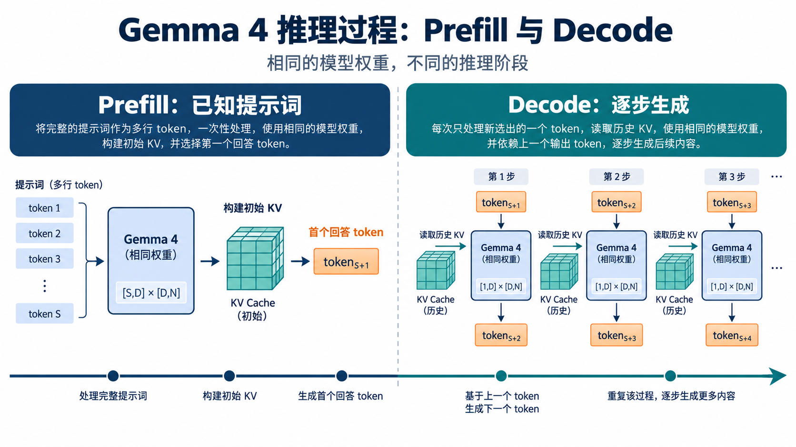
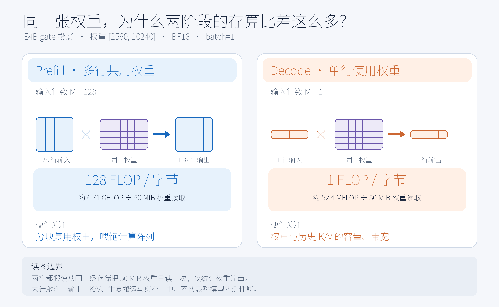
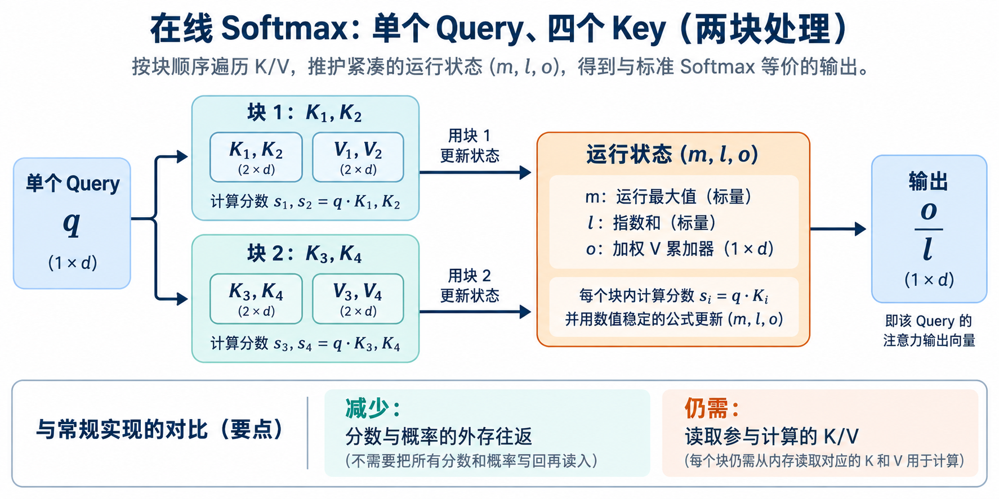
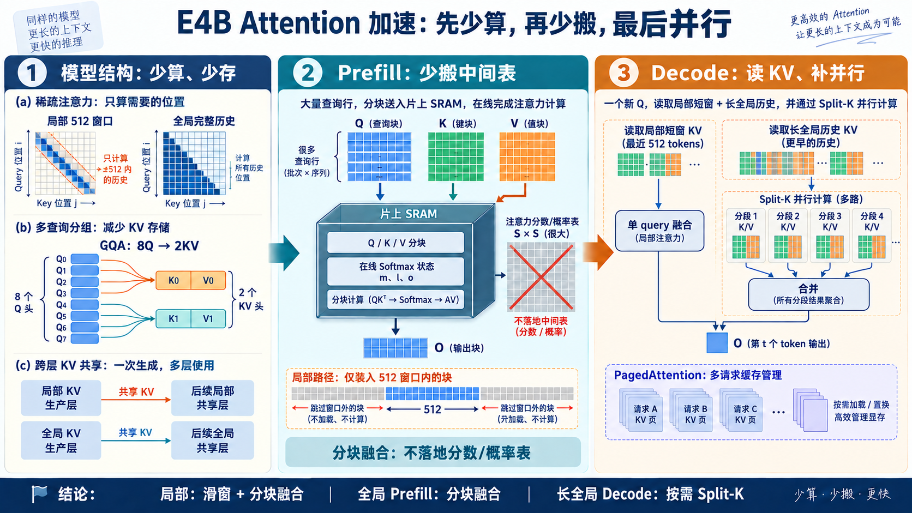

# Prefill 与 Decode 怎样加速 Attention

[11 篇版索引](README.md) · 第 06 篇

同一套 E4B 权重，在用户刚提交提示词时会面对多行已知输入；开始持续吐字后，单请求的常规步骤通常只新增一行。Prefill 与 Decode 的名字说的是这两种执行阶段。要选 Attention 内核，先问清本次有多少查询、每个查询能读多少历史、存储里真正来回搬的是什么。

*图 1：两阶段共用模型权重。Prefill 建立初始 K/V；Decode 的新查询读取可见历史，并为以后留下新 K/V。*

## 阶段切换首先改变矩阵形状

拿 E4B 一张 `[2560,10240]` 的 gate 权重举例。若提示词有 128 个位置，Prefill 线性投影形如 `[128,2560]×[2560,10240]`；单请求 Decode 形如 `[1,2560]×[2560,10240]`。同一份权重，前者服务 128 行，后者只服务一行。若从同一级存储只读一次权重、每个元素 BF16 占 2 字节，单计权重的理想算术强度为 `2M/b` FLOP/byte：`M=128` 是约 128，`M=1` 是约 1。它不是整层实测值，却解释了为什么 Prefill 值得追求矩阵块复用，单请求 Decode 更容易受权重供给制约。

*图 2：按一次权重读取估算，不含激活、KV、缓存命中和重复搬运；图中的倍数不能直接换算为设备速度。*

Attention 也换了形状。全局 Prefill 有很多 Q，若完整物化 `[B,Hq,S,S]` 分数和概率表，中间数据会很大；单 query Decode 没有巨大的 `S×S` 表，却要读可见历史 K/V。E4B 的局部 512 窗口又把局部与全局层的历史长度分开。把两阶段、两类层都交给同一个“最快 Attention”名称，容易掩盖实际开销。

## Prefill：分块融合，并真正跳过窗外块

FlashAttention 一类精确分块算法让一块 Q 依次处理 K/V 块，在片上维护 softmax 的最大值、指数和、加权输出；块间按新最大值重缩放后合并。这样不必把完整分数和概率表写到外存。它改的是计算与数据搬运顺序，仍计算原有可见位置的 Attention。局部层还必须**不调度**512 窗口之外的 tile：若先把所有 QK 都算完再 mask，逻辑配对量并未减少。全局层不能照此跳过远处有效位置。

*图 3：每块更新 `m、l、o`，最后输出 `o/l`。分块省掉中间表的外存往返，不自动省掉可见 K/V 的读取。*

## Decode：先让历史 KV 读得顺，再考虑拆分

局部 Decode 只有一个新查询、最多读取窗口内 K/V，通常应直接用消费缓存的融合内核，并让四个 Q 头共享对应的一组 KV 头。全局 Decode 的历史可能很长；若单 query 和少量 head 无法给设备提供足够并行任务，可把历史切段并行计算局部 softmax 状态，再合并为同一个结果。这是 **Split-K**，会增加合并和工作区，短历史不一定划算。

**PagedAttention** 解决的是动态 KV 分配、碎片和多请求调度，不会减少单请求必须读取的可见历史；它可以与上述计算内核组合。KV 量化则改变缓存字节和数值精度，需另做质量验证。E4B 本身已有滑窗、GQA 与跨层 KV 共享，它们先于内核选择生效，不应把收益重复计算。

*图 4：局部 Prefill、全局 Prefill、局部 Decode 和长历史全局 Decode 是四种不同负载；箭头是概念路径，不表示性能实测。*

落到 E4B，局部 Prefill 优先因果滑窗分块融合；全局 Prefill 需要支持 512 维 head 的因果分块内核；局部 Decode 先用单 query 窗口内核；全局 Decode 在长历史且并行度不足时再测 Split-K。具体后端支持不能凭算法名推断：CUDA FlashAttention-2 官方实现的 head_dim 上限为 256，无法直接覆盖 E4B 的 512 维全局头。接入新内核前，还要核对 E4B 的 Q/K 归一化、RoPE、8:2 头对应、独立 K/V、局部/全局 mask 及 `scale=1.0`，再与参考实现做数值对照。

最后分别报告首 token 延迟、后续 token/s 和整段耗时，并注明提示词长度、输出长度、batch 与设备条件。只有这样，算法上的中间表收益、长历史 KV 搬运和用户感受到的等待才不会被混成一个数字。

资料：[E4B 固定配置](https://huggingface.co/google/gemma-4-E4B-it/blob/ee0ef6023621cff504d758262d4e04895a5af4a2/config.json) · [FlashAttention](https://arxiv.org/abs/2205.14135) · [FlashAttention-2 实现说明](https://github.com/Dao-AILab/flash-attention#nvidia-cuda-support) · [PagedAttention](https://arxiv.org/abs/2309.06180)
