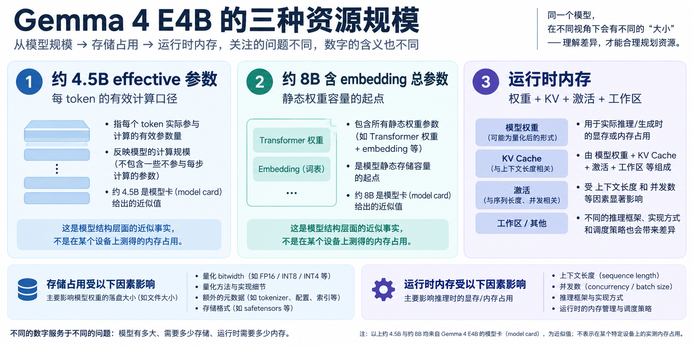
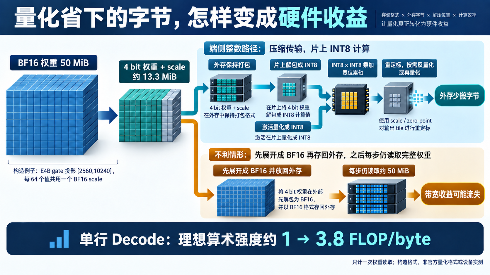

# 权重和数据怎样穿过芯片：量化、带宽与复用

[11 篇版索引](README.md) · 第 07 篇

判断 E4B 能否放进端侧设备，不能把型号里的“4B”直接乘每个参数的字节数。模型卡约 4.5B **effective** 参数描述每 token 的有效计算规模；包含 embedding 的总参数约 8B，更接近静态权重需要安放的规模。运行时还要同时保留随请求增长的 KV Cache、激活和工作区。把这些量混成一个“模型大小”，会在容量与带宽两端都算错。

*图 1：三种口径分别回答有效计算、静态参数和动态状态的问题；图中的示例容量不是某台设备的实测占用。*

## 量化省的是哪一级存储的字节

BF16 每个权重占 2 字节。把常驻权重以 4 bit 等低位宽打包，能减少文件和外存净荷，但还要计每组 scale、零点、对齐与索引。拿 `[2560,10240]` 的 gate 权重作**构造算术**：26,214,400 个元素，BF16 净荷约 50 MiB；若每 64 个值用 4 bit 保存、共用一个 BF16 scale，平均 `0.5+2/64=0.53125` 字节，理想净荷约 13.3 MiB。这不是 E4B 官方某种量化格式的完整定义，也不是实际运行内存。

关键是压缩状态能走到多靠近计算单元的地方。若低位宽权重一到芯片就整块展开为 BF16，再写回较慢存储，后续计算可能仍搬运接近 BF16 的字节。更有意义的数据路是在片上取出压缩块，转换成计算阵列使用的 INT8 等整数表示；激活在旁路量化，整数乘加后再按 scale 反量化或接入后续计算。它需要片上缓冲、量化/反量化路径和格式匹配，不能只凭权重文件小就断言运行时带宽也按相同比例下降。

*图 2：比较的是数据在哪一级展开、哪一级反复搬运。数值范围、scale 与算子支持必须按实际量化方案核对。*

## 同样的权重，在两阶段为什么价值不同

对一张 `[K,N]` 权重，一次处理 `M` 行约做 `2MKN` FLOP。若只计从同一级存储读取一次权重，权重净荷为 `KNb`，理想算术强度为 `2M/b` FLOP/byte。Prefill 的 `M` 较大，分块后同一权重瓦片可服务多行；单请求 Decode 的 `M` 常接近 1，每步都要再次供给大量权重，压缩与缓存命中更敏感。量化降低 `b`，Tiling 增大块内复用机会，二者从不同方向改善供数。但激活搬运、格式转换、KV 历史读取和片上容量还会改变最终瓶颈。

*图 3：行数变化带来权重复用机会变化。阵列占用和实际外存流量仍需目标设备测量。*

硬件评估至少要同时给出四项结果：模型装载峰值、稳态权重带宽、Prefill 首 token 延迟，以及不同上下文长度下的 Decode token/s。量化还可能影响模型质量，尤其 KV 量化会改变后续每步读取的历史数值。固定 checkpoint、量化方法、测试集、batch 和设备，再比较质量与性能，才能判断一种格式是否真的有用。这里的公式只解释因果，不替代这组测量。

资料：[Google Gemma 4 模型卡](https://ai.google.dev/gemma/docs/core/model_card_4) · [E4B 固定配置](https://huggingface.co/google/gemma-4-E4B-it/blob/ee0ef6023621cff504d758262d4e04895a5af4a2/config.json) · [Transformers Gemma 4 实现](https://github.com/huggingface/transformers/tree/8445b13cd24961e47f25a649fb113580f71a8d11/src/transformers/models/gemma4)
