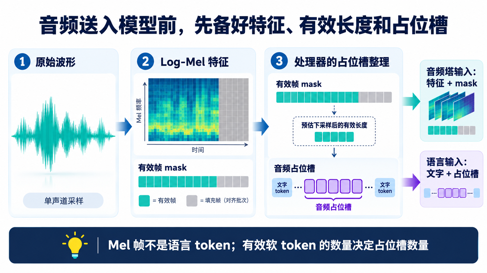
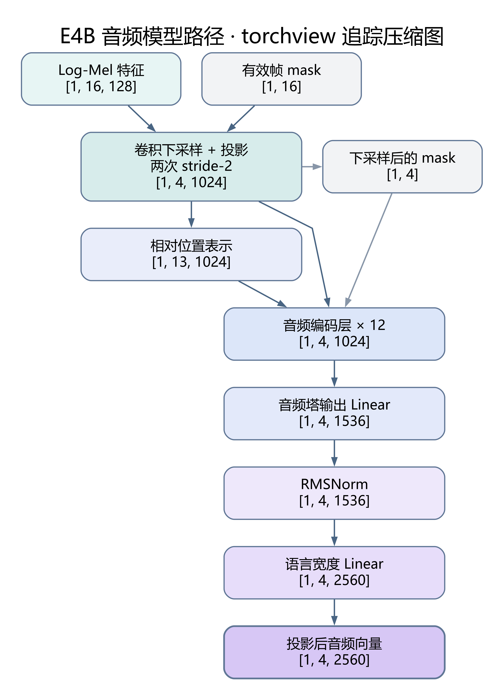

# 音频输入：波形怎样变成软 Token

[11 篇版索引](README.md) · 第 09 篇

把录音交给 E4B，模型不会先收到一段自动听写好的文字。输入首先是随时间变化的波形；它被处理成时频特征，再缩短时间轴、经过音频编码器，最终以一串连续向量占据语言序列中的预留位置。理解这条链，要分别数清波形采样点、Mel 帧和有效音频软 token，三者对应不同的硬件成本。

*图 1：`T/4` 只描述两次 stride-2 后时间位置的近似变化；实际有效数量还受边界和 mask 影响。波形与频谱均为概念示意。*

## 先把时间上的振幅，变成时间上的频率结构

波形告诉我们振幅怎样变，却不直接显示同一时刻有哪些频率。特征提取器用相互重叠的短窗逐段分析声音：固定实现默认单声道 16 kHz，窗长 20 ms、步进 10 ms；每窗做短时频率分析，经 128 个 Mel 滤波器汇成频带强度，再取对数。于是得到“时间帧 × 128 个频带”的 Log-Mel 特征。它保留了频率何时较强的结构，不是无损原始波形，更不是文本。

*图 2：横向是时间，纵向是 Mel 频带，颜色表达强弱。图不是录音实测或语音转写。*

每隔 10 ms 前进一帧，说明一秒语音大致产生百帧量级的 Mel 特征；它并不意味着一秒就增加百个语言 token。为批量对齐而补齐的帧也不能被当成有效语音。Processor 因此交出 `input_features_mask`，标明哪些 Mel 帧真实有效。

## 占位槽先备好，向量稍后填入

音频塔还没运行时，语言提示词已经要预留音频位置。Processor 根据有效帧 mask 模拟两次下采样的**长度变化**，预估会留下多少有效音频向量，并插入同数目的音频占位槽。这只是数量核算；Processor 没有在此时执行音频卷积，也没有提前生成声学特征。占位槽不是“听写出的词”。

*图 3：Processor 的两路交接：特征与 mask 给音频塔，文字与占位槽给语言序列。图中条块数仅表达对应关系。*

音频塔先用两层 stride-2 卷积压缩时间，同时提取邻近帧的局部模式；随后 12 层音频编码进一步结合声音片段。固定 E4B 配置的音频注意力右侧上下文为 0，不能把当前片段画成直接读取未来片段。音频塔输出先到 1536 维，再经 RMSNorm 与 Linear 投到 2560 维语言主宽度。

*图 4：构造 `[1,16,128]` Mel 与 `[1,16]` mask，追踪得到 `[1,4,2560]` 投影和 `[1,4]` mask。图合并显示 12 个连续编码层；[完整追踪图](../assets/diagrams/audio_path_16mel_e4b.png)可放大核对。使用初始化参数，未加载 checkpoint，也未做语音识别。*

模型最后按 mask 剔除 padding 对应的输出，检查有效向量数与占位槽数一致，再把音频向量填进语言输入。文字和音频从此由同一个语言 Decoder 处理，生成的是文本回答。若产品要播放语音，还需额外的语音合成。端侧预算则要把前端采样与特征提取、音频塔、增加的语言 Prefill 位置，以及后续生成分开算；仅按录音文件字节数或最后的软 token 数，都看不全这条路径。

资料：[Google Gemma 4 音频说明](https://ai.google.dev/gemma/docs/capabilities/audio) · [E4B 固定配置](https://huggingface.co/google/gemma-4-E4B-it/blob/ee0ef6023621cff504d758262d4e04895a5af4a2/config.json) · [音频特征提取](https://github.com/huggingface/transformers/blob/8445b13cd24961e47f25a649fb113580f71a8d11/src/transformers/models/gemma4/feature_extraction_gemma4.py) · [音频模型实现](https://github.com/huggingface/transformers/blob/8445b13cd24961e47f25a649fb113580f71a8d11/src/transformers/models/gemma4/modeling_gemma4.py)
