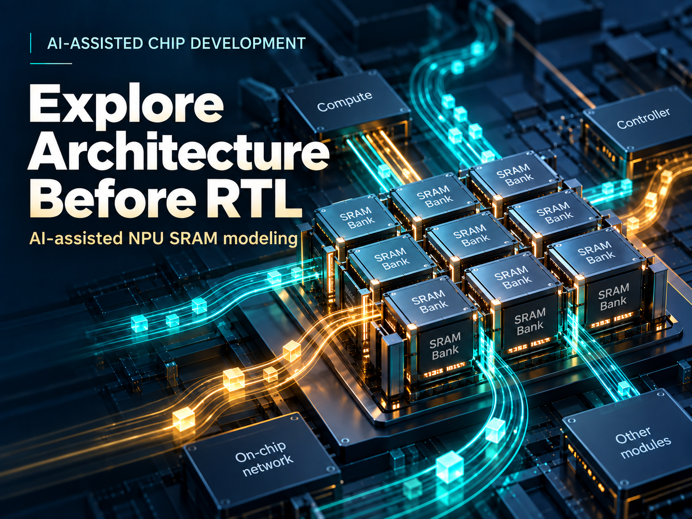
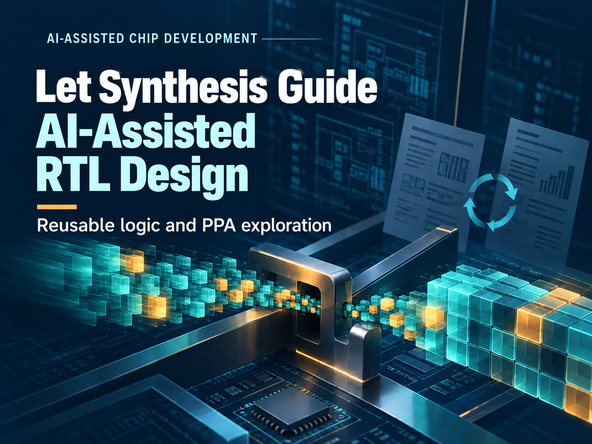
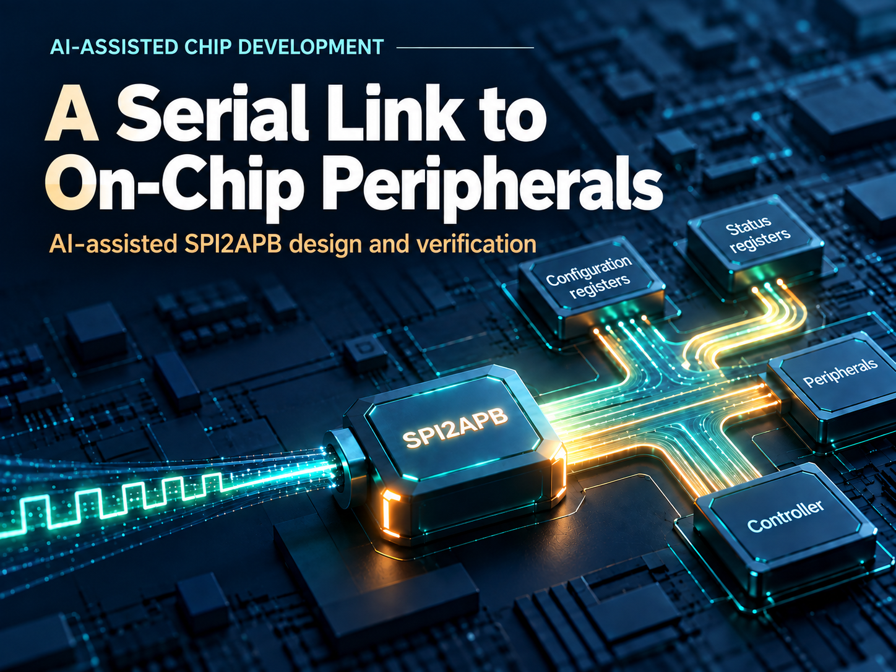

# English Covers — 4:3 / 英文封面 4:3 版本

8 张独立封面变体，使用 Codex 内置 imagegen 重新构图。原宽幅封面与正文引用保留。各篇完整提示词保存在 `notes/cover-en-4x3-prompt.md`，尺寸和哈希保存在各篇 `sources.json`。

## Explore Architecture Before RTL: AI-Assisted ESL Modeling of NPU SRAM

1448 × 1086 · 4:3 · [PNG](../ai-accelerated-esl-modeling/assets/generated/cover-en-4x3.png) · [Prompt](../ai-accelerated-esl-modeling/notes/cover-en-4x3-prompt.md)

## Let Synthesis Guide AI-Assisted RTL Design: A CBB and PPA Exploration

1448 × 1086 · 4:3 · [PNG](../ai-assisted-cbb-and-ppa-exploration/assets/generated/cover-en-4x3.png) · [Prompt](../ai-assisted-cbb-and-ppa-exploration/notes/cover-en-4x3-prompt.md)

## Checking Access to On-Chip Memory: AI-Assisted AXI MPU Development

1448 × 1086 · 4:3 · [PNG](../ai-assisted-generator-ip-development-v2/assets/generated/cover-en-4x3.png) · [Prompt](../ai-assisted-generator-ip-development-v2/notes/cover-en-4x3-prompt.md)

## AI-Assisted Peripheral Access Control: Request Filtering and Atomic Policy Updates

1448 × 1086 · 4:3 · [PNG](../ai-assisted-parameterized-ip-development/assets/generated/cover-en-4x3.png) · [Prompt](../ai-assisted-parameterized-ip-development/notes/cover-en-4x3-prompt.md)

## Reaching On-Chip Peripherals over SPI: AI-Assisted SPI2APB Design and Verification

1448 × 1086 · 4:3 · [PNG](../ai-assisted-spi2apb-ip-development/assets/generated/cover-en-4x3.png) · [Prompt](../ai-assisted-spi2apb-ip-development/notes/cover-en-4x3-prompt.md)

## AI-Assisted AXI4 VIP Development: Making Verification Code Reusable

1448 × 1086 · 4:3 · [PNG](../ai-assisted-vip-development-and-reuse/assets/generated/cover-en-4x3.png) · [Prompt](../ai-assisted-vip-development-and-reuse/notes/cover-en-4x3-prompt.md)

## Designing a Post-Quantum Cryptographic Accelerator with AI: From Commands to Verified RTL

1448 × 1086 · 4:3 · [PNG](../ai-pqc-rtl/assets/generated/cover-en-4x3.png) · [Prompt](../ai-pqc-rtl/notes/cover-en-4x3-prompt.md)

## SoC Studio: Bringing the Whole Chip Design Together

1448 × 1086 · 4:3 · [PNG](../soc-studio-from-diagram-to-design/assets/generated/cover-en-4x3.png) · [Prompt](../soc-studio-from-diagram-to-design/notes/cover-en-4x3-prompt.md)

